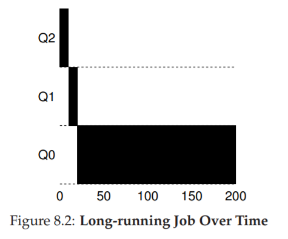
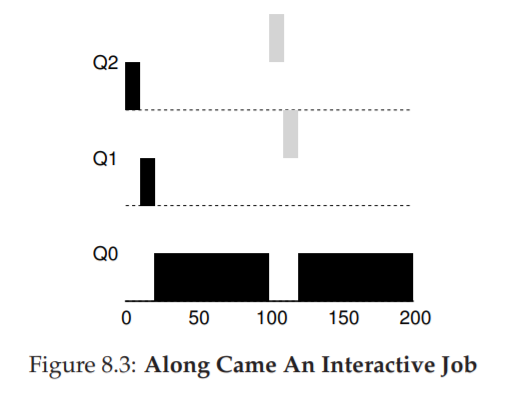
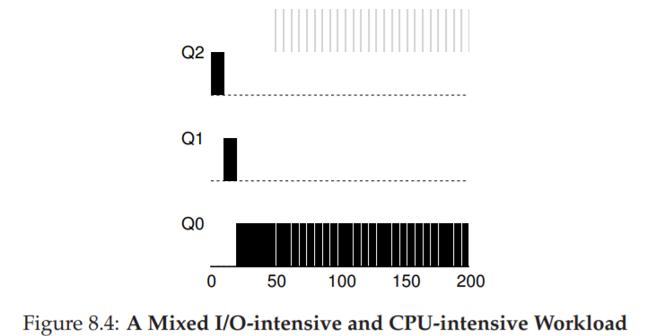
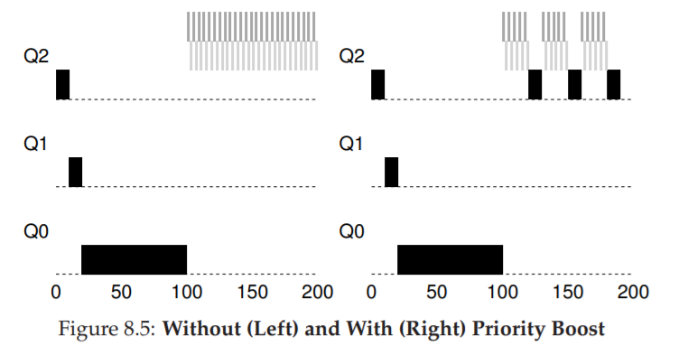
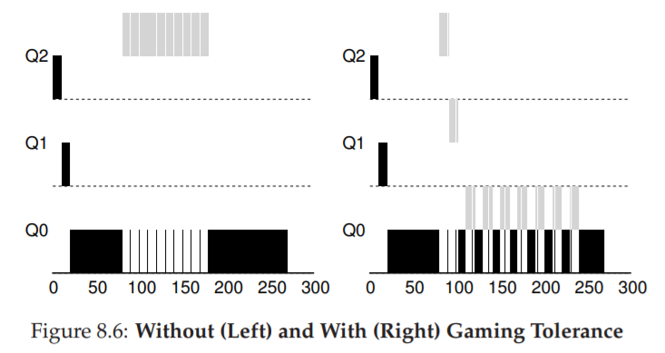
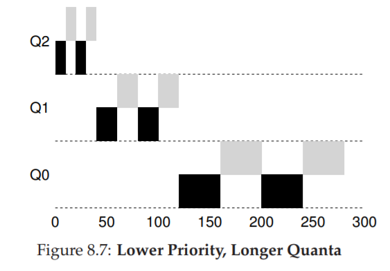

## 8 Multi-level Feedback

首先了解一下程序的参数和默认值

```python
parser = OptionParser()
# 随机种子
parser.add_option('-s', '--seed', help='the random seed', default=0, action='store', type='int', dest='seed')
# 队列数量，默认为 3
parser.add_option('-n', '--numQueues', help='number of queues in MLFQ (if not using -Q)', default=3, action='store', type='int', dest='numQueues')
# 时间片长度，默认为 10
parser.add_option('-q', '--quantum', help='length of time slice (if not using -Q)',default=10, action='store', type='int', dest='quantum')
# 时间片配额，默认为 1
parser.add_option('-a', '--allotment', help='length of allotment (if not using -A)',default=1, action='store', type='int', dest='allotment')
# 时间片长度列表，针对每一个队列
parser.add_option('-Q', '--quantumList', help='length of time slice per queue level, specified as x,y,z,... where x is the quantum length for the highest priority queue, y the next highest, and so forth', default='', action='store', type='string', dest='quantumList')
# 时间片配额，针对每一个队列
parser.add_option('-A', '--allotmentList', help='length of time allotment per queue level, specified as x,y,z,... where x is the # of time slices for the highest priority queue, y the next highest, and so forth', default='', action='store', type='string', dest='allotmentList')
# 作业数量，默认为 3
parser.add_option('-j', '--numJobs', default=3, help='number of jobs in the system',action='store', type='int', dest='numJobs')
# 作业最大长度
parser.add_option('-m', '--maxlen', default=100, help='max run-time of a job (if randomly generating)', action='store', type='int',dest='maxlen')
# 作业发起 IO 的频率
parser.add_option('-M', '--maxio', default=10, help='max I/O frequency of a job (if randomly generating)',action='store', type='int', dest='maxio')
# 将所有作业提升到最高优先级的时间间隔，避免饥饿问题，默认为 0 ，即不提升优先级
parser.add_option('-B', '--boost', default=0, help='how often to boost the priority of all jobs back to high priority', action='store', type='int', dest='boost')
# IO 时间，默认为 5
parser.add_option('-i', '--iotime', default=5, help='how long an I/O should last (fixed constant)',action='store', type='int', dest='ioTime')
# IO 时保持在队列中（不改变优先级）
parser.add_option('-S', '--stay', default=False, help='reset and stay at same priority level when issuing I/O',action='store_true', dest='stay')
# IO 完成后将作业放至队首
parser.add_option('-I', '--iobump', default=False, help='if specified, jobs that finished I/O move immediately to front of current queue',action='store_true', dest='iobump')
# 作业列表，开始时间,运行时间,IO 频率
parser.add_option('-l', '--jlist', default='', help='a comma-separated list of jobs to run, in the form x1,y1,z1:x2,y2,z2:... where x is start time, y is run time, and z is how often the job issues an I/O request',action='store', type='string', dest='jlist')
# 计算答案
parser.add_option('-c', help='compute answers for me', action='store_true',default=False, dest='solve')

(options, args) = parser.parse_args()

random.seed(options.seed)
```

### 1

随机生成一个简单的例子
- 随机种子：`-s 1`
- 队列数量：`-n 2`
- 作业数量：`-j 2`
- 最大作业时长：`-m 10`
- 不执行 IO：`-M 0`

```bash
./mlfq.py -s 1 -n 2 -j 2 -m 10 -M 0 -c

# 输出
Here is the list of inputs:
OPTIONS jobs 2                                  <---- 作业数量
OPTIONS queues 2                                <---- 队列数量
OPTIONS allotments for queue  1 is   1          <---- 队列 1 的时间片配额
OPTIONS quantum length for queue  1 is  10      <---- 队列 1 的时间片长度
OPTIONS allotments for queue  0 is   1          <---- 队列 0 的时间片配额
OPTIONS quantum length for queue  0 is  10      <---- 队列 0 的时间片长度
OPTIONS boost 0                                 <---- 不提升优先级
OPTIONS ioTime 5                                <---- IO 时间
OPTIONS stayAfterIO False                       <---- IO 完成后不保持优先级
OPTIONS iobump False                            <---- IO 完成后不将作业提到当前队列的第一个


For each job, three defining characteristics are given:
  startTime : at what time does the job enter the system
  runTime   : the total CPU time needed by the job to finish
  ioFreq    : every ioFreq time units, the job issues an I/O
              (the I/O takes ioTime units to complete)

Job List:
  Job  0: startTime   0 - runTime   2 - ioFreq   0
  Job  1: startTime   0 - runTime   7 - ioFreq   0


Execution Trace:

[ time 0 ] JOB BEGINS by JOB 0
[ time 0 ] JOB BEGINS by JOB 1
[ time 0 ] Run JOB 0 at PRIORITY 1 [ TICKS 9 ALLOT 1 TIME 1 (of 2) ]
[ time 1 ] Run JOB 0 at PRIORITY 1 [ TICKS 8 ALLOT 1 TIME 0 (of 2) ]
[ time 2 ] FINISHED JOB 0
[ time 2 ] Run JOB 1 at PRIORITY 1 [ TICKS 9 ALLOT 1 TIME 6 (of 7) ]
[ time 3 ] Run JOB 1 at PRIORITY 1 [ TICKS 8 ALLOT 1 TIME 5 (of 7) ]
[ time 4 ] Run JOB 1 at PRIORITY 1 [ TICKS 7 ALLOT 1 TIME 4 (of 7) ]
[ time 5 ] Run JOB 1 at PRIORITY 1 [ TICKS 6 ALLOT 1 TIME 3 (of 7) ]
[ time 6 ] Run JOB 1 at PRIORITY 1 [ TICKS 5 ALLOT 1 TIME 2 (of 7) ]
[ time 7 ] Run JOB 1 at PRIORITY 1 [ TICKS 4 ALLOT 1 TIME 1 (of 7) ]
[ time 8 ] Run JOB 1 at PRIORITY 1 [ TICKS 3 ALLOT 1 TIME 0 (of 7) ]
[ time 9 ] FINISHED JOB 1

Final statistics:
  Job  0: startTime   0 - response   0 - turnaround   2
  Job  1: startTime   0 - response   2 - turnaround   9

  Avg  1: startTime n/a - response 1.00 - turnaround 5.50
```

一共有 2 级优先队列，作业 0 长度为 2 ，在队列 1 中执行 2 ms 完成，时间片消耗 2 ms 切换到同一个队列中的作业 1 执行，作业 1 执行 7 ms 完成，时间片消耗 7 ms，共计消耗 9 ms 时间片，因此在队列 1 中就可以完成两个作业。

### 2

#### 图 8.2



- 三级优先队列，进程在每个队列上运行 1 个时间片（配额），即 10 ms
- 只有一个进程，因此最后一级队列的轮转运行即一直运行该进程

<details>
  <summary>运行结果</summary>

```bash
./mlfq.py -n 3 -q 10 -l 0,200,0 -c

# 输出
Here is the list of inputs:
OPTIONS jobs 1
OPTIONS queues 3
OPTIONS allotments for queue  2 is   1
OPTIONS quantum length for queue  2 is  10
OPTIONS allotments for queue  1 is   1
OPTIONS quantum length for queue  1 is  10
OPTIONS allotments for queue  0 is   1
OPTIONS quantum length for queue  0 is  10
OPTIONS boost 0
OPTIONS ioTime 5
OPTIONS stayAfterIO False
OPTIONS iobump False


For each job, three defining characteristics are given:
  startTime : at what time does the job enter the system
  runTime   : the total CPU time needed by the job to finish
  ioFreq    : every ioFreq time units, the job issues an I/O
              (the I/O takes ioTime units to complete)

Job List:
  Job  0: startTime   0 - runTime 200 - ioFreq   0


Execution Trace:

[ time 0 ] JOB BEGINS by JOB 0
[ time 0 ] Run JOB 0 at PRIORITY 2 [ TICKS 9 ALLOT 1 TIME 199 (of 200) ]
[ time 1 ] Run JOB 0 at PRIORITY 2 [ TICKS 8 ALLOT 1 TIME 198 (of 200) ]
[ time 2 ] Run JOB 0 at PRIORITY 2 [ TICKS 7 ALLOT 1 TIME 197 (of 200) ]
[ time 3 ] Run JOB 0 at PRIORITY 2 [ TICKS 6 ALLOT 1 TIME 196 (of 200) ]
[ time 4 ] Run JOB 0 at PRIORITY 2 [ TICKS 5 ALLOT 1 TIME 195 (of 200) ]
[ time 5 ] Run JOB 0 at PRIORITY 2 [ TICKS 4 ALLOT 1 TIME 194 (of 200) ]
[ time 6 ] Run JOB 0 at PRIORITY 2 [ TICKS 3 ALLOT 1 TIME 193 (of 200) ]
[ time 7 ] Run JOB 0 at PRIORITY 2 [ TICKS 2 ALLOT 1 TIME 192 (of 200) ]
[ time 8 ] Run JOB 0 at PRIORITY 2 [ TICKS 1 ALLOT 1 TIME 191 (of 200) ]
[ time 9 ] Run JOB 0 at PRIORITY 2 [ TICKS 0 ALLOT 1 TIME 190 (of 200) ]
[ time 10 ] Run JOB 0 at PRIORITY 1 [ TICKS 9 ALLOT 1 TIME 189 (of 200) ]
[ time 11 ] Run JOB 0 at PRIORITY 1 [ TICKS 8 ALLOT 1 TIME 188 (of 200) ]
[ time 12 ] Run JOB 0 at PRIORITY 1 [ TICKS 7 ALLOT 1 TIME 187 (of 200) ]
[ time 13 ] Run JOB 0 at PRIORITY 1 [ TICKS 6 ALLOT 1 TIME 186 (of 200) ]
[ time 14 ] Run JOB 0 at PRIORITY 1 [ TICKS 5 ALLOT 1 TIME 185 (of 200) ]
[ time 15 ] Run JOB 0 at PRIORITY 1 [ TICKS 4 ALLOT 1 TIME 184 (of 200) ]
[ time 16 ] Run JOB 0 at PRIORITY 1 [ TICKS 3 ALLOT 1 TIME 183 (of 200) ]
[ time 17 ] Run JOB 0 at PRIORITY 1 [ TICKS 2 ALLOT 1 TIME 182 (of 200) ]
[ time 18 ] Run JOB 0 at PRIORITY 1 [ TICKS 1 ALLOT 1 TIME 181 (of 200) ]
[ time 19 ] Run JOB 0 at PRIORITY 1 [ TICKS 0 ALLOT 1 TIME 180 (of 200) ]
[ time 20 ] Run JOB 0 at PRIORITY 0 [ TICKS 9 ALLOT 1 TIME 179 (of 200) ]
[ time 21 ] Run JOB 0 at PRIORITY 0 [ TICKS 8 ALLOT 1 TIME 178 (of 200) ]
[ time 22 ] Run JOB 0 at PRIORITY 0 [ TICKS 7 ALLOT 1 TIME 177 (of 200) ]
[ time 23 ] Run JOB 0 at PRIORITY 0 [ TICKS 6 ALLOT 1 TIME 176 (of 200) ]
[ time 24 ] Run JOB 0 at PRIORITY 0 [ TICKS 5 ALLOT 1 TIME 175 (of 200) ]
[ time 25 ] Run JOB 0 at PRIORITY 0 [ TICKS 4 ALLOT 1 TIME 174 (of 200) ]
[ time 26 ] Run JOB 0 at PRIORITY 0 [ TICKS 3 ALLOT 1 TIME 173 (of 200) ]
[ time 27 ] Run JOB 0 at PRIORITY 0 [ TICKS 2 ALLOT 1 TIME 172 (of 200) ]
[ time 28 ] Run JOB 0 at PRIORITY 0 [ TICKS 1 ALLOT 1 TIME 171 (of 200) ]
[ time 29 ] Run JOB 0 at PRIORITY 0 [ TICKS 0 ALLOT 1 TIME 170 (of 200) ]
[ time 30 ] Run JOB 0 at PRIORITY 0 [ TICKS 9 ALLOT 1 TIME 169 (of 200) ]
[ time 31 ] Run JOB 0 at PRIORITY 0 [ TICKS 8 ALLOT 1 TIME 168 (of 200) ]
[ time 32 ] Run JOB 0 at PRIORITY 0 [ TICKS 7 ALLOT 1 TIME 167 (of 200) ]
[ time 33 ] Run JOB 0 at PRIORITY 0 [ TICKS 6 ALLOT 1 TIME 166 (of 200) ]
[ time 34 ] Run JOB 0 at PRIORITY 0 [ TICKS 5 ALLOT 1 TIME 165 (of 200) ]
[ time 35 ] Run JOB 0 at PRIORITY 0 [ TICKS 4 ALLOT 1 TIME 164 (of 200) ]
[ time 36 ] Run JOB 0 at PRIORITY 0 [ TICKS 3 ALLOT 1 TIME 163 (of 200) ]
[ time 37 ] Run JOB 0 at PRIORITY 0 [ TICKS 2 ALLOT 1 TIME 162 (of 200) ]
[ time 38 ] Run JOB 0 at PRIORITY 0 [ TICKS 1 ALLOT 1 TIME 161 (of 200) ]
[ time 39 ] Run JOB 0 at PRIORITY 0 [ TICKS 0 ALLOT 1 TIME 160 (of 200) ]
[ time 40 ] Run JOB 0 at PRIORITY 0 [ TICKS 9 ALLOT 1 TIME 159 (of 200) ]
[ time 41 ] Run JOB 0 at PRIORITY 0 [ TICKS 8 ALLOT 1 TIME 158 (of 200) ]
[ time 42 ] Run JOB 0 at PRIORITY 0 [ TICKS 7 ALLOT 1 TIME 157 (of 200) ]
[ time 43 ] Run JOB 0 at PRIORITY 0 [ TICKS 6 ALLOT 1 TIME 156 (of 200) ]
[ time 44 ] Run JOB 0 at PRIORITY 0 [ TICKS 5 ALLOT 1 TIME 155 (of 200) ]
[ time 45 ] Run JOB 0 at PRIORITY 0 [ TICKS 4 ALLOT 1 TIME 154 (of 200) ]
[ time 46 ] Run JOB 0 at PRIORITY 0 [ TICKS 3 ALLOT 1 TIME 153 (of 200) ]
[ time 47 ] Run JOB 0 at PRIORITY 0 [ TICKS 2 ALLOT 1 TIME 152 (of 200) ]
[ time 48 ] Run JOB 0 at PRIORITY 0 [ TICKS 1 ALLOT 1 TIME 151 (of 200) ]
[ time 49 ] Run JOB 0 at PRIORITY 0 [ TICKS 0 ALLOT 1 TIME 150 (of 200) ]
[ time 50 ] Run JOB 0 at PRIORITY 0 [ TICKS 9 ALLOT 1 TIME 149 (of 200) ]
[ time 51 ] Run JOB 0 at PRIORITY 0 [ TICKS 8 ALLOT 1 TIME 148 (of 200) ]
[ time 52 ] Run JOB 0 at PRIORITY 0 [ TICKS 7 ALLOT 1 TIME 147 (of 200) ]
[ time 53 ] Run JOB 0 at PRIORITY 0 [ TICKS 6 ALLOT 1 TIME 146 (of 200) ]
[ time 54 ] Run JOB 0 at PRIORITY 0 [ TICKS 5 ALLOT 1 TIME 145 (of 200) ]
[ time 55 ] Run JOB 0 at PRIORITY 0 [ TICKS 4 ALLOT 1 TIME 144 (of 200) ]
[ time 56 ] Run JOB 0 at PRIORITY 0 [ TICKS 3 ALLOT 1 TIME 143 (of 200) ]
[ time 57 ] Run JOB 0 at PRIORITY 0 [ TICKS 2 ALLOT 1 TIME 142 (of 200) ]
[ time 58 ] Run JOB 0 at PRIORITY 0 [ TICKS 1 ALLOT 1 TIME 141 (of 200) ]
[ time 59 ] Run JOB 0 at PRIORITY 0 [ TICKS 0 ALLOT 1 TIME 140 (of 200) ]
[ time 60 ] Run JOB 0 at PRIORITY 0 [ TICKS 9 ALLOT 1 TIME 139 (of 200) ]
[ time 61 ] Run JOB 0 at PRIORITY 0 [ TICKS 8 ALLOT 1 TIME 138 (of 200) ]
[ time 62 ] Run JOB 0 at PRIORITY 0 [ TICKS 7 ALLOT 1 TIME 137 (of 200) ]
[ time 63 ] Run JOB 0 at PRIORITY 0 [ TICKS 6 ALLOT 1 TIME 136 (of 200) ]
[ time 64 ] Run JOB 0 at PRIORITY 0 [ TICKS 5 ALLOT 1 TIME 135 (of 200) ]
[ time 65 ] Run JOB 0 at PRIORITY 0 [ TICKS 4 ALLOT 1 TIME 134 (of 200) ]
[ time 66 ] Run JOB 0 at PRIORITY 0 [ TICKS 3 ALLOT 1 TIME 133 (of 200) ]
[ time 67 ] Run JOB 0 at PRIORITY 0 [ TICKS 2 ALLOT 1 TIME 132 (of 200) ]
[ time 68 ] Run JOB 0 at PRIORITY 0 [ TICKS 1 ALLOT 1 TIME 131 (of 200) ]
[ time 69 ] Run JOB 0 at PRIORITY 0 [ TICKS 0 ALLOT 1 TIME 130 (of 200) ]
[ time 70 ] Run JOB 0 at PRIORITY 0 [ TICKS 9 ALLOT 1 TIME 129 (of 200) ]
[ time 71 ] Run JOB 0 at PRIORITY 0 [ TICKS 8 ALLOT 1 TIME 128 (of 200) ]
[ time 72 ] Run JOB 0 at PRIORITY 0 [ TICKS 7 ALLOT 1 TIME 127 (of 200) ]
[ time 73 ] Run JOB 0 at PRIORITY 0 [ TICKS 6 ALLOT 1 TIME 126 (of 200) ]
[ time 74 ] Run JOB 0 at PRIORITY 0 [ TICKS 5 ALLOT 1 TIME 125 (of 200) ]
[ time 75 ] Run JOB 0 at PRIORITY 0 [ TICKS 4 ALLOT 1 TIME 124 (of 200) ]
[ time 76 ] Run JOB 0 at PRIORITY 0 [ TICKS 3 ALLOT 1 TIME 123 (of 200) ]
[ time 77 ] Run JOB 0 at PRIORITY 0 [ TICKS 2 ALLOT 1 TIME 122 (of 200) ]
[ time 78 ] Run JOB 0 at PRIORITY 0 [ TICKS 1 ALLOT 1 TIME 121 (of 200) ]
[ time 79 ] Run JOB 0 at PRIORITY 0 [ TICKS 0 ALLOT 1 TIME 120 (of 200) ]
[ time 80 ] Run JOB 0 at PRIORITY 0 [ TICKS 9 ALLOT 1 TIME 119 (of 200) ]
[ time 81 ] Run JOB 0 at PRIORITY 0 [ TICKS 8 ALLOT 1 TIME 118 (of 200) ]
[ time 82 ] Run JOB 0 at PRIORITY 0 [ TICKS 7 ALLOT 1 TIME 117 (of 200) ]
[ time 83 ] Run JOB 0 at PRIORITY 0 [ TICKS 6 ALLOT 1 TIME 116 (of 200) ]
[ time 84 ] Run JOB 0 at PRIORITY 0 [ TICKS 5 ALLOT 1 TIME 115 (of 200) ]
[ time 85 ] Run JOB 0 at PRIORITY 0 [ TICKS 4 ALLOT 1 TIME 114 (of 200) ]
[ time 86 ] Run JOB 0 at PRIORITY 0 [ TICKS 3 ALLOT 1 TIME 113 (of 200) ]
[ time 87 ] Run JOB 0 at PRIORITY 0 [ TICKS 2 ALLOT 1 TIME 112 (of 200) ]
[ time 88 ] Run JOB 0 at PRIORITY 0 [ TICKS 1 ALLOT 1 TIME 111 (of 200) ]
[ time 89 ] Run JOB 0 at PRIORITY 0 [ TICKS 0 ALLOT 1 TIME 110 (of 200) ]
[ time 90 ] Run JOB 0 at PRIORITY 0 [ TICKS 9 ALLOT 1 TIME 109 (of 200) ]
[ time 91 ] Run JOB 0 at PRIORITY 0 [ TICKS 8 ALLOT 1 TIME 108 (of 200) ]
[ time 92 ] Run JOB 0 at PRIORITY 0 [ TICKS 7 ALLOT 1 TIME 107 (of 200) ]
[ time 93 ] Run JOB 0 at PRIORITY 0 [ TICKS 6 ALLOT 1 TIME 106 (of 200) ]
[ time 94 ] Run JOB 0 at PRIORITY 0 [ TICKS 5 ALLOT 1 TIME 105 (of 200) ]
[ time 95 ] Run JOB 0 at PRIORITY 0 [ TICKS 4 ALLOT 1 TIME 104 (of 200) ]
[ time 96 ] Run JOB 0 at PRIORITY 0 [ TICKS 3 ALLOT 1 TIME 103 (of 200) ]
[ time 97 ] Run JOB 0 at PRIORITY 0 [ TICKS 2 ALLOT 1 TIME 102 (of 200) ]
[ time 98 ] Run JOB 0 at PRIORITY 0 [ TICKS 1 ALLOT 1 TIME 101 (of 200) ]
[ time 99 ] Run JOB 0 at PRIORITY 0 [ TICKS 0 ALLOT 1 TIME 100 (of 200) ]
[ time 100 ] Run JOB 0 at PRIORITY 0 [ TICKS 9 ALLOT 1 TIME 99 (of 200) ]
[ time 101 ] Run JOB 0 at PRIORITY 0 [ TICKS 8 ALLOT 1 TIME 98 (of 200) ]
[ time 102 ] Run JOB 0 at PRIORITY 0 [ TICKS 7 ALLOT 1 TIME 97 (of 200) ]
[ time 103 ] Run JOB 0 at PRIORITY 0 [ TICKS 6 ALLOT 1 TIME 96 (of 200) ]
[ time 104 ] Run JOB 0 at PRIORITY 0 [ TICKS 5 ALLOT 1 TIME 95 (of 200) ]
[ time 105 ] Run JOB 0 at PRIORITY 0 [ TICKS 4 ALLOT 1 TIME 94 (of 200) ]
[ time 106 ] Run JOB 0 at PRIORITY 0 [ TICKS 3 ALLOT 1 TIME 93 (of 200) ]
[ time 107 ] Run JOB 0 at PRIORITY 0 [ TICKS 2 ALLOT 1 TIME 92 (of 200) ]
[ time 108 ] Run JOB 0 at PRIORITY 0 [ TICKS 1 ALLOT 1 TIME 91 (of 200) ]
[ time 109 ] Run JOB 0 at PRIORITY 0 [ TICKS 0 ALLOT 1 TIME 90 (of 200) ]
[ time 110 ] Run JOB 0 at PRIORITY 0 [ TICKS 9 ALLOT 1 TIME 89 (of 200) ]
[ time 111 ] Run JOB 0 at PRIORITY 0 [ TICKS 8 ALLOT 1 TIME 88 (of 200) ]
[ time 112 ] Run JOB 0 at PRIORITY 0 [ TICKS 7 ALLOT 1 TIME 87 (of 200) ]
[ time 113 ] Run JOB 0 at PRIORITY 0 [ TICKS 6 ALLOT 1 TIME 86 (of 200) ]
[ time 114 ] Run JOB 0 at PRIORITY 0 [ TICKS 5 ALLOT 1 TIME 85 (of 200) ]
[ time 115 ] Run JOB 0 at PRIORITY 0 [ TICKS 4 ALLOT 1 TIME 84 (of 200) ]
[ time 116 ] Run JOB 0 at PRIORITY 0 [ TICKS 3 ALLOT 1 TIME 83 (of 200) ]
[ time 117 ] Run JOB 0 at PRIORITY 0 [ TICKS 2 ALLOT 1 TIME 82 (of 200) ]
[ time 118 ] Run JOB 0 at PRIORITY 0 [ TICKS 1 ALLOT 1 TIME 81 (of 200) ]
[ time 119 ] Run JOB 0 at PRIORITY 0 [ TICKS 0 ALLOT 1 TIME 80 (of 200) ]
[ time 120 ] Run JOB 0 at PRIORITY 0 [ TICKS 9 ALLOT 1 TIME 79 (of 200) ]
[ time 121 ] Run JOB 0 at PRIORITY 0 [ TICKS 8 ALLOT 1 TIME 78 (of 200) ]
[ time 122 ] Run JOB 0 at PRIORITY 0 [ TICKS 7 ALLOT 1 TIME 77 (of 200) ]
[ time 123 ] Run JOB 0 at PRIORITY 0 [ TICKS 6 ALLOT 1 TIME 76 (of 200) ]
[ time 124 ] Run JOB 0 at PRIORITY 0 [ TICKS 5 ALLOT 1 TIME 75 (of 200) ]
[ time 125 ] Run JOB 0 at PRIORITY 0 [ TICKS 4 ALLOT 1 TIME 74 (of 200) ]
[ time 126 ] Run JOB 0 at PRIORITY 0 [ TICKS 3 ALLOT 1 TIME 73 (of 200) ]
[ time 127 ] Run JOB 0 at PRIORITY 0 [ TICKS 2 ALLOT 1 TIME 72 (of 200) ]
[ time 128 ] Run JOB 0 at PRIORITY 0 [ TICKS 1 ALLOT 1 TIME 71 (of 200) ]
[ time 129 ] Run JOB 0 at PRIORITY 0 [ TICKS 0 ALLOT 1 TIME 70 (of 200) ]
[ time 130 ] Run JOB 0 at PRIORITY 0 [ TICKS 9 ALLOT 1 TIME 69 (of 200) ]
[ time 131 ] Run JOB 0 at PRIORITY 0 [ TICKS 8 ALLOT 1 TIME 68 (of 200) ]
[ time 132 ] Run JOB 0 at PRIORITY 0 [ TICKS 7 ALLOT 1 TIME 67 (of 200) ]
[ time 133 ] Run JOB 0 at PRIORITY 0 [ TICKS 6 ALLOT 1 TIME 66 (of 200) ]
[ time 134 ] Run JOB 0 at PRIORITY 0 [ TICKS 5 ALLOT 1 TIME 65 (of 200) ]
[ time 135 ] Run JOB 0 at PRIORITY 0 [ TICKS 4 ALLOT 1 TIME 64 (of 200) ]
[ time 136 ] Run JOB 0 at PRIORITY 0 [ TICKS 3 ALLOT 1 TIME 63 (of 200) ]
[ time 137 ] Run JOB 0 at PRIORITY 0 [ TICKS 2 ALLOT 1 TIME 62 (of 200) ]
[ time 138 ] Run JOB 0 at PRIORITY 0 [ TICKS 1 ALLOT 1 TIME 61 (of 200) ]
[ time 139 ] Run JOB 0 at PRIORITY 0 [ TICKS 0 ALLOT 1 TIME 60 (of 200) ]
[ time 140 ] Run JOB 0 at PRIORITY 0 [ TICKS 9 ALLOT 1 TIME 59 (of 200) ]
[ time 141 ] Run JOB 0 at PRIORITY 0 [ TICKS 8 ALLOT 1 TIME 58 (of 200) ]
[ time 142 ] Run JOB 0 at PRIORITY 0 [ TICKS 7 ALLOT 1 TIME 57 (of 200) ]
[ time 143 ] Run JOB 0 at PRIORITY 0 [ TICKS 6 ALLOT 1 TIME 56 (of 200) ]
[ time 144 ] Run JOB 0 at PRIORITY 0 [ TICKS 5 ALLOT 1 TIME 55 (of 200) ]
[ time 145 ] Run JOB 0 at PRIORITY 0 [ TICKS 4 ALLOT 1 TIME 54 (of 200) ]
[ time 146 ] Run JOB 0 at PRIORITY 0 [ TICKS 3 ALLOT 1 TIME 53 (of 200) ]
[ time 147 ] Run JOB 0 at PRIORITY 0 [ TICKS 2 ALLOT 1 TIME 52 (of 200) ]
[ time 148 ] Run JOB 0 at PRIORITY 0 [ TICKS 1 ALLOT 1 TIME 51 (of 200) ]
[ time 149 ] Run JOB 0 at PRIORITY 0 [ TICKS 0 ALLOT 1 TIME 50 (of 200) ]
[ time 150 ] Run JOB 0 at PRIORITY 0 [ TICKS 9 ALLOT 1 TIME 49 (of 200) ]
[ time 151 ] Run JOB 0 at PRIORITY 0 [ TICKS 8 ALLOT 1 TIME 48 (of 200) ]
[ time 152 ] Run JOB 0 at PRIORITY 0 [ TICKS 7 ALLOT 1 TIME 47 (of 200) ]
[ time 153 ] Run JOB 0 at PRIORITY 0 [ TICKS 6 ALLOT 1 TIME 46 (of 200) ]
[ time 154 ] Run JOB 0 at PRIORITY 0 [ TICKS 5 ALLOT 1 TIME 45 (of 200) ]
[ time 155 ] Run JOB 0 at PRIORITY 0 [ TICKS 4 ALLOT 1 TIME 44 (of 200) ]
[ time 156 ] Run JOB 0 at PRIORITY 0 [ TICKS 3 ALLOT 1 TIME 43 (of 200) ]
[ time 157 ] Run JOB 0 at PRIORITY 0 [ TICKS 2 ALLOT 1 TIME 42 (of 200) ]
[ time 158 ] Run JOB 0 at PRIORITY 0 [ TICKS 1 ALLOT 1 TIME 41 (of 200) ]
[ time 159 ] Run JOB 0 at PRIORITY 0 [ TICKS 0 ALLOT 1 TIME 40 (of 200) ]
[ time 160 ] Run JOB 0 at PRIORITY 0 [ TICKS 9 ALLOT 1 TIME 39 (of 200) ]
[ time 161 ] Run JOB 0 at PRIORITY 0 [ TICKS 8 ALLOT 1 TIME 38 (of 200) ]
[ time 162 ] Run JOB 0 at PRIORITY 0 [ TICKS 7 ALLOT 1 TIME 37 (of 200) ]
[ time 163 ] Run JOB 0 at PRIORITY 0 [ TICKS 6 ALLOT 1 TIME 36 (of 200) ]
[ time 164 ] Run JOB 0 at PRIORITY 0 [ TICKS 5 ALLOT 1 TIME 35 (of 200) ]
[ time 165 ] Run JOB 0 at PRIORITY 0 [ TICKS 4 ALLOT 1 TIME 34 (of 200) ]
[ time 166 ] Run JOB 0 at PRIORITY 0 [ TICKS 3 ALLOT 1 TIME 33 (of 200) ]
[ time 167 ] Run JOB 0 at PRIORITY 0 [ TICKS 2 ALLOT 1 TIME 32 (of 200) ]
[ time 168 ] Run JOB 0 at PRIORITY 0 [ TICKS 1 ALLOT 1 TIME 31 (of 200) ]
[ time 169 ] Run JOB 0 at PRIORITY 0 [ TICKS 0 ALLOT 1 TIME 30 (of 200) ]
[ time 170 ] Run JOB 0 at PRIORITY 0 [ TICKS 9 ALLOT 1 TIME 29 (of 200) ]
[ time 171 ] Run JOB 0 at PRIORITY 0 [ TICKS 8 ALLOT 1 TIME 28 (of 200) ]
[ time 172 ] Run JOB 0 at PRIORITY 0 [ TICKS 7 ALLOT 1 TIME 27 (of 200) ]
[ time 173 ] Run JOB 0 at PRIORITY 0 [ TICKS 6 ALLOT 1 TIME 26 (of 200) ]
[ time 174 ] Run JOB 0 at PRIORITY 0 [ TICKS 5 ALLOT 1 TIME 25 (of 200) ]
[ time 175 ] Run JOB 0 at PRIORITY 0 [ TICKS 4 ALLOT 1 TIME 24 (of 200) ]
[ time 176 ] Run JOB 0 at PRIORITY 0 [ TICKS 3 ALLOT 1 TIME 23 (of 200) ]
[ time 177 ] Run JOB 0 at PRIORITY 0 [ TICKS 2 ALLOT 1 TIME 22 (of 200) ]
[ time 178 ] Run JOB 0 at PRIORITY 0 [ TICKS 1 ALLOT 1 TIME 21 (of 200) ]
[ time 179 ] Run JOB 0 at PRIORITY 0 [ TICKS 0 ALLOT 1 TIME 20 (of 200) ]
[ time 180 ] Run JOB 0 at PRIORITY 0 [ TICKS 9 ALLOT 1 TIME 19 (of 200) ]
[ time 181 ] Run JOB 0 at PRIORITY 0 [ TICKS 8 ALLOT 1 TIME 18 (of 200) ]
[ time 182 ] Run JOB 0 at PRIORITY 0 [ TICKS 7 ALLOT 1 TIME 17 (of 200) ]
[ time 183 ] Run JOB 0 at PRIORITY 0 [ TICKS 6 ALLOT 1 TIME 16 (of 200) ]
[ time 184 ] Run JOB 0 at PRIORITY 0 [ TICKS 5 ALLOT 1 TIME 15 (of 200) ]
[ time 185 ] Run JOB 0 at PRIORITY 0 [ TICKS 4 ALLOT 1 TIME 14 (of 200) ]
[ time 186 ] Run JOB 0 at PRIORITY 0 [ TICKS 3 ALLOT 1 TIME 13 (of 200) ]
[ time 187 ] Run JOB 0 at PRIORITY 0 [ TICKS 2 ALLOT 1 TIME 12 (of 200) ]
[ time 188 ] Run JOB 0 at PRIORITY 0 [ TICKS 1 ALLOT 1 TIME 11 (of 200) ]
[ time 189 ] Run JOB 0 at PRIORITY 0 [ TICKS 0 ALLOT 1 TIME 10 (of 200) ]
[ time 190 ] Run JOB 0 at PRIORITY 0 [ TICKS 9 ALLOT 1 TIME 9 (of 200) ]
[ time 191 ] Run JOB 0 at PRIORITY 0 [ TICKS 8 ALLOT 1 TIME 8 (of 200) ]
[ time 192 ] Run JOB 0 at PRIORITY 0 [ TICKS 7 ALLOT 1 TIME 7 (of 200) ]
[ time 193 ] Run JOB 0 at PRIORITY 0 [ TICKS 6 ALLOT 1 TIME 6 (of 200) ]
[ time 194 ] Run JOB 0 at PRIORITY 0 [ TICKS 5 ALLOT 1 TIME 5 (of 200) ]
[ time 195 ] Run JOB 0 at PRIORITY 0 [ TICKS 4 ALLOT 1 TIME 4 (of 200) ]
[ time 196 ] Run JOB 0 at PRIORITY 0 [ TICKS 3 ALLOT 1 TIME 3 (of 200) ]
[ time 197 ] Run JOB 0 at PRIORITY 0 [ TICKS 2 ALLOT 1 TIME 2 (of 200) ]
[ time 198 ] Run JOB 0 at PRIORITY 0 [ TICKS 1 ALLOT 1 TIME 1 (of 200) ]
[ time 199 ] Run JOB 0 at PRIORITY 0 [ TICKS 0 ALLOT 1 TIME 0 (of 200) ]
[ time 200 ] FINISHED JOB 0

Final statistics:
  Job  0: startTime   0 - response   0 - turnaround 200

  Avg  0: startTime n/a - response 0.00 - turnaround 200.00
```

</details>

#### 图 8.3



不包含 IO 操作
- 第一个作业在 0 ms 时刻到达，运行 180 ms，不执行 IO ：`0,180,0`
- 第二个作业在 100 ms 时刻到达，运行 20 ms，不执行 IO ：`100,20,0`
- 时间片长度为 10 ms ：`-q 10`
- 3 个优先级队列
- 每个队列 1 个时间片长度
- 默认不提升优先级

<details>
  <summary>运行结果</summary>

```bash
./mlfq.py --jlist 0,180,0:100,20,0 -q 10

# 输出
Here is the list of inputs:
OPTIONS jobs 2
OPTIONS queues 3
OPTIONS allotments for queue  2 is   1
OPTIONS quantum length for queue  2 is  10
OPTIONS allotments for queue  1 is   1
OPTIONS quantum length for queue  1 is  10
OPTIONS allotments for queue  0 is   1
OPTIONS quantum length for queue  0 is  10
OPTIONS boost 0
OPTIONS ioTime 5
OPTIONS stayAfterIO False
OPTIONS iobump False


For each job, three defining characteristics are given:
  startTime : at what time does the job enter the system
  runTime   : the total CPU time needed by the job to finish
  ioFreq    : every ioFreq time units, the job issues an I/O
              (the I/O takes ioTime units to complete)

Job List:
  Job  0: startTime   0 - runTime 180 - ioFreq   0
  Job  1: startTime 100 - runTime  20 - ioFreq   0


Execution Trace:

[ time 0 ] JOB BEGINS by JOB 0
[ time 0 ] Run JOB 0 at PRIORITY 2 [ TICKS 9 ALLOT 1 TIME 179 (of 180) ]
[ time 1 ] Run JOB 0 at PRIORITY 2 [ TICKS 8 ALLOT 1 TIME 178 (of 180) ]
[ time 2 ] Run JOB 0 at PRIORITY 2 [ TICKS 7 ALLOT 1 TIME 177 (of 180) ]
[ time 3 ] Run JOB 0 at PRIORITY 2 [ TICKS 6 ALLOT 1 TIME 176 (of 180) ]
[ time 4 ] Run JOB 0 at PRIORITY 2 [ TICKS 5 ALLOT 1 TIME 175 (of 180) ]
[ time 5 ] Run JOB 0 at PRIORITY 2 [ TICKS 4 ALLOT 1 TIME 174 (of 180) ]
[ time 6 ] Run JOB 0 at PRIORITY 2 [ TICKS 3 ALLOT 1 TIME 173 (of 180) ]
[ time 7 ] Run JOB 0 at PRIORITY 2 [ TICKS 2 ALLOT 1 TIME 172 (of 180) ]
[ time 8 ] Run JOB 0 at PRIORITY 2 [ TICKS 1 ALLOT 1 TIME 171 (of 180) ]
[ time 9 ] Run JOB 0 at PRIORITY 2 [ TICKS 0 ALLOT 1 TIME 170 (of 180) ]
[ time 10 ] Run JOB 0 at PRIORITY 1 [ TICKS 9 ALLOT 1 TIME 169 (of 180) ]
[ time 11 ] Run JOB 0 at PRIORITY 1 [ TICKS 8 ALLOT 1 TIME 168 (of 180) ]
[ time 12 ] Run JOB 0 at PRIORITY 1 [ TICKS 7 ALLOT 1 TIME 167 (of 180) ]
[ time 13 ] Run JOB 0 at PRIORITY 1 [ TICKS 6 ALLOT 1 TIME 166 (of 180) ]
[ time 14 ] Run JOB 0 at PRIORITY 1 [ TICKS 5 ALLOT 1 TIME 165 (of 180) ]
[ time 15 ] Run JOB 0 at PRIORITY 1 [ TICKS 4 ALLOT 1 TIME 164 (of 180) ]
[ time 16 ] Run JOB 0 at PRIORITY 1 [ TICKS 3 ALLOT 1 TIME 163 (of 180) ]
[ time 17 ] Run JOB 0 at PRIORITY 1 [ TICKS 2 ALLOT 1 TIME 162 (of 180) ]
[ time 18 ] Run JOB 0 at PRIORITY 1 [ TICKS 1 ALLOT 1 TIME 161 (of 180) ]
[ time 19 ] Run JOB 0 at PRIORITY 1 [ TICKS 0 ALLOT 1 TIME 160 (of 180) ]
[ time 20 ] Run JOB 0 at PRIORITY 0 [ TICKS 9 ALLOT 1 TIME 159 (of 180) ]
[ time 21 ] Run JOB 0 at PRIORITY 0 [ TICKS 8 ALLOT 1 TIME 158 (of 180) ]
[ time 22 ] Run JOB 0 at PRIORITY 0 [ TICKS 7 ALLOT 1 TIME 157 (of 180) ]
[ time 23 ] Run JOB 0 at PRIORITY 0 [ TICKS 6 ALLOT 1 TIME 156 (of 180) ]
[ time 24 ] Run JOB 0 at PRIORITY 0 [ TICKS 5 ALLOT 1 TIME 155 (of 180) ]
[ time 25 ] Run JOB 0 at PRIORITY 0 [ TICKS 4 ALLOT 1 TIME 154 (of 180) ]
[ time 26 ] Run JOB 0 at PRIORITY 0 [ TICKS 3 ALLOT 1 TIME 153 (of 180) ]
[ time 27 ] Run JOB 0 at PRIORITY 0 [ TICKS 2 ALLOT 1 TIME 152 (of 180) ]
[ time 28 ] Run JOB 0 at PRIORITY 0 [ TICKS 1 ALLOT 1 TIME 151 (of 180) ]
[ time 29 ] Run JOB 0 at PRIORITY 0 [ TICKS 0 ALLOT 1 TIME 150 (of 180) ]
[ time 30 ] Run JOB 0 at PRIORITY 0 [ TICKS 9 ALLOT 1 TIME 149 (of 180) ]
[ time 31 ] Run JOB 0 at PRIORITY 0 [ TICKS 8 ALLOT 1 TIME 148 (of 180) ]
[ time 32 ] Run JOB 0 at PRIORITY 0 [ TICKS 7 ALLOT 1 TIME 147 (of 180) ]
[ time 33 ] Run JOB 0 at PRIORITY 0 [ TICKS 6 ALLOT 1 TIME 146 (of 180) ]
[ time 34 ] Run JOB 0 at PRIORITY 0 [ TICKS 5 ALLOT 1 TIME 145 (of 180) ]
[ time 35 ] Run JOB 0 at PRIORITY 0 [ TICKS 4 ALLOT 1 TIME 144 (of 180) ]
[ time 36 ] Run JOB 0 at PRIORITY 0 [ TICKS 3 ALLOT 1 TIME 143 (of 180) ]
[ time 37 ] Run JOB 0 at PRIORITY 0 [ TICKS 2 ALLOT 1 TIME 142 (of 180) ]
[ time 38 ] Run JOB 0 at PRIORITY 0 [ TICKS 1 ALLOT 1 TIME 141 (of 180) ]
[ time 39 ] Run JOB 0 at PRIORITY 0 [ TICKS 0 ALLOT 1 TIME 140 (of 180) ]
[ time 40 ] Run JOB 0 at PRIORITY 0 [ TICKS 9 ALLOT 1 TIME 139 (of 180) ]
[ time 41 ] Run JOB 0 at PRIORITY 0 [ TICKS 8 ALLOT 1 TIME 138 (of 180) ]
[ time 42 ] Run JOB 0 at PRIORITY 0 [ TICKS 7 ALLOT 1 TIME 137 (of 180) ]
[ time 43 ] Run JOB 0 at PRIORITY 0 [ TICKS 6 ALLOT 1 TIME 136 (of 180) ]
[ time 44 ] Run JOB 0 at PRIORITY 0 [ TICKS 5 ALLOT 1 TIME 135 (of 180) ]
[ time 45 ] Run JOB 0 at PRIORITY 0 [ TICKS 4 ALLOT 1 TIME 134 (of 180) ]
[ time 46 ] Run JOB 0 at PRIORITY 0 [ TICKS 3 ALLOT 1 TIME 133 (of 180) ]
[ time 47 ] Run JOB 0 at PRIORITY 0 [ TICKS 2 ALLOT 1 TIME 132 (of 180) ]
[ time 48 ] Run JOB 0 at PRIORITY 0 [ TICKS 1 ALLOT 1 TIME 131 (of 180) ]
[ time 49 ] Run JOB 0 at PRIORITY 0 [ TICKS 0 ALLOT 1 TIME 130 (of 180) ]
[ time 50 ] Run JOB 0 at PRIORITY 0 [ TICKS 9 ALLOT 1 TIME 129 (of 180) ]
[ time 51 ] Run JOB 0 at PRIORITY 0 [ TICKS 8 ALLOT 1 TIME 128 (of 180) ]
[ time 52 ] Run JOB 0 at PRIORITY 0 [ TICKS 7 ALLOT 1 TIME 127 (of 180) ]
[ time 53 ] Run JOB 0 at PRIORITY 0 [ TICKS 6 ALLOT 1 TIME 126 (of 180) ]
[ time 54 ] Run JOB 0 at PRIORITY 0 [ TICKS 5 ALLOT 1 TIME 125 (of 180) ]
[ time 55 ] Run JOB 0 at PRIORITY 0 [ TICKS 4 ALLOT 1 TIME 124 (of 180) ]
[ time 56 ] Run JOB 0 at PRIORITY 0 [ TICKS 3 ALLOT 1 TIME 123 (of 180) ]
[ time 57 ] Run JOB 0 at PRIORITY 0 [ TICKS 2 ALLOT 1 TIME 122 (of 180) ]
[ time 58 ] Run JOB 0 at PRIORITY 0 [ TICKS 1 ALLOT 1 TIME 121 (of 180) ]
[ time 59 ] Run JOB 0 at PRIORITY 0 [ TICKS 0 ALLOT 1 TIME 120 (of 180) ]
[ time 60 ] Run JOB 0 at PRIORITY 0 [ TICKS 9 ALLOT 1 TIME 119 (of 180) ]
[ time 61 ] Run JOB 0 at PRIORITY 0 [ TICKS 8 ALLOT 1 TIME 118 (of 180) ]
[ time 62 ] Run JOB 0 at PRIORITY 0 [ TICKS 7 ALLOT 1 TIME 117 (of 180) ]
[ time 63 ] Run JOB 0 at PRIORITY 0 [ TICKS 6 ALLOT 1 TIME 116 (of 180) ]
[ time 64 ] Run JOB 0 at PRIORITY 0 [ TICKS 5 ALLOT 1 TIME 115 (of 180) ]
[ time 65 ] Run JOB 0 at PRIORITY 0 [ TICKS 4 ALLOT 1 TIME 114 (of 180) ]
[ time 66 ] Run JOB 0 at PRIORITY 0 [ TICKS 3 ALLOT 1 TIME 113 (of 180) ]
[ time 67 ] Run JOB 0 at PRIORITY 0 [ TICKS 2 ALLOT 1 TIME 112 (of 180) ]
[ time 68 ] Run JOB 0 at PRIORITY 0 [ TICKS 1 ALLOT 1 TIME 111 (of 180) ]
[ time 69 ] Run JOB 0 at PRIORITY 0 [ TICKS 0 ALLOT 1 TIME 110 (of 180) ]
[ time 70 ] Run JOB 0 at PRIORITY 0 [ TICKS 9 ALLOT 1 TIME 109 (of 180) ]
[ time 71 ] Run JOB 0 at PRIORITY 0 [ TICKS 8 ALLOT 1 TIME 108 (of 180) ]
[ time 72 ] Run JOB 0 at PRIORITY 0 [ TICKS 7 ALLOT 1 TIME 107 (of 180) ]
[ time 73 ] Run JOB 0 at PRIORITY 0 [ TICKS 6 ALLOT 1 TIME 106 (of 180) ]
[ time 74 ] Run JOB 0 at PRIORITY 0 [ TICKS 5 ALLOT 1 TIME 105 (of 180) ]
[ time 75 ] Run JOB 0 at PRIORITY 0 [ TICKS 4 ALLOT 1 TIME 104 (of 180) ]
[ time 76 ] Run JOB 0 at PRIORITY 0 [ TICKS 3 ALLOT 1 TIME 103 (of 180) ]
[ time 77 ] Run JOB 0 at PRIORITY 0 [ TICKS 2 ALLOT 1 TIME 102 (of 180) ]
[ time 78 ] Run JOB 0 at PRIORITY 0 [ TICKS 1 ALLOT 1 TIME 101 (of 180) ]
[ time 79 ] Run JOB 0 at PRIORITY 0 [ TICKS 0 ALLOT 1 TIME 100 (of 180) ]
[ time 80 ] Run JOB 0 at PRIORITY 0 [ TICKS 9 ALLOT 1 TIME 99 (of 180) ]
[ time 81 ] Run JOB 0 at PRIORITY 0 [ TICKS 8 ALLOT 1 TIME 98 (of 180) ]
[ time 82 ] Run JOB 0 at PRIORITY 0 [ TICKS 7 ALLOT 1 TIME 97 (of 180) ]
[ time 83 ] Run JOB 0 at PRIORITY 0 [ TICKS 6 ALLOT 1 TIME 96 (of 180) ]
[ time 84 ] Run JOB 0 at PRIORITY 0 [ TICKS 5 ALLOT 1 TIME 95 (of 180) ]
[ time 85 ] Run JOB 0 at PRIORITY 0 [ TICKS 4 ALLOT 1 TIME 94 (of 180) ]
[ time 86 ] Run JOB 0 at PRIORITY 0 [ TICKS 3 ALLOT 1 TIME 93 (of 180) ]
[ time 87 ] Run JOB 0 at PRIORITY 0 [ TICKS 2 ALLOT 1 TIME 92 (of 180) ]
[ time 88 ] Run JOB 0 at PRIORITY 0 [ TICKS 1 ALLOT 1 TIME 91 (of 180) ]
[ time 89 ] Run JOB 0 at PRIORITY 0 [ TICKS 0 ALLOT 1 TIME 90 (of 180) ]
[ time 90 ] Run JOB 0 at PRIORITY 0 [ TICKS 9 ALLOT 1 TIME 89 (of 180) ]
[ time 91 ] Run JOB 0 at PRIORITY 0 [ TICKS 8 ALLOT 1 TIME 88 (of 180) ]
[ time 92 ] Run JOB 0 at PRIORITY 0 [ TICKS 7 ALLOT 1 TIME 87 (of 180) ]
[ time 93 ] Run JOB 0 at PRIORITY 0 [ TICKS 6 ALLOT 1 TIME 86 (of 180) ]
[ time 94 ] Run JOB 0 at PRIORITY 0 [ TICKS 5 ALLOT 1 TIME 85 (of 180) ]
[ time 95 ] Run JOB 0 at PRIORITY 0 [ TICKS 4 ALLOT 1 TIME 84 (of 180) ]
[ time 96 ] Run JOB 0 at PRIORITY 0 [ TICKS 3 ALLOT 1 TIME 83 (of 180) ]
[ time 97 ] Run JOB 0 at PRIORITY 0 [ TICKS 2 ALLOT 1 TIME 82 (of 180) ]
[ time 98 ] Run JOB 0 at PRIORITY 0 [ TICKS 1 ALLOT 1 TIME 81 (of 180) ]
[ time 99 ] Run JOB 0 at PRIORITY 0 [ TICKS 0 ALLOT 1 TIME 80 (of 180) ]
[ time 100 ] JOB BEGINS by JOB 1
[ time 100 ] Run JOB 1 at PRIORITY 2 [ TICKS 9 ALLOT 1 TIME 19 (of 20) ]
[ time 101 ] Run JOB 1 at PRIORITY 2 [ TICKS 8 ALLOT 1 TIME 18 (of 20) ]
[ time 102 ] Run JOB 1 at PRIORITY 2 [ TICKS 7 ALLOT 1 TIME 17 (of 20) ]
[ time 103 ] Run JOB 1 at PRIORITY 2 [ TICKS 6 ALLOT 1 TIME 16 (of 20) ]
[ time 104 ] Run JOB 1 at PRIORITY 2 [ TICKS 5 ALLOT 1 TIME 15 (of 20) ]
[ time 105 ] Run JOB 1 at PRIORITY 2 [ TICKS 4 ALLOT 1 TIME 14 (of 20) ]
[ time 106 ] Run JOB 1 at PRIORITY 2 [ TICKS 3 ALLOT 1 TIME 13 (of 20) ]
[ time 107 ] Run JOB 1 at PRIORITY 2 [ TICKS 2 ALLOT 1 TIME 12 (of 20) ]
[ time 108 ] Run JOB 1 at PRIORITY 2 [ TICKS 1 ALLOT 1 TIME 11 (of 20) ]
[ time 109 ] Run JOB 1 at PRIORITY 2 [ TICKS 0 ALLOT 1 TIME 10 (of 20) ]
[ time 110 ] Run JOB 1 at PRIORITY 1 [ TICKS 9 ALLOT 1 TIME 9 (of 20) ]
[ time 111 ] Run JOB 1 at PRIORITY 1 [ TICKS 8 ALLOT 1 TIME 8 (of 20) ]
[ time 112 ] Run JOB 1 at PRIORITY 1 [ TICKS 7 ALLOT 1 TIME 7 (of 20) ]
[ time 113 ] Run JOB 1 at PRIORITY 1 [ TICKS 6 ALLOT 1 TIME 6 (of 20) ]
[ time 114 ] Run JOB 1 at PRIORITY 1 [ TICKS 5 ALLOT 1 TIME 5 (of 20) ]
[ time 115 ] Run JOB 1 at PRIORITY 1 [ TICKS 4 ALLOT 1 TIME 4 (of 20) ]
[ time 116 ] Run JOB 1 at PRIORITY 1 [ TICKS 3 ALLOT 1 TIME 3 (of 20) ]
[ time 117 ] Run JOB 1 at PRIORITY 1 [ TICKS 2 ALLOT 1 TIME 2 (of 20) ]
[ time 118 ] Run JOB 1 at PRIORITY 1 [ TICKS 1 ALLOT 1 TIME 1 (of 20) ]
[ time 119 ] Run JOB 1 at PRIORITY 1 [ TICKS 0 ALLOT 1 TIME 0 (of 20) ]
[ time 120 ] FINISHED JOB 1
[ time 120 ] Run JOB 0 at PRIORITY 0 [ TICKS 9 ALLOT 1 TIME 79 (of 180) ]
[ time 121 ] Run JOB 0 at PRIORITY 0 [ TICKS 8 ALLOT 1 TIME 78 (of 180) ]
[ time 122 ] Run JOB 0 at PRIORITY 0 [ TICKS 7 ALLOT 1 TIME 77 (of 180) ]
[ time 123 ] Run JOB 0 at PRIORITY 0 [ TICKS 6 ALLOT 1 TIME 76 (of 180) ]
[ time 124 ] Run JOB 0 at PRIORITY 0 [ TICKS 5 ALLOT 1 TIME 75 (of 180) ]
[ time 125 ] Run JOB 0 at PRIORITY 0 [ TICKS 4 ALLOT 1 TIME 74 (of 180) ]
[ time 126 ] Run JOB 0 at PRIORITY 0 [ TICKS 3 ALLOT 1 TIME 73 (of 180) ]
[ time 127 ] Run JOB 0 at PRIORITY 0 [ TICKS 2 ALLOT 1 TIME 72 (of 180) ]
[ time 128 ] Run JOB 0 at PRIORITY 0 [ TICKS 1 ALLOT 1 TIME 71 (of 180) ]
[ time 129 ] Run JOB 0 at PRIORITY 0 [ TICKS 0 ALLOT 1 TIME 70 (of 180) ]
[ time 130 ] Run JOB 0 at PRIORITY 0 [ TICKS 9 ALLOT 1 TIME 69 (of 180) ]
[ time 131 ] Run JOB 0 at PRIORITY 0 [ TICKS 8 ALLOT 1 TIME 68 (of 180) ]
[ time 132 ] Run JOB 0 at PRIORITY 0 [ TICKS 7 ALLOT 1 TIME 67 (of 180) ]
[ time 133 ] Run JOB 0 at PRIORITY 0 [ TICKS 6 ALLOT 1 TIME 66 (of 180) ]
[ time 134 ] Run JOB 0 at PRIORITY 0 [ TICKS 5 ALLOT 1 TIME 65 (of 180) ]
[ time 135 ] Run JOB 0 at PRIORITY 0 [ TICKS 4 ALLOT 1 TIME 64 (of 180) ]
[ time 136 ] Run JOB 0 at PRIORITY 0 [ TICKS 3 ALLOT 1 TIME 63 (of 180) ]
[ time 137 ] Run JOB 0 at PRIORITY 0 [ TICKS 2 ALLOT 1 TIME 62 (of 180) ]
[ time 138 ] Run JOB 0 at PRIORITY 0 [ TICKS 1 ALLOT 1 TIME 61 (of 180) ]
[ time 139 ] Run JOB 0 at PRIORITY 0 [ TICKS 0 ALLOT 1 TIME 60 (of 180) ]
[ time 140 ] Run JOB 0 at PRIORITY 0 [ TICKS 9 ALLOT 1 TIME 59 (of 180) ]
[ time 141 ] Run JOB 0 at PRIORITY 0 [ TICKS 8 ALLOT 1 TIME 58 (of 180) ]
[ time 142 ] Run JOB 0 at PRIORITY 0 [ TICKS 7 ALLOT 1 TIME 57 (of 180) ]
[ time 143 ] Run JOB 0 at PRIORITY 0 [ TICKS 6 ALLOT 1 TIME 56 (of 180) ]
[ time 144 ] Run JOB 0 at PRIORITY 0 [ TICKS 5 ALLOT 1 TIME 55 (of 180) ]
[ time 145 ] Run JOB 0 at PRIORITY 0 [ TICKS 4 ALLOT 1 TIME 54 (of 180) ]
[ time 146 ] Run JOB 0 at PRIORITY 0 [ TICKS 3 ALLOT 1 TIME 53 (of 180) ]
[ time 147 ] Run JOB 0 at PRIORITY 0 [ TICKS 2 ALLOT 1 TIME 52 (of 180) ]
[ time 148 ] Run JOB 0 at PRIORITY 0 [ TICKS 1 ALLOT 1 TIME 51 (of 180) ]
[ time 149 ] Run JOB 0 at PRIORITY 0 [ TICKS 0 ALLOT 1 TIME 50 (of 180) ]
[ time 150 ] Run JOB 0 at PRIORITY 0 [ TICKS 9 ALLOT 1 TIME 49 (of 180) ]
[ time 151 ] Run JOB 0 at PRIORITY 0 [ TICKS 8 ALLOT 1 TIME 48 (of 180) ]
[ time 152 ] Run JOB 0 at PRIORITY 0 [ TICKS 7 ALLOT 1 TIME 47 (of 180) ]
[ time 153 ] Run JOB 0 at PRIORITY 0 [ TICKS 6 ALLOT 1 TIME 46 (of 180) ]
[ time 154 ] Run JOB 0 at PRIORITY 0 [ TICKS 5 ALLOT 1 TIME 45 (of 180) ]
[ time 155 ] Run JOB 0 at PRIORITY 0 [ TICKS 4 ALLOT 1 TIME 44 (of 180) ]
[ time 156 ] Run JOB 0 at PRIORITY 0 [ TICKS 3 ALLOT 1 TIME 43 (of 180) ]
[ time 157 ] Run JOB 0 at PRIORITY 0 [ TICKS 2 ALLOT 1 TIME 42 (of 180) ]
[ time 158 ] Run JOB 0 at PRIORITY 0 [ TICKS 1 ALLOT 1 TIME 41 (of 180) ]
[ time 159 ] Run JOB 0 at PRIORITY 0 [ TICKS 0 ALLOT 1 TIME 40 (of 180) ]
[ time 160 ] Run JOB 0 at PRIORITY 0 [ TICKS 9 ALLOT 1 TIME 39 (of 180) ]
[ time 161 ] Run JOB 0 at PRIORITY 0 [ TICKS 8 ALLOT 1 TIME 38 (of 180) ]
[ time 162 ] Run JOB 0 at PRIORITY 0 [ TICKS 7 ALLOT 1 TIME 37 (of 180) ]
[ time 163 ] Run JOB 0 at PRIORITY 0 [ TICKS 6 ALLOT 1 TIME 36 (of 180) ]
[ time 164 ] Run JOB 0 at PRIORITY 0 [ TICKS 5 ALLOT 1 TIME 35 (of 180) ]
[ time 165 ] Run JOB 0 at PRIORITY 0 [ TICKS 4 ALLOT 1 TIME 34 (of 180) ]
[ time 166 ] Run JOB 0 at PRIORITY 0 [ TICKS 3 ALLOT 1 TIME 33 (of 180) ]
[ time 167 ] Run JOB 0 at PRIORITY 0 [ TICKS 2 ALLOT 1 TIME 32 (of 180) ]
[ time 168 ] Run JOB 0 at PRIORITY 0 [ TICKS 1 ALLOT 1 TIME 31 (of 180) ]
[ time 169 ] Run JOB 0 at PRIORITY 0 [ TICKS 0 ALLOT 1 TIME 30 (of 180) ]
[ time 170 ] Run JOB 0 at PRIORITY 0 [ TICKS 9 ALLOT 1 TIME 29 (of 180) ]
[ time 171 ] Run JOB 0 at PRIORITY 0 [ TICKS 8 ALLOT 1 TIME 28 (of 180) ]
[ time 172 ] Run JOB 0 at PRIORITY 0 [ TICKS 7 ALLOT 1 TIME 27 (of 180) ]
[ time 173 ] Run JOB 0 at PRIORITY 0 [ TICKS 6 ALLOT 1 TIME 26 (of 180) ]
[ time 174 ] Run JOB 0 at PRIORITY 0 [ TICKS 5 ALLOT 1 TIME 25 (of 180) ]
[ time 175 ] Run JOB 0 at PRIORITY 0 [ TICKS 4 ALLOT 1 TIME 24 (of 180) ]
[ time 176 ] Run JOB 0 at PRIORITY 0 [ TICKS 3 ALLOT 1 TIME 23 (of 180) ]
[ time 177 ] Run JOB 0 at PRIORITY 0 [ TICKS 2 ALLOT 1 TIME 22 (of 180) ]
[ time 178 ] Run JOB 0 at PRIORITY 0 [ TICKS 1 ALLOT 1 TIME 21 (of 180) ]
[ time 179 ] Run JOB 0 at PRIORITY 0 [ TICKS 0 ALLOT 1 TIME 20 (of 180) ]
[ time 180 ] Run JOB 0 at PRIORITY 0 [ TICKS 9 ALLOT 1 TIME 19 (of 180) ]
[ time 181 ] Run JOB 0 at PRIORITY 0 [ TICKS 8 ALLOT 1 TIME 18 (of 180) ]
[ time 182 ] Run JOB 0 at PRIORITY 0 [ TICKS 7 ALLOT 1 TIME 17 (of 180) ]
[ time 183 ] Run JOB 0 at PRIORITY 0 [ TICKS 6 ALLOT 1 TIME 16 (of 180) ]
[ time 184 ] Run JOB 0 at PRIORITY 0 [ TICKS 5 ALLOT 1 TIME 15 (of 180) ]
[ time 185 ] Run JOB 0 at PRIORITY 0 [ TICKS 4 ALLOT 1 TIME 14 (of 180) ]
[ time 186 ] Run JOB 0 at PRIORITY 0 [ TICKS 3 ALLOT 1 TIME 13 (of 180) ]
[ time 187 ] Run JOB 0 at PRIORITY 0 [ TICKS 2 ALLOT 1 TIME 12 (of 180) ]
[ time 188 ] Run JOB 0 at PRIORITY 0 [ TICKS 1 ALLOT 1 TIME 11 (of 180) ]
[ time 189 ] Run JOB 0 at PRIORITY 0 [ TICKS 0 ALLOT 1 TIME 10 (of 180) ]
[ time 190 ] Run JOB 0 at PRIORITY 0 [ TICKS 9 ALLOT 1 TIME 9 (of 180) ]
[ time 191 ] Run JOB 0 at PRIORITY 0 [ TICKS 8 ALLOT 1 TIME 8 (of 180) ]
[ time 192 ] Run JOB 0 at PRIORITY 0 [ TICKS 7 ALLOT 1 TIME 7 (of 180) ]
[ time 193 ] Run JOB 0 at PRIORITY 0 [ TICKS 6 ALLOT 1 TIME 6 (of 180) ]
[ time 194 ] Run JOB 0 at PRIORITY 0 [ TICKS 5 ALLOT 1 TIME 5 (of 180) ]
[ time 195 ] Run JOB 0 at PRIORITY 0 [ TICKS 4 ALLOT 1 TIME 4 (of 180) ]
[ time 196 ] Run JOB 0 at PRIORITY 0 [ TICKS 3 ALLOT 1 TIME 3 (of 180) ]
[ time 197 ] Run JOB 0 at PRIORITY 0 [ TICKS 2 ALLOT 1 TIME 2 (of 180) ]
[ time 198 ] Run JOB 0 at PRIORITY 0 [ TICKS 1 ALLOT 1 TIME 1 (of 180) ]
[ time 199 ] Run JOB 0 at PRIORITY 0 [ TICKS 0 ALLOT 1 TIME 0 (of 180) ]
[ time 200 ] FINISHED JOB 0

Final statistics:
  Job  0: startTime   0 - response   0 - turnaround 200
  Job  1: startTime 100 - response   0 - turnaround  20

  Avg  1: startTime n/a - response 0.00 - turnaround 110.00
```

</details>

#### 图 8.4



- 前面是 JOB 0 运行及移至下一个优先级队列的过程，直到被移至最后一个队列
- JOB 1 每隔 1 ms 执行一次 IO
- JOB 0 每运行 5 ms 就运行一次 JOB 1

<details>
  <summary>运行结果</summary>

```bash
./mlfq.py -n 3 -q 10 -l 0,200,0:0,39,1 -S -c

# 输出
Here is the list of inputs:
OPTIONS jobs 2
OPTIONS queues 3
OPTIONS allotments for queue  2 is   1
OPTIONS quantum length for queue  2 is  10
OPTIONS allotments for queue  1 is   1
OPTIONS quantum length for queue  1 is  10
OPTIONS allotments for queue  0 is   1
OPTIONS quantum length for queue  0 is  10
OPTIONS boost 0
OPTIONS ioTime 5
OPTIONS stayAfterIO True
OPTIONS iobump False


For each job, three defining characteristics are given:
  startTime : at what time does the job enter the system
  runTime   : the total CPU time needed by the job to finish
  ioFreq    : every ioFreq time units, the job issues an I/O
              (the I/O takes ioTime units to complete)

Job List:
  Job  0: startTime   0 - runTime 200 - ioFreq   0
  Job  1: startTime   0 - runTime  39 - ioFreq   1


Execution Trace:

[ time 0 ] JOB BEGINS by JOB 0
[ time 0 ] JOB BEGINS by JOB 1
[ time 0 ] Run JOB 0 at PRIORITY 2 [ TICKS 9 ALLOT 1 TIME 199 (of 200) ]
[ time 1 ] Run JOB 0 at PRIORITY 2 [ TICKS 8 ALLOT 1 TIME 198 (of 200) ]
[ time 2 ] Run JOB 0 at PRIORITY 2 [ TICKS 7 ALLOT 1 TIME 197 (of 200) ]
[ time 3 ] Run JOB 0 at PRIORITY 2 [ TICKS 6 ALLOT 1 TIME 196 (of 200) ]
[ time 4 ] Run JOB 0 at PRIORITY 2 [ TICKS 5 ALLOT 1 TIME 195 (of 200) ]
[ time 5 ] Run JOB 0 at PRIORITY 2 [ TICKS 4 ALLOT 1 TIME 194 (of 200) ]
[ time 6 ] Run JOB 0 at PRIORITY 2 [ TICKS 3 ALLOT 1 TIME 193 (of 200) ]
[ time 7 ] Run JOB 0 at PRIORITY 2 [ TICKS 2 ALLOT 1 TIME 192 (of 200) ]
[ time 8 ] Run JOB 0 at PRIORITY 2 [ TICKS 1 ALLOT 1 TIME 191 (of 200) ]
[ time 9 ] Run JOB 0 at PRIORITY 2 [ TICKS 0 ALLOT 1 TIME 190 (of 200) ]
[ time 10 ] Run JOB 1 at PRIORITY 2 [ TICKS 9 ALLOT 1 TIME 38 (of 39) ]
[ time 11 ] IO_START by JOB 1
IO DONE
[ time 11 ] Run JOB 0 at PRIORITY 1 [ TICKS 9 ALLOT 1 TIME 189 (of 200) ]
[ time 12 ] Run JOB 0 at PRIORITY 1 [ TICKS 8 ALLOT 1 TIME 188 (of 200) ]
[ time 13 ] Run JOB 0 at PRIORITY 1 [ TICKS 7 ALLOT 1 TIME 187 (of 200) ]
[ time 14 ] Run JOB 0 at PRIORITY 1 [ TICKS 6 ALLOT 1 TIME 186 (of 200) ]
[ time 15 ] Run JOB 0 at PRIORITY 1 [ TICKS 5 ALLOT 1 TIME 185 (of 200) ]
[ time 16 ] IO_DONE by JOB 1
[ time 16 ] Run JOB 1 at PRIORITY 2 [ TICKS 9 ALLOT 1 TIME 37 (of 39) ]
[ time 17 ] IO_START by JOB 1
IO DONE
[ time 17 ] Run JOB 0 at PRIORITY 1 [ TICKS 4 ALLOT 1 TIME 184 (of 200) ]
[ time 18 ] Run JOB 0 at PRIORITY 1 [ TICKS 3 ALLOT 1 TIME 183 (of 200) ]
[ time 19 ] Run JOB 0 at PRIORITY 1 [ TICKS 2 ALLOT 1 TIME 182 (of 200) ]
[ time 20 ] Run JOB 0 at PRIORITY 1 [ TICKS 1 ALLOT 1 TIME 181 (of 200) ]
[ time 21 ] Run JOB 0 at PRIORITY 1 [ TICKS 0 ALLOT 1 TIME 180 (of 200) ]
[ time 22 ] IO_DONE by JOB 1
[ time 22 ] Run JOB 1 at PRIORITY 2 [ TICKS 9 ALLOT 1 TIME 36 (of 39) ]
[ time 23 ] IO_START by JOB 1
IO DONE
[ time 23 ] Run JOB 0 at PRIORITY 0 [ TICKS 9 ALLOT 1 TIME 179 (of 200) ]
[ time 24 ] Run JOB 0 at PRIORITY 0 [ TICKS 8 ALLOT 1 TIME 178 (of 200) ]
[ time 25 ] Run JOB 0 at PRIORITY 0 [ TICKS 7 ALLOT 1 TIME 177 (of 200) ]
[ time 26 ] Run JOB 0 at PRIORITY 0 [ TICKS 6 ALLOT 1 TIME 176 (of 200) ]
[ time 27 ] Run JOB 0 at PRIORITY 0 [ TICKS 5 ALLOT 1 TIME 175 (of 200) ]
[ time 28 ] IO_DONE by JOB 1
[ time 28 ] Run JOB 1 at PRIORITY 2 [ TICKS 9 ALLOT 1 TIME 35 (of 39) ]
[ time 29 ] IO_START by JOB 1
IO DONE
[ time 29 ] Run JOB 0 at PRIORITY 0 [ TICKS 4 ALLOT 1 TIME 174 (of 200) ]
[ time 30 ] Run JOB 0 at PRIORITY 0 [ TICKS 3 ALLOT 1 TIME 173 (of 200) ]
[ time 31 ] Run JOB 0 at PRIORITY 0 [ TICKS 2 ALLOT 1 TIME 172 (of 200) ]
[ time 32 ] Run JOB 0 at PRIORITY 0 [ TICKS 1 ALLOT 1 TIME 171 (of 200) ]
[ time 33 ] Run JOB 0 at PRIORITY 0 [ TICKS 0 ALLOT 1 TIME 170 (of 200) ]
[ time 34 ] IO_DONE by JOB 1
[ time 34 ] Run JOB 1 at PRIORITY 2 [ TICKS 9 ALLOT 1 TIME 34 (of 39) ]
[ time 35 ] IO_START by JOB 1
IO DONE
[ time 35 ] Run JOB 0 at PRIORITY 0 [ TICKS 9 ALLOT 1 TIME 169 (of 200) ]
[ time 36 ] Run JOB 0 at PRIORITY 0 [ TICKS 8 ALLOT 1 TIME 168 (of 200) ]
[ time 37 ] Run JOB 0 at PRIORITY 0 [ TICKS 7 ALLOT 1 TIME 167 (of 200) ]
[ time 38 ] Run JOB 0 at PRIORITY 0 [ TICKS 6 ALLOT 1 TIME 166 (of 200) ]
[ time 39 ] Run JOB 0 at PRIORITY 0 [ TICKS 5 ALLOT 1 TIME 165 (of 200) ]
[ time 40 ] IO_DONE by JOB 1
[ time 40 ] Run JOB 1 at PRIORITY 2 [ TICKS 9 ALLOT 1 TIME 33 (of 39) ]
[ time 41 ] IO_START by JOB 1
IO DONE
[ time 41 ] Run JOB 0 at PRIORITY 0 [ TICKS 4 ALLOT 1 TIME 164 (of 200) ]
[ time 42 ] Run JOB 0 at PRIORITY 0 [ TICKS 3 ALLOT 1 TIME 163 (of 200) ]
[ time 43 ] Run JOB 0 at PRIORITY 0 [ TICKS 2 ALLOT 1 TIME 162 (of 200) ]
[ time 44 ] Run JOB 0 at PRIORITY 0 [ TICKS 1 ALLOT 1 TIME 161 (of 200) ]
[ time 45 ] Run JOB 0 at PRIORITY 0 [ TICKS 0 ALLOT 1 TIME 160 (of 200) ]
[ time 46 ] IO_DONE by JOB 1
[ time 46 ] Run JOB 1 at PRIORITY 2 [ TICKS 9 ALLOT 1 TIME 32 (of 39) ]
[ time 47 ] IO_START by JOB 1
IO DONE
[ time 47 ] Run JOB 0 at PRIORITY 0 [ TICKS 9 ALLOT 1 TIME 159 (of 200) ]
[ time 48 ] Run JOB 0 at PRIORITY 0 [ TICKS 8 ALLOT 1 TIME 158 (of 200) ]
[ time 49 ] Run JOB 0 at PRIORITY 0 [ TICKS 7 ALLOT 1 TIME 157 (of 200) ]
[ time 50 ] Run JOB 0 at PRIORITY 0 [ TICKS 6 ALLOT 1 TIME 156 (of 200) ]
[ time 51 ] Run JOB 0 at PRIORITY 0 [ TICKS 5 ALLOT 1 TIME 155 (of 200) ]
[ time 52 ] IO_DONE by JOB 1
[ time 52 ] Run JOB 1 at PRIORITY 2 [ TICKS 9 ALLOT 1 TIME 31 (of 39) ]
[ time 53 ] IO_START by JOB 1
IO DONE
[ time 53 ] Run JOB 0 at PRIORITY 0 [ TICKS 4 ALLOT 1 TIME 154 (of 200) ]
[ time 54 ] Run JOB 0 at PRIORITY 0 [ TICKS 3 ALLOT 1 TIME 153 (of 200) ]
[ time 55 ] Run JOB 0 at PRIORITY 0 [ TICKS 2 ALLOT 1 TIME 152 (of 200) ]
[ time 56 ] Run JOB 0 at PRIORITY 0 [ TICKS 1 ALLOT 1 TIME 151 (of 200) ]
[ time 57 ] Run JOB 0 at PRIORITY 0 [ TICKS 0 ALLOT 1 TIME 150 (of 200) ]
[ time 58 ] IO_DONE by JOB 1
[ time 58 ] Run JOB 1 at PRIORITY 2 [ TICKS 9 ALLOT 1 TIME 30 (of 39) ]
[ time 59 ] IO_START by JOB 1
IO DONE
[ time 59 ] Run JOB 0 at PRIORITY 0 [ TICKS 9 ALLOT 1 TIME 149 (of 200) ]
[ time 60 ] Run JOB 0 at PRIORITY 0 [ TICKS 8 ALLOT 1 TIME 148 (of 200) ]
[ time 61 ] Run JOB 0 at PRIORITY 0 [ TICKS 7 ALLOT 1 TIME 147 (of 200) ]
[ time 62 ] Run JOB 0 at PRIORITY 0 [ TICKS 6 ALLOT 1 TIME 146 (of 200) ]
[ time 63 ] Run JOB 0 at PRIORITY 0 [ TICKS 5 ALLOT 1 TIME 145 (of 200) ]
[ time 64 ] IO_DONE by JOB 1
[ time 64 ] Run JOB 1 at PRIORITY 2 [ TICKS 9 ALLOT 1 TIME 29 (of 39) ]
[ time 65 ] IO_START by JOB 1
IO DONE
[ time 65 ] Run JOB 0 at PRIORITY 0 [ TICKS 4 ALLOT 1 TIME 144 (of 200) ]
[ time 66 ] Run JOB 0 at PRIORITY 0 [ TICKS 3 ALLOT 1 TIME 143 (of 200) ]
[ time 67 ] Run JOB 0 at PRIORITY 0 [ TICKS 2 ALLOT 1 TIME 142 (of 200) ]
[ time 68 ] Run JOB 0 at PRIORITY 0 [ TICKS 1 ALLOT 1 TIME 141 (of 200) ]
[ time 69 ] Run JOB 0 at PRIORITY 0 [ TICKS 0 ALLOT 1 TIME 140 (of 200) ]
[ time 70 ] IO_DONE by JOB 1
[ time 70 ] Run JOB 1 at PRIORITY 2 [ TICKS 9 ALLOT 1 TIME 28 (of 39) ]
[ time 71 ] IO_START by JOB 1
IO DONE
[ time 71 ] Run JOB 0 at PRIORITY 0 [ TICKS 9 ALLOT 1 TIME 139 (of 200) ]
[ time 72 ] Run JOB 0 at PRIORITY 0 [ TICKS 8 ALLOT 1 TIME 138 (of 200) ]
[ time 73 ] Run JOB 0 at PRIORITY 0 [ TICKS 7 ALLOT 1 TIME 137 (of 200) ]
[ time 74 ] Run JOB 0 at PRIORITY 0 [ TICKS 6 ALLOT 1 TIME 136 (of 200) ]
[ time 75 ] Run JOB 0 at PRIORITY 0 [ TICKS 5 ALLOT 1 TIME 135 (of 200) ]
[ time 76 ] IO_DONE by JOB 1
[ time 76 ] Run JOB 1 at PRIORITY 2 [ TICKS 9 ALLOT 1 TIME 27 (of 39) ]
[ time 77 ] IO_START by JOB 1
IO DONE
[ time 77 ] Run JOB 0 at PRIORITY 0 [ TICKS 4 ALLOT 1 TIME 134 (of 200) ]
[ time 78 ] Run JOB 0 at PRIORITY 0 [ TICKS 3 ALLOT 1 TIME 133 (of 200) ]
[ time 79 ] Run JOB 0 at PRIORITY 0 [ TICKS 2 ALLOT 1 TIME 132 (of 200) ]
[ time 80 ] Run JOB 0 at PRIORITY 0 [ TICKS 1 ALLOT 1 TIME 131 (of 200) ]
[ time 81 ] Run JOB 0 at PRIORITY 0 [ TICKS 0 ALLOT 1 TIME 130 (of 200) ]
[ time 82 ] IO_DONE by JOB 1
[ time 82 ] Run JOB 1 at PRIORITY 2 [ TICKS 9 ALLOT 1 TIME 26 (of 39) ]
[ time 83 ] IO_START by JOB 1
IO DONE
[ time 83 ] Run JOB 0 at PRIORITY 0 [ TICKS 9 ALLOT 1 TIME 129 (of 200) ]
[ time 84 ] Run JOB 0 at PRIORITY 0 [ TICKS 8 ALLOT 1 TIME 128 (of 200) ]
[ time 85 ] Run JOB 0 at PRIORITY 0 [ TICKS 7 ALLOT 1 TIME 127 (of 200) ]
[ time 86 ] Run JOB 0 at PRIORITY 0 [ TICKS 6 ALLOT 1 TIME 126 (of 200) ]
[ time 87 ] Run JOB 0 at PRIORITY 0 [ TICKS 5 ALLOT 1 TIME 125 (of 200) ]
[ time 88 ] IO_DONE by JOB 1
[ time 88 ] Run JOB 1 at PRIORITY 2 [ TICKS 9 ALLOT 1 TIME 25 (of 39) ]
[ time 89 ] IO_START by JOB 1
IO DONE
[ time 89 ] Run JOB 0 at PRIORITY 0 [ TICKS 4 ALLOT 1 TIME 124 (of 200) ]
[ time 90 ] Run JOB 0 at PRIORITY 0 [ TICKS 3 ALLOT 1 TIME 123 (of 200) ]
[ time 91 ] Run JOB 0 at PRIORITY 0 [ TICKS 2 ALLOT 1 TIME 122 (of 200) ]
[ time 92 ] Run JOB 0 at PRIORITY 0 [ TICKS 1 ALLOT 1 TIME 121 (of 200) ]
[ time 93 ] Run JOB 0 at PRIORITY 0 [ TICKS 0 ALLOT 1 TIME 120 (of 200) ]
[ time 94 ] IO_DONE by JOB 1
[ time 94 ] Run JOB 1 at PRIORITY 2 [ TICKS 9 ALLOT 1 TIME 24 (of 39) ]
[ time 95 ] IO_START by JOB 1
IO DONE
[ time 95 ] Run JOB 0 at PRIORITY 0 [ TICKS 9 ALLOT 1 TIME 119 (of 200) ]
[ time 96 ] Run JOB 0 at PRIORITY 0 [ TICKS 8 ALLOT 1 TIME 118 (of 200) ]
[ time 97 ] Run JOB 0 at PRIORITY 0 [ TICKS 7 ALLOT 1 TIME 117 (of 200) ]
[ time 98 ] Run JOB 0 at PRIORITY 0 [ TICKS 6 ALLOT 1 TIME 116 (of 200) ]
[ time 99 ] Run JOB 0 at PRIORITY 0 [ TICKS 5 ALLOT 1 TIME 115 (of 200) ]
[ time 100 ] IO_DONE by JOB 1
[ time 100 ] Run JOB 1 at PRIORITY 2 [ TICKS 9 ALLOT 1 TIME 23 (of 39) ]
[ time 101 ] IO_START by JOB 1
IO DONE
[ time 101 ] Run JOB 0 at PRIORITY 0 [ TICKS 4 ALLOT 1 TIME 114 (of 200) ]
[ time 102 ] Run JOB 0 at PRIORITY 0 [ TICKS 3 ALLOT 1 TIME 113 (of 200) ]
[ time 103 ] Run JOB 0 at PRIORITY 0 [ TICKS 2 ALLOT 1 TIME 112 (of 200) ]
[ time 104 ] Run JOB 0 at PRIORITY 0 [ TICKS 1 ALLOT 1 TIME 111 (of 200) ]
[ time 105 ] Run JOB 0 at PRIORITY 0 [ TICKS 0 ALLOT 1 TIME 110 (of 200) ]
[ time 106 ] IO_DONE by JOB 1
[ time 106 ] Run JOB 1 at PRIORITY 2 [ TICKS 9 ALLOT 1 TIME 22 (of 39) ]
[ time 107 ] IO_START by JOB 1
IO DONE
[ time 107 ] Run JOB 0 at PRIORITY 0 [ TICKS 9 ALLOT 1 TIME 109 (of 200) ]
[ time 108 ] Run JOB 0 at PRIORITY 0 [ TICKS 8 ALLOT 1 TIME 108 (of 200) ]
[ time 109 ] Run JOB 0 at PRIORITY 0 [ TICKS 7 ALLOT 1 TIME 107 (of 200) ]
[ time 110 ] Run JOB 0 at PRIORITY 0 [ TICKS 6 ALLOT 1 TIME 106 (of 200) ]
[ time 111 ] Run JOB 0 at PRIORITY 0 [ TICKS 5 ALLOT 1 TIME 105 (of 200) ]
[ time 112 ] IO_DONE by JOB 1
[ time 112 ] Run JOB 1 at PRIORITY 2 [ TICKS 9 ALLOT 1 TIME 21 (of 39) ]
[ time 113 ] IO_START by JOB 1
IO DONE
[ time 113 ] Run JOB 0 at PRIORITY 0 [ TICKS 4 ALLOT 1 TIME 104 (of 200) ]
[ time 114 ] Run JOB 0 at PRIORITY 0 [ TICKS 3 ALLOT 1 TIME 103 (of 200) ]
[ time 115 ] Run JOB 0 at PRIORITY 0 [ TICKS 2 ALLOT 1 TIME 102 (of 200) ]
[ time 116 ] Run JOB 0 at PRIORITY 0 [ TICKS 1 ALLOT 1 TIME 101 (of 200) ]
[ time 117 ] Run JOB 0 at PRIORITY 0 [ TICKS 0 ALLOT 1 TIME 100 (of 200) ]
[ time 118 ] IO_DONE by JOB 1
[ time 118 ] Run JOB 1 at PRIORITY 2 [ TICKS 9 ALLOT 1 TIME 20 (of 39) ]
[ time 119 ] IO_START by JOB 1
IO DONE
[ time 119 ] Run JOB 0 at PRIORITY 0 [ TICKS 9 ALLOT 1 TIME 99 (of 200) ]
[ time 120 ] Run JOB 0 at PRIORITY 0 [ TICKS 8 ALLOT 1 TIME 98 (of 200) ]
[ time 121 ] Run JOB 0 at PRIORITY 0 [ TICKS 7 ALLOT 1 TIME 97 (of 200) ]
[ time 122 ] Run JOB 0 at PRIORITY 0 [ TICKS 6 ALLOT 1 TIME 96 (of 200) ]
[ time 123 ] Run JOB 0 at PRIORITY 0 [ TICKS 5 ALLOT 1 TIME 95 (of 200) ]
[ time 124 ] IO_DONE by JOB 1
[ time 124 ] Run JOB 1 at PRIORITY 2 [ TICKS 9 ALLOT 1 TIME 19 (of 39) ]
[ time 125 ] IO_START by JOB 1
IO DONE
[ time 125 ] Run JOB 0 at PRIORITY 0 [ TICKS 4 ALLOT 1 TIME 94 (of 200) ]
[ time 126 ] Run JOB 0 at PRIORITY 0 [ TICKS 3 ALLOT 1 TIME 93 (of 200) ]
[ time 127 ] Run JOB 0 at PRIORITY 0 [ TICKS 2 ALLOT 1 TIME 92 (of 200) ]
[ time 128 ] Run JOB 0 at PRIORITY 0 [ TICKS 1 ALLOT 1 TIME 91 (of 200) ]
[ time 129 ] Run JOB 0 at PRIORITY 0 [ TICKS 0 ALLOT 1 TIME 90 (of 200) ]
[ time 130 ] IO_DONE by JOB 1
[ time 130 ] Run JOB 1 at PRIORITY 2 [ TICKS 9 ALLOT 1 TIME 18 (of 39) ]
[ time 131 ] IO_START by JOB 1
IO DONE
[ time 131 ] Run JOB 0 at PRIORITY 0 [ TICKS 9 ALLOT 1 TIME 89 (of 200) ]
[ time 132 ] Run JOB 0 at PRIORITY 0 [ TICKS 8 ALLOT 1 TIME 88 (of 200) ]
[ time 133 ] Run JOB 0 at PRIORITY 0 [ TICKS 7 ALLOT 1 TIME 87 (of 200) ]
[ time 134 ] Run JOB 0 at PRIORITY 0 [ TICKS 6 ALLOT 1 TIME 86 (of 200) ]
[ time 135 ] Run JOB 0 at PRIORITY 0 [ TICKS 5 ALLOT 1 TIME 85 (of 200) ]
[ time 136 ] IO_DONE by JOB 1
[ time 136 ] Run JOB 1 at PRIORITY 2 [ TICKS 9 ALLOT 1 TIME 17 (of 39) ]
[ time 137 ] IO_START by JOB 1
IO DONE
[ time 137 ] Run JOB 0 at PRIORITY 0 [ TICKS 4 ALLOT 1 TIME 84 (of 200) ]
[ time 138 ] Run JOB 0 at PRIORITY 0 [ TICKS 3 ALLOT 1 TIME 83 (of 200) ]
[ time 139 ] Run JOB 0 at PRIORITY 0 [ TICKS 2 ALLOT 1 TIME 82 (of 200) ]
[ time 140 ] Run JOB 0 at PRIORITY 0 [ TICKS 1 ALLOT 1 TIME 81 (of 200) ]
[ time 141 ] Run JOB 0 at PRIORITY 0 [ TICKS 0 ALLOT 1 TIME 80 (of 200) ]
[ time 142 ] IO_DONE by JOB 1
[ time 142 ] Run JOB 1 at PRIORITY 2 [ TICKS 9 ALLOT 1 TIME 16 (of 39) ]
[ time 143 ] IO_START by JOB 1
IO DONE
[ time 143 ] Run JOB 0 at PRIORITY 0 [ TICKS 9 ALLOT 1 TIME 79 (of 200) ]
[ time 144 ] Run JOB 0 at PRIORITY 0 [ TICKS 8 ALLOT 1 TIME 78 (of 200) ]
[ time 145 ] Run JOB 0 at PRIORITY 0 [ TICKS 7 ALLOT 1 TIME 77 (of 200) ]
[ time 146 ] Run JOB 0 at PRIORITY 0 [ TICKS 6 ALLOT 1 TIME 76 (of 200) ]
[ time 147 ] Run JOB 0 at PRIORITY 0 [ TICKS 5 ALLOT 1 TIME 75 (of 200) ]
[ time 148 ] IO_DONE by JOB 1
[ time 148 ] Run JOB 1 at PRIORITY 2 [ TICKS 9 ALLOT 1 TIME 15 (of 39) ]
[ time 149 ] IO_START by JOB 1
IO DONE
[ time 149 ] Run JOB 0 at PRIORITY 0 [ TICKS 4 ALLOT 1 TIME 74 (of 200) ]
[ time 150 ] Run JOB 0 at PRIORITY 0 [ TICKS 3 ALLOT 1 TIME 73 (of 200) ]
[ time 151 ] Run JOB 0 at PRIORITY 0 [ TICKS 2 ALLOT 1 TIME 72 (of 200) ]
[ time 152 ] Run JOB 0 at PRIORITY 0 [ TICKS 1 ALLOT 1 TIME 71 (of 200) ]
[ time 153 ] Run JOB 0 at PRIORITY 0 [ TICKS 0 ALLOT 1 TIME 70 (of 200) ]
[ time 154 ] IO_DONE by JOB 1
[ time 154 ] Run JOB 1 at PRIORITY 2 [ TICKS 9 ALLOT 1 TIME 14 (of 39) ]
[ time 155 ] IO_START by JOB 1
IO DONE
[ time 155 ] Run JOB 0 at PRIORITY 0 [ TICKS 9 ALLOT 1 TIME 69 (of 200) ]
[ time 156 ] Run JOB 0 at PRIORITY 0 [ TICKS 8 ALLOT 1 TIME 68 (of 200) ]
[ time 157 ] Run JOB 0 at PRIORITY 0 [ TICKS 7 ALLOT 1 TIME 67 (of 200) ]
[ time 158 ] Run JOB 0 at PRIORITY 0 [ TICKS 6 ALLOT 1 TIME 66 (of 200) ]
[ time 159 ] Run JOB 0 at PRIORITY 0 [ TICKS 5 ALLOT 1 TIME 65 (of 200) ]
[ time 160 ] IO_DONE by JOB 1
[ time 160 ] Run JOB 1 at PRIORITY 2 [ TICKS 9 ALLOT 1 TIME 13 (of 39) ]
[ time 161 ] IO_START by JOB 1
IO DONE
[ time 161 ] Run JOB 0 at PRIORITY 0 [ TICKS 4 ALLOT 1 TIME 64 (of 200) ]
[ time 162 ] Run JOB 0 at PRIORITY 0 [ TICKS 3 ALLOT 1 TIME 63 (of 200) ]
[ time 163 ] Run JOB 0 at PRIORITY 0 [ TICKS 2 ALLOT 1 TIME 62 (of 200) ]
[ time 164 ] Run JOB 0 at PRIORITY 0 [ TICKS 1 ALLOT 1 TIME 61 (of 200) ]
[ time 165 ] Run JOB 0 at PRIORITY 0 [ TICKS 0 ALLOT 1 TIME 60 (of 200) ]
[ time 166 ] IO_DONE by JOB 1
[ time 166 ] Run JOB 1 at PRIORITY 2 [ TICKS 9 ALLOT 1 TIME 12 (of 39) ]
[ time 167 ] IO_START by JOB 1
IO DONE
[ time 167 ] Run JOB 0 at PRIORITY 0 [ TICKS 9 ALLOT 1 TIME 59 (of 200) ]
[ time 168 ] Run JOB 0 at PRIORITY 0 [ TICKS 8 ALLOT 1 TIME 58 (of 200) ]
[ time 169 ] Run JOB 0 at PRIORITY 0 [ TICKS 7 ALLOT 1 TIME 57 (of 200) ]
[ time 170 ] Run JOB 0 at PRIORITY 0 [ TICKS 6 ALLOT 1 TIME 56 (of 200) ]
[ time 171 ] Run JOB 0 at PRIORITY 0 [ TICKS 5 ALLOT 1 TIME 55 (of 200) ]
[ time 172 ] IO_DONE by JOB 1
[ time 172 ] Run JOB 1 at PRIORITY 2 [ TICKS 9 ALLOT 1 TIME 11 (of 39) ]
[ time 173 ] IO_START by JOB 1
IO DONE
[ time 173 ] Run JOB 0 at PRIORITY 0 [ TICKS 4 ALLOT 1 TIME 54 (of 200) ]
[ time 174 ] Run JOB 0 at PRIORITY 0 [ TICKS 3 ALLOT 1 TIME 53 (of 200) ]
[ time 175 ] Run JOB 0 at PRIORITY 0 [ TICKS 2 ALLOT 1 TIME 52 (of 200) ]
[ time 176 ] Run JOB 0 at PRIORITY 0 [ TICKS 1 ALLOT 1 TIME 51 (of 200) ]
[ time 177 ] Run JOB 0 at PRIORITY 0 [ TICKS 0 ALLOT 1 TIME 50 (of 200) ]
[ time 178 ] IO_DONE by JOB 1
[ time 178 ] Run JOB 1 at PRIORITY 2 [ TICKS 9 ALLOT 1 TIME 10 (of 39) ]
[ time 179 ] IO_START by JOB 1
IO DONE
[ time 179 ] Run JOB 0 at PRIORITY 0 [ TICKS 9 ALLOT 1 TIME 49 (of 200) ]
[ time 180 ] Run JOB 0 at PRIORITY 0 [ TICKS 8 ALLOT 1 TIME 48 (of 200) ]
[ time 181 ] Run JOB 0 at PRIORITY 0 [ TICKS 7 ALLOT 1 TIME 47 (of 200) ]
[ time 182 ] Run JOB 0 at PRIORITY 0 [ TICKS 6 ALLOT 1 TIME 46 (of 200) ]
[ time 183 ] Run JOB 0 at PRIORITY 0 [ TICKS 5 ALLOT 1 TIME 45 (of 200) ]
[ time 184 ] IO_DONE by JOB 1
[ time 184 ] Run JOB 1 at PRIORITY 2 [ TICKS 9 ALLOT 1 TIME 9 (of 39) ]
[ time 185 ] IO_START by JOB 1
IO DONE
[ time 185 ] Run JOB 0 at PRIORITY 0 [ TICKS 4 ALLOT 1 TIME 44 (of 200) ]
[ time 186 ] Run JOB 0 at PRIORITY 0 [ TICKS 3 ALLOT 1 TIME 43 (of 200) ]
[ time 187 ] Run JOB 0 at PRIORITY 0 [ TICKS 2 ALLOT 1 TIME 42 (of 200) ]
[ time 188 ] Run JOB 0 at PRIORITY 0 [ TICKS 1 ALLOT 1 TIME 41 (of 200) ]
[ time 189 ] Run JOB 0 at PRIORITY 0 [ TICKS 0 ALLOT 1 TIME 40 (of 200) ]
[ time 190 ] IO_DONE by JOB 1
[ time 190 ] Run JOB 1 at PRIORITY 2 [ TICKS 9 ALLOT 1 TIME 8 (of 39) ]
[ time 191 ] IO_START by JOB 1
IO DONE
[ time 191 ] Run JOB 0 at PRIORITY 0 [ TICKS 9 ALLOT 1 TIME 39 (of 200) ]
[ time 192 ] Run JOB 0 at PRIORITY 0 [ TICKS 8 ALLOT 1 TIME 38 (of 200) ]
[ time 193 ] Run JOB 0 at PRIORITY 0 [ TICKS 7 ALLOT 1 TIME 37 (of 200) ]
[ time 194 ] Run JOB 0 at PRIORITY 0 [ TICKS 6 ALLOT 1 TIME 36 (of 200) ]
[ time 195 ] Run JOB 0 at PRIORITY 0 [ TICKS 5 ALLOT 1 TIME 35 (of 200) ]
[ time 196 ] IO_DONE by JOB 1
[ time 196 ] Run JOB 1 at PRIORITY 2 [ TICKS 9 ALLOT 1 TIME 7 (of 39) ]
[ time 197 ] IO_START by JOB 1
IO DONE
[ time 197 ] Run JOB 0 at PRIORITY 0 [ TICKS 4 ALLOT 1 TIME 34 (of 200) ]
[ time 198 ] Run JOB 0 at PRIORITY 0 [ TICKS 3 ALLOT 1 TIME 33 (of 200) ]
[ time 199 ] Run JOB 0 at PRIORITY 0 [ TICKS 2 ALLOT 1 TIME 32 (of 200) ]
[ time 200 ] Run JOB 0 at PRIORITY 0 [ TICKS 1 ALLOT 1 TIME 31 (of 200) ]
[ time 201 ] Run JOB 0 at PRIORITY 0 [ TICKS 0 ALLOT 1 TIME 30 (of 200) ]
[ time 202 ] IO_DONE by JOB 1
[ time 202 ] Run JOB 1 at PRIORITY 2 [ TICKS 9 ALLOT 1 TIME 6 (of 39) ]
[ time 203 ] IO_START by JOB 1
IO DONE
[ time 203 ] Run JOB 0 at PRIORITY 0 [ TICKS 9 ALLOT 1 TIME 29 (of 200) ]
[ time 204 ] Run JOB 0 at PRIORITY 0 [ TICKS 8 ALLOT 1 TIME 28 (of 200) ]
[ time 205 ] Run JOB 0 at PRIORITY 0 [ TICKS 7 ALLOT 1 TIME 27 (of 200) ]
[ time 206 ] Run JOB 0 at PRIORITY 0 [ TICKS 6 ALLOT 1 TIME 26 (of 200) ]
[ time 207 ] Run JOB 0 at PRIORITY 0 [ TICKS 5 ALLOT 1 TIME 25 (of 200) ]
[ time 208 ] IO_DONE by JOB 1
[ time 208 ] Run JOB 1 at PRIORITY 2 [ TICKS 9 ALLOT 1 TIME 5 (of 39) ]
[ time 209 ] IO_START by JOB 1
IO DONE
[ time 209 ] Run JOB 0 at PRIORITY 0 [ TICKS 4 ALLOT 1 TIME 24 (of 200) ]
[ time 210 ] Run JOB 0 at PRIORITY 0 [ TICKS 3 ALLOT 1 TIME 23 (of 200) ]
[ time 211 ] Run JOB 0 at PRIORITY 0 [ TICKS 2 ALLOT 1 TIME 22 (of 200) ]
[ time 212 ] Run JOB 0 at PRIORITY 0 [ TICKS 1 ALLOT 1 TIME 21 (of 200) ]
[ time 213 ] Run JOB 0 at PRIORITY 0 [ TICKS 0 ALLOT 1 TIME 20 (of 200) ]
[ time 214 ] IO_DONE by JOB 1
[ time 214 ] Run JOB 1 at PRIORITY 2 [ TICKS 9 ALLOT 1 TIME 4 (of 39) ]
[ time 215 ] IO_START by JOB 1
IO DONE
[ time 215 ] Run JOB 0 at PRIORITY 0 [ TICKS 9 ALLOT 1 TIME 19 (of 200) ]
[ time 216 ] Run JOB 0 at PRIORITY 0 [ TICKS 8 ALLOT 1 TIME 18 (of 200) ]
[ time 217 ] Run JOB 0 at PRIORITY 0 [ TICKS 7 ALLOT 1 TIME 17 (of 200) ]
[ time 218 ] Run JOB 0 at PRIORITY 0 [ TICKS 6 ALLOT 1 TIME 16 (of 200) ]
[ time 219 ] Run JOB 0 at PRIORITY 0 [ TICKS 5 ALLOT 1 TIME 15 (of 200) ]
[ time 220 ] IO_DONE by JOB 1
[ time 220 ] Run JOB 1 at PRIORITY 2 [ TICKS 9 ALLOT 1 TIME 3 (of 39) ]
[ time 221 ] IO_START by JOB 1
IO DONE
[ time 221 ] Run JOB 0 at PRIORITY 0 [ TICKS 4 ALLOT 1 TIME 14 (of 200) ]
[ time 222 ] Run JOB 0 at PRIORITY 0 [ TICKS 3 ALLOT 1 TIME 13 (of 200) ]
[ time 223 ] Run JOB 0 at PRIORITY 0 [ TICKS 2 ALLOT 1 TIME 12 (of 200) ]
[ time 224 ] Run JOB 0 at PRIORITY 0 [ TICKS 1 ALLOT 1 TIME 11 (of 200) ]
[ time 225 ] Run JOB 0 at PRIORITY 0 [ TICKS 0 ALLOT 1 TIME 10 (of 200) ]
[ time 226 ] IO_DONE by JOB 1
[ time 226 ] Run JOB 1 at PRIORITY 2 [ TICKS 9 ALLOT 1 TIME 2 (of 39) ]
[ time 227 ] IO_START by JOB 1
IO DONE
[ time 227 ] Run JOB 0 at PRIORITY 0 [ TICKS 9 ALLOT 1 TIME 9 (of 200) ]
[ time 228 ] Run JOB 0 at PRIORITY 0 [ TICKS 8 ALLOT 1 TIME 8 (of 200) ]
[ time 229 ] Run JOB 0 at PRIORITY 0 [ TICKS 7 ALLOT 1 TIME 7 (of 200) ]
[ time 230 ] Run JOB 0 at PRIORITY 0 [ TICKS 6 ALLOT 1 TIME 6 (of 200) ]
[ time 231 ] Run JOB 0 at PRIORITY 0 [ TICKS 5 ALLOT 1 TIME 5 (of 200) ]
[ time 232 ] IO_DONE by JOB 1
[ time 232 ] Run JOB 1 at PRIORITY 2 [ TICKS 9 ALLOT 1 TIME 1 (of 39) ]
[ time 233 ] IO_START by JOB 1
IO DONE
[ time 233 ] Run JOB 0 at PRIORITY 0 [ TICKS 4 ALLOT 1 TIME 4 (of 200) ]
[ time 234 ] Run JOB 0 at PRIORITY 0 [ TICKS 3 ALLOT 1 TIME 3 (of 200) ]
[ time 235 ] Run JOB 0 at PRIORITY 0 [ TICKS 2 ALLOT 1 TIME 2 (of 200) ]
[ time 236 ] Run JOB 0 at PRIORITY 0 [ TICKS 1 ALLOT 1 TIME 1 (of 200) ]
[ time 237 ] Run JOB 0 at PRIORITY 0 [ TICKS 0 ALLOT 1 TIME 0 (of 200) ]
[ time 238 ] FINISHED JOB 0
[ time 238 ] IO_DONE by JOB 1
[ time 238 ] Run JOB 1 at PRIORITY 2 [ TICKS 9 ALLOT 1 TIME 0 (of 39) ]
[ time 239 ] FINISHED JOB 1

Final statistics:
  Job  0: startTime   0 - response   0 - turnaround 238
  Job  1: startTime   0 - response  10 - turnaround 239

  Avg  1: startTime n/a - response 5.00 - turnaround 238.50
```
</details>

#### 图 8.5



图 8.5（左）
- 第一个进程在 0 ms 到达，一直运行直达被降低到最低优先级
- 第二个进程和第三个进程在 100 ms 到达，每隔 5ms 执行一次 IO 操作，每次 IO 耗时 5 ms
  - IO 执行完毕后保持优先级
  - 轮流 IO 和占用 CPU ，此时第一个进程产生饥饿现象

<details>
  <summary>运行结果</summary>

```bash
./mlfq.py -n 3 -q 10 -l 0,200,0:100,50,5:100,50,5 -S -c

# 输出
Here is the list of inputs:
OPTIONS jobs 3
OPTIONS queues 3
OPTIONS allotments for queue  2 is   1
OPTIONS quantum length for queue  2 is  10
OPTIONS allotments for queue  1 is   1
OPTIONS quantum length for queue  1 is  10
OPTIONS allotments for queue  0 is   1
OPTIONS quantum length for queue  0 is  10
OPTIONS boost 0
OPTIONS ioTime 5
OPTIONS stayAfterIO True
OPTIONS iobump False


For each job, three defining characteristics are given:
  startTime : at what time does the job enter the system
  runTime   : the total CPU time needed by the job to finish
  ioFreq    : every ioFreq time units, the job issues an I/O
              (the I/O takes ioTime units to complete)

Job List:
  Job  0: startTime   0 - runTime 200 - ioFreq   0
  Job  1: startTime 100 - runTime  50 - ioFreq   5
  Job  2: startTime 100 - runTime  50 - ioFreq   5


Execution Trace:

[ time 0 ] JOB BEGINS by JOB 0
[ time 0 ] Run JOB 0 at PRIORITY 2 [ TICKS 9 ALLOT 1 TIME 199 (of 200) ]
[ time 1 ] Run JOB 0 at PRIORITY 2 [ TICKS 8 ALLOT 1 TIME 198 (of 200) ]
[ time 2 ] Run JOB 0 at PRIORITY 2 [ TICKS 7 ALLOT 1 TIME 197 (of 200) ]
[ time 3 ] Run JOB 0 at PRIORITY 2 [ TICKS 6 ALLOT 1 TIME 196 (of 200) ]
[ time 4 ] Run JOB 0 at PRIORITY 2 [ TICKS 5 ALLOT 1 TIME 195 (of 200) ]
[ time 5 ] Run JOB 0 at PRIORITY 2 [ TICKS 4 ALLOT 1 TIME 194 (of 200) ]
[ time 6 ] Run JOB 0 at PRIORITY 2 [ TICKS 3 ALLOT 1 TIME 193 (of 200) ]
[ time 7 ] Run JOB 0 at PRIORITY 2 [ TICKS 2 ALLOT 1 TIME 192 (of 200) ]
[ time 8 ] Run JOB 0 at PRIORITY 2 [ TICKS 1 ALLOT 1 TIME 191 (of 200) ]
[ time 9 ] Run JOB 0 at PRIORITY 2 [ TICKS 0 ALLOT 1 TIME 190 (of 200) ]
[ time 10 ] Run JOB 0 at PRIORITY 1 [ TICKS 9 ALLOT 1 TIME 189 (of 200) ]
[ time 11 ] Run JOB 0 at PRIORITY 1 [ TICKS 8 ALLOT 1 TIME 188 (of 200) ]
[ time 12 ] Run JOB 0 at PRIORITY 1 [ TICKS 7 ALLOT 1 TIME 187 (of 200) ]
[ time 13 ] Run JOB 0 at PRIORITY 1 [ TICKS 6 ALLOT 1 TIME 186 (of 200) ]
[ time 14 ] Run JOB 0 at PRIORITY 1 [ TICKS 5 ALLOT 1 TIME 185 (of 200) ]
[ time 15 ] Run JOB 0 at PRIORITY 1 [ TICKS 4 ALLOT 1 TIME 184 (of 200) ]
[ time 16 ] Run JOB 0 at PRIORITY 1 [ TICKS 3 ALLOT 1 TIME 183 (of 200) ]
[ time 17 ] Run JOB 0 at PRIORITY 1 [ TICKS 2 ALLOT 1 TIME 182 (of 200) ]
[ time 18 ] Run JOB 0 at PRIORITY 1 [ TICKS 1 ALLOT 1 TIME 181 (of 200) ]
[ time 19 ] Run JOB 0 at PRIORITY 1 [ TICKS 0 ALLOT 1 TIME 180 (of 200) ]
[ time 20 ] Run JOB 0 at PRIORITY 0 [ TICKS 9 ALLOT 1 TIME 179 (of 200) ]
[ time 21 ] Run JOB 0 at PRIORITY 0 [ TICKS 8 ALLOT 1 TIME 178 (of 200) ]
[ time 22 ] Run JOB 0 at PRIORITY 0 [ TICKS 7 ALLOT 1 TIME 177 (of 200) ]
[ time 23 ] Run JOB 0 at PRIORITY 0 [ TICKS 6 ALLOT 1 TIME 176 (of 200) ]
[ time 24 ] Run JOB 0 at PRIORITY 0 [ TICKS 5 ALLOT 1 TIME 175 (of 200) ]
[ time 25 ] Run JOB 0 at PRIORITY 0 [ TICKS 4 ALLOT 1 TIME 174 (of 200) ]
[ time 26 ] Run JOB 0 at PRIORITY 0 [ TICKS 3 ALLOT 1 TIME 173 (of 200) ]
[ time 27 ] Run JOB 0 at PRIORITY 0 [ TICKS 2 ALLOT 1 TIME 172 (of 200) ]
[ time 28 ] Run JOB 0 at PRIORITY 0 [ TICKS 1 ALLOT 1 TIME 171 (of 200) ]
[ time 29 ] Run JOB 0 at PRIORITY 0 [ TICKS 0 ALLOT 1 TIME 170 (of 200) ]
[ time 30 ] Run JOB 0 at PRIORITY 0 [ TICKS 9 ALLOT 1 TIME 169 (of 200) ]
[ time 31 ] Run JOB 0 at PRIORITY 0 [ TICKS 8 ALLOT 1 TIME 168 (of 200) ]
[ time 32 ] Run JOB 0 at PRIORITY 0 [ TICKS 7 ALLOT 1 TIME 167 (of 200) ]
[ time 33 ] Run JOB 0 at PRIORITY 0 [ TICKS 6 ALLOT 1 TIME 166 (of 200) ]
[ time 34 ] Run JOB 0 at PRIORITY 0 [ TICKS 5 ALLOT 1 TIME 165 (of 200) ]
[ time 35 ] Run JOB 0 at PRIORITY 0 [ TICKS 4 ALLOT 1 TIME 164 (of 200) ]
[ time 36 ] Run JOB 0 at PRIORITY 0 [ TICKS 3 ALLOT 1 TIME 163 (of 200) ]
[ time 37 ] Run JOB 0 at PRIORITY 0 [ TICKS 2 ALLOT 1 TIME 162 (of 200) ]
[ time 38 ] Run JOB 0 at PRIORITY 0 [ TICKS 1 ALLOT 1 TIME 161 (of 200) ]
[ time 39 ] Run JOB 0 at PRIORITY 0 [ TICKS 0 ALLOT 1 TIME 160 (of 200) ]
[ time 40 ] Run JOB 0 at PRIORITY 0 [ TICKS 9 ALLOT 1 TIME 159 (of 200) ]
[ time 41 ] Run JOB 0 at PRIORITY 0 [ TICKS 8 ALLOT 1 TIME 158 (of 200) ]
[ time 42 ] Run JOB 0 at PRIORITY 0 [ TICKS 7 ALLOT 1 TIME 157 (of 200) ]
[ time 43 ] Run JOB 0 at PRIORITY 0 [ TICKS 6 ALLOT 1 TIME 156 (of 200) ]
[ time 44 ] Run JOB 0 at PRIORITY 0 [ TICKS 5 ALLOT 1 TIME 155 (of 200) ]
[ time 45 ] Run JOB 0 at PRIORITY 0 [ TICKS 4 ALLOT 1 TIME 154 (of 200) ]
[ time 46 ] Run JOB 0 at PRIORITY 0 [ TICKS 3 ALLOT 1 TIME 153 (of 200) ]
[ time 47 ] Run JOB 0 at PRIORITY 0 [ TICKS 2 ALLOT 1 TIME 152 (of 200) ]
[ time 48 ] Run JOB 0 at PRIORITY 0 [ TICKS 1 ALLOT 1 TIME 151 (of 200) ]
[ time 49 ] Run JOB 0 at PRIORITY 0 [ TICKS 0 ALLOT 1 TIME 150 (of 200) ]
[ time 50 ] Run JOB 0 at PRIORITY 0 [ TICKS 9 ALLOT 1 TIME 149 (of 200) ]
[ time 51 ] Run JOB 0 at PRIORITY 0 [ TICKS 8 ALLOT 1 TIME 148 (of 200) ]
[ time 52 ] Run JOB 0 at PRIORITY 0 [ TICKS 7 ALLOT 1 TIME 147 (of 200) ]
[ time 53 ] Run JOB 0 at PRIORITY 0 [ TICKS 6 ALLOT 1 TIME 146 (of 200) ]
[ time 54 ] Run JOB 0 at PRIORITY 0 [ TICKS 5 ALLOT 1 TIME 145 (of 200) ]
[ time 55 ] Run JOB 0 at PRIORITY 0 [ TICKS 4 ALLOT 1 TIME 144 (of 200) ]
[ time 56 ] Run JOB 0 at PRIORITY 0 [ TICKS 3 ALLOT 1 TIME 143 (of 200) ]
[ time 57 ] Run JOB 0 at PRIORITY 0 [ TICKS 2 ALLOT 1 TIME 142 (of 200) ]
[ time 58 ] Run JOB 0 at PRIORITY 0 [ TICKS 1 ALLOT 1 TIME 141 (of 200) ]
[ time 59 ] Run JOB 0 at PRIORITY 0 [ TICKS 0 ALLOT 1 TIME 140 (of 200) ]
[ time 60 ] Run JOB 0 at PRIORITY 0 [ TICKS 9 ALLOT 1 TIME 139 (of 200) ]
[ time 61 ] Run JOB 0 at PRIORITY 0 [ TICKS 8 ALLOT 1 TIME 138 (of 200) ]
[ time 62 ] Run JOB 0 at PRIORITY 0 [ TICKS 7 ALLOT 1 TIME 137 (of 200) ]
[ time 63 ] Run JOB 0 at PRIORITY 0 [ TICKS 6 ALLOT 1 TIME 136 (of 200) ]
[ time 64 ] Run JOB 0 at PRIORITY 0 [ TICKS 5 ALLOT 1 TIME 135 (of 200) ]
[ time 65 ] Run JOB 0 at PRIORITY 0 [ TICKS 4 ALLOT 1 TIME 134 (of 200) ]
[ time 66 ] Run JOB 0 at PRIORITY 0 [ TICKS 3 ALLOT 1 TIME 133 (of 200) ]
[ time 67 ] Run JOB 0 at PRIORITY 0 [ TICKS 2 ALLOT 1 TIME 132 (of 200) ]
[ time 68 ] Run JOB 0 at PRIORITY 0 [ TICKS 1 ALLOT 1 TIME 131 (of 200) ]
[ time 69 ] Run JOB 0 at PRIORITY 0 [ TICKS 0 ALLOT 1 TIME 130 (of 200) ]
[ time 70 ] Run JOB 0 at PRIORITY 0 [ TICKS 9 ALLOT 1 TIME 129 (of 200) ]
[ time 71 ] Run JOB 0 at PRIORITY 0 [ TICKS 8 ALLOT 1 TIME 128 (of 200) ]
[ time 72 ] Run JOB 0 at PRIORITY 0 [ TICKS 7 ALLOT 1 TIME 127 (of 200) ]
[ time 73 ] Run JOB 0 at PRIORITY 0 [ TICKS 6 ALLOT 1 TIME 126 (of 200) ]
[ time 74 ] Run JOB 0 at PRIORITY 0 [ TICKS 5 ALLOT 1 TIME 125 (of 200) ]
[ time 75 ] Run JOB 0 at PRIORITY 0 [ TICKS 4 ALLOT 1 TIME 124 (of 200) ]
[ time 76 ] Run JOB 0 at PRIORITY 0 [ TICKS 3 ALLOT 1 TIME 123 (of 200) ]
[ time 77 ] Run JOB 0 at PRIORITY 0 [ TICKS 2 ALLOT 1 TIME 122 (of 200) ]
[ time 78 ] Run JOB 0 at PRIORITY 0 [ TICKS 1 ALLOT 1 TIME 121 (of 200) ]
[ time 79 ] Run JOB 0 at PRIORITY 0 [ TICKS 0 ALLOT 1 TIME 120 (of 200) ]
[ time 80 ] Run JOB 0 at PRIORITY 0 [ TICKS 9 ALLOT 1 TIME 119 (of 200) ]
[ time 81 ] Run JOB 0 at PRIORITY 0 [ TICKS 8 ALLOT 1 TIME 118 (of 200) ]
[ time 82 ] Run JOB 0 at PRIORITY 0 [ TICKS 7 ALLOT 1 TIME 117 (of 200) ]
[ time 83 ] Run JOB 0 at PRIORITY 0 [ TICKS 6 ALLOT 1 TIME 116 (of 200) ]
[ time 84 ] Run JOB 0 at PRIORITY 0 [ TICKS 5 ALLOT 1 TIME 115 (of 200) ]
[ time 85 ] Run JOB 0 at PRIORITY 0 [ TICKS 4 ALLOT 1 TIME 114 (of 200) ]
[ time 86 ] Run JOB 0 at PRIORITY 0 [ TICKS 3 ALLOT 1 TIME 113 (of 200) ]
[ time 87 ] Run JOB 0 at PRIORITY 0 [ TICKS 2 ALLOT 1 TIME 112 (of 200) ]
[ time 88 ] Run JOB 0 at PRIORITY 0 [ TICKS 1 ALLOT 1 TIME 111 (of 200) ]
[ time 89 ] Run JOB 0 at PRIORITY 0 [ TICKS 0 ALLOT 1 TIME 110 (of 200) ]
[ time 90 ] Run JOB 0 at PRIORITY 0 [ TICKS 9 ALLOT 1 TIME 109 (of 200) ]
[ time 91 ] Run JOB 0 at PRIORITY 0 [ TICKS 8 ALLOT 1 TIME 108 (of 200) ]
[ time 92 ] Run JOB 0 at PRIORITY 0 [ TICKS 7 ALLOT 1 TIME 107 (of 200) ]
[ time 93 ] Run JOB 0 at PRIORITY 0 [ TICKS 6 ALLOT 1 TIME 106 (of 200) ]
[ time 94 ] Run JOB 0 at PRIORITY 0 [ TICKS 5 ALLOT 1 TIME 105 (of 200) ]
[ time 95 ] Run JOB 0 at PRIORITY 0 [ TICKS 4 ALLOT 1 TIME 104 (of 200) ]
[ time 96 ] Run JOB 0 at PRIORITY 0 [ TICKS 3 ALLOT 1 TIME 103 (of 200) ]
[ time 97 ] Run JOB 0 at PRIORITY 0 [ TICKS 2 ALLOT 1 TIME 102 (of 200) ]
[ time 98 ] Run JOB 0 at PRIORITY 0 [ TICKS 1 ALLOT 1 TIME 101 (of 200) ]
[ time 99 ] Run JOB 0 at PRIORITY 0 [ TICKS 0 ALLOT 1 TIME 100 (of 200) ]
[ time 100 ] JOB BEGINS by JOB 1
[ time 100 ] JOB BEGINS by JOB 2
[ time 100 ] Run JOB 1 at PRIORITY 2 [ TICKS 9 ALLOT 1 TIME 49 (of 50) ]
[ time 101 ] Run JOB 1 at PRIORITY 2 [ TICKS 8 ALLOT 1 TIME 48 (of 50) ]
[ time 102 ] Run JOB 1 at PRIORITY 2 [ TICKS 7 ALLOT 1 TIME 47 (of 50) ]
[ time 103 ] Run JOB 1 at PRIORITY 2 [ TICKS 6 ALLOT 1 TIME 46 (of 50) ]
[ time 104 ] Run JOB 1 at PRIORITY 2 [ TICKS 5 ALLOT 1 TIME 45 (of 50) ]
[ time 105 ] IO_START by JOB 1
IO DONE
[ time 105 ] Run JOB 2 at PRIORITY 2 [ TICKS 9 ALLOT 1 TIME 49 (of 50) ]
[ time 106 ] Run JOB 2 at PRIORITY 2 [ TICKS 8 ALLOT 1 TIME 48 (of 50) ]
[ time 107 ] Run JOB 2 at PRIORITY 2 [ TICKS 7 ALLOT 1 TIME 47 (of 50) ]
[ time 108 ] Run JOB 2 at PRIORITY 2 [ TICKS 6 ALLOT 1 TIME 46 (of 50) ]
[ time 109 ] Run JOB 2 at PRIORITY 2 [ TICKS 5 ALLOT 1 TIME 45 (of 50) ]
[ time 110 ] IO_START by JOB 2
IO DONE
[ time 110 ] IO_DONE by JOB 1
[ time 110 ] Run JOB 1 at PRIORITY 2 [ TICKS 9 ALLOT 1 TIME 44 (of 50) ]
[ time 111 ] Run JOB 1 at PRIORITY 2 [ TICKS 8 ALLOT 1 TIME 43 (of 50) ]
[ time 112 ] Run JOB 1 at PRIORITY 2 [ TICKS 7 ALLOT 1 TIME 42 (of 50) ]
[ time 113 ] Run JOB 1 at PRIORITY 2 [ TICKS 6 ALLOT 1 TIME 41 (of 50) ]
[ time 114 ] Run JOB 1 at PRIORITY 2 [ TICKS 5 ALLOT 1 TIME 40 (of 50) ]
[ time 115 ] IO_START by JOB 1
IO DONE
[ time 115 ] IO_DONE by JOB 2
[ time 115 ] Run JOB 2 at PRIORITY 2 [ TICKS 9 ALLOT 1 TIME 44 (of 50) ]
[ time 116 ] Run JOB 2 at PRIORITY 2 [ TICKS 8 ALLOT 1 TIME 43 (of 50) ]
[ time 117 ] Run JOB 2 at PRIORITY 2 [ TICKS 7 ALLOT 1 TIME 42 (of 50) ]
[ time 118 ] Run JOB 2 at PRIORITY 2 [ TICKS 6 ALLOT 1 TIME 41 (of 50) ]
[ time 119 ] Run JOB 2 at PRIORITY 2 [ TICKS 5 ALLOT 1 TIME 40 (of 50) ]
[ time 120 ] IO_START by JOB 2
IO DONE
[ time 120 ] IO_DONE by JOB 1
[ time 120 ] Run JOB 1 at PRIORITY 2 [ TICKS 9 ALLOT 1 TIME 39 (of 50) ]
[ time 121 ] Run JOB 1 at PRIORITY 2 [ TICKS 8 ALLOT 1 TIME 38 (of 50) ]
[ time 122 ] Run JOB 1 at PRIORITY 2 [ TICKS 7 ALLOT 1 TIME 37 (of 50) ]
[ time 123 ] Run JOB 1 at PRIORITY 2 [ TICKS 6 ALLOT 1 TIME 36 (of 50) ]
[ time 124 ] Run JOB 1 at PRIORITY 2 [ TICKS 5 ALLOT 1 TIME 35 (of 50) ]
[ time 125 ] IO_START by JOB 1
IO DONE
[ time 125 ] IO_DONE by JOB 2
[ time 125 ] Run JOB 2 at PRIORITY 2 [ TICKS 9 ALLOT 1 TIME 39 (of 50) ]
[ time 126 ] Run JOB 2 at PRIORITY 2 [ TICKS 8 ALLOT 1 TIME 38 (of 50) ]
[ time 127 ] Run JOB 2 at PRIORITY 2 [ TICKS 7 ALLOT 1 TIME 37 (of 50) ]
[ time 128 ] Run JOB 2 at PRIORITY 2 [ TICKS 6 ALLOT 1 TIME 36 (of 50) ]
[ time 129 ] Run JOB 2 at PRIORITY 2 [ TICKS 5 ALLOT 1 TIME 35 (of 50) ]
[ time 130 ] IO_START by JOB 2
IO DONE
[ time 130 ] IO_DONE by JOB 1
[ time 130 ] Run JOB 1 at PRIORITY 2 [ TICKS 9 ALLOT 1 TIME 34 (of 50) ]
[ time 131 ] Run JOB 1 at PRIORITY 2 [ TICKS 8 ALLOT 1 TIME 33 (of 50) ]
[ time 132 ] Run JOB 1 at PRIORITY 2 [ TICKS 7 ALLOT 1 TIME 32 (of 50) ]
[ time 133 ] Run JOB 1 at PRIORITY 2 [ TICKS 6 ALLOT 1 TIME 31 (of 50) ]
[ time 134 ] Run JOB 1 at PRIORITY 2 [ TICKS 5 ALLOT 1 TIME 30 (of 50) ]
[ time 135 ] IO_START by JOB 1
IO DONE
[ time 135 ] IO_DONE by JOB 2
[ time 135 ] Run JOB 2 at PRIORITY 2 [ TICKS 9 ALLOT 1 TIME 34 (of 50) ]
[ time 136 ] Run JOB 2 at PRIORITY 2 [ TICKS 8 ALLOT 1 TIME 33 (of 50) ]
[ time 137 ] Run JOB 2 at PRIORITY 2 [ TICKS 7 ALLOT 1 TIME 32 (of 50) ]
[ time 138 ] Run JOB 2 at PRIORITY 2 [ TICKS 6 ALLOT 1 TIME 31 (of 50) ]
[ time 139 ] Run JOB 2 at PRIORITY 2 [ TICKS 5 ALLOT 1 TIME 30 (of 50) ]
[ time 140 ] IO_START by JOB 2
IO DONE
[ time 140 ] IO_DONE by JOB 1
[ time 140 ] Run JOB 1 at PRIORITY 2 [ TICKS 9 ALLOT 1 TIME 29 (of 50) ]
[ time 141 ] Run JOB 1 at PRIORITY 2 [ TICKS 8 ALLOT 1 TIME 28 (of 50) ]
[ time 142 ] Run JOB 1 at PRIORITY 2 [ TICKS 7 ALLOT 1 TIME 27 (of 50) ]
[ time 143 ] Run JOB 1 at PRIORITY 2 [ TICKS 6 ALLOT 1 TIME 26 (of 50) ]
[ time 144 ] Run JOB 1 at PRIORITY 2 [ TICKS 5 ALLOT 1 TIME 25 (of 50) ]
[ time 145 ] IO_START by JOB 1
IO DONE
[ time 145 ] IO_DONE by JOB 2
[ time 145 ] Run JOB 2 at PRIORITY 2 [ TICKS 9 ALLOT 1 TIME 29 (of 50) ]
[ time 146 ] Run JOB 2 at PRIORITY 2 [ TICKS 8 ALLOT 1 TIME 28 (of 50) ]
[ time 147 ] Run JOB 2 at PRIORITY 2 [ TICKS 7 ALLOT 1 TIME 27 (of 50) ]
[ time 148 ] Run JOB 2 at PRIORITY 2 [ TICKS 6 ALLOT 1 TIME 26 (of 50) ]
[ time 149 ] Run JOB 2 at PRIORITY 2 [ TICKS 5 ALLOT 1 TIME 25 (of 50) ]
[ time 150 ] IO_START by JOB 2
IO DONE
[ time 150 ] IO_DONE by JOB 1
[ time 150 ] Run JOB 1 at PRIORITY 2 [ TICKS 9 ALLOT 1 TIME 24 (of 50) ]
[ time 151 ] Run JOB 1 at PRIORITY 2 [ TICKS 8 ALLOT 1 TIME 23 (of 50) ]
[ time 152 ] Run JOB 1 at PRIORITY 2 [ TICKS 7 ALLOT 1 TIME 22 (of 50) ]
[ time 153 ] Run JOB 1 at PRIORITY 2 [ TICKS 6 ALLOT 1 TIME 21 (of 50) ]
[ time 154 ] Run JOB 1 at PRIORITY 2 [ TICKS 5 ALLOT 1 TIME 20 (of 50) ]
[ time 155 ] IO_START by JOB 1
IO DONE
[ time 155 ] IO_DONE by JOB 2
[ time 155 ] Run JOB 2 at PRIORITY 2 [ TICKS 9 ALLOT 1 TIME 24 (of 50) ]
[ time 156 ] Run JOB 2 at PRIORITY 2 [ TICKS 8 ALLOT 1 TIME 23 (of 50) ]
[ time 157 ] Run JOB 2 at PRIORITY 2 [ TICKS 7 ALLOT 1 TIME 22 (of 50) ]
[ time 158 ] Run JOB 2 at PRIORITY 2 [ TICKS 6 ALLOT 1 TIME 21 (of 50) ]
[ time 159 ] Run JOB 2 at PRIORITY 2 [ TICKS 5 ALLOT 1 TIME 20 (of 50) ]
[ time 160 ] IO_START by JOB 2
IO DONE
[ time 160 ] IO_DONE by JOB 1
[ time 160 ] Run JOB 1 at PRIORITY 2 [ TICKS 9 ALLOT 1 TIME 19 (of 50) ]
[ time 161 ] Run JOB 1 at PRIORITY 2 [ TICKS 8 ALLOT 1 TIME 18 (of 50) ]
[ time 162 ] Run JOB 1 at PRIORITY 2 [ TICKS 7 ALLOT 1 TIME 17 (of 50) ]
[ time 163 ] Run JOB 1 at PRIORITY 2 [ TICKS 6 ALLOT 1 TIME 16 (of 50) ]
[ time 164 ] Run JOB 1 at PRIORITY 2 [ TICKS 5 ALLOT 1 TIME 15 (of 50) ]
[ time 165 ] IO_START by JOB 1
IO DONE
[ time 165 ] IO_DONE by JOB 2
[ time 165 ] Run JOB 2 at PRIORITY 2 [ TICKS 9 ALLOT 1 TIME 19 (of 50) ]
[ time 166 ] Run JOB 2 at PRIORITY 2 [ TICKS 8 ALLOT 1 TIME 18 (of 50) ]
[ time 167 ] Run JOB 2 at PRIORITY 2 [ TICKS 7 ALLOT 1 TIME 17 (of 50) ]
[ time 168 ] Run JOB 2 at PRIORITY 2 [ TICKS 6 ALLOT 1 TIME 16 (of 50) ]
[ time 169 ] Run JOB 2 at PRIORITY 2 [ TICKS 5 ALLOT 1 TIME 15 (of 50) ]
[ time 170 ] IO_START by JOB 2
IO DONE
[ time 170 ] IO_DONE by JOB 1
[ time 170 ] Run JOB 1 at PRIORITY 2 [ TICKS 9 ALLOT 1 TIME 14 (of 50) ]
[ time 171 ] Run JOB 1 at PRIORITY 2 [ TICKS 8 ALLOT 1 TIME 13 (of 50) ]
[ time 172 ] Run JOB 1 at PRIORITY 2 [ TICKS 7 ALLOT 1 TIME 12 (of 50) ]
[ time 173 ] Run JOB 1 at PRIORITY 2 [ TICKS 6 ALLOT 1 TIME 11 (of 50) ]
[ time 174 ] Run JOB 1 at PRIORITY 2 [ TICKS 5 ALLOT 1 TIME 10 (of 50) ]
[ time 175 ] IO_START by JOB 1
IO DONE
[ time 175 ] IO_DONE by JOB 2
[ time 175 ] Run JOB 2 at PRIORITY 2 [ TICKS 9 ALLOT 1 TIME 14 (of 50) ]
[ time 176 ] Run JOB 2 at PRIORITY 2 [ TICKS 8 ALLOT 1 TIME 13 (of 50) ]
[ time 177 ] Run JOB 2 at PRIORITY 2 [ TICKS 7 ALLOT 1 TIME 12 (of 50) ]
[ time 178 ] Run JOB 2 at PRIORITY 2 [ TICKS 6 ALLOT 1 TIME 11 (of 50) ]
[ time 179 ] Run JOB 2 at PRIORITY 2 [ TICKS 5 ALLOT 1 TIME 10 (of 50) ]
[ time 180 ] IO_START by JOB 2
IO DONE
[ time 180 ] IO_DONE by JOB 1
[ time 180 ] Run JOB 1 at PRIORITY 2 [ TICKS 9 ALLOT 1 TIME 9 (of 50) ]
[ time 181 ] Run JOB 1 at PRIORITY 2 [ TICKS 8 ALLOT 1 TIME 8 (of 50) ]
[ time 182 ] Run JOB 1 at PRIORITY 2 [ TICKS 7 ALLOT 1 TIME 7 (of 50) ]
[ time 183 ] Run JOB 1 at PRIORITY 2 [ TICKS 6 ALLOT 1 TIME 6 (of 50) ]
[ time 184 ] Run JOB 1 at PRIORITY 2 [ TICKS 5 ALLOT 1 TIME 5 (of 50) ]
[ time 185 ] IO_START by JOB 1
IO DONE
[ time 185 ] IO_DONE by JOB 2
[ time 185 ] Run JOB 2 at PRIORITY 2 [ TICKS 9 ALLOT 1 TIME 9 (of 50) ]
[ time 186 ] Run JOB 2 at PRIORITY 2 [ TICKS 8 ALLOT 1 TIME 8 (of 50) ]
[ time 187 ] Run JOB 2 at PRIORITY 2 [ TICKS 7 ALLOT 1 TIME 7 (of 50) ]
[ time 188 ] Run JOB 2 at PRIORITY 2 [ TICKS 6 ALLOT 1 TIME 6 (of 50) ]
[ time 189 ] Run JOB 2 at PRIORITY 2 [ TICKS 5 ALLOT 1 TIME 5 (of 50) ]
[ time 190 ] IO_START by JOB 2
IO DONE
[ time 190 ] IO_DONE by JOB 1
[ time 190 ] Run JOB 1 at PRIORITY 2 [ TICKS 9 ALLOT 1 TIME 4 (of 50) ]
[ time 191 ] Run JOB 1 at PRIORITY 2 [ TICKS 8 ALLOT 1 TIME 3 (of 50) ]
[ time 192 ] Run JOB 1 at PRIORITY 2 [ TICKS 7 ALLOT 1 TIME 2 (of 50) ]
[ time 193 ] Run JOB 1 at PRIORITY 2 [ TICKS 6 ALLOT 1 TIME 1 (of 50) ]
[ time 194 ] Run JOB 1 at PRIORITY 2 [ TICKS 5 ALLOT 1 TIME 0 (of 50) ]
[ time 195 ] FINISHED JOB 1
[ time 195 ] IO_DONE by JOB 2
[ time 195 ] Run JOB 2 at PRIORITY 2 [ TICKS 9 ALLOT 1 TIME 4 (of 50) ]
[ time 196 ] Run JOB 2 at PRIORITY 2 [ TICKS 8 ALLOT 1 TIME 3 (of 50) ]
[ time 197 ] Run JOB 2 at PRIORITY 2 [ TICKS 7 ALLOT 1 TIME 2 (of 50) ]
[ time 198 ] Run JOB 2 at PRIORITY 2 [ TICKS 6 ALLOT 1 TIME 1 (of 50) ]
[ time 199 ] Run JOB 2 at PRIORITY 2 [ TICKS 5 ALLOT 1 TIME 0 (of 50) ]
[ time 200 ] FINISHED JOB 2
[ time 200 ] Run JOB 0 at PRIORITY 0 [ TICKS 9 ALLOT 1 TIME 99 (of 200) ]
[ time 201 ] Run JOB 0 at PRIORITY 0 [ TICKS 8 ALLOT 1 TIME 98 (of 200) ]
[ time 202 ] Run JOB 0 at PRIORITY 0 [ TICKS 7 ALLOT 1 TIME 97 (of 200) ]
[ time 203 ] Run JOB 0 at PRIORITY 0 [ TICKS 6 ALLOT 1 TIME 96 (of 200) ]
[ time 204 ] Run JOB 0 at PRIORITY 0 [ TICKS 5 ALLOT 1 TIME 95 (of 200) ]
[ time 205 ] Run JOB 0 at PRIORITY 0 [ TICKS 4 ALLOT 1 TIME 94 (of 200) ]
[ time 206 ] Run JOB 0 at PRIORITY 0 [ TICKS 3 ALLOT 1 TIME 93 (of 200) ]
[ time 207 ] Run JOB 0 at PRIORITY 0 [ TICKS 2 ALLOT 1 TIME 92 (of 200) ]
[ time 208 ] Run JOB 0 at PRIORITY 0 [ TICKS 1 ALLOT 1 TIME 91 (of 200) ]
[ time 209 ] Run JOB 0 at PRIORITY 0 [ TICKS 0 ALLOT 1 TIME 90 (of 200) ]
[ time 210 ] Run JOB 0 at PRIORITY 0 [ TICKS 9 ALLOT 1 TIME 89 (of 200) ]
[ time 211 ] Run JOB 0 at PRIORITY 0 [ TICKS 8 ALLOT 1 TIME 88 (of 200) ]
[ time 212 ] Run JOB 0 at PRIORITY 0 [ TICKS 7 ALLOT 1 TIME 87 (of 200) ]
[ time 213 ] Run JOB 0 at PRIORITY 0 [ TICKS 6 ALLOT 1 TIME 86 (of 200) ]
[ time 214 ] Run JOB 0 at PRIORITY 0 [ TICKS 5 ALLOT 1 TIME 85 (of 200) ]
[ time 215 ] Run JOB 0 at PRIORITY 0 [ TICKS 4 ALLOT 1 TIME 84 (of 200) ]
[ time 216 ] Run JOB 0 at PRIORITY 0 [ TICKS 3 ALLOT 1 TIME 83 (of 200) ]
[ time 217 ] Run JOB 0 at PRIORITY 0 [ TICKS 2 ALLOT 1 TIME 82 (of 200) ]
[ time 218 ] Run JOB 0 at PRIORITY 0 [ TICKS 1 ALLOT 1 TIME 81 (of 200) ]
[ time 219 ] Run JOB 0 at PRIORITY 0 [ TICKS 0 ALLOT 1 TIME 80 (of 200) ]
[ time 220 ] Run JOB 0 at PRIORITY 0 [ TICKS 9 ALLOT 1 TIME 79 (of 200) ]
[ time 221 ] Run JOB 0 at PRIORITY 0 [ TICKS 8 ALLOT 1 TIME 78 (of 200) ]
[ time 222 ] Run JOB 0 at PRIORITY 0 [ TICKS 7 ALLOT 1 TIME 77 (of 200) ]
[ time 223 ] Run JOB 0 at PRIORITY 0 [ TICKS 6 ALLOT 1 TIME 76 (of 200) ]
[ time 224 ] Run JOB 0 at PRIORITY 0 [ TICKS 5 ALLOT 1 TIME 75 (of 200) ]
[ time 225 ] Run JOB 0 at PRIORITY 0 [ TICKS 4 ALLOT 1 TIME 74 (of 200) ]
[ time 226 ] Run JOB 0 at PRIORITY 0 [ TICKS 3 ALLOT 1 TIME 73 (of 200) ]
[ time 227 ] Run JOB 0 at PRIORITY 0 [ TICKS 2 ALLOT 1 TIME 72 (of 200) ]
[ time 228 ] Run JOB 0 at PRIORITY 0 [ TICKS 1 ALLOT 1 TIME 71 (of 200) ]
[ time 229 ] Run JOB 0 at PRIORITY 0 [ TICKS 0 ALLOT 1 TIME 70 (of 200) ]
[ time 230 ] Run JOB 0 at PRIORITY 0 [ TICKS 9 ALLOT 1 TIME 69 (of 200) ]
[ time 231 ] Run JOB 0 at PRIORITY 0 [ TICKS 8 ALLOT 1 TIME 68 (of 200) ]
[ time 232 ] Run JOB 0 at PRIORITY 0 [ TICKS 7 ALLOT 1 TIME 67 (of 200) ]
[ time 233 ] Run JOB 0 at PRIORITY 0 [ TICKS 6 ALLOT 1 TIME 66 (of 200) ]
[ time 234 ] Run JOB 0 at PRIORITY 0 [ TICKS 5 ALLOT 1 TIME 65 (of 200) ]
[ time 235 ] Run JOB 0 at PRIORITY 0 [ TICKS 4 ALLOT 1 TIME 64 (of 200) ]
[ time 236 ] Run JOB 0 at PRIORITY 0 [ TICKS 3 ALLOT 1 TIME 63 (of 200) ]
[ time 237 ] Run JOB 0 at PRIORITY 0 [ TICKS 2 ALLOT 1 TIME 62 (of 200) ]
[ time 238 ] Run JOB 0 at PRIORITY 0 [ TICKS 1 ALLOT 1 TIME 61 (of 200) ]
[ time 239 ] Run JOB 0 at PRIORITY 0 [ TICKS 0 ALLOT 1 TIME 60 (of 200) ]
[ time 240 ] Run JOB 0 at PRIORITY 0 [ TICKS 9 ALLOT 1 TIME 59 (of 200) ]
[ time 241 ] Run JOB 0 at PRIORITY 0 [ TICKS 8 ALLOT 1 TIME 58 (of 200) ]
[ time 242 ] Run JOB 0 at PRIORITY 0 [ TICKS 7 ALLOT 1 TIME 57 (of 200) ]
[ time 243 ] Run JOB 0 at PRIORITY 0 [ TICKS 6 ALLOT 1 TIME 56 (of 200) ]
[ time 244 ] Run JOB 0 at PRIORITY 0 [ TICKS 5 ALLOT 1 TIME 55 (of 200) ]
[ time 245 ] Run JOB 0 at PRIORITY 0 [ TICKS 4 ALLOT 1 TIME 54 (of 200) ]
[ time 246 ] Run JOB 0 at PRIORITY 0 [ TICKS 3 ALLOT 1 TIME 53 (of 200) ]
[ time 247 ] Run JOB 0 at PRIORITY 0 [ TICKS 2 ALLOT 1 TIME 52 (of 200) ]
[ time 248 ] Run JOB 0 at PRIORITY 0 [ TICKS 1 ALLOT 1 TIME 51 (of 200) ]
[ time 249 ] Run JOB 0 at PRIORITY 0 [ TICKS 0 ALLOT 1 TIME 50 (of 200) ]
[ time 250 ] Run JOB 0 at PRIORITY 0 [ TICKS 9 ALLOT 1 TIME 49 (of 200) ]
[ time 251 ] Run JOB 0 at PRIORITY 0 [ TICKS 8 ALLOT 1 TIME 48 (of 200) ]
[ time 252 ] Run JOB 0 at PRIORITY 0 [ TICKS 7 ALLOT 1 TIME 47 (of 200) ]
[ time 253 ] Run JOB 0 at PRIORITY 0 [ TICKS 6 ALLOT 1 TIME 46 (of 200) ]
[ time 254 ] Run JOB 0 at PRIORITY 0 [ TICKS 5 ALLOT 1 TIME 45 (of 200) ]
[ time 255 ] Run JOB 0 at PRIORITY 0 [ TICKS 4 ALLOT 1 TIME 44 (of 200) ]
[ time 256 ] Run JOB 0 at PRIORITY 0 [ TICKS 3 ALLOT 1 TIME 43 (of 200) ]
[ time 257 ] Run JOB 0 at PRIORITY 0 [ TICKS 2 ALLOT 1 TIME 42 (of 200) ]
[ time 258 ] Run JOB 0 at PRIORITY 0 [ TICKS 1 ALLOT 1 TIME 41 (of 200) ]
[ time 259 ] Run JOB 0 at PRIORITY 0 [ TICKS 0 ALLOT 1 TIME 40 (of 200) ]
[ time 260 ] Run JOB 0 at PRIORITY 0 [ TICKS 9 ALLOT 1 TIME 39 (of 200) ]
[ time 261 ] Run JOB 0 at PRIORITY 0 [ TICKS 8 ALLOT 1 TIME 38 (of 200) ]
[ time 262 ] Run JOB 0 at PRIORITY 0 [ TICKS 7 ALLOT 1 TIME 37 (of 200) ]
[ time 263 ] Run JOB 0 at PRIORITY 0 [ TICKS 6 ALLOT 1 TIME 36 (of 200) ]
[ time 264 ] Run JOB 0 at PRIORITY 0 [ TICKS 5 ALLOT 1 TIME 35 (of 200) ]
[ time 265 ] Run JOB 0 at PRIORITY 0 [ TICKS 4 ALLOT 1 TIME 34 (of 200) ]
[ time 266 ] Run JOB 0 at PRIORITY 0 [ TICKS 3 ALLOT 1 TIME 33 (of 200) ]
[ time 267 ] Run JOB 0 at PRIORITY 0 [ TICKS 2 ALLOT 1 TIME 32 (of 200) ]
[ time 268 ] Run JOB 0 at PRIORITY 0 [ TICKS 1 ALLOT 1 TIME 31 (of 200) ]
[ time 269 ] Run JOB 0 at PRIORITY 0 [ TICKS 0 ALLOT 1 TIME 30 (of 200) ]
[ time 270 ] Run JOB 0 at PRIORITY 0 [ TICKS 9 ALLOT 1 TIME 29 (of 200) ]
[ time 271 ] Run JOB 0 at PRIORITY 0 [ TICKS 8 ALLOT 1 TIME 28 (of 200) ]
[ time 272 ] Run JOB 0 at PRIORITY 0 [ TICKS 7 ALLOT 1 TIME 27 (of 200) ]
[ time 273 ] Run JOB 0 at PRIORITY 0 [ TICKS 6 ALLOT 1 TIME 26 (of 200) ]
[ time 274 ] Run JOB 0 at PRIORITY 0 [ TICKS 5 ALLOT 1 TIME 25 (of 200) ]
[ time 275 ] Run JOB 0 at PRIORITY 0 [ TICKS 4 ALLOT 1 TIME 24 (of 200) ]
[ time 276 ] Run JOB 0 at PRIORITY 0 [ TICKS 3 ALLOT 1 TIME 23 (of 200) ]
[ time 277 ] Run JOB 0 at PRIORITY 0 [ TICKS 2 ALLOT 1 TIME 22 (of 200) ]
[ time 278 ] Run JOB 0 at PRIORITY 0 [ TICKS 1 ALLOT 1 TIME 21 (of 200) ]
[ time 279 ] Run JOB 0 at PRIORITY 0 [ TICKS 0 ALLOT 1 TIME 20 (of 200) ]
[ time 280 ] Run JOB 0 at PRIORITY 0 [ TICKS 9 ALLOT 1 TIME 19 (of 200) ]
[ time 281 ] Run JOB 0 at PRIORITY 0 [ TICKS 8 ALLOT 1 TIME 18 (of 200) ]
[ time 282 ] Run JOB 0 at PRIORITY 0 [ TICKS 7 ALLOT 1 TIME 17 (of 200) ]
[ time 283 ] Run JOB 0 at PRIORITY 0 [ TICKS 6 ALLOT 1 TIME 16 (of 200) ]
[ time 284 ] Run JOB 0 at PRIORITY 0 [ TICKS 5 ALLOT 1 TIME 15 (of 200) ]
[ time 285 ] Run JOB 0 at PRIORITY 0 [ TICKS 4 ALLOT 1 TIME 14 (of 200) ]
[ time 286 ] Run JOB 0 at PRIORITY 0 [ TICKS 3 ALLOT 1 TIME 13 (of 200) ]
[ time 287 ] Run JOB 0 at PRIORITY 0 [ TICKS 2 ALLOT 1 TIME 12 (of 200) ]
[ time 288 ] Run JOB 0 at PRIORITY 0 [ TICKS 1 ALLOT 1 TIME 11 (of 200) ]
[ time 289 ] Run JOB 0 at PRIORITY 0 [ TICKS 0 ALLOT 1 TIME 10 (of 200) ]
[ time 290 ] Run JOB 0 at PRIORITY 0 [ TICKS 9 ALLOT 1 TIME 9 (of 200) ]
[ time 291 ] Run JOB 0 at PRIORITY 0 [ TICKS 8 ALLOT 1 TIME 8 (of 200) ]
[ time 292 ] Run JOB 0 at PRIORITY 0 [ TICKS 7 ALLOT 1 TIME 7 (of 200) ]
[ time 293 ] Run JOB 0 at PRIORITY 0 [ TICKS 6 ALLOT 1 TIME 6 (of 200) ]
[ time 294 ] Run JOB 0 at PRIORITY 0 [ TICKS 5 ALLOT 1 TIME 5 (of 200) ]
[ time 295 ] Run JOB 0 at PRIORITY 0 [ TICKS 4 ALLOT 1 TIME 4 (of 200) ]
[ time 296 ] Run JOB 0 at PRIORITY 0 [ TICKS 3 ALLOT 1 TIME 3 (of 200) ]
[ time 297 ] Run JOB 0 at PRIORITY 0 [ TICKS 2 ALLOT 1 TIME 2 (of 200) ]
[ time 298 ] Run JOB 0 at PRIORITY 0 [ TICKS 1 ALLOT 1 TIME 1 (of 200) ]
[ time 299 ] Run JOB 0 at PRIORITY 0 [ TICKS 0 ALLOT 1 TIME 0 (of 200) ]
[ time 300 ] FINISHED JOB 0

Final statistics:
  Job  0: startTime   0 - response   0 - turnaround 300
  Job  1: startTime 100 - response   0 - turnaround  95
  Job  2: startTime 100 - response   5 - turnaround 100

  Avg  2: startTime n/a - response 1.67 - turnaround 165.00
```

</details>
</br>

图 8.5（右）

<details>
  <summary>运行结果</summary>

```bash
./mlfq.py -n 3 -q 10 -l 0,200,0:100,50,5:100,50,5 -S -B 50 -c

# 输出
Here is the list of inputs:
OPTIONS jobs 3
OPTIONS queues 3
OPTIONS allotments for queue  2 is   1
OPTIONS quantum length for queue  2 is  10
OPTIONS allotments for queue  1 is   1
OPTIONS quantum length for queue  1 is  10
OPTIONS allotments for queue  0 is   1
OPTIONS quantum length for queue  0 is  10
OPTIONS boost 50
OPTIONS ioTime 5
OPTIONS stayAfterIO True
OPTIONS iobump False


For each job, three defining characteristics are given:
  startTime : at what time does the job enter the system
  runTime   : the total CPU time needed by the job to finish
  ioFreq    : every ioFreq time units, the job issues an I/O
              (the I/O takes ioTime units to complete)

Job List:
  Job  0: startTime   0 - runTime 200 - ioFreq   0
  Job  1: startTime 100 - runTime  50 - ioFreq   5
  Job  2: startTime 100 - runTime  50 - ioFreq   5


Execution Trace:

[ time 0 ] JOB BEGINS by JOB 0
[ time 0 ] Run JOB 0 at PRIORITY 2 [ TICKS 9 ALLOT 1 TIME 199 (of 200) ]
[ time 1 ] Run JOB 0 at PRIORITY 2 [ TICKS 8 ALLOT 1 TIME 198 (of 200) ]
[ time 2 ] Run JOB 0 at PRIORITY 2 [ TICKS 7 ALLOT 1 TIME 197 (of 200) ]
[ time 3 ] Run JOB 0 at PRIORITY 2 [ TICKS 6 ALLOT 1 TIME 196 (of 200) ]
[ time 4 ] Run JOB 0 at PRIORITY 2 [ TICKS 5 ALLOT 1 TIME 195 (of 200) ]
[ time 5 ] Run JOB 0 at PRIORITY 2 [ TICKS 4 ALLOT 1 TIME 194 (of 200) ]
[ time 6 ] Run JOB 0 at PRIORITY 2 [ TICKS 3 ALLOT 1 TIME 193 (of 200) ]
[ time 7 ] Run JOB 0 at PRIORITY 2 [ TICKS 2 ALLOT 1 TIME 192 (of 200) ]
[ time 8 ] Run JOB 0 at PRIORITY 2 [ TICKS 1 ALLOT 1 TIME 191 (of 200) ]
[ time 9 ] Run JOB 0 at PRIORITY 2 [ TICKS 0 ALLOT 1 TIME 190 (of 200) ]
[ time 10 ] Run JOB 0 at PRIORITY 1 [ TICKS 9 ALLOT 1 TIME 189 (of 200) ]
[ time 11 ] Run JOB 0 at PRIORITY 1 [ TICKS 8 ALLOT 1 TIME 188 (of 200) ]
[ time 12 ] Run JOB 0 at PRIORITY 1 [ TICKS 7 ALLOT 1 TIME 187 (of 200) ]
[ time 13 ] Run JOB 0 at PRIORITY 1 [ TICKS 6 ALLOT 1 TIME 186 (of 200) ]
[ time 14 ] Run JOB 0 at PRIORITY 1 [ TICKS 5 ALLOT 1 TIME 185 (of 200) ]
[ time 15 ] Run JOB 0 at PRIORITY 1 [ TICKS 4 ALLOT 1 TIME 184 (of 200) ]
[ time 16 ] Run JOB 0 at PRIORITY 1 [ TICKS 3 ALLOT 1 TIME 183 (of 200) ]
[ time 17 ] Run JOB 0 at PRIORITY 1 [ TICKS 2 ALLOT 1 TIME 182 (of 200) ]
[ time 18 ] Run JOB 0 at PRIORITY 1 [ TICKS 1 ALLOT 1 TIME 181 (of 200) ]
[ time 19 ] Run JOB 0 at PRIORITY 1 [ TICKS 0 ALLOT 1 TIME 180 (of 200) ]
[ time 20 ] Run JOB 0 at PRIORITY 0 [ TICKS 9 ALLOT 1 TIME 179 (of 200) ]
[ time 21 ] Run JOB 0 at PRIORITY 0 [ TICKS 8 ALLOT 1 TIME 178 (of 200) ]
[ time 22 ] Run JOB 0 at PRIORITY 0 [ TICKS 7 ALLOT 1 TIME 177 (of 200) ]
[ time 23 ] Run JOB 0 at PRIORITY 0 [ TICKS 6 ALLOT 1 TIME 176 (of 200) ]
[ time 24 ] Run JOB 0 at PRIORITY 0 [ TICKS 5 ALLOT 1 TIME 175 (of 200) ]
[ time 25 ] Run JOB 0 at PRIORITY 0 [ TICKS 4 ALLOT 1 TIME 174 (of 200) ]
[ time 26 ] Run JOB 0 at PRIORITY 0 [ TICKS 3 ALLOT 1 TIME 173 (of 200) ]
[ time 27 ] Run JOB 0 at PRIORITY 0 [ TICKS 2 ALLOT 1 TIME 172 (of 200) ]
[ time 28 ] Run JOB 0 at PRIORITY 0 [ TICKS 1 ALLOT 1 TIME 171 (of 200) ]
[ time 29 ] Run JOB 0 at PRIORITY 0 [ TICKS 0 ALLOT 1 TIME 170 (of 200) ]
[ time 30 ] Run JOB 0 at PRIORITY 0 [ TICKS 9 ALLOT 1 TIME 169 (of 200) ]
[ time 31 ] Run JOB 0 at PRIORITY 0 [ TICKS 8 ALLOT 1 TIME 168 (of 200) ]
[ time 32 ] Run JOB 0 at PRIORITY 0 [ TICKS 7 ALLOT 1 TIME 167 (of 200) ]
[ time 33 ] Run JOB 0 at PRIORITY 0 [ TICKS 6 ALLOT 1 TIME 166 (of 200) ]
[ time 34 ] Run JOB 0 at PRIORITY 0 [ TICKS 5 ALLOT 1 TIME 165 (of 200) ]
[ time 35 ] Run JOB 0 at PRIORITY 0 [ TICKS 4 ALLOT 1 TIME 164 (of 200) ]
[ time 36 ] Run JOB 0 at PRIORITY 0 [ TICKS 3 ALLOT 1 TIME 163 (of 200) ]
[ time 37 ] Run JOB 0 at PRIORITY 0 [ TICKS 2 ALLOT 1 TIME 162 (of 200) ]
[ time 38 ] Run JOB 0 at PRIORITY 0 [ TICKS 1 ALLOT 1 TIME 161 (of 200) ]
[ time 39 ] Run JOB 0 at PRIORITY 0 [ TICKS 0 ALLOT 1 TIME 160 (of 200) ]
[ time 40 ] Run JOB 0 at PRIORITY 0 [ TICKS 9 ALLOT 1 TIME 159 (of 200) ]
[ time 41 ] Run JOB 0 at PRIORITY 0 [ TICKS 8 ALLOT 1 TIME 158 (of 200) ]
[ time 42 ] Run JOB 0 at PRIORITY 0 [ TICKS 7 ALLOT 1 TIME 157 (of 200) ]
[ time 43 ] Run JOB 0 at PRIORITY 0 [ TICKS 6 ALLOT 1 TIME 156 (of 200) ]
[ time 44 ] Run JOB 0 at PRIORITY 0 [ TICKS 5 ALLOT 1 TIME 155 (of 200) ]
[ time 45 ] Run JOB 0 at PRIORITY 0 [ TICKS 4 ALLOT 1 TIME 154 (of 200) ]
[ time 46 ] Run JOB 0 at PRIORITY 0 [ TICKS 3 ALLOT 1 TIME 153 (of 200) ]
[ time 47 ] Run JOB 0 at PRIORITY 0 [ TICKS 2 ALLOT 1 TIME 152 (of 200) ]
[ time 48 ] Run JOB 0 at PRIORITY 0 [ TICKS 1 ALLOT 1 TIME 151 (of 200) ]
[ time 49 ] Run JOB 0 at PRIORITY 0 [ TICKS 0 ALLOT 1 TIME 150 (of 200) ]
[ time 50 ] BOOST ( every 50 )
[ time 50 ] Run JOB 0 at PRIORITY 2 [ TICKS 0 ALLOT 1 TIME 149 (of 200) ]
[ time 51 ] Run JOB 0 at PRIORITY 1 [ TICKS 9 ALLOT 1 TIME 148 (of 200) ]
[ time 52 ] Run JOB 0 at PRIORITY 1 [ TICKS 8 ALLOT 1 TIME 147 (of 200) ]
[ time 53 ] Run JOB 0 at PRIORITY 1 [ TICKS 7 ALLOT 1 TIME 146 (of 200) ]
[ time 54 ] Run JOB 0 at PRIORITY 1 [ TICKS 6 ALLOT 1 TIME 145 (of 200) ]
[ time 55 ] Run JOB 0 at PRIORITY 1 [ TICKS 5 ALLOT 1 TIME 144 (of 200) ]
[ time 56 ] Run JOB 0 at PRIORITY 1 [ TICKS 4 ALLOT 1 TIME 143 (of 200) ]
[ time 57 ] Run JOB 0 at PRIORITY 1 [ TICKS 3 ALLOT 1 TIME 142 (of 200) ]
[ time 58 ] Run JOB 0 at PRIORITY 1 [ TICKS 2 ALLOT 1 TIME 141 (of 200) ]
[ time 59 ] Run JOB 0 at PRIORITY 1 [ TICKS 1 ALLOT 1 TIME 140 (of 200) ]
[ time 60 ] Run JOB 0 at PRIORITY 1 [ TICKS 0 ALLOT 1 TIME 139 (of 200) ]
[ time 61 ] Run JOB 0 at PRIORITY 0 [ TICKS 9 ALLOT 1 TIME 138 (of 200) ]
[ time 62 ] Run JOB 0 at PRIORITY 0 [ TICKS 8 ALLOT 1 TIME 137 (of 200) ]
[ time 63 ] Run JOB 0 at PRIORITY 0 [ TICKS 7 ALLOT 1 TIME 136 (of 200) ]
[ time 64 ] Run JOB 0 at PRIORITY 0 [ TICKS 6 ALLOT 1 TIME 135 (of 200) ]
[ time 65 ] Run JOB 0 at PRIORITY 0 [ TICKS 5 ALLOT 1 TIME 134 (of 200) ]
[ time 66 ] Run JOB 0 at PRIORITY 0 [ TICKS 4 ALLOT 1 TIME 133 (of 200) ]
[ time 67 ] Run JOB 0 at PRIORITY 0 [ TICKS 3 ALLOT 1 TIME 132 (of 200) ]
[ time 68 ] Run JOB 0 at PRIORITY 0 [ TICKS 2 ALLOT 1 TIME 131 (of 200) ]
[ time 69 ] Run JOB 0 at PRIORITY 0 [ TICKS 1 ALLOT 1 TIME 130 (of 200) ]
[ time 70 ] Run JOB 0 at PRIORITY 0 [ TICKS 0 ALLOT 1 TIME 129 (of 200) ]
[ time 71 ] Run JOB 0 at PRIORITY 0 [ TICKS 9 ALLOT 1 TIME 128 (of 200) ]
[ time 72 ] Run JOB 0 at PRIORITY 0 [ TICKS 8 ALLOT 1 TIME 127 (of 200) ]
[ time 73 ] Run JOB 0 at PRIORITY 0 [ TICKS 7 ALLOT 1 TIME 126 (of 200) ]
[ time 74 ] Run JOB 0 at PRIORITY 0 [ TICKS 6 ALLOT 1 TIME 125 (of 200) ]
[ time 75 ] Run JOB 0 at PRIORITY 0 [ TICKS 5 ALLOT 1 TIME 124 (of 200) ]
[ time 76 ] Run JOB 0 at PRIORITY 0 [ TICKS 4 ALLOT 1 TIME 123 (of 200) ]
[ time 77 ] Run JOB 0 at PRIORITY 0 [ TICKS 3 ALLOT 1 TIME 122 (of 200) ]
[ time 78 ] Run JOB 0 at PRIORITY 0 [ TICKS 2 ALLOT 1 TIME 121 (of 200) ]
[ time 79 ] Run JOB 0 at PRIORITY 0 [ TICKS 1 ALLOT 1 TIME 120 (of 200) ]
[ time 80 ] Run JOB 0 at PRIORITY 0 [ TICKS 0 ALLOT 1 TIME 119 (of 200) ]
[ time 81 ] Run JOB 0 at PRIORITY 0 [ TICKS 9 ALLOT 1 TIME 118 (of 200) ]
[ time 82 ] Run JOB 0 at PRIORITY 0 [ TICKS 8 ALLOT 1 TIME 117 (of 200) ]
[ time 83 ] Run JOB 0 at PRIORITY 0 [ TICKS 7 ALLOT 1 TIME 116 (of 200) ]
[ time 84 ] Run JOB 0 at PRIORITY 0 [ TICKS 6 ALLOT 1 TIME 115 (of 200) ]
[ time 85 ] Run JOB 0 at PRIORITY 0 [ TICKS 5 ALLOT 1 TIME 114 (of 200) ]
[ time 86 ] Run JOB 0 at PRIORITY 0 [ TICKS 4 ALLOT 1 TIME 113 (of 200) ]
[ time 87 ] Run JOB 0 at PRIORITY 0 [ TICKS 3 ALLOT 1 TIME 112 (of 200) ]
[ time 88 ] Run JOB 0 at PRIORITY 0 [ TICKS 2 ALLOT 1 TIME 111 (of 200) ]
[ time 89 ] Run JOB 0 at PRIORITY 0 [ TICKS 1 ALLOT 1 TIME 110 (of 200) ]
[ time 90 ] Run JOB 0 at PRIORITY 0 [ TICKS 0 ALLOT 1 TIME 109 (of 200) ]
[ time 91 ] Run JOB 0 at PRIORITY 0 [ TICKS 9 ALLOT 1 TIME 108 (of 200) ]
[ time 92 ] Run JOB 0 at PRIORITY 0 [ TICKS 8 ALLOT 1 TIME 107 (of 200) ]
[ time 93 ] Run JOB 0 at PRIORITY 0 [ TICKS 7 ALLOT 1 TIME 106 (of 200) ]
[ time 94 ] Run JOB 0 at PRIORITY 0 [ TICKS 6 ALLOT 1 TIME 105 (of 200) ]
[ time 95 ] Run JOB 0 at PRIORITY 0 [ TICKS 5 ALLOT 1 TIME 104 (of 200) ]
[ time 96 ] Run JOB 0 at PRIORITY 0 [ TICKS 4 ALLOT 1 TIME 103 (of 200) ]
[ time 97 ] Run JOB 0 at PRIORITY 0 [ TICKS 3 ALLOT 1 TIME 102 (of 200) ]
[ time 98 ] Run JOB 0 at PRIORITY 0 [ TICKS 2 ALLOT 1 TIME 101 (of 200) ]
[ time 99 ] Run JOB 0 at PRIORITY 0 [ TICKS 1 ALLOT 1 TIME 100 (of 200) ]
[ time 100 ] BOOST ( every 50 )
[ time 100 ] JOB BEGINS by JOB 1
[ time 100 ] JOB BEGINS by JOB 2
[ time 100 ] Run JOB 0 at PRIORITY 2 [ TICKS 0 ALLOT 1 TIME 99 (of 200) ]
[ time 101 ] Run JOB 1 at PRIORITY 2 [ TICKS 0 ALLOT 1 TIME 49 (of 50) ]
[ time 102 ] Run JOB 2 at PRIORITY 2 [ TICKS 0 ALLOT 1 TIME 49 (of 50) ]
[ time 103 ] Run JOB 0 at PRIORITY 1 [ TICKS 9 ALLOT 1 TIME 98 (of 200) ]
[ time 104 ] Run JOB 0 at PRIORITY 1 [ TICKS 8 ALLOT 1 TIME 97 (of 200) ]
[ time 105 ] Run JOB 0 at PRIORITY 1 [ TICKS 7 ALLOT 1 TIME 96 (of 200) ]
[ time 106 ] Run JOB 0 at PRIORITY 1 [ TICKS 6 ALLOT 1 TIME 95 (of 200) ]
[ time 107 ] Run JOB 0 at PRIORITY 1 [ TICKS 5 ALLOT 1 TIME 94 (of 200) ]
[ time 108 ] Run JOB 0 at PRIORITY 1 [ TICKS 4 ALLOT 1 TIME 93 (of 200) ]
[ time 109 ] Run JOB 0 at PRIORITY 1 [ TICKS 3 ALLOT 1 TIME 92 (of 200) ]
[ time 110 ] Run JOB 0 at PRIORITY 1 [ TICKS 2 ALLOT 1 TIME 91 (of 200) ]
[ time 111 ] Run JOB 0 at PRIORITY 1 [ TICKS 1 ALLOT 1 TIME 90 (of 200) ]
[ time 112 ] Run JOB 0 at PRIORITY 1 [ TICKS 0 ALLOT 1 TIME 89 (of 200) ]
[ time 113 ] Run JOB 1 at PRIORITY 1 [ TICKS 9 ALLOT 1 TIME 48 (of 50) ]
[ time 114 ] Run JOB 1 at PRIORITY 1 [ TICKS 8 ALLOT 1 TIME 47 (of 50) ]
[ time 115 ] Run JOB 1 at PRIORITY 1 [ TICKS 7 ALLOT 1 TIME 46 (of 50) ]
[ time 116 ] Run JOB 1 at PRIORITY 1 [ TICKS 6 ALLOT 1 TIME 45 (of 50) ]
[ time 117 ] IO_START by JOB 1
IO DONE
[ time 117 ] Run JOB 2 at PRIORITY 1 [ TICKS 9 ALLOT 1 TIME 48 (of 50) ]
[ time 118 ] Run JOB 2 at PRIORITY 1 [ TICKS 8 ALLOT 1 TIME 47 (of 50) ]
[ time 119 ] Run JOB 2 at PRIORITY 1 [ TICKS 7 ALLOT 1 TIME 46 (of 50) ]
[ time 120 ] Run JOB 2 at PRIORITY 1 [ TICKS 6 ALLOT 1 TIME 45 (of 50) ]
[ time 121 ] IO_START by JOB 2
IO DONE
[ time 121 ] Run JOB 0 at PRIORITY 0 [ TICKS 9 ALLOT 1 TIME 88 (of 200) ]
[ time 122 ] IO_DONE by JOB 1
[ time 122 ] Run JOB 1 at PRIORITY 1 [ TICKS 9 ALLOT 1 TIME 44 (of 50) ]
[ time 123 ] Run JOB 1 at PRIORITY 1 [ TICKS 8 ALLOT 1 TIME 43 (of 50) ]
[ time 124 ] Run JOB 1 at PRIORITY 1 [ TICKS 7 ALLOT 1 TIME 42 (of 50) ]
[ time 125 ] Run JOB 1 at PRIORITY 1 [ TICKS 6 ALLOT 1 TIME 41 (of 50) ]
[ time 126 ] IO_DONE by JOB 2
[ time 126 ] Run JOB 1 at PRIORITY 1 [ TICKS 5 ALLOT 1 TIME 40 (of 50) ]
[ time 127 ] IO_START by JOB 1
IO DONE
[ time 127 ] Run JOB 2 at PRIORITY 1 [ TICKS 9 ALLOT 1 TIME 44 (of 50) ]
[ time 128 ] Run JOB 2 at PRIORITY 1 [ TICKS 8 ALLOT 1 TIME 43 (of 50) ]
[ time 129 ] Run JOB 2 at PRIORITY 1 [ TICKS 7 ALLOT 1 TIME 42 (of 50) ]
[ time 130 ] Run JOB 2 at PRIORITY 1 [ TICKS 6 ALLOT 1 TIME 41 (of 50) ]
[ time 131 ] Run JOB 2 at PRIORITY 1 [ TICKS 5 ALLOT 1 TIME 40 (of 50) ]
[ time 132 ] IO_START by JOB 2
IO DONE
[ time 132 ] IO_DONE by JOB 1
[ time 132 ] Run JOB 1 at PRIORITY 1 [ TICKS 9 ALLOT 1 TIME 39 (of 50) ]
[ time 133 ] Run JOB 1 at PRIORITY 1 [ TICKS 8 ALLOT 1 TIME 38 (of 50) ]
[ time 134 ] Run JOB 1 at PRIORITY 1 [ TICKS 7 ALLOT 1 TIME 37 (of 50) ]
[ time 135 ] Run JOB 1 at PRIORITY 1 [ TICKS 6 ALLOT 1 TIME 36 (of 50) ]
[ time 136 ] Run JOB 1 at PRIORITY 1 [ TICKS 5 ALLOT 1 TIME 35 (of 50) ]
[ time 137 ] IO_START by JOB 1
IO DONE
[ time 137 ] IO_DONE by JOB 2
[ time 137 ] Run JOB 2 at PRIORITY 1 [ TICKS 9 ALLOT 1 TIME 39 (of 50) ]
[ time 138 ] Run JOB 2 at PRIORITY 1 [ TICKS 8 ALLOT 1 TIME 38 (of 50) ]
[ time 139 ] Run JOB 2 at PRIORITY 1 [ TICKS 7 ALLOT 1 TIME 37 (of 50) ]
[ time 140 ] Run JOB 2 at PRIORITY 1 [ TICKS 6 ALLOT 1 TIME 36 (of 50) ]
[ time 141 ] Run JOB 2 at PRIORITY 1 [ TICKS 5 ALLOT 1 TIME 35 (of 50) ]
[ time 142 ] IO_START by JOB 2
IO DONE
[ time 142 ] IO_DONE by JOB 1
[ time 142 ] Run JOB 1 at PRIORITY 1 [ TICKS 9 ALLOT 1 TIME 34 (of 50) ]
[ time 143 ] Run JOB 1 at PRIORITY 1 [ TICKS 8 ALLOT 1 TIME 33 (of 50) ]
[ time 144 ] Run JOB 1 at PRIORITY 1 [ TICKS 7 ALLOT 1 TIME 32 (of 50) ]
[ time 145 ] Run JOB 1 at PRIORITY 1 [ TICKS 6 ALLOT 1 TIME 31 (of 50) ]
[ time 146 ] Run JOB 1 at PRIORITY 1 [ TICKS 5 ALLOT 1 TIME 30 (of 50) ]
[ time 147 ] IO_START by JOB 1
IO DONE
[ time 147 ] IO_DONE by JOB 2
[ time 147 ] Run JOB 2 at PRIORITY 1 [ TICKS 9 ALLOT 1 TIME 34 (of 50) ]
[ time 148 ] Run JOB 2 at PRIORITY 1 [ TICKS 8 ALLOT 1 TIME 33 (of 50) ]
[ time 149 ] Run JOB 2 at PRIORITY 1 [ TICKS 7 ALLOT 1 TIME 32 (of 50) ]
[ time 150 ] BOOST ( every 50 )
[ time 150 ] Run JOB 0 at PRIORITY 2 [ TICKS 0 ALLOT 1 TIME 87 (of 200) ]
[ time 151 ] Run JOB 2 at PRIORITY 2 [ TICKS 0 ALLOT 1 TIME 31 (of 50) ]
[ time 152 ] IO_DONE by JOB 1
[ time 152 ] Run JOB 1 at PRIORITY 2 [ TICKS 0 ALLOT 1 TIME 29 (of 50) ]
[ time 153 ] Run JOB 0 at PRIORITY 1 [ TICKS 9 ALLOT 1 TIME 86 (of 200) ]
[ time 154 ] Run JOB 0 at PRIORITY 1 [ TICKS 8 ALLOT 1 TIME 85 (of 200) ]
[ time 155 ] Run JOB 0 at PRIORITY 1 [ TICKS 7 ALLOT 1 TIME 84 (of 200) ]
[ time 156 ] Run JOB 0 at PRIORITY 1 [ TICKS 6 ALLOT 1 TIME 83 (of 200) ]
[ time 157 ] Run JOB 0 at PRIORITY 1 [ TICKS 5 ALLOT 1 TIME 82 (of 200) ]
[ time 158 ] Run JOB 0 at PRIORITY 1 [ TICKS 4 ALLOT 1 TIME 81 (of 200) ]
[ time 159 ] Run JOB 0 at PRIORITY 1 [ TICKS 3 ALLOT 1 TIME 80 (of 200) ]
[ time 160 ] Run JOB 0 at PRIORITY 1 [ TICKS 2 ALLOT 1 TIME 79 (of 200) ]
[ time 161 ] Run JOB 0 at PRIORITY 1 [ TICKS 1 ALLOT 1 TIME 78 (of 200) ]
[ time 162 ] Run JOB 0 at PRIORITY 1 [ TICKS 0 ALLOT 1 TIME 77 (of 200) ]
[ time 163 ] Run JOB 2 at PRIORITY 1 [ TICKS 9 ALLOT 1 TIME 30 (of 50) ]
[ time 164 ] IO_START by JOB 2
IO DONE
[ time 164 ] Run JOB 1 at PRIORITY 1 [ TICKS 9 ALLOT 1 TIME 28 (of 50) ]
[ time 165 ] Run JOB 1 at PRIORITY 1 [ TICKS 8 ALLOT 1 TIME 27 (of 50) ]
[ time 166 ] Run JOB 1 at PRIORITY 1 [ TICKS 7 ALLOT 1 TIME 26 (of 50) ]
[ time 167 ] Run JOB 1 at PRIORITY 1 [ TICKS 6 ALLOT 1 TIME 25 (of 50) ]
[ time 168 ] IO_START by JOB 1
IO DONE
[ time 168 ] Run JOB 0 at PRIORITY 0 [ TICKS 9 ALLOT 1 TIME 76 (of 200) ]
[ time 169 ] IO_DONE by JOB 2
[ time 169 ] Run JOB 2 at PRIORITY 1 [ TICKS 9 ALLOT 1 TIME 29 (of 50) ]
[ time 170 ] Run JOB 2 at PRIORITY 1 [ TICKS 8 ALLOT 1 TIME 28 (of 50) ]
[ time 171 ] Run JOB 2 at PRIORITY 1 [ TICKS 7 ALLOT 1 TIME 27 (of 50) ]
[ time 172 ] Run JOB 2 at PRIORITY 1 [ TICKS 6 ALLOT 1 TIME 26 (of 50) ]
[ time 173 ] IO_DONE by JOB 1
[ time 173 ] Run JOB 2 at PRIORITY 1 [ TICKS 5 ALLOT 1 TIME 25 (of 50) ]
[ time 174 ] IO_START by JOB 2
IO DONE
[ time 174 ] Run JOB 1 at PRIORITY 1 [ TICKS 9 ALLOT 1 TIME 24 (of 50) ]
[ time 175 ] Run JOB 1 at PRIORITY 1 [ TICKS 8 ALLOT 1 TIME 23 (of 50) ]
[ time 176 ] Run JOB 1 at PRIORITY 1 [ TICKS 7 ALLOT 1 TIME 22 (of 50) ]
[ time 177 ] Run JOB 1 at PRIORITY 1 [ TICKS 6 ALLOT 1 TIME 21 (of 50) ]
[ time 178 ] Run JOB 1 at PRIORITY 1 [ TICKS 5 ALLOT 1 TIME 20 (of 50) ]
[ time 179 ] IO_START by JOB 1
IO DONE
[ time 179 ] IO_DONE by JOB 2
[ time 179 ] Run JOB 2 at PRIORITY 1 [ TICKS 9 ALLOT 1 TIME 24 (of 50) ]
[ time 180 ] Run JOB 2 at PRIORITY 1 [ TICKS 8 ALLOT 1 TIME 23 (of 50) ]
[ time 181 ] Run JOB 2 at PRIORITY 1 [ TICKS 7 ALLOT 1 TIME 22 (of 50) ]
[ time 182 ] Run JOB 2 at PRIORITY 1 [ TICKS 6 ALLOT 1 TIME 21 (of 50) ]
[ time 183 ] Run JOB 2 at PRIORITY 1 [ TICKS 5 ALLOT 1 TIME 20 (of 50) ]
[ time 184 ] IO_START by JOB 2
IO DONE
[ time 184 ] IO_DONE by JOB 1
[ time 184 ] Run JOB 1 at PRIORITY 1 [ TICKS 9 ALLOT 1 TIME 19 (of 50) ]
[ time 185 ] Run JOB 1 at PRIORITY 1 [ TICKS 8 ALLOT 1 TIME 18 (of 50) ]
[ time 186 ] Run JOB 1 at PRIORITY 1 [ TICKS 7 ALLOT 1 TIME 17 (of 50) ]
[ time 187 ] Run JOB 1 at PRIORITY 1 [ TICKS 6 ALLOT 1 TIME 16 (of 50) ]
[ time 188 ] Run JOB 1 at PRIORITY 1 [ TICKS 5 ALLOT 1 TIME 15 (of 50) ]
[ time 189 ] IO_START by JOB 1
IO DONE
[ time 189 ] IO_DONE by JOB 2
[ time 189 ] Run JOB 2 at PRIORITY 1 [ TICKS 9 ALLOT 1 TIME 19 (of 50) ]
[ time 190 ] Run JOB 2 at PRIORITY 1 [ TICKS 8 ALLOT 1 TIME 18 (of 50) ]
[ time 191 ] Run JOB 2 at PRIORITY 1 [ TICKS 7 ALLOT 1 TIME 17 (of 50) ]
[ time 192 ] Run JOB 2 at PRIORITY 1 [ TICKS 6 ALLOT 1 TIME 16 (of 50) ]
[ time 193 ] Run JOB 2 at PRIORITY 1 [ TICKS 5 ALLOT 1 TIME 15 (of 50) ]
[ time 194 ] IO_START by JOB 2
IO DONE
[ time 194 ] IO_DONE by JOB 1
[ time 194 ] Run JOB 1 at PRIORITY 1 [ TICKS 9 ALLOT 1 TIME 14 (of 50) ]
[ time 195 ] Run JOB 1 at PRIORITY 1 [ TICKS 8 ALLOT 1 TIME 13 (of 50) ]
[ time 196 ] Run JOB 1 at PRIORITY 1 [ TICKS 7 ALLOT 1 TIME 12 (of 50) ]
[ time 197 ] Run JOB 1 at PRIORITY 1 [ TICKS 6 ALLOT 1 TIME 11 (of 50) ]
[ time 198 ] Run JOB 1 at PRIORITY 1 [ TICKS 5 ALLOT 1 TIME 10 (of 50) ]
[ time 199 ] IO_START by JOB 1
IO DONE
[ time 199 ] IO_DONE by JOB 2
[ time 199 ] Run JOB 2 at PRIORITY 1 [ TICKS 9 ALLOT 1 TIME 14 (of 50) ]
[ time 200 ] BOOST ( every 50 )
[ time 200 ] Run JOB 0 at PRIORITY 2 [ TICKS 0 ALLOT 1 TIME 75 (of 200) ]
[ time 201 ] Run JOB 2 at PRIORITY 2 [ TICKS 0 ALLOT 1 TIME 13 (of 50) ]
[ time 202 ] Run JOB 0 at PRIORITY 1 [ TICKS 9 ALLOT 1 TIME 74 (of 200) ]
[ time 203 ] Run JOB 0 at PRIORITY 1 [ TICKS 8 ALLOT 1 TIME 73 (of 200) ]
[ time 204 ] IO_DONE by JOB 1
[ time 204 ] Run JOB 1 at PRIORITY 2 [ TICKS 0 ALLOT 1 TIME 9 (of 50) ]
[ time 205 ] Run JOB 0 at PRIORITY 1 [ TICKS 7 ALLOT 1 TIME 72 (of 200) ]
[ time 206 ] Run JOB 0 at PRIORITY 1 [ TICKS 6 ALLOT 1 TIME 71 (of 200) ]
[ time 207 ] Run JOB 0 at PRIORITY 1 [ TICKS 5 ALLOT 1 TIME 70 (of 200) ]
[ time 208 ] Run JOB 0 at PRIORITY 1 [ TICKS 4 ALLOT 1 TIME 69 (of 200) ]
[ time 209 ] Run JOB 0 at PRIORITY 1 [ TICKS 3 ALLOT 1 TIME 68 (of 200) ]
[ time 210 ] Run JOB 0 at PRIORITY 1 [ TICKS 2 ALLOT 1 TIME 67 (of 200) ]
[ time 211 ] Run JOB 0 at PRIORITY 1 [ TICKS 1 ALLOT 1 TIME 66 (of 200) ]
[ time 212 ] Run JOB 0 at PRIORITY 1 [ TICKS 0 ALLOT 1 TIME 65 (of 200) ]
[ time 213 ] Run JOB 2 at PRIORITY 1 [ TICKS 9 ALLOT 1 TIME 12 (of 50) ]
[ time 214 ] Run JOB 2 at PRIORITY 1 [ TICKS 8 ALLOT 1 TIME 11 (of 50) ]
[ time 215 ] Run JOB 2 at PRIORITY 1 [ TICKS 7 ALLOT 1 TIME 10 (of 50) ]
[ time 216 ] IO_START by JOB 2
IO DONE
[ time 216 ] Run JOB 1 at PRIORITY 1 [ TICKS 9 ALLOT 1 TIME 8 (of 50) ]
[ time 217 ] Run JOB 1 at PRIORITY 1 [ TICKS 8 ALLOT 1 TIME 7 (of 50) ]
[ time 218 ] Run JOB 1 at PRIORITY 1 [ TICKS 7 ALLOT 1 TIME 6 (of 50) ]
[ time 219 ] Run JOB 1 at PRIORITY 1 [ TICKS 6 ALLOT 1 TIME 5 (of 50) ]
[ time 220 ] IO_START by JOB 1
IO DONE
[ time 220 ] Run JOB 0 at PRIORITY 0 [ TICKS 9 ALLOT 1 TIME 64 (of 200) ]
[ time 221 ] IO_DONE by JOB 2
[ time 221 ] Run JOB 2 at PRIORITY 1 [ TICKS 9 ALLOT 1 TIME 9 (of 50) ]
[ time 222 ] Run JOB 2 at PRIORITY 1 [ TICKS 8 ALLOT 1 TIME 8 (of 50) ]
[ time 223 ] Run JOB 2 at PRIORITY 1 [ TICKS 7 ALLOT 1 TIME 7 (of 50) ]
[ time 224 ] Run JOB 2 at PRIORITY 1 [ TICKS 6 ALLOT 1 TIME 6 (of 50) ]
[ time 225 ] IO_DONE by JOB 1
[ time 225 ] Run JOB 2 at PRIORITY 1 [ TICKS 5 ALLOT 1 TIME 5 (of 50) ]
[ time 226 ] IO_START by JOB 2
IO DONE
[ time 226 ] Run JOB 1 at PRIORITY 1 [ TICKS 9 ALLOT 1 TIME 4 (of 50) ]
[ time 227 ] Run JOB 1 at PRIORITY 1 [ TICKS 8 ALLOT 1 TIME 3 (of 50) ]
[ time 228 ] Run JOB 1 at PRIORITY 1 [ TICKS 7 ALLOT 1 TIME 2 (of 50) ]
[ time 229 ] Run JOB 1 at PRIORITY 1 [ TICKS 6 ALLOT 1 TIME 1 (of 50) ]
[ time 230 ] Run JOB 1 at PRIORITY 1 [ TICKS 5 ALLOT 1 TIME 0 (of 50) ]
[ time 231 ] FINISHED JOB 1
[ time 231 ] IO_DONE by JOB 2
[ time 231 ] Run JOB 2 at PRIORITY 1 [ TICKS 9 ALLOT 1 TIME 4 (of 50) ]
[ time 232 ] Run JOB 2 at PRIORITY 1 [ TICKS 8 ALLOT 1 TIME 3 (of 50) ]
[ time 233 ] Run JOB 2 at PRIORITY 1 [ TICKS 7 ALLOT 1 TIME 2 (of 50) ]
[ time 234 ] Run JOB 2 at PRIORITY 1 [ TICKS 6 ALLOT 1 TIME 1 (of 50) ]
[ time 235 ] Run JOB 2 at PRIORITY 1 [ TICKS 5 ALLOT 1 TIME 0 (of 50) ]
[ time 236 ] FINISHED JOB 2
[ time 236 ] Run JOB 0 at PRIORITY 0 [ TICKS 8 ALLOT 1 TIME 63 (of 200) ]
[ time 237 ] Run JOB 0 at PRIORITY 0 [ TICKS 7 ALLOT 1 TIME 62 (of 200) ]
[ time 238 ] Run JOB 0 at PRIORITY 0 [ TICKS 6 ALLOT 1 TIME 61 (of 200) ]
[ time 239 ] Run JOB 0 at PRIORITY 0 [ TICKS 5 ALLOT 1 TIME 60 (of 200) ]
[ time 240 ] Run JOB 0 at PRIORITY 0 [ TICKS 4 ALLOT 1 TIME 59 (of 200) ]
[ time 241 ] Run JOB 0 at PRIORITY 0 [ TICKS 3 ALLOT 1 TIME 58 (of 200) ]
[ time 242 ] Run JOB 0 at PRIORITY 0 [ TICKS 2 ALLOT 1 TIME 57 (of 200) ]
[ time 243 ] Run JOB 0 at PRIORITY 0 [ TICKS 1 ALLOT 1 TIME 56 (of 200) ]
[ time 244 ] Run JOB 0 at PRIORITY 0 [ TICKS 0 ALLOT 1 TIME 55 (of 200) ]
[ time 245 ] Run JOB 0 at PRIORITY 0 [ TICKS 9 ALLOT 1 TIME 54 (of 200) ]
[ time 246 ] Run JOB 0 at PRIORITY 0 [ TICKS 8 ALLOT 1 TIME 53 (of 200) ]
[ time 247 ] Run JOB 0 at PRIORITY 0 [ TICKS 7 ALLOT 1 TIME 52 (of 200) ]
[ time 248 ] Run JOB 0 at PRIORITY 0 [ TICKS 6 ALLOT 1 TIME 51 (of 200) ]
[ time 249 ] Run JOB 0 at PRIORITY 0 [ TICKS 5 ALLOT 1 TIME 50 (of 200) ]
[ time 250 ] BOOST ( every 50 )
[ time 250 ] Run JOB 0 at PRIORITY 2 [ TICKS 0 ALLOT 1 TIME 49 (of 200) ]
[ time 251 ] Run JOB 0 at PRIORITY 1 [ TICKS 9 ALLOT 1 TIME 48 (of 200) ]
[ time 252 ] Run JOB 0 at PRIORITY 1 [ TICKS 8 ALLOT 1 TIME 47 (of 200) ]
[ time 253 ] Run JOB 0 at PRIORITY 1 [ TICKS 7 ALLOT 1 TIME 46 (of 200) ]
[ time 254 ] Run JOB 0 at PRIORITY 1 [ TICKS 6 ALLOT 1 TIME 45 (of 200) ]
[ time 255 ] Run JOB 0 at PRIORITY 1 [ TICKS 5 ALLOT 1 TIME 44 (of 200) ]
[ time 256 ] Run JOB 0 at PRIORITY 1 [ TICKS 4 ALLOT 1 TIME 43 (of 200) ]
[ time 257 ] Run JOB 0 at PRIORITY 1 [ TICKS 3 ALLOT 1 TIME 42 (of 200) ]
[ time 258 ] Run JOB 0 at PRIORITY 1 [ TICKS 2 ALLOT 1 TIME 41 (of 200) ]
[ time 259 ] Run JOB 0 at PRIORITY 1 [ TICKS 1 ALLOT 1 TIME 40 (of 200) ]
[ time 260 ] Run JOB 0 at PRIORITY 1 [ TICKS 0 ALLOT 1 TIME 39 (of 200) ]
[ time 261 ] Run JOB 0 at PRIORITY 0 [ TICKS 9 ALLOT 1 TIME 38 (of 200) ]
[ time 262 ] Run JOB 0 at PRIORITY 0 [ TICKS 8 ALLOT 1 TIME 37 (of 200) ]
[ time 263 ] Run JOB 0 at PRIORITY 0 [ TICKS 7 ALLOT 1 TIME 36 (of 200) ]
[ time 264 ] Run JOB 0 at PRIORITY 0 [ TICKS 6 ALLOT 1 TIME 35 (of 200) ]
[ time 265 ] Run JOB 0 at PRIORITY 0 [ TICKS 5 ALLOT 1 TIME 34 (of 200) ]
[ time 266 ] Run JOB 0 at PRIORITY 0 [ TICKS 4 ALLOT 1 TIME 33 (of 200) ]
[ time 267 ] Run JOB 0 at PRIORITY 0 [ TICKS 3 ALLOT 1 TIME 32 (of 200) ]
[ time 268 ] Run JOB 0 at PRIORITY 0 [ TICKS 2 ALLOT 1 TIME 31 (of 200) ]
[ time 269 ] Run JOB 0 at PRIORITY 0 [ TICKS 1 ALLOT 1 TIME 30 (of 200) ]
[ time 270 ] Run JOB 0 at PRIORITY 0 [ TICKS 0 ALLOT 1 TIME 29 (of 200) ]
[ time 271 ] Run JOB 0 at PRIORITY 0 [ TICKS 9 ALLOT 1 TIME 28 (of 200) ]
[ time 272 ] Run JOB 0 at PRIORITY 0 [ TICKS 8 ALLOT 1 TIME 27 (of 200) ]
[ time 273 ] Run JOB 0 at PRIORITY 0 [ TICKS 7 ALLOT 1 TIME 26 (of 200) ]
[ time 274 ] Run JOB 0 at PRIORITY 0 [ TICKS 6 ALLOT 1 TIME 25 (of 200) ]
[ time 275 ] Run JOB 0 at PRIORITY 0 [ TICKS 5 ALLOT 1 TIME 24 (of 200) ]
[ time 276 ] Run JOB 0 at PRIORITY 0 [ TICKS 4 ALLOT 1 TIME 23 (of 200) ]
[ time 277 ] Run JOB 0 at PRIORITY 0 [ TICKS 3 ALLOT 1 TIME 22 (of 200) ]
[ time 278 ] Run JOB 0 at PRIORITY 0 [ TICKS 2 ALLOT 1 TIME 21 (of 200) ]
[ time 279 ] Run JOB 0 at PRIORITY 0 [ TICKS 1 ALLOT 1 TIME 20 (of 200) ]
[ time 280 ] Run JOB 0 at PRIORITY 0 [ TICKS 0 ALLOT 1 TIME 19 (of 200) ]
[ time 281 ] Run JOB 0 at PRIORITY 0 [ TICKS 9 ALLOT 1 TIME 18 (of 200) ]
[ time 282 ] Run JOB 0 at PRIORITY 0 [ TICKS 8 ALLOT 1 TIME 17 (of 200) ]
[ time 283 ] Run JOB 0 at PRIORITY 0 [ TICKS 7 ALLOT 1 TIME 16 (of 200) ]
[ time 284 ] Run JOB 0 at PRIORITY 0 [ TICKS 6 ALLOT 1 TIME 15 (of 200) ]
[ time 285 ] Run JOB 0 at PRIORITY 0 [ TICKS 5 ALLOT 1 TIME 14 (of 200) ]
[ time 286 ] Run JOB 0 at PRIORITY 0 [ TICKS 4 ALLOT 1 TIME 13 (of 200) ]
[ time 287 ] Run JOB 0 at PRIORITY 0 [ TICKS 3 ALLOT 1 TIME 12 (of 200) ]
[ time 288 ] Run JOB 0 at PRIORITY 0 [ TICKS 2 ALLOT 1 TIME 11 (of 200) ]
[ time 289 ] Run JOB 0 at PRIORITY 0 [ TICKS 1 ALLOT 1 TIME 10 (of 200) ]
[ time 290 ] Run JOB 0 at PRIORITY 0 [ TICKS 0 ALLOT 1 TIME 9 (of 200) ]
[ time 291 ] Run JOB 0 at PRIORITY 0 [ TICKS 9 ALLOT 1 TIME 8 (of 200) ]
[ time 292 ] Run JOB 0 at PRIORITY 0 [ TICKS 8 ALLOT 1 TIME 7 (of 200) ]
[ time 293 ] Run JOB 0 at PRIORITY 0 [ TICKS 7 ALLOT 1 TIME 6 (of 200) ]
[ time 294 ] Run JOB 0 at PRIORITY 0 [ TICKS 6 ALLOT 1 TIME 5 (of 200) ]
[ time 295 ] Run JOB 0 at PRIORITY 0 [ TICKS 5 ALLOT 1 TIME 4 (of 200) ]
[ time 296 ] Run JOB 0 at PRIORITY 0 [ TICKS 4 ALLOT 1 TIME 3 (of 200) ]
[ time 297 ] Run JOB 0 at PRIORITY 0 [ TICKS 3 ALLOT 1 TIME 2 (of 200) ]
[ time 298 ] Run JOB 0 at PRIORITY 0 [ TICKS 2 ALLOT 1 TIME 1 (of 200) ]
[ time 299 ] Run JOB 0 at PRIORITY 0 [ TICKS 1 ALLOT 1 TIME 0 (of 200) ]
[ time 300 ] FINISHED JOB 0

Final statistics:
  Job  0: startTime   0 - response   0 - turnaround 300
  Job  1: startTime 100 - response   1 - turnaround 131
  Job  2: startTime 100 - response   2 - turnaround 136

  Avg  2: startTime n/a - response 1.00 - turnaround 189.00
```

</details>

#### 图 8.6



图 8.6（左）
- 这里把进程的运行时间缩短了

<details>
  <summary>运行结果</summary>

```bash
./mlfq.py -n 3 -q 10 -i 1 -l 0,25,0:0,100,9 -S -c

# 输出
Here is the list of inputs:
OPTIONS jobs 2
OPTIONS queues 3
OPTIONS allotments for queue  2 is   1
OPTIONS quantum length for queue  2 is  10
OPTIONS allotments for queue  1 is   1
OPTIONS quantum length for queue  1 is  10
OPTIONS allotments for queue  0 is   1
OPTIONS quantum length for queue  0 is  10
OPTIONS boost 0
OPTIONS ioTime 1
OPTIONS stayAfterIO True
OPTIONS iobump False


For each job, three defining characteristics are given:
  startTime : at what time does the job enter the system
  runTime   : the total CPU time needed by the job to finish
  ioFreq    : every ioFreq time units, the job issues an I/O
              (the I/O takes ioTime units to complete)

Job List:
  Job  0: startTime   0 - runTime  25 - ioFreq   0
  Job  1: startTime   0 - runTime 100 - ioFreq   9


Execution Trace:

[ time 0 ] JOB BEGINS by JOB 0
[ time 0 ] JOB BEGINS by JOB 1
[ time 0 ] Run JOB 0 at PRIORITY 2 [ TICKS 9 ALLOT 1 TIME 24 (of 25) ]
[ time 1 ] Run JOB 0 at PRIORITY 2 [ TICKS 8 ALLOT 1 TIME 23 (of 25) ]
[ time 2 ] Run JOB 0 at PRIORITY 2 [ TICKS 7 ALLOT 1 TIME 22 (of 25) ]
[ time 3 ] Run JOB 0 at PRIORITY 2 [ TICKS 6 ALLOT 1 TIME 21 (of 25) ]
[ time 4 ] Run JOB 0 at PRIORITY 2 [ TICKS 5 ALLOT 1 TIME 20 (of 25) ]
[ time 5 ] Run JOB 0 at PRIORITY 2 [ TICKS 4 ALLOT 1 TIME 19 (of 25) ]
[ time 6 ] Run JOB 0 at PRIORITY 2 [ TICKS 3 ALLOT 1 TIME 18 (of 25) ]
[ time 7 ] Run JOB 0 at PRIORITY 2 [ TICKS 2 ALLOT 1 TIME 17 (of 25) ]
[ time 8 ] Run JOB 0 at PRIORITY 2 [ TICKS 1 ALLOT 1 TIME 16 (of 25) ]
[ time 9 ] Run JOB 0 at PRIORITY 2 [ TICKS 0 ALLOT 1 TIME 15 (of 25) ]
[ time 10 ] Run JOB 1 at PRIORITY 2 [ TICKS 9 ALLOT 1 TIME 99 (of 100) ]
[ time 11 ] Run JOB 1 at PRIORITY 2 [ TICKS 8 ALLOT 1 TIME 98 (of 100) ]
[ time 12 ] Run JOB 1 at PRIORITY 2 [ TICKS 7 ALLOT 1 TIME 97 (of 100) ]
[ time 13 ] Run JOB 1 at PRIORITY 2 [ TICKS 6 ALLOT 1 TIME 96 (of 100) ]
[ time 14 ] Run JOB 1 at PRIORITY 2 [ TICKS 5 ALLOT 1 TIME 95 (of 100) ]
[ time 15 ] Run JOB 1 at PRIORITY 2 [ TICKS 4 ALLOT 1 TIME 94 (of 100) ]
[ time 16 ] Run JOB 1 at PRIORITY 2 [ TICKS 3 ALLOT 1 TIME 93 (of 100) ]
[ time 17 ] Run JOB 1 at PRIORITY 2 [ TICKS 2 ALLOT 1 TIME 92 (of 100) ]
[ time 18 ] Run JOB 1 at PRIORITY 2 [ TICKS 1 ALLOT 1 TIME 91 (of 100) ]
[ time 19 ] IO_START by JOB 1
IO DONE
[ time 19 ] Run JOB 0 at PRIORITY 1 [ TICKS 9 ALLOT 1 TIME 14 (of 25) ]
[ time 20 ] IO_DONE by JOB 1
[ time 20 ] Run JOB 1 at PRIORITY 2 [ TICKS 9 ALLOT 1 TIME 90 (of 100) ]
[ time 21 ] Run JOB 1 at PRIORITY 2 [ TICKS 8 ALLOT 1 TIME 89 (of 100) ]
[ time 22 ] Run JOB 1 at PRIORITY 2 [ TICKS 7 ALLOT 1 TIME 88 (of 100) ]
[ time 23 ] Run JOB 1 at PRIORITY 2 [ TICKS 6 ALLOT 1 TIME 87 (of 100) ]
[ time 24 ] Run JOB 1 at PRIORITY 2 [ TICKS 5 ALLOT 1 TIME 86 (of 100) ]
[ time 25 ] Run JOB 1 at PRIORITY 2 [ TICKS 4 ALLOT 1 TIME 85 (of 100) ]
[ time 26 ] Run JOB 1 at PRIORITY 2 [ TICKS 3 ALLOT 1 TIME 84 (of 100) ]
[ time 27 ] Run JOB 1 at PRIORITY 2 [ TICKS 2 ALLOT 1 TIME 83 (of 100) ]
[ time 28 ] Run JOB 1 at PRIORITY 2 [ TICKS 1 ALLOT 1 TIME 82 (of 100) ]
[ time 29 ] IO_START by JOB 1
IO DONE
[ time 29 ] Run JOB 0 at PRIORITY 1 [ TICKS 8 ALLOT 1 TIME 13 (of 25) ]
[ time 30 ] IO_DONE by JOB 1
[ time 30 ] Run JOB 1 at PRIORITY 2 [ TICKS 9 ALLOT 1 TIME 81 (of 100) ]
[ time 31 ] Run JOB 1 at PRIORITY 2 [ TICKS 8 ALLOT 1 TIME 80 (of 100) ]
[ time 32 ] Run JOB 1 at PRIORITY 2 [ TICKS 7 ALLOT 1 TIME 79 (of 100) ]
[ time 33 ] Run JOB 1 at PRIORITY 2 [ TICKS 6 ALLOT 1 TIME 78 (of 100) ]
[ time 34 ] Run JOB 1 at PRIORITY 2 [ TICKS 5 ALLOT 1 TIME 77 (of 100) ]
[ time 35 ] Run JOB 1 at PRIORITY 2 [ TICKS 4 ALLOT 1 TIME 76 (of 100) ]
[ time 36 ] Run JOB 1 at PRIORITY 2 [ TICKS 3 ALLOT 1 TIME 75 (of 100) ]
[ time 37 ] Run JOB 1 at PRIORITY 2 [ TICKS 2 ALLOT 1 TIME 74 (of 100) ]
[ time 38 ] Run JOB 1 at PRIORITY 2 [ TICKS 1 ALLOT 1 TIME 73 (of 100) ]
[ time 39 ] IO_START by JOB 1
IO DONE
[ time 39 ] Run JOB 0 at PRIORITY 1 [ TICKS 7 ALLOT 1 TIME 12 (of 25) ]
[ time 40 ] IO_DONE by JOB 1
[ time 40 ] Run JOB 1 at PRIORITY 2 [ TICKS 9 ALLOT 1 TIME 72 (of 100) ]
[ time 41 ] Run JOB 1 at PRIORITY 2 [ TICKS 8 ALLOT 1 TIME 71 (of 100) ]
[ time 42 ] Run JOB 1 at PRIORITY 2 [ TICKS 7 ALLOT 1 TIME 70 (of 100) ]
[ time 43 ] Run JOB 1 at PRIORITY 2 [ TICKS 6 ALLOT 1 TIME 69 (of 100) ]
[ time 44 ] Run JOB 1 at PRIORITY 2 [ TICKS 5 ALLOT 1 TIME 68 (of 100) ]
[ time 45 ] Run JOB 1 at PRIORITY 2 [ TICKS 4 ALLOT 1 TIME 67 (of 100) ]
[ time 46 ] Run JOB 1 at PRIORITY 2 [ TICKS 3 ALLOT 1 TIME 66 (of 100) ]
[ time 47 ] Run JOB 1 at PRIORITY 2 [ TICKS 2 ALLOT 1 TIME 65 (of 100) ]
[ time 48 ] Run JOB 1 at PRIORITY 2 [ TICKS 1 ALLOT 1 TIME 64 (of 100) ]
[ time 49 ] IO_START by JOB 1
IO DONE
[ time 49 ] Run JOB 0 at PRIORITY 1 [ TICKS 6 ALLOT 1 TIME 11 (of 25) ]
[ time 50 ] IO_DONE by JOB 1
[ time 50 ] Run JOB 1 at PRIORITY 2 [ TICKS 9 ALLOT 1 TIME 63 (of 100) ]
[ time 51 ] Run JOB 1 at PRIORITY 2 [ TICKS 8 ALLOT 1 TIME 62 (of 100) ]
[ time 52 ] Run JOB 1 at PRIORITY 2 [ TICKS 7 ALLOT 1 TIME 61 (of 100) ]
[ time 53 ] Run JOB 1 at PRIORITY 2 [ TICKS 6 ALLOT 1 TIME 60 (of 100) ]
[ time 54 ] Run JOB 1 at PRIORITY 2 [ TICKS 5 ALLOT 1 TIME 59 (of 100) ]
[ time 55 ] Run JOB 1 at PRIORITY 2 [ TICKS 4 ALLOT 1 TIME 58 (of 100) ]
[ time 56 ] Run JOB 1 at PRIORITY 2 [ TICKS 3 ALLOT 1 TIME 57 (of 100) ]
[ time 57 ] Run JOB 1 at PRIORITY 2 [ TICKS 2 ALLOT 1 TIME 56 (of 100) ]
[ time 58 ] Run JOB 1 at PRIORITY 2 [ TICKS 1 ALLOT 1 TIME 55 (of 100) ]
[ time 59 ] IO_START by JOB 1
IO DONE
[ time 59 ] Run JOB 0 at PRIORITY 1 [ TICKS 5 ALLOT 1 TIME 10 (of 25) ]
[ time 60 ] IO_DONE by JOB 1
[ time 60 ] Run JOB 1 at PRIORITY 2 [ TICKS 9 ALLOT 1 TIME 54 (of 100) ]
[ time 61 ] Run JOB 1 at PRIORITY 2 [ TICKS 8 ALLOT 1 TIME 53 (of 100) ]
[ time 62 ] Run JOB 1 at PRIORITY 2 [ TICKS 7 ALLOT 1 TIME 52 (of 100) ]
[ time 63 ] Run JOB 1 at PRIORITY 2 [ TICKS 6 ALLOT 1 TIME 51 (of 100) ]
[ time 64 ] Run JOB 1 at PRIORITY 2 [ TICKS 5 ALLOT 1 TIME 50 (of 100) ]
[ time 65 ] Run JOB 1 at PRIORITY 2 [ TICKS 4 ALLOT 1 TIME 49 (of 100) ]
[ time 66 ] Run JOB 1 at PRIORITY 2 [ TICKS 3 ALLOT 1 TIME 48 (of 100) ]
[ time 67 ] Run JOB 1 at PRIORITY 2 [ TICKS 2 ALLOT 1 TIME 47 (of 100) ]
[ time 68 ] Run JOB 1 at PRIORITY 2 [ TICKS 1 ALLOT 1 TIME 46 (of 100) ]
[ time 69 ] IO_START by JOB 1
IO DONE
[ time 69 ] Run JOB 0 at PRIORITY 1 [ TICKS 4 ALLOT 1 TIME 9 (of 25) ]
[ time 70 ] IO_DONE by JOB 1
[ time 70 ] Run JOB 1 at PRIORITY 2 [ TICKS 9 ALLOT 1 TIME 45 (of 100) ]
[ time 71 ] Run JOB 1 at PRIORITY 2 [ TICKS 8 ALLOT 1 TIME 44 (of 100) ]
[ time 72 ] Run JOB 1 at PRIORITY 2 [ TICKS 7 ALLOT 1 TIME 43 (of 100) ]
[ time 73 ] Run JOB 1 at PRIORITY 2 [ TICKS 6 ALLOT 1 TIME 42 (of 100) ]
[ time 74 ] Run JOB 1 at PRIORITY 2 [ TICKS 5 ALLOT 1 TIME 41 (of 100) ]
[ time 75 ] Run JOB 1 at PRIORITY 2 [ TICKS 4 ALLOT 1 TIME 40 (of 100) ]
[ time 76 ] Run JOB 1 at PRIORITY 2 [ TICKS 3 ALLOT 1 TIME 39 (of 100) ]
[ time 77 ] Run JOB 1 at PRIORITY 2 [ TICKS 2 ALLOT 1 TIME 38 (of 100) ]
[ time 78 ] Run JOB 1 at PRIORITY 2 [ TICKS 1 ALLOT 1 TIME 37 (of 100) ]
[ time 79 ] IO_START by JOB 1
IO DONE
[ time 79 ] Run JOB 0 at PRIORITY 1 [ TICKS 3 ALLOT 1 TIME 8 (of 25) ]
[ time 80 ] IO_DONE by JOB 1
[ time 80 ] Run JOB 1 at PRIORITY 2 [ TICKS 9 ALLOT 1 TIME 36 (of 100) ]
[ time 81 ] Run JOB 1 at PRIORITY 2 [ TICKS 8 ALLOT 1 TIME 35 (of 100) ]
[ time 82 ] Run JOB 1 at PRIORITY 2 [ TICKS 7 ALLOT 1 TIME 34 (of 100) ]
[ time 83 ] Run JOB 1 at PRIORITY 2 [ TICKS 6 ALLOT 1 TIME 33 (of 100) ]
[ time 84 ] Run JOB 1 at PRIORITY 2 [ TICKS 5 ALLOT 1 TIME 32 (of 100) ]
[ time 85 ] Run JOB 1 at PRIORITY 2 [ TICKS 4 ALLOT 1 TIME 31 (of 100) ]
[ time 86 ] Run JOB 1 at PRIORITY 2 [ TICKS 3 ALLOT 1 TIME 30 (of 100) ]
[ time 87 ] Run JOB 1 at PRIORITY 2 [ TICKS 2 ALLOT 1 TIME 29 (of 100) ]
[ time 88 ] Run JOB 1 at PRIORITY 2 [ TICKS 1 ALLOT 1 TIME 28 (of 100) ]
[ time 89 ] IO_START by JOB 1
IO DONE
[ time 89 ] Run JOB 0 at PRIORITY 1 [ TICKS 2 ALLOT 1 TIME 7 (of 25) ]
[ time 90 ] IO_DONE by JOB 1
[ time 90 ] Run JOB 1 at PRIORITY 2 [ TICKS 9 ALLOT 1 TIME 27 (of 100) ]
[ time 91 ] Run JOB 1 at PRIORITY 2 [ TICKS 8 ALLOT 1 TIME 26 (of 100) ]
[ time 92 ] Run JOB 1 at PRIORITY 2 [ TICKS 7 ALLOT 1 TIME 25 (of 100) ]
[ time 93 ] Run JOB 1 at PRIORITY 2 [ TICKS 6 ALLOT 1 TIME 24 (of 100) ]
[ time 94 ] Run JOB 1 at PRIORITY 2 [ TICKS 5 ALLOT 1 TIME 23 (of 100) ]
[ time 95 ] Run JOB 1 at PRIORITY 2 [ TICKS 4 ALLOT 1 TIME 22 (of 100) ]
[ time 96 ] Run JOB 1 at PRIORITY 2 [ TICKS 3 ALLOT 1 TIME 21 (of 100) ]
[ time 97 ] Run JOB 1 at PRIORITY 2 [ TICKS 2 ALLOT 1 TIME 20 (of 100) ]
[ time 98 ] Run JOB 1 at PRIORITY 2 [ TICKS 1 ALLOT 1 TIME 19 (of 100) ]
[ time 99 ] IO_START by JOB 1
IO DONE
[ time 99 ] Run JOB 0 at PRIORITY 1 [ TICKS 1 ALLOT 1 TIME 6 (of 25) ]
[ time 100 ] IO_DONE by JOB 1
[ time 100 ] Run JOB 1 at PRIORITY 2 [ TICKS 9 ALLOT 1 TIME 18 (of 100) ]
[ time 101 ] Run JOB 1 at PRIORITY 2 [ TICKS 8 ALLOT 1 TIME 17 (of 100) ]
[ time 102 ] Run JOB 1 at PRIORITY 2 [ TICKS 7 ALLOT 1 TIME 16 (of 100) ]
[ time 103 ] Run JOB 1 at PRIORITY 2 [ TICKS 6 ALLOT 1 TIME 15 (of 100) ]
[ time 104 ] Run JOB 1 at PRIORITY 2 [ TICKS 5 ALLOT 1 TIME 14 (of 100) ]
[ time 105 ] Run JOB 1 at PRIORITY 2 [ TICKS 4 ALLOT 1 TIME 13 (of 100) ]
[ time 106 ] Run JOB 1 at PRIORITY 2 [ TICKS 3 ALLOT 1 TIME 12 (of 100) ]
[ time 107 ] Run JOB 1 at PRIORITY 2 [ TICKS 2 ALLOT 1 TIME 11 (of 100) ]
[ time 108 ] Run JOB 1 at PRIORITY 2 [ TICKS 1 ALLOT 1 TIME 10 (of 100) ]
[ time 109 ] IO_START by JOB 1
IO DONE
[ time 109 ] Run JOB 0 at PRIORITY 1 [ TICKS 0 ALLOT 1 TIME 5 (of 25) ]
[ time 110 ] IO_DONE by JOB 1
[ time 110 ] Run JOB 1 at PRIORITY 2 [ TICKS 9 ALLOT 1 TIME 9 (of 100) ]
[ time 111 ] Run JOB 1 at PRIORITY 2 [ TICKS 8 ALLOT 1 TIME 8 (of 100) ]
[ time 112 ] Run JOB 1 at PRIORITY 2 [ TICKS 7 ALLOT 1 TIME 7 (of 100) ]
[ time 113 ] Run JOB 1 at PRIORITY 2 [ TICKS 6 ALLOT 1 TIME 6 (of 100) ]
[ time 114 ] Run JOB 1 at PRIORITY 2 [ TICKS 5 ALLOT 1 TIME 5 (of 100) ]
[ time 115 ] Run JOB 1 at PRIORITY 2 [ TICKS 4 ALLOT 1 TIME 4 (of 100) ]
[ time 116 ] Run JOB 1 at PRIORITY 2 [ TICKS 3 ALLOT 1 TIME 3 (of 100) ]
[ time 117 ] Run JOB 1 at PRIORITY 2 [ TICKS 2 ALLOT 1 TIME 2 (of 100) ]
[ time 118 ] Run JOB 1 at PRIORITY 2 [ TICKS 1 ALLOT 1 TIME 1 (of 100) ]
[ time 119 ] IO_START by JOB 1
IO DONE
[ time 119 ] Run JOB 0 at PRIORITY 0 [ TICKS 9 ALLOT 1 TIME 4 (of 25) ]
[ time 120 ] IO_DONE by JOB 1
[ time 120 ] Run JOB 1 at PRIORITY 2 [ TICKS 9 ALLOT 1 TIME 0 (of 100) ]
[ time 121 ] FINISHED JOB 1
[ time 121 ] Run JOB 0 at PRIORITY 0 [ TICKS 8 ALLOT 1 TIME 3 (of 25) ]
[ time 122 ] Run JOB 0 at PRIORITY 0 [ TICKS 7 ALLOT 1 TIME 2 (of 25) ]
[ time 123 ] Run JOB 0 at PRIORITY 0 [ TICKS 6 ALLOT 1 TIME 1 (of 25) ]
[ time 124 ] Run JOB 0 at PRIORITY 0 [ TICKS 5 ALLOT 1 TIME 0 (of 25) ]
[ time 125 ] FINISHED JOB 0

Final statistics:
  Job  0: startTime   0 - response   0 - turnaround 125
  Job  1: startTime   0 - response  10 - turnaround 121

  Avg  1: startTime n/a - response 5.00 - turnaround 123.00
```

</details>
</br>

图 8.6（右）
- 延长了不执行 IO 操作的进程的运行时长，避免 CPU 空闲

<details>
  <summary>运行结果</summary>

```bash
./mlfq.py -n 3 -q 10 -i 1 -l 0,200,0:0,100,9 -c

# 输出
Here is the list of inputs:
OPTIONS jobs 2
OPTIONS queues 3
OPTIONS allotments for queue  2 is   1
OPTIONS quantum length for queue  2 is  10
OPTIONS allotments for queue  1 is   1
OPTIONS quantum length for queue  1 is  10
OPTIONS allotments for queue  0 is   1
OPTIONS quantum length for queue  0 is  10
OPTIONS boost 0
OPTIONS ioTime 1
OPTIONS stayAfterIO False
OPTIONS iobump False


For each job, three defining characteristics are given:
  startTime : at what time does the job enter the system
  runTime   : the total CPU time needed by the job to finish
  ioFreq    : every ioFreq time units, the job issues an I/O
              (the I/O takes ioTime units to complete)

Job List:
  Job  0: startTime   0 - runTime 200 - ioFreq   0
  Job  1: startTime   0 - runTime 100 - ioFreq   9


Execution Trace:

[ time 0 ] JOB BEGINS by JOB 0
[ time 0 ] JOB BEGINS by JOB 1
[ time 0 ] Run JOB 0 at PRIORITY 2 [ TICKS 9 ALLOT 1 TIME 199 (of 200) ]
[ time 1 ] Run JOB 0 at PRIORITY 2 [ TICKS 8 ALLOT 1 TIME 198 (of 200) ]
[ time 2 ] Run JOB 0 at PRIORITY 2 [ TICKS 7 ALLOT 1 TIME 197 (of 200) ]
[ time 3 ] Run JOB 0 at PRIORITY 2 [ TICKS 6 ALLOT 1 TIME 196 (of 200) ]
[ time 4 ] Run JOB 0 at PRIORITY 2 [ TICKS 5 ALLOT 1 TIME 195 (of 200) ]
[ time 5 ] Run JOB 0 at PRIORITY 2 [ TICKS 4 ALLOT 1 TIME 194 (of 200) ]
[ time 6 ] Run JOB 0 at PRIORITY 2 [ TICKS 3 ALLOT 1 TIME 193 (of 200) ]
[ time 7 ] Run JOB 0 at PRIORITY 2 [ TICKS 2 ALLOT 1 TIME 192 (of 200) ]
[ time 8 ] Run JOB 0 at PRIORITY 2 [ TICKS 1 ALLOT 1 TIME 191 (of 200) ]
[ time 9 ] Run JOB 0 at PRIORITY 2 [ TICKS 0 ALLOT 1 TIME 190 (of 200) ]
[ time 10 ] Run JOB 1 at PRIORITY 2 [ TICKS 9 ALLOT 1 TIME 99 (of 100) ]
[ time 11 ] Run JOB 1 at PRIORITY 2 [ TICKS 8 ALLOT 1 TIME 98 (of 100) ]
[ time 12 ] Run JOB 1 at PRIORITY 2 [ TICKS 7 ALLOT 1 TIME 97 (of 100) ]
[ time 13 ] Run JOB 1 at PRIORITY 2 [ TICKS 6 ALLOT 1 TIME 96 (of 100) ]
[ time 14 ] Run JOB 1 at PRIORITY 2 [ TICKS 5 ALLOT 1 TIME 95 (of 100) ]
[ time 15 ] Run JOB 1 at PRIORITY 2 [ TICKS 4 ALLOT 1 TIME 94 (of 100) ]
[ time 16 ] Run JOB 1 at PRIORITY 2 [ TICKS 3 ALLOT 1 TIME 93 (of 100) ]
[ time 17 ] Run JOB 1 at PRIORITY 2 [ TICKS 2 ALLOT 1 TIME 92 (of 100) ]
[ time 18 ] Run JOB 1 at PRIORITY 2 [ TICKS 1 ALLOT 1 TIME 91 (of 100) ]
[ time 19 ] IO_START by JOB 1
IO DONE
[ time 19 ] Run JOB 0 at PRIORITY 1 [ TICKS 9 ALLOT 1 TIME 189 (of 200) ]
[ time 20 ] IO_DONE by JOB 1
[ time 20 ] Run JOB 1 at PRIORITY 2 [ TICKS 0 ALLOT 1 TIME 90 (of 100) ]
[ time 21 ] Run JOB 0 at PRIORITY 1 [ TICKS 8 ALLOT 1 TIME 188 (of 200) ]
[ time 22 ] Run JOB 0 at PRIORITY 1 [ TICKS 7 ALLOT 1 TIME 187 (of 200) ]
[ time 23 ] Run JOB 0 at PRIORITY 1 [ TICKS 6 ALLOT 1 TIME 186 (of 200) ]
[ time 24 ] Run JOB 0 at PRIORITY 1 [ TICKS 5 ALLOT 1 TIME 185 (of 200) ]
[ time 25 ] Run JOB 0 at PRIORITY 1 [ TICKS 4 ALLOT 1 TIME 184 (of 200) ]
[ time 26 ] Run JOB 0 at PRIORITY 1 [ TICKS 3 ALLOT 1 TIME 183 (of 200) ]
[ time 27 ] Run JOB 0 at PRIORITY 1 [ TICKS 2 ALLOT 1 TIME 182 (of 200) ]
[ time 28 ] Run JOB 0 at PRIORITY 1 [ TICKS 1 ALLOT 1 TIME 181 (of 200) ]
[ time 29 ] Run JOB 0 at PRIORITY 1 [ TICKS 0 ALLOT 1 TIME 180 (of 200) ]
[ time 30 ] Run JOB 1 at PRIORITY 1 [ TICKS 9 ALLOT 1 TIME 89 (of 100) ]
[ time 31 ] Run JOB 1 at PRIORITY 1 [ TICKS 8 ALLOT 1 TIME 88 (of 100) ]
[ time 32 ] Run JOB 1 at PRIORITY 1 [ TICKS 7 ALLOT 1 TIME 87 (of 100) ]
[ time 33 ] Run JOB 1 at PRIORITY 1 [ TICKS 6 ALLOT 1 TIME 86 (of 100) ]
[ time 34 ] Run JOB 1 at PRIORITY 1 [ TICKS 5 ALLOT 1 TIME 85 (of 100) ]
[ time 35 ] Run JOB 1 at PRIORITY 1 [ TICKS 4 ALLOT 1 TIME 84 (of 100) ]
[ time 36 ] Run JOB 1 at PRIORITY 1 [ TICKS 3 ALLOT 1 TIME 83 (of 100) ]
[ time 37 ] Run JOB 1 at PRIORITY 1 [ TICKS 2 ALLOT 1 TIME 82 (of 100) ]
[ time 38 ] IO_START by JOB 1
IO DONE
[ time 38 ] Run JOB 0 at PRIORITY 0 [ TICKS 9 ALLOT 1 TIME 179 (of 200) ]
[ time 39 ] IO_DONE by JOB 1
[ time 39 ] Run JOB 1 at PRIORITY 1 [ TICKS 1 ALLOT 1 TIME 81 (of 100) ]
[ time 40 ] Run JOB 1 at PRIORITY 1 [ TICKS 0 ALLOT 1 TIME 80 (of 100) ]
[ time 41 ] Run JOB 0 at PRIORITY 0 [ TICKS 8 ALLOT 1 TIME 178 (of 200) ]
[ time 42 ] Run JOB 0 at PRIORITY 0 [ TICKS 7 ALLOT 1 TIME 177 (of 200) ]
[ time 43 ] Run JOB 0 at PRIORITY 0 [ TICKS 6 ALLOT 1 TIME 176 (of 200) ]
[ time 44 ] Run JOB 0 at PRIORITY 0 [ TICKS 5 ALLOT 1 TIME 175 (of 200) ]
[ time 45 ] Run JOB 0 at PRIORITY 0 [ TICKS 4 ALLOT 1 TIME 174 (of 200) ]
[ time 46 ] Run JOB 0 at PRIORITY 0 [ TICKS 3 ALLOT 1 TIME 173 (of 200) ]
[ time 47 ] Run JOB 0 at PRIORITY 0 [ TICKS 2 ALLOT 1 TIME 172 (of 200) ]
[ time 48 ] Run JOB 0 at PRIORITY 0 [ TICKS 1 ALLOT 1 TIME 171 (of 200) ]
[ time 49 ] Run JOB 0 at PRIORITY 0 [ TICKS 0 ALLOT 1 TIME 170 (of 200) ]
[ time 50 ] Run JOB 1 at PRIORITY 0 [ TICKS 9 ALLOT 1 TIME 79 (of 100) ]
[ time 51 ] Run JOB 1 at PRIORITY 0 [ TICKS 8 ALLOT 1 TIME 78 (of 100) ]
[ time 52 ] Run JOB 1 at PRIORITY 0 [ TICKS 7 ALLOT 1 TIME 77 (of 100) ]
[ time 53 ] Run JOB 1 at PRIORITY 0 [ TICKS 6 ALLOT 1 TIME 76 (of 100) ]
[ time 54 ] Run JOB 1 at PRIORITY 0 [ TICKS 5 ALLOT 1 TIME 75 (of 100) ]
[ time 55 ] Run JOB 1 at PRIORITY 0 [ TICKS 4 ALLOT 1 TIME 74 (of 100) ]
[ time 56 ] Run JOB 1 at PRIORITY 0 [ TICKS 3 ALLOT 1 TIME 73 (of 100) ]
[ time 57 ] IO_START by JOB 1
IO DONE
[ time 57 ] Run JOB 0 at PRIORITY 0 [ TICKS 9 ALLOT 1 TIME 169 (of 200) ]
[ time 58 ] IO_DONE by JOB 1
[ time 58 ] Run JOB 0 at PRIORITY 0 [ TICKS 8 ALLOT 1 TIME 168 (of 200) ]
[ time 59 ] Run JOB 0 at PRIORITY 0 [ TICKS 7 ALLOT 1 TIME 167 (of 200) ]
[ time 60 ] Run JOB 0 at PRIORITY 0 [ TICKS 6 ALLOT 1 TIME 166 (of 200) ]
[ time 61 ] Run JOB 0 at PRIORITY 0 [ TICKS 5 ALLOT 1 TIME 165 (of 200) ]
[ time 62 ] Run JOB 0 at PRIORITY 0 [ TICKS 4 ALLOT 1 TIME 164 (of 200) ]
[ time 63 ] Run JOB 0 at PRIORITY 0 [ TICKS 3 ALLOT 1 TIME 163 (of 200) ]
[ time 64 ] Run JOB 0 at PRIORITY 0 [ TICKS 2 ALLOT 1 TIME 162 (of 200) ]
[ time 65 ] Run JOB 0 at PRIORITY 0 [ TICKS 1 ALLOT 1 TIME 161 (of 200) ]
[ time 66 ] Run JOB 0 at PRIORITY 0 [ TICKS 0 ALLOT 1 TIME 160 (of 200) ]
[ time 67 ] Run JOB 1 at PRIORITY 0 [ TICKS 2 ALLOT 1 TIME 72 (of 100) ]
[ time 68 ] Run JOB 1 at PRIORITY 0 [ TICKS 1 ALLOT 1 TIME 71 (of 100) ]
[ time 69 ] Run JOB 1 at PRIORITY 0 [ TICKS 0 ALLOT 1 TIME 70 (of 100) ]
[ time 70 ] Run JOB 0 at PRIORITY 0 [ TICKS 9 ALLOT 1 TIME 159 (of 200) ]
[ time 71 ] Run JOB 0 at PRIORITY 0 [ TICKS 8 ALLOT 1 TIME 158 (of 200) ]
[ time 72 ] Run JOB 0 at PRIORITY 0 [ TICKS 7 ALLOT 1 TIME 157 (of 200) ]
[ time 73 ] Run JOB 0 at PRIORITY 0 [ TICKS 6 ALLOT 1 TIME 156 (of 200) ]
[ time 74 ] Run JOB 0 at PRIORITY 0 [ TICKS 5 ALLOT 1 TIME 155 (of 200) ]
[ time 75 ] Run JOB 0 at PRIORITY 0 [ TICKS 4 ALLOT 1 TIME 154 (of 200) ]
[ time 76 ] Run JOB 0 at PRIORITY 0 [ TICKS 3 ALLOT 1 TIME 153 (of 200) ]
[ time 77 ] Run JOB 0 at PRIORITY 0 [ TICKS 2 ALLOT 1 TIME 152 (of 200) ]
[ time 78 ] Run JOB 0 at PRIORITY 0 [ TICKS 1 ALLOT 1 TIME 151 (of 200) ]
[ time 79 ] Run JOB 0 at PRIORITY 0 [ TICKS 0 ALLOT 1 TIME 150 (of 200) ]
[ time 80 ] Run JOB 1 at PRIORITY 0 [ TICKS 9 ALLOT 1 TIME 69 (of 100) ]
[ time 81 ] Run JOB 1 at PRIORITY 0 [ TICKS 8 ALLOT 1 TIME 68 (of 100) ]
[ time 82 ] Run JOB 1 at PRIORITY 0 [ TICKS 7 ALLOT 1 TIME 67 (of 100) ]
[ time 83 ] Run JOB 1 at PRIORITY 0 [ TICKS 6 ALLOT 1 TIME 66 (of 100) ]
[ time 84 ] Run JOB 1 at PRIORITY 0 [ TICKS 5 ALLOT 1 TIME 65 (of 100) ]
[ time 85 ] Run JOB 1 at PRIORITY 0 [ TICKS 4 ALLOT 1 TIME 64 (of 100) ]
[ time 86 ] IO_START by JOB 1
IO DONE
[ time 86 ] Run JOB 0 at PRIORITY 0 [ TICKS 9 ALLOT 1 TIME 149 (of 200) ]
[ time 87 ] IO_DONE by JOB 1
[ time 87 ] Run JOB 0 at PRIORITY 0 [ TICKS 8 ALLOT 1 TIME 148 (of 200) ]
[ time 88 ] Run JOB 0 at PRIORITY 0 [ TICKS 7 ALLOT 1 TIME 147 (of 200) ]
[ time 89 ] Run JOB 0 at PRIORITY 0 [ TICKS 6 ALLOT 1 TIME 146 (of 200) ]
[ time 90 ] Run JOB 0 at PRIORITY 0 [ TICKS 5 ALLOT 1 TIME 145 (of 200) ]
[ time 91 ] Run JOB 0 at PRIORITY 0 [ TICKS 4 ALLOT 1 TIME 144 (of 200) ]
[ time 92 ] Run JOB 0 at PRIORITY 0 [ TICKS 3 ALLOT 1 TIME 143 (of 200) ]
[ time 93 ] Run JOB 0 at PRIORITY 0 [ TICKS 2 ALLOT 1 TIME 142 (of 200) ]
[ time 94 ] Run JOB 0 at PRIORITY 0 [ TICKS 1 ALLOT 1 TIME 141 (of 200) ]
[ time 95 ] Run JOB 0 at PRIORITY 0 [ TICKS 0 ALLOT 1 TIME 140 (of 200) ]
[ time 96 ] Run JOB 1 at PRIORITY 0 [ TICKS 3 ALLOT 1 TIME 63 (of 100) ]
[ time 97 ] Run JOB 1 at PRIORITY 0 [ TICKS 2 ALLOT 1 TIME 62 (of 100) ]
[ time 98 ] Run JOB 1 at PRIORITY 0 [ TICKS 1 ALLOT 1 TIME 61 (of 100) ]
[ time 99 ] Run JOB 1 at PRIORITY 0 [ TICKS 0 ALLOT 1 TIME 60 (of 100) ]
[ time 100 ] Run JOB 0 at PRIORITY 0 [ TICKS 9 ALLOT 1 TIME 139 (of 200) ]
[ time 101 ] Run JOB 0 at PRIORITY 0 [ TICKS 8 ALLOT 1 TIME 138 (of 200) ]
[ time 102 ] Run JOB 0 at PRIORITY 0 [ TICKS 7 ALLOT 1 TIME 137 (of 200) ]
[ time 103 ] Run JOB 0 at PRIORITY 0 [ TICKS 6 ALLOT 1 TIME 136 (of 200) ]
[ time 104 ] Run JOB 0 at PRIORITY 0 [ TICKS 5 ALLOT 1 TIME 135 (of 200) ]
[ time 105 ] Run JOB 0 at PRIORITY 0 [ TICKS 4 ALLOT 1 TIME 134 (of 200) ]
[ time 106 ] Run JOB 0 at PRIORITY 0 [ TICKS 3 ALLOT 1 TIME 133 (of 200) ]
[ time 107 ] Run JOB 0 at PRIORITY 0 [ TICKS 2 ALLOT 1 TIME 132 (of 200) ]
[ time 108 ] Run JOB 0 at PRIORITY 0 [ TICKS 1 ALLOT 1 TIME 131 (of 200) ]
[ time 109 ] Run JOB 0 at PRIORITY 0 [ TICKS 0 ALLOT 1 TIME 130 (of 200) ]
[ time 110 ] Run JOB 1 at PRIORITY 0 [ TICKS 9 ALLOT 1 TIME 59 (of 100) ]
[ time 111 ] Run JOB 1 at PRIORITY 0 [ TICKS 8 ALLOT 1 TIME 58 (of 100) ]
[ time 112 ] Run JOB 1 at PRIORITY 0 [ TICKS 7 ALLOT 1 TIME 57 (of 100) ]
[ time 113 ] Run JOB 1 at PRIORITY 0 [ TICKS 6 ALLOT 1 TIME 56 (of 100) ]
[ time 114 ] Run JOB 1 at PRIORITY 0 [ TICKS 5 ALLOT 1 TIME 55 (of 100) ]
[ time 115 ] IO_START by JOB 1
IO DONE
[ time 115 ] Run JOB 0 at PRIORITY 0 [ TICKS 9 ALLOT 1 TIME 129 (of 200) ]
[ time 116 ] IO_DONE by JOB 1
[ time 116 ] Run JOB 0 at PRIORITY 0 [ TICKS 8 ALLOT 1 TIME 128 (of 200) ]
[ time 117 ] Run JOB 0 at PRIORITY 0 [ TICKS 7 ALLOT 1 TIME 127 (of 200) ]
[ time 118 ] Run JOB 0 at PRIORITY 0 [ TICKS 6 ALLOT 1 TIME 126 (of 200) ]
[ time 119 ] Run JOB 0 at PRIORITY 0 [ TICKS 5 ALLOT 1 TIME 125 (of 200) ]
[ time 120 ] Run JOB 0 at PRIORITY 0 [ TICKS 4 ALLOT 1 TIME 124 (of 200) ]
[ time 121 ] Run JOB 0 at PRIORITY 0 [ TICKS 3 ALLOT 1 TIME 123 (of 200) ]
[ time 122 ] Run JOB 0 at PRIORITY 0 [ TICKS 2 ALLOT 1 TIME 122 (of 200) ]
[ time 123 ] Run JOB 0 at PRIORITY 0 [ TICKS 1 ALLOT 1 TIME 121 (of 200) ]
[ time 124 ] Run JOB 0 at PRIORITY 0 [ TICKS 0 ALLOT 1 TIME 120 (of 200) ]
[ time 125 ] Run JOB 1 at PRIORITY 0 [ TICKS 4 ALLOT 1 TIME 54 (of 100) ]
[ time 126 ] Run JOB 1 at PRIORITY 0 [ TICKS 3 ALLOT 1 TIME 53 (of 100) ]
[ time 127 ] Run JOB 1 at PRIORITY 0 [ TICKS 2 ALLOT 1 TIME 52 (of 100) ]
[ time 128 ] Run JOB 1 at PRIORITY 0 [ TICKS 1 ALLOT 1 TIME 51 (of 100) ]
[ time 129 ] Run JOB 1 at PRIORITY 0 [ TICKS 0 ALLOT 1 TIME 50 (of 100) ]
[ time 130 ] Run JOB 0 at PRIORITY 0 [ TICKS 9 ALLOT 1 TIME 119 (of 200) ]
[ time 131 ] Run JOB 0 at PRIORITY 0 [ TICKS 8 ALLOT 1 TIME 118 (of 200) ]
[ time 132 ] Run JOB 0 at PRIORITY 0 [ TICKS 7 ALLOT 1 TIME 117 (of 200) ]
[ time 133 ] Run JOB 0 at PRIORITY 0 [ TICKS 6 ALLOT 1 TIME 116 (of 200) ]
[ time 134 ] Run JOB 0 at PRIORITY 0 [ TICKS 5 ALLOT 1 TIME 115 (of 200) ]
[ time 135 ] Run JOB 0 at PRIORITY 0 [ TICKS 4 ALLOT 1 TIME 114 (of 200) ]
[ time 136 ] Run JOB 0 at PRIORITY 0 [ TICKS 3 ALLOT 1 TIME 113 (of 200) ]
[ time 137 ] Run JOB 0 at PRIORITY 0 [ TICKS 2 ALLOT 1 TIME 112 (of 200) ]
[ time 138 ] Run JOB 0 at PRIORITY 0 [ TICKS 1 ALLOT 1 TIME 111 (of 200) ]
[ time 139 ] Run JOB 0 at PRIORITY 0 [ TICKS 0 ALLOT 1 TIME 110 (of 200) ]
[ time 140 ] Run JOB 1 at PRIORITY 0 [ TICKS 9 ALLOT 1 TIME 49 (of 100) ]
[ time 141 ] Run JOB 1 at PRIORITY 0 [ TICKS 8 ALLOT 1 TIME 48 (of 100) ]
[ time 142 ] Run JOB 1 at PRIORITY 0 [ TICKS 7 ALLOT 1 TIME 47 (of 100) ]
[ time 143 ] Run JOB 1 at PRIORITY 0 [ TICKS 6 ALLOT 1 TIME 46 (of 100) ]
[ time 144 ] IO_START by JOB 1
IO DONE
[ time 144 ] Run JOB 0 at PRIORITY 0 [ TICKS 9 ALLOT 1 TIME 109 (of 200) ]
[ time 145 ] IO_DONE by JOB 1
[ time 145 ] Run JOB 0 at PRIORITY 0 [ TICKS 8 ALLOT 1 TIME 108 (of 200) ]
[ time 146 ] Run JOB 0 at PRIORITY 0 [ TICKS 7 ALLOT 1 TIME 107 (of 200) ]
[ time 147 ] Run JOB 0 at PRIORITY 0 [ TICKS 6 ALLOT 1 TIME 106 (of 200) ]
[ time 148 ] Run JOB 0 at PRIORITY 0 [ TICKS 5 ALLOT 1 TIME 105 (of 200) ]
[ time 149 ] Run JOB 0 at PRIORITY 0 [ TICKS 4 ALLOT 1 TIME 104 (of 200) ]
[ time 150 ] Run JOB 0 at PRIORITY 0 [ TICKS 3 ALLOT 1 TIME 103 (of 200) ]
[ time 151 ] Run JOB 0 at PRIORITY 0 [ TICKS 2 ALLOT 1 TIME 102 (of 200) ]
[ time 152 ] Run JOB 0 at PRIORITY 0 [ TICKS 1 ALLOT 1 TIME 101 (of 200) ]
[ time 153 ] Run JOB 0 at PRIORITY 0 [ TICKS 0 ALLOT 1 TIME 100 (of 200) ]
[ time 154 ] Run JOB 1 at PRIORITY 0 [ TICKS 5 ALLOT 1 TIME 45 (of 100) ]
[ time 155 ] Run JOB 1 at PRIORITY 0 [ TICKS 4 ALLOT 1 TIME 44 (of 100) ]
[ time 156 ] Run JOB 1 at PRIORITY 0 [ TICKS 3 ALLOT 1 TIME 43 (of 100) ]
[ time 157 ] Run JOB 1 at PRIORITY 0 [ TICKS 2 ALLOT 1 TIME 42 (of 100) ]
[ time 158 ] Run JOB 1 at PRIORITY 0 [ TICKS 1 ALLOT 1 TIME 41 (of 100) ]
[ time 159 ] Run JOB 1 at PRIORITY 0 [ TICKS 0 ALLOT 1 TIME 40 (of 100) ]
[ time 160 ] Run JOB 0 at PRIORITY 0 [ TICKS 9 ALLOT 1 TIME 99 (of 200) ]
[ time 161 ] Run JOB 0 at PRIORITY 0 [ TICKS 8 ALLOT 1 TIME 98 (of 200) ]
[ time 162 ] Run JOB 0 at PRIORITY 0 [ TICKS 7 ALLOT 1 TIME 97 (of 200) ]
[ time 163 ] Run JOB 0 at PRIORITY 0 [ TICKS 6 ALLOT 1 TIME 96 (of 200) ]
[ time 164 ] Run JOB 0 at PRIORITY 0 [ TICKS 5 ALLOT 1 TIME 95 (of 200) ]
[ time 165 ] Run JOB 0 at PRIORITY 0 [ TICKS 4 ALLOT 1 TIME 94 (of 200) ]
[ time 166 ] Run JOB 0 at PRIORITY 0 [ TICKS 3 ALLOT 1 TIME 93 (of 200) ]
[ time 167 ] Run JOB 0 at PRIORITY 0 [ TICKS 2 ALLOT 1 TIME 92 (of 200) ]
[ time 168 ] Run JOB 0 at PRIORITY 0 [ TICKS 1 ALLOT 1 TIME 91 (of 200) ]
[ time 169 ] Run JOB 0 at PRIORITY 0 [ TICKS 0 ALLOT 1 TIME 90 (of 200) ]
[ time 170 ] Run JOB 1 at PRIORITY 0 [ TICKS 9 ALLOT 1 TIME 39 (of 100) ]
[ time 171 ] Run JOB 1 at PRIORITY 0 [ TICKS 8 ALLOT 1 TIME 38 (of 100) ]
[ time 172 ] Run JOB 1 at PRIORITY 0 [ TICKS 7 ALLOT 1 TIME 37 (of 100) ]
[ time 173 ] IO_START by JOB 1
IO DONE
[ time 173 ] Run JOB 0 at PRIORITY 0 [ TICKS 9 ALLOT 1 TIME 89 (of 200) ]
[ time 174 ] IO_DONE by JOB 1
[ time 174 ] Run JOB 0 at PRIORITY 0 [ TICKS 8 ALLOT 1 TIME 88 (of 200) ]
[ time 175 ] Run JOB 0 at PRIORITY 0 [ TICKS 7 ALLOT 1 TIME 87 (of 200) ]
[ time 176 ] Run JOB 0 at PRIORITY 0 [ TICKS 6 ALLOT 1 TIME 86 (of 200) ]
[ time 177 ] Run JOB 0 at PRIORITY 0 [ TICKS 5 ALLOT 1 TIME 85 (of 200) ]
[ time 178 ] Run JOB 0 at PRIORITY 0 [ TICKS 4 ALLOT 1 TIME 84 (of 200) ]
[ time 179 ] Run JOB 0 at PRIORITY 0 [ TICKS 3 ALLOT 1 TIME 83 (of 200) ]
[ time 180 ] Run JOB 0 at PRIORITY 0 [ TICKS 2 ALLOT 1 TIME 82 (of 200) ]
[ time 181 ] Run JOB 0 at PRIORITY 0 [ TICKS 1 ALLOT 1 TIME 81 (of 200) ]
[ time 182 ] Run JOB 0 at PRIORITY 0 [ TICKS 0 ALLOT 1 TIME 80 (of 200) ]
[ time 183 ] Run JOB 1 at PRIORITY 0 [ TICKS 6 ALLOT 1 TIME 36 (of 100) ]
[ time 184 ] Run JOB 1 at PRIORITY 0 [ TICKS 5 ALLOT 1 TIME 35 (of 100) ]
[ time 185 ] Run JOB 1 at PRIORITY 0 [ TICKS 4 ALLOT 1 TIME 34 (of 100) ]
[ time 186 ] Run JOB 1 at PRIORITY 0 [ TICKS 3 ALLOT 1 TIME 33 (of 100) ]
[ time 187 ] Run JOB 1 at PRIORITY 0 [ TICKS 2 ALLOT 1 TIME 32 (of 100) ]
[ time 188 ] Run JOB 1 at PRIORITY 0 [ TICKS 1 ALLOT 1 TIME 31 (of 100) ]
[ time 189 ] Run JOB 1 at PRIORITY 0 [ TICKS 0 ALLOT 1 TIME 30 (of 100) ]
[ time 190 ] Run JOB 0 at PRIORITY 0 [ TICKS 9 ALLOT 1 TIME 79 (of 200) ]
[ time 191 ] Run JOB 0 at PRIORITY 0 [ TICKS 8 ALLOT 1 TIME 78 (of 200) ]
[ time 192 ] Run JOB 0 at PRIORITY 0 [ TICKS 7 ALLOT 1 TIME 77 (of 200) ]
[ time 193 ] Run JOB 0 at PRIORITY 0 [ TICKS 6 ALLOT 1 TIME 76 (of 200) ]
[ time 194 ] Run JOB 0 at PRIORITY 0 [ TICKS 5 ALLOT 1 TIME 75 (of 200) ]
[ time 195 ] Run JOB 0 at PRIORITY 0 [ TICKS 4 ALLOT 1 TIME 74 (of 200) ]
[ time 196 ] Run JOB 0 at PRIORITY 0 [ TICKS 3 ALLOT 1 TIME 73 (of 200) ]
[ time 197 ] Run JOB 0 at PRIORITY 0 [ TICKS 2 ALLOT 1 TIME 72 (of 200) ]
[ time 198 ] Run JOB 0 at PRIORITY 0 [ TICKS 1 ALLOT 1 TIME 71 (of 200) ]
[ time 199 ] Run JOB 0 at PRIORITY 0 [ TICKS 0 ALLOT 1 TIME 70 (of 200) ]
[ time 200 ] Run JOB 1 at PRIORITY 0 [ TICKS 9 ALLOT 1 TIME 29 (of 100) ]
[ time 201 ] Run JOB 1 at PRIORITY 0 [ TICKS 8 ALLOT 1 TIME 28 (of 100) ]
[ time 202 ] IO_START by JOB 1
IO DONE
[ time 202 ] Run JOB 0 at PRIORITY 0 [ TICKS 9 ALLOT 1 TIME 69 (of 200) ]
[ time 203 ] IO_DONE by JOB 1
[ time 203 ] Run JOB 0 at PRIORITY 0 [ TICKS 8 ALLOT 1 TIME 68 (of 200) ]
[ time 204 ] Run JOB 0 at PRIORITY 0 [ TICKS 7 ALLOT 1 TIME 67 (of 200) ]
[ time 205 ] Run JOB 0 at PRIORITY 0 [ TICKS 6 ALLOT 1 TIME 66 (of 200) ]
[ time 206 ] Run JOB 0 at PRIORITY 0 [ TICKS 5 ALLOT 1 TIME 65 (of 200) ]
[ time 207 ] Run JOB 0 at PRIORITY 0 [ TICKS 4 ALLOT 1 TIME 64 (of 200) ]
[ time 208 ] Run JOB 0 at PRIORITY 0 [ TICKS 3 ALLOT 1 TIME 63 (of 200) ]
[ time 209 ] Run JOB 0 at PRIORITY 0 [ TICKS 2 ALLOT 1 TIME 62 (of 200) ]
[ time 210 ] Run JOB 0 at PRIORITY 0 [ TICKS 1 ALLOT 1 TIME 61 (of 200) ]
[ time 211 ] Run JOB 0 at PRIORITY 0 [ TICKS 0 ALLOT 1 TIME 60 (of 200) ]
[ time 212 ] Run JOB 1 at PRIORITY 0 [ TICKS 7 ALLOT 1 TIME 27 (of 100) ]
[ time 213 ] Run JOB 1 at PRIORITY 0 [ TICKS 6 ALLOT 1 TIME 26 (of 100) ]
[ time 214 ] Run JOB 1 at PRIORITY 0 [ TICKS 5 ALLOT 1 TIME 25 (of 100) ]
[ time 215 ] Run JOB 1 at PRIORITY 0 [ TICKS 4 ALLOT 1 TIME 24 (of 100) ]
[ time 216 ] Run JOB 1 at PRIORITY 0 [ TICKS 3 ALLOT 1 TIME 23 (of 100) ]
[ time 217 ] Run JOB 1 at PRIORITY 0 [ TICKS 2 ALLOT 1 TIME 22 (of 100) ]
[ time 218 ] Run JOB 1 at PRIORITY 0 [ TICKS 1 ALLOT 1 TIME 21 (of 100) ]
[ time 219 ] Run JOB 1 at PRIORITY 0 [ TICKS 0 ALLOT 1 TIME 20 (of 100) ]
[ time 220 ] Run JOB 0 at PRIORITY 0 [ TICKS 9 ALLOT 1 TIME 59 (of 200) ]
[ time 221 ] Run JOB 0 at PRIORITY 0 [ TICKS 8 ALLOT 1 TIME 58 (of 200) ]
[ time 222 ] Run JOB 0 at PRIORITY 0 [ TICKS 7 ALLOT 1 TIME 57 (of 200) ]
[ time 223 ] Run JOB 0 at PRIORITY 0 [ TICKS 6 ALLOT 1 TIME 56 (of 200) ]
[ time 224 ] Run JOB 0 at PRIORITY 0 [ TICKS 5 ALLOT 1 TIME 55 (of 200) ]
[ time 225 ] Run JOB 0 at PRIORITY 0 [ TICKS 4 ALLOT 1 TIME 54 (of 200) ]
[ time 226 ] Run JOB 0 at PRIORITY 0 [ TICKS 3 ALLOT 1 TIME 53 (of 200) ]
[ time 227 ] Run JOB 0 at PRIORITY 0 [ TICKS 2 ALLOT 1 TIME 52 (of 200) ]
[ time 228 ] Run JOB 0 at PRIORITY 0 [ TICKS 1 ALLOT 1 TIME 51 (of 200) ]
[ time 229 ] Run JOB 0 at PRIORITY 0 [ TICKS 0 ALLOT 1 TIME 50 (of 200) ]
[ time 230 ] Run JOB 1 at PRIORITY 0 [ TICKS 9 ALLOT 1 TIME 19 (of 100) ]
[ time 231 ] IO_START by JOB 1
IO DONE
[ time 231 ] Run JOB 0 at PRIORITY 0 [ TICKS 9 ALLOT 1 TIME 49 (of 200) ]
[ time 232 ] IO_DONE by JOB 1
[ time 232 ] Run JOB 0 at PRIORITY 0 [ TICKS 8 ALLOT 1 TIME 48 (of 200) ]
[ time 233 ] Run JOB 0 at PRIORITY 0 [ TICKS 7 ALLOT 1 TIME 47 (of 200) ]
[ time 234 ] Run JOB 0 at PRIORITY 0 [ TICKS 6 ALLOT 1 TIME 46 (of 200) ]
[ time 235 ] Run JOB 0 at PRIORITY 0 [ TICKS 5 ALLOT 1 TIME 45 (of 200) ]
[ time 236 ] Run JOB 0 at PRIORITY 0 [ TICKS 4 ALLOT 1 TIME 44 (of 200) ]
[ time 237 ] Run JOB 0 at PRIORITY 0 [ TICKS 3 ALLOT 1 TIME 43 (of 200) ]
[ time 238 ] Run JOB 0 at PRIORITY 0 [ TICKS 2 ALLOT 1 TIME 42 (of 200) ]
[ time 239 ] Run JOB 0 at PRIORITY 0 [ TICKS 1 ALLOT 1 TIME 41 (of 200) ]
[ time 240 ] Run JOB 0 at PRIORITY 0 [ TICKS 0 ALLOT 1 TIME 40 (of 200) ]
[ time 241 ] Run JOB 1 at PRIORITY 0 [ TICKS 8 ALLOT 1 TIME 18 (of 100) ]
[ time 242 ] Run JOB 1 at PRIORITY 0 [ TICKS 7 ALLOT 1 TIME 17 (of 100) ]
[ time 243 ] Run JOB 1 at PRIORITY 0 [ TICKS 6 ALLOT 1 TIME 16 (of 100) ]
[ time 244 ] Run JOB 1 at PRIORITY 0 [ TICKS 5 ALLOT 1 TIME 15 (of 100) ]
[ time 245 ] Run JOB 1 at PRIORITY 0 [ TICKS 4 ALLOT 1 TIME 14 (of 100) ]
[ time 246 ] Run JOB 1 at PRIORITY 0 [ TICKS 3 ALLOT 1 TIME 13 (of 100) ]
[ time 247 ] Run JOB 1 at PRIORITY 0 [ TICKS 2 ALLOT 1 TIME 12 (of 100) ]
[ time 248 ] Run JOB 1 at PRIORITY 0 [ TICKS 1 ALLOT 1 TIME 11 (of 100) ]
[ time 249 ] Run JOB 1 at PRIORITY 0 [ TICKS 0 ALLOT 1 TIME 10 (of 100) ]
[ time 250 ] IO_START by JOB 1
IO DONE
[ time 250 ] Run JOB 0 at PRIORITY 0 [ TICKS 9 ALLOT 1 TIME 39 (of 200) ]
[ time 251 ] IO_DONE by JOB 1
[ time 251 ] Run JOB 0 at PRIORITY 0 [ TICKS 8 ALLOT 1 TIME 38 (of 200) ]
[ time 252 ] Run JOB 0 at PRIORITY 0 [ TICKS 7 ALLOT 1 TIME 37 (of 200) ]
[ time 253 ] Run JOB 0 at PRIORITY 0 [ TICKS 6 ALLOT 1 TIME 36 (of 200) ]
[ time 254 ] Run JOB 0 at PRIORITY 0 [ TICKS 5 ALLOT 1 TIME 35 (of 200) ]
[ time 255 ] Run JOB 0 at PRIORITY 0 [ TICKS 4 ALLOT 1 TIME 34 (of 200) ]
[ time 256 ] Run JOB 0 at PRIORITY 0 [ TICKS 3 ALLOT 1 TIME 33 (of 200) ]
[ time 257 ] Run JOB 0 at PRIORITY 0 [ TICKS 2 ALLOT 1 TIME 32 (of 200) ]
[ time 258 ] Run JOB 0 at PRIORITY 0 [ TICKS 1 ALLOT 1 TIME 31 (of 200) ]
[ time 259 ] Run JOB 0 at PRIORITY 0 [ TICKS 0 ALLOT 1 TIME 30 (of 200) ]
[ time 260 ] Run JOB 1 at PRIORITY 0 [ TICKS 9 ALLOT 1 TIME 9 (of 100) ]
[ time 261 ] Run JOB 1 at PRIORITY 0 [ TICKS 8 ALLOT 1 TIME 8 (of 100) ]
[ time 262 ] Run JOB 1 at PRIORITY 0 [ TICKS 7 ALLOT 1 TIME 7 (of 100) ]
[ time 263 ] Run JOB 1 at PRIORITY 0 [ TICKS 6 ALLOT 1 TIME 6 (of 100) ]
[ time 264 ] Run JOB 1 at PRIORITY 0 [ TICKS 5 ALLOT 1 TIME 5 (of 100) ]
[ time 265 ] Run JOB 1 at PRIORITY 0 [ TICKS 4 ALLOT 1 TIME 4 (of 100) ]
[ time 266 ] Run JOB 1 at PRIORITY 0 [ TICKS 3 ALLOT 1 TIME 3 (of 100) ]
[ time 267 ] Run JOB 1 at PRIORITY 0 [ TICKS 2 ALLOT 1 TIME 2 (of 100) ]
[ time 268 ] Run JOB 1 at PRIORITY 0 [ TICKS 1 ALLOT 1 TIME 1 (of 100) ]
[ time 269 ] IO_START by JOB 1
IO DONE
[ time 269 ] Run JOB 0 at PRIORITY 0 [ TICKS 9 ALLOT 1 TIME 29 (of 200) ]
[ time 270 ] IO_DONE by JOB 1
[ time 270 ] Run JOB 0 at PRIORITY 0 [ TICKS 8 ALLOT 1 TIME 28 (of 200) ]
[ time 271 ] Run JOB 0 at PRIORITY 0 [ TICKS 7 ALLOT 1 TIME 27 (of 200) ]
[ time 272 ] Run JOB 0 at PRIORITY 0 [ TICKS 6 ALLOT 1 TIME 26 (of 200) ]
[ time 273 ] Run JOB 0 at PRIORITY 0 [ TICKS 5 ALLOT 1 TIME 25 (of 200) ]
[ time 274 ] Run JOB 0 at PRIORITY 0 [ TICKS 4 ALLOT 1 TIME 24 (of 200) ]
[ time 275 ] Run JOB 0 at PRIORITY 0 [ TICKS 3 ALLOT 1 TIME 23 (of 200) ]
[ time 276 ] Run JOB 0 at PRIORITY 0 [ TICKS 2 ALLOT 1 TIME 22 (of 200) ]
[ time 277 ] Run JOB 0 at PRIORITY 0 [ TICKS 1 ALLOT 1 TIME 21 (of 200) ]
[ time 278 ] Run JOB 0 at PRIORITY 0 [ TICKS 0 ALLOT 1 TIME 20 (of 200) ]
[ time 279 ] Run JOB 1 at PRIORITY 0 [ TICKS 0 ALLOT 1 TIME 0 (of 100) ]
[ time 280 ] FINISHED JOB 1
[ time 280 ] Run JOB 0 at PRIORITY 0 [ TICKS 9 ALLOT 1 TIME 19 (of 200) ]
[ time 281 ] Run JOB 0 at PRIORITY 0 [ TICKS 8 ALLOT 1 TIME 18 (of 200) ]
[ time 282 ] Run JOB 0 at PRIORITY 0 [ TICKS 7 ALLOT 1 TIME 17 (of 200) ]
[ time 283 ] Run JOB 0 at PRIORITY 0 [ TICKS 6 ALLOT 1 TIME 16 (of 200) ]
[ time 284 ] Run JOB 0 at PRIORITY 0 [ TICKS 5 ALLOT 1 TIME 15 (of 200) ]
[ time 285 ] Run JOB 0 at PRIORITY 0 [ TICKS 4 ALLOT 1 TIME 14 (of 200) ]
[ time 286 ] Run JOB 0 at PRIORITY 0 [ TICKS 3 ALLOT 1 TIME 13 (of 200) ]
[ time 287 ] Run JOB 0 at PRIORITY 0 [ TICKS 2 ALLOT 1 TIME 12 (of 200) ]
[ time 288 ] Run JOB 0 at PRIORITY 0 [ TICKS 1 ALLOT 1 TIME 11 (of 200) ]
[ time 289 ] Run JOB 0 at PRIORITY 0 [ TICKS 0 ALLOT 1 TIME 10 (of 200) ]
[ time 290 ] Run JOB 0 at PRIORITY 0 [ TICKS 9 ALLOT 1 TIME 9 (of 200) ]
[ time 291 ] Run JOB 0 at PRIORITY 0 [ TICKS 8 ALLOT 1 TIME 8 (of 200) ]
[ time 292 ] Run JOB 0 at PRIORITY 0 [ TICKS 7 ALLOT 1 TIME 7 (of 200) ]
[ time 293 ] Run JOB 0 at PRIORITY 0 [ TICKS 6 ALLOT 1 TIME 6 (of 200) ]
[ time 294 ] Run JOB 0 at PRIORITY 0 [ TICKS 5 ALLOT 1 TIME 5 (of 200) ]
[ time 295 ] Run JOB 0 at PRIORITY 0 [ TICKS 4 ALLOT 1 TIME 4 (of 200) ]
[ time 296 ] Run JOB 0 at PRIORITY 0 [ TICKS 3 ALLOT 1 TIME 3 (of 200) ]
[ time 297 ] Run JOB 0 at PRIORITY 0 [ TICKS 2 ALLOT 1 TIME 2 (of 200) ]
[ time 298 ] Run JOB 0 at PRIORITY 0 [ TICKS 1 ALLOT 1 TIME 1 (of 200) ]
[ time 299 ] Run JOB 0 at PRIORITY 0 [ TICKS 0 ALLOT 1 TIME 0 (of 200) ]
[ time 300 ] FINISHED JOB 0

Final statistics:
  Job  0: startTime   0 - response   0 - turnaround 300
  Job  1: startTime   0 - response  10 - turnaround 280

  Avg  1: startTime n/a - response 5.00 - turnaround 290.00
```

</details>

#### 图 8.7



- 优先级越低，时间片越长

<details>
  <summary>运行结果</summary>

```bash
./mlfq.py -n 3 -Q 10,20,40 -l 0,100,0:0,100,0 -c

# 输出
Here is the list of inputs:
OPTIONS jobs 2
OPTIONS queues 3
OPTIONS allotments for queue  2 is   1
OPTIONS quantum length for queue  2 is  10
OPTIONS allotments for queue  1 is   1
OPTIONS quantum length for queue  1 is  20
OPTIONS allotments for queue  0 is   1
OPTIONS quantum length for queue  0 is  40
OPTIONS boost 0
OPTIONS ioTime 5
OPTIONS stayAfterIO False
OPTIONS iobump False


For each job, three defining characteristics are given:
  startTime : at what time does the job enter the system
  runTime   : the total CPU time needed by the job to finish
  ioFreq    : every ioFreq time units, the job issues an I/O
              (the I/O takes ioTime units to complete)

Job List:
  Job  0: startTime   0 - runTime 100 - ioFreq   0
  Job  1: startTime   0 - runTime 100 - ioFreq   0


Execution Trace:

[ time 0 ] JOB BEGINS by JOB 0
[ time 0 ] JOB BEGINS by JOB 1
[ time 0 ] Run JOB 0 at PRIORITY 2 [ TICKS 9 ALLOT 1 TIME 99 (of 100) ]
[ time 1 ] Run JOB 0 at PRIORITY 2 [ TICKS 8 ALLOT 1 TIME 98 (of 100) ]
[ time 2 ] Run JOB 0 at PRIORITY 2 [ TICKS 7 ALLOT 1 TIME 97 (of 100) ]
[ time 3 ] Run JOB 0 at PRIORITY 2 [ TICKS 6 ALLOT 1 TIME 96 (of 100) ]
[ time 4 ] Run JOB 0 at PRIORITY 2 [ TICKS 5 ALLOT 1 TIME 95 (of 100) ]
[ time 5 ] Run JOB 0 at PRIORITY 2 [ TICKS 4 ALLOT 1 TIME 94 (of 100) ]
[ time 6 ] Run JOB 0 at PRIORITY 2 [ TICKS 3 ALLOT 1 TIME 93 (of 100) ]
[ time 7 ] Run JOB 0 at PRIORITY 2 [ TICKS 2 ALLOT 1 TIME 92 (of 100) ]
[ time 8 ] Run JOB 0 at PRIORITY 2 [ TICKS 1 ALLOT 1 TIME 91 (of 100) ]
[ time 9 ] Run JOB 0 at PRIORITY 2 [ TICKS 0 ALLOT 1 TIME 90 (of 100) ]
[ time 10 ] Run JOB 1 at PRIORITY 2 [ TICKS 9 ALLOT 1 TIME 99 (of 100) ]
[ time 11 ] Run JOB 1 at PRIORITY 2 [ TICKS 8 ALLOT 1 TIME 98 (of 100) ]
[ time 12 ] Run JOB 1 at PRIORITY 2 [ TICKS 7 ALLOT 1 TIME 97 (of 100) ]
[ time 13 ] Run JOB 1 at PRIORITY 2 [ TICKS 6 ALLOT 1 TIME 96 (of 100) ]
[ time 14 ] Run JOB 1 at PRIORITY 2 [ TICKS 5 ALLOT 1 TIME 95 (of 100) ]
[ time 15 ] Run JOB 1 at PRIORITY 2 [ TICKS 4 ALLOT 1 TIME 94 (of 100) ]
[ time 16 ] Run JOB 1 at PRIORITY 2 [ TICKS 3 ALLOT 1 TIME 93 (of 100) ]
[ time 17 ] Run JOB 1 at PRIORITY 2 [ TICKS 2 ALLOT 1 TIME 92 (of 100) ]
[ time 18 ] Run JOB 1 at PRIORITY 2 [ TICKS 1 ALLOT 1 TIME 91 (of 100) ]
[ time 19 ] Run JOB 1 at PRIORITY 2 [ TICKS 0 ALLOT 1 TIME 90 (of 100) ]
[ time 20 ] Run JOB 0 at PRIORITY 1 [ TICKS 19 ALLOT 1 TIME 89 (of 100) ]
[ time 21 ] Run JOB 0 at PRIORITY 1 [ TICKS 18 ALLOT 1 TIME 88 (of 100) ]
[ time 22 ] Run JOB 0 at PRIORITY 1 [ TICKS 17 ALLOT 1 TIME 87 (of 100) ]
[ time 23 ] Run JOB 0 at PRIORITY 1 [ TICKS 16 ALLOT 1 TIME 86 (of 100) ]
[ time 24 ] Run JOB 0 at PRIORITY 1 [ TICKS 15 ALLOT 1 TIME 85 (of 100) ]
[ time 25 ] Run JOB 0 at PRIORITY 1 [ TICKS 14 ALLOT 1 TIME 84 (of 100) ]
[ time 26 ] Run JOB 0 at PRIORITY 1 [ TICKS 13 ALLOT 1 TIME 83 (of 100) ]
[ time 27 ] Run JOB 0 at PRIORITY 1 [ TICKS 12 ALLOT 1 TIME 82 (of 100) ]
[ time 28 ] Run JOB 0 at PRIORITY 1 [ TICKS 11 ALLOT 1 TIME 81 (of 100) ]
[ time 29 ] Run JOB 0 at PRIORITY 1 [ TICKS 10 ALLOT 1 TIME 80 (of 100) ]
[ time 30 ] Run JOB 0 at PRIORITY 1 [ TICKS 9 ALLOT 1 TIME 79 (of 100) ]
[ time 31 ] Run JOB 0 at PRIORITY 1 [ TICKS 8 ALLOT 1 TIME 78 (of 100) ]
[ time 32 ] Run JOB 0 at PRIORITY 1 [ TICKS 7 ALLOT 1 TIME 77 (of 100) ]
[ time 33 ] Run JOB 0 at PRIORITY 1 [ TICKS 6 ALLOT 1 TIME 76 (of 100) ]
[ time 34 ] Run JOB 0 at PRIORITY 1 [ TICKS 5 ALLOT 1 TIME 75 (of 100) ]
[ time 35 ] Run JOB 0 at PRIORITY 1 [ TICKS 4 ALLOT 1 TIME 74 (of 100) ]
[ time 36 ] Run JOB 0 at PRIORITY 1 [ TICKS 3 ALLOT 1 TIME 73 (of 100) ]
[ time 37 ] Run JOB 0 at PRIORITY 1 [ TICKS 2 ALLOT 1 TIME 72 (of 100) ]
[ time 38 ] Run JOB 0 at PRIORITY 1 [ TICKS 1 ALLOT 1 TIME 71 (of 100) ]
[ time 39 ] Run JOB 0 at PRIORITY 1 [ TICKS 0 ALLOT 1 TIME 70 (of 100) ]
[ time 40 ] Run JOB 1 at PRIORITY 1 [ TICKS 19 ALLOT 1 TIME 89 (of 100) ]
[ time 41 ] Run JOB 1 at PRIORITY 1 [ TICKS 18 ALLOT 1 TIME 88 (of 100) ]
[ time 42 ] Run JOB 1 at PRIORITY 1 [ TICKS 17 ALLOT 1 TIME 87 (of 100) ]
[ time 43 ] Run JOB 1 at PRIORITY 1 [ TICKS 16 ALLOT 1 TIME 86 (of 100) ]
[ time 44 ] Run JOB 1 at PRIORITY 1 [ TICKS 15 ALLOT 1 TIME 85 (of 100) ]
[ time 45 ] Run JOB 1 at PRIORITY 1 [ TICKS 14 ALLOT 1 TIME 84 (of 100) ]
[ time 46 ] Run JOB 1 at PRIORITY 1 [ TICKS 13 ALLOT 1 TIME 83 (of 100) ]
[ time 47 ] Run JOB 1 at PRIORITY 1 [ TICKS 12 ALLOT 1 TIME 82 (of 100) ]
[ time 48 ] Run JOB 1 at PRIORITY 1 [ TICKS 11 ALLOT 1 TIME 81 (of 100) ]
[ time 49 ] Run JOB 1 at PRIORITY 1 [ TICKS 10 ALLOT 1 TIME 80 (of 100) ]
[ time 50 ] Run JOB 1 at PRIORITY 1 [ TICKS 9 ALLOT 1 TIME 79 (of 100) ]
[ time 51 ] Run JOB 1 at PRIORITY 1 [ TICKS 8 ALLOT 1 TIME 78 (of 100) ]
[ time 52 ] Run JOB 1 at PRIORITY 1 [ TICKS 7 ALLOT 1 TIME 77 (of 100) ]
[ time 53 ] Run JOB 1 at PRIORITY 1 [ TICKS 6 ALLOT 1 TIME 76 (of 100) ]
[ time 54 ] Run JOB 1 at PRIORITY 1 [ TICKS 5 ALLOT 1 TIME 75 (of 100) ]
[ time 55 ] Run JOB 1 at PRIORITY 1 [ TICKS 4 ALLOT 1 TIME 74 (of 100) ]
[ time 56 ] Run JOB 1 at PRIORITY 1 [ TICKS 3 ALLOT 1 TIME 73 (of 100) ]
[ time 57 ] Run JOB 1 at PRIORITY 1 [ TICKS 2 ALLOT 1 TIME 72 (of 100) ]
[ time 58 ] Run JOB 1 at PRIORITY 1 [ TICKS 1 ALLOT 1 TIME 71 (of 100) ]
[ time 59 ] Run JOB 1 at PRIORITY 1 [ TICKS 0 ALLOT 1 TIME 70 (of 100) ]
[ time 60 ] Run JOB 0 at PRIORITY 0 [ TICKS 39 ALLOT 1 TIME 69 (of 100) ]
[ time 61 ] Run JOB 0 at PRIORITY 0 [ TICKS 38 ALLOT 1 TIME 68 (of 100) ]
[ time 62 ] Run JOB 0 at PRIORITY 0 [ TICKS 37 ALLOT 1 TIME 67 (of 100) ]
[ time 63 ] Run JOB 0 at PRIORITY 0 [ TICKS 36 ALLOT 1 TIME 66 (of 100) ]
[ time 64 ] Run JOB 0 at PRIORITY 0 [ TICKS 35 ALLOT 1 TIME 65 (of 100) ]
[ time 65 ] Run JOB 0 at PRIORITY 0 [ TICKS 34 ALLOT 1 TIME 64 (of 100) ]
[ time 66 ] Run JOB 0 at PRIORITY 0 [ TICKS 33 ALLOT 1 TIME 63 (of 100) ]
[ time 67 ] Run JOB 0 at PRIORITY 0 [ TICKS 32 ALLOT 1 TIME 62 (of 100) ]
[ time 68 ] Run JOB 0 at PRIORITY 0 [ TICKS 31 ALLOT 1 TIME 61 (of 100) ]
[ time 69 ] Run JOB 0 at PRIORITY 0 [ TICKS 30 ALLOT 1 TIME 60 (of 100) ]
[ time 70 ] Run JOB 0 at PRIORITY 0 [ TICKS 29 ALLOT 1 TIME 59 (of 100) ]
[ time 71 ] Run JOB 0 at PRIORITY 0 [ TICKS 28 ALLOT 1 TIME 58 (of 100) ]
[ time 72 ] Run JOB 0 at PRIORITY 0 [ TICKS 27 ALLOT 1 TIME 57 (of 100) ]
[ time 73 ] Run JOB 0 at PRIORITY 0 [ TICKS 26 ALLOT 1 TIME 56 (of 100) ]
[ time 74 ] Run JOB 0 at PRIORITY 0 [ TICKS 25 ALLOT 1 TIME 55 (of 100) ]
[ time 75 ] Run JOB 0 at PRIORITY 0 [ TICKS 24 ALLOT 1 TIME 54 (of 100) ]
[ time 76 ] Run JOB 0 at PRIORITY 0 [ TICKS 23 ALLOT 1 TIME 53 (of 100) ]
[ time 77 ] Run JOB 0 at PRIORITY 0 [ TICKS 22 ALLOT 1 TIME 52 (of 100) ]
[ time 78 ] Run JOB 0 at PRIORITY 0 [ TICKS 21 ALLOT 1 TIME 51 (of 100) ]
[ time 79 ] Run JOB 0 at PRIORITY 0 [ TICKS 20 ALLOT 1 TIME 50 (of 100) ]
[ time 80 ] Run JOB 0 at PRIORITY 0 [ TICKS 19 ALLOT 1 TIME 49 (of 100) ]
[ time 81 ] Run JOB 0 at PRIORITY 0 [ TICKS 18 ALLOT 1 TIME 48 (of 100) ]
[ time 82 ] Run JOB 0 at PRIORITY 0 [ TICKS 17 ALLOT 1 TIME 47 (of 100) ]
[ time 83 ] Run JOB 0 at PRIORITY 0 [ TICKS 16 ALLOT 1 TIME 46 (of 100) ]
[ time 84 ] Run JOB 0 at PRIORITY 0 [ TICKS 15 ALLOT 1 TIME 45 (of 100) ]
[ time 85 ] Run JOB 0 at PRIORITY 0 [ TICKS 14 ALLOT 1 TIME 44 (of 100) ]
[ time 86 ] Run JOB 0 at PRIORITY 0 [ TICKS 13 ALLOT 1 TIME 43 (of 100) ]
[ time 87 ] Run JOB 0 at PRIORITY 0 [ TICKS 12 ALLOT 1 TIME 42 (of 100) ]
[ time 88 ] Run JOB 0 at PRIORITY 0 [ TICKS 11 ALLOT 1 TIME 41 (of 100) ]
[ time 89 ] Run JOB 0 at PRIORITY 0 [ TICKS 10 ALLOT 1 TIME 40 (of 100) ]
[ time 90 ] Run JOB 0 at PRIORITY 0 [ TICKS 9 ALLOT 1 TIME 39 (of 100) ]
[ time 91 ] Run JOB 0 at PRIORITY 0 [ TICKS 8 ALLOT 1 TIME 38 (of 100) ]
[ time 92 ] Run JOB 0 at PRIORITY 0 [ TICKS 7 ALLOT 1 TIME 37 (of 100) ]
[ time 93 ] Run JOB 0 at PRIORITY 0 [ TICKS 6 ALLOT 1 TIME 36 (of 100) ]
[ time 94 ] Run JOB 0 at PRIORITY 0 [ TICKS 5 ALLOT 1 TIME 35 (of 100) ]
[ time 95 ] Run JOB 0 at PRIORITY 0 [ TICKS 4 ALLOT 1 TIME 34 (of 100) ]
[ time 96 ] Run JOB 0 at PRIORITY 0 [ TICKS 3 ALLOT 1 TIME 33 (of 100) ]
[ time 97 ] Run JOB 0 at PRIORITY 0 [ TICKS 2 ALLOT 1 TIME 32 (of 100) ]
[ time 98 ] Run JOB 0 at PRIORITY 0 [ TICKS 1 ALLOT 1 TIME 31 (of 100) ]
[ time 99 ] Run JOB 0 at PRIORITY 0 [ TICKS 0 ALLOT 1 TIME 30 (of 100) ]
[ time 100 ] Run JOB 1 at PRIORITY 0 [ TICKS 39 ALLOT 1 TIME 69 (of 100) ]
[ time 101 ] Run JOB 1 at PRIORITY 0 [ TICKS 38 ALLOT 1 TIME 68 (of 100) ]
[ time 102 ] Run JOB 1 at PRIORITY 0 [ TICKS 37 ALLOT 1 TIME 67 (of 100) ]
[ time 103 ] Run JOB 1 at PRIORITY 0 [ TICKS 36 ALLOT 1 TIME 66 (of 100) ]
[ time 104 ] Run JOB 1 at PRIORITY 0 [ TICKS 35 ALLOT 1 TIME 65 (of 100) ]
[ time 105 ] Run JOB 1 at PRIORITY 0 [ TICKS 34 ALLOT 1 TIME 64 (of 100) ]
[ time 106 ] Run JOB 1 at PRIORITY 0 [ TICKS 33 ALLOT 1 TIME 63 (of 100) ]
[ time 107 ] Run JOB 1 at PRIORITY 0 [ TICKS 32 ALLOT 1 TIME 62 (of 100) ]
[ time 108 ] Run JOB 1 at PRIORITY 0 [ TICKS 31 ALLOT 1 TIME 61 (of 100) ]
[ time 109 ] Run JOB 1 at PRIORITY 0 [ TICKS 30 ALLOT 1 TIME 60 (of 100) ]
[ time 110 ] Run JOB 1 at PRIORITY 0 [ TICKS 29 ALLOT 1 TIME 59 (of 100) ]
[ time 111 ] Run JOB 1 at PRIORITY 0 [ TICKS 28 ALLOT 1 TIME 58 (of 100) ]
[ time 112 ] Run JOB 1 at PRIORITY 0 [ TICKS 27 ALLOT 1 TIME 57 (of 100) ]
[ time 113 ] Run JOB 1 at PRIORITY 0 [ TICKS 26 ALLOT 1 TIME 56 (of 100) ]
[ time 114 ] Run JOB 1 at PRIORITY 0 [ TICKS 25 ALLOT 1 TIME 55 (of 100) ]
[ time 115 ] Run JOB 1 at PRIORITY 0 [ TICKS 24 ALLOT 1 TIME 54 (of 100) ]
[ time 116 ] Run JOB 1 at PRIORITY 0 [ TICKS 23 ALLOT 1 TIME 53 (of 100) ]
[ time 117 ] Run JOB 1 at PRIORITY 0 [ TICKS 22 ALLOT 1 TIME 52 (of 100) ]
[ time 118 ] Run JOB 1 at PRIORITY 0 [ TICKS 21 ALLOT 1 TIME 51 (of 100) ]
[ time 119 ] Run JOB 1 at PRIORITY 0 [ TICKS 20 ALLOT 1 TIME 50 (of 100) ]
[ time 120 ] Run JOB 1 at PRIORITY 0 [ TICKS 19 ALLOT 1 TIME 49 (of 100) ]
[ time 121 ] Run JOB 1 at PRIORITY 0 [ TICKS 18 ALLOT 1 TIME 48 (of 100) ]
[ time 122 ] Run JOB 1 at PRIORITY 0 [ TICKS 17 ALLOT 1 TIME 47 (of 100) ]
[ time 123 ] Run JOB 1 at PRIORITY 0 [ TICKS 16 ALLOT 1 TIME 46 (of 100) ]
[ time 124 ] Run JOB 1 at PRIORITY 0 [ TICKS 15 ALLOT 1 TIME 45 (of 100) ]
[ time 125 ] Run JOB 1 at PRIORITY 0 [ TICKS 14 ALLOT 1 TIME 44 (of 100) ]
[ time 126 ] Run JOB 1 at PRIORITY 0 [ TICKS 13 ALLOT 1 TIME 43 (of 100) ]
[ time 127 ] Run JOB 1 at PRIORITY 0 [ TICKS 12 ALLOT 1 TIME 42 (of 100) ]
[ time 128 ] Run JOB 1 at PRIORITY 0 [ TICKS 11 ALLOT 1 TIME 41 (of 100) ]
[ time 129 ] Run JOB 1 at PRIORITY 0 [ TICKS 10 ALLOT 1 TIME 40 (of 100) ]
[ time 130 ] Run JOB 1 at PRIORITY 0 [ TICKS 9 ALLOT 1 TIME 39 (of 100) ]
[ time 131 ] Run JOB 1 at PRIORITY 0 [ TICKS 8 ALLOT 1 TIME 38 (of 100) ]
[ time 132 ] Run JOB 1 at PRIORITY 0 [ TICKS 7 ALLOT 1 TIME 37 (of 100) ]
[ time 133 ] Run JOB 1 at PRIORITY 0 [ TICKS 6 ALLOT 1 TIME 36 (of 100) ]
[ time 134 ] Run JOB 1 at PRIORITY 0 [ TICKS 5 ALLOT 1 TIME 35 (of 100) ]
[ time 135 ] Run JOB 1 at PRIORITY 0 [ TICKS 4 ALLOT 1 TIME 34 (of 100) ]
[ time 136 ] Run JOB 1 at PRIORITY 0 [ TICKS 3 ALLOT 1 TIME 33 (of 100) ]
[ time 137 ] Run JOB 1 at PRIORITY 0 [ TICKS 2 ALLOT 1 TIME 32 (of 100) ]
[ time 138 ] Run JOB 1 at PRIORITY 0 [ TICKS 1 ALLOT 1 TIME 31 (of 100) ]
[ time 139 ] Run JOB 1 at PRIORITY 0 [ TICKS 0 ALLOT 1 TIME 30 (of 100) ]
[ time 140 ] Run JOB 0 at PRIORITY 0 [ TICKS 39 ALLOT 1 TIME 29 (of 100) ]
[ time 141 ] Run JOB 0 at PRIORITY 0 [ TICKS 38 ALLOT 1 TIME 28 (of 100) ]
[ time 142 ] Run JOB 0 at PRIORITY 0 [ TICKS 37 ALLOT 1 TIME 27 (of 100) ]
[ time 143 ] Run JOB 0 at PRIORITY 0 [ TICKS 36 ALLOT 1 TIME 26 (of 100) ]
[ time 144 ] Run JOB 0 at PRIORITY 0 [ TICKS 35 ALLOT 1 TIME 25 (of 100) ]
[ time 145 ] Run JOB 0 at PRIORITY 0 [ TICKS 34 ALLOT 1 TIME 24 (of 100) ]
[ time 146 ] Run JOB 0 at PRIORITY 0 [ TICKS 33 ALLOT 1 TIME 23 (of 100) ]
[ time 147 ] Run JOB 0 at PRIORITY 0 [ TICKS 32 ALLOT 1 TIME 22 (of 100) ]
[ time 148 ] Run JOB 0 at PRIORITY 0 [ TICKS 31 ALLOT 1 TIME 21 (of 100) ]
[ time 149 ] Run JOB 0 at PRIORITY 0 [ TICKS 30 ALLOT 1 TIME 20 (of 100) ]
[ time 150 ] Run JOB 0 at PRIORITY 0 [ TICKS 29 ALLOT 1 TIME 19 (of 100) ]
[ time 151 ] Run JOB 0 at PRIORITY 0 [ TICKS 28 ALLOT 1 TIME 18 (of 100) ]
[ time 152 ] Run JOB 0 at PRIORITY 0 [ TICKS 27 ALLOT 1 TIME 17 (of 100) ]
[ time 153 ] Run JOB 0 at PRIORITY 0 [ TICKS 26 ALLOT 1 TIME 16 (of 100) ]
[ time 154 ] Run JOB 0 at PRIORITY 0 [ TICKS 25 ALLOT 1 TIME 15 (of 100) ]
[ time 155 ] Run JOB 0 at PRIORITY 0 [ TICKS 24 ALLOT 1 TIME 14 (of 100) ]
[ time 156 ] Run JOB 0 at PRIORITY 0 [ TICKS 23 ALLOT 1 TIME 13 (of 100) ]
[ time 157 ] Run JOB 0 at PRIORITY 0 [ TICKS 22 ALLOT 1 TIME 12 (of 100) ]
[ time 158 ] Run JOB 0 at PRIORITY 0 [ TICKS 21 ALLOT 1 TIME 11 (of 100) ]
[ time 159 ] Run JOB 0 at PRIORITY 0 [ TICKS 20 ALLOT 1 TIME 10 (of 100) ]
[ time 160 ] Run JOB 0 at PRIORITY 0 [ TICKS 19 ALLOT 1 TIME 9 (of 100) ]
[ time 161 ] Run JOB 0 at PRIORITY 0 [ TICKS 18 ALLOT 1 TIME 8 (of 100) ]
[ time 162 ] Run JOB 0 at PRIORITY 0 [ TICKS 17 ALLOT 1 TIME 7 (of 100) ]
[ time 163 ] Run JOB 0 at PRIORITY 0 [ TICKS 16 ALLOT 1 TIME 6 (of 100) ]
[ time 164 ] Run JOB 0 at PRIORITY 0 [ TICKS 15 ALLOT 1 TIME 5 (of 100) ]
[ time 165 ] Run JOB 0 at PRIORITY 0 [ TICKS 14 ALLOT 1 TIME 4 (of 100) ]
[ time 166 ] Run JOB 0 at PRIORITY 0 [ TICKS 13 ALLOT 1 TIME 3 (of 100) ]
[ time 167 ] Run JOB 0 at PRIORITY 0 [ TICKS 12 ALLOT 1 TIME 2 (of 100) ]
[ time 168 ] Run JOB 0 at PRIORITY 0 [ TICKS 11 ALLOT 1 TIME 1 (of 100) ]
[ time 169 ] Run JOB 0 at PRIORITY 0 [ TICKS 10 ALLOT 1 TIME 0 (of 100) ]
[ time 170 ] FINISHED JOB 0
[ time 170 ] Run JOB 1 at PRIORITY 0 [ TICKS 39 ALLOT 1 TIME 29 (of 100) ]
[ time 171 ] Run JOB 1 at PRIORITY 0 [ TICKS 38 ALLOT 1 TIME 28 (of 100) ]
[ time 172 ] Run JOB 1 at PRIORITY 0 [ TICKS 37 ALLOT 1 TIME 27 (of 100) ]
[ time 173 ] Run JOB 1 at PRIORITY 0 [ TICKS 36 ALLOT 1 TIME 26 (of 100) ]
[ time 174 ] Run JOB 1 at PRIORITY 0 [ TICKS 35 ALLOT 1 TIME 25 (of 100) ]
[ time 175 ] Run JOB 1 at PRIORITY 0 [ TICKS 34 ALLOT 1 TIME 24 (of 100) ]
[ time 176 ] Run JOB 1 at PRIORITY 0 [ TICKS 33 ALLOT 1 TIME 23 (of 100) ]
[ time 177 ] Run JOB 1 at PRIORITY 0 [ TICKS 32 ALLOT 1 TIME 22 (of 100) ]
[ time 178 ] Run JOB 1 at PRIORITY 0 [ TICKS 31 ALLOT 1 TIME 21 (of 100) ]
[ time 179 ] Run JOB 1 at PRIORITY 0 [ TICKS 30 ALLOT 1 TIME 20 (of 100) ]
[ time 180 ] Run JOB 1 at PRIORITY 0 [ TICKS 29 ALLOT 1 TIME 19 (of 100) ]
[ time 181 ] Run JOB 1 at PRIORITY 0 [ TICKS 28 ALLOT 1 TIME 18 (of 100) ]
[ time 182 ] Run JOB 1 at PRIORITY 0 [ TICKS 27 ALLOT 1 TIME 17 (of 100) ]
[ time 183 ] Run JOB 1 at PRIORITY 0 [ TICKS 26 ALLOT 1 TIME 16 (of 100) ]
[ time 184 ] Run JOB 1 at PRIORITY 0 [ TICKS 25 ALLOT 1 TIME 15 (of 100) ]
[ time 185 ] Run JOB 1 at PRIORITY 0 [ TICKS 24 ALLOT 1 TIME 14 (of 100) ]
[ time 186 ] Run JOB 1 at PRIORITY 0 [ TICKS 23 ALLOT 1 TIME 13 (of 100) ]
[ time 187 ] Run JOB 1 at PRIORITY 0 [ TICKS 22 ALLOT 1 TIME 12 (of 100) ]
[ time 188 ] Run JOB 1 at PRIORITY 0 [ TICKS 21 ALLOT 1 TIME 11 (of 100) ]
[ time 189 ] Run JOB 1 at PRIORITY 0 [ TICKS 20 ALLOT 1 TIME 10 (of 100) ]
[ time 190 ] Run JOB 1 at PRIORITY 0 [ TICKS 19 ALLOT 1 TIME 9 (of 100) ]
[ time 191 ] Run JOB 1 at PRIORITY 0 [ TICKS 18 ALLOT 1 TIME 8 (of 100) ]
[ time 192 ] Run JOB 1 at PRIORITY 0 [ TICKS 17 ALLOT 1 TIME 7 (of 100) ]
[ time 193 ] Run JOB 1 at PRIORITY 0 [ TICKS 16 ALLOT 1 TIME 6 (of 100) ]
[ time 194 ] Run JOB 1 at PRIORITY 0 [ TICKS 15 ALLOT 1 TIME 5 (of 100) ]
[ time 195 ] Run JOB 1 at PRIORITY 0 [ TICKS 14 ALLOT 1 TIME 4 (of 100) ]
[ time 196 ] Run JOB 1 at PRIORITY 0 [ TICKS 13 ALLOT 1 TIME 3 (of 100) ]
[ time 197 ] Run JOB 1 at PRIORITY 0 [ TICKS 12 ALLOT 1 TIME 2 (of 100) ]
[ time 198 ] Run JOB 1 at PRIORITY 0 [ TICKS 11 ALLOT 1 TIME 1 (of 100) ]
[ time 199 ] Run JOB 1 at PRIORITY 0 [ TICKS 10 ALLOT 1 TIME 0 (of 100) ]
[ time 200 ] FINISHED JOB 1

Final statistics:
  Job  0: startTime   0 - response   0 - turnaround 170
  Job  1: startTime   0 - response  10 - turnaround 200

  Avg  1: startTime n/a - response 5.00 - turnaround 185.00
```

</details>

### 3

配置参数，像轮转调度程序那样工作

两个进程都在 0 ms 到达，都要运行 10 ms 并且都没有 IO
- 只使用一个队列即可

```bash
./mlfq.py -n 1 -q 5 -l 0,10,0:0,10,0 -c

# 输出
Here is the list of inputs:
OPTIONS jobs 2
OPTIONS queues 1
OPTIONS allotments for queue  0 is   1
OPTIONS quantum length for queue  0 is   5
OPTIONS boost 0
OPTIONS ioTime 5
OPTIONS stayAfterIO False
OPTIONS iobump False


For each job, three defining characteristics are given:
  startTime : at what time does the job enter the system
  runTime   : the total CPU time needed by the job to finish
  ioFreq    : every ioFreq time units, the job issues an I/O
              (the I/O takes ioTime units to complete)

Job List:
  Job  0: startTime   0 - runTime  10 - ioFreq   0
  Job  1: startTime   0 - runTime  10 - ioFreq   0


Execution Trace:

[ time 0 ] JOB BEGINS by JOB 0
[ time 0 ] JOB BEGINS by JOB 1
[ time 0 ] Run JOB 0 at PRIORITY 0 [ TICKS 4 ALLOT 1 TIME 9 (of 10) ]
[ time 1 ] Run JOB 0 at PRIORITY 0 [ TICKS 3 ALLOT 1 TIME 8 (of 10) ]
[ time 2 ] Run JOB 0 at PRIORITY 0 [ TICKS 2 ALLOT 1 TIME 7 (of 10) ]
[ time 3 ] Run JOB 0 at PRIORITY 0 [ TICKS 1 ALLOT 1 TIME 6 (of 10) ]
[ time 4 ] Run JOB 0 at PRIORITY 0 [ TICKS 0 ALLOT 1 TIME 5 (of 10) ]
[ time 5 ] Run JOB 1 at PRIORITY 0 [ TICKS 4 ALLOT 1 TIME 9 (of 10) ]
[ time 6 ] Run JOB 1 at PRIORITY 0 [ TICKS 3 ALLOT 1 TIME 8 (of 10) ]
[ time 7 ] Run JOB 1 at PRIORITY 0 [ TICKS 2 ALLOT 1 TIME 7 (of 10) ]
[ time 8 ] Run JOB 1 at PRIORITY 0 [ TICKS 1 ALLOT 1 TIME 6 (of 10) ]
[ time 9 ] Run JOB 1 at PRIORITY 0 [ TICKS 0 ALLOT 1 TIME 5 (of 10) ]
[ time 10 ] Run JOB 0 at PRIORITY 0 [ TICKS 4 ALLOT 1 TIME 4 (of 10) ]
[ time 11 ] Run JOB 0 at PRIORITY 0 [ TICKS 3 ALLOT 1 TIME 3 (of 10) ]
[ time 12 ] Run JOB 0 at PRIORITY 0 [ TICKS 2 ALLOT 1 TIME 2 (of 10) ]
[ time 13 ] Run JOB 0 at PRIORITY 0 [ TICKS 1 ALLOT 1 TIME 1 (of 10) ]
[ time 14 ] Run JOB 0 at PRIORITY 0 [ TICKS 0 ALLOT 1 TIME 0 (of 10) ]
[ time 15 ] FINISHED JOB 0
[ time 15 ] Run JOB 1 at PRIORITY 0 [ TICKS 4 ALLOT 1 TIME 4 (of 10) ]
[ time 16 ] Run JOB 1 at PRIORITY 0 [ TICKS 3 ALLOT 1 TIME 3 (of 10) ]
[ time 17 ] Run JOB 1 at PRIORITY 0 [ TICKS 2 ALLOT 1 TIME 2 (of 10) ]
[ time 18 ] Run JOB 1 at PRIORITY 0 [ TICKS 1 ALLOT 1 TIME 1 (of 10) ]
[ time 19 ] Run JOB 1 at PRIORITY 0 [ TICKS 0 ALLOT 1 TIME 0 (of 10) ]
[ time 20 ] FINISHED JOB 1

Final statistics:
  Job  0: startTime   0 - response   0 - turnaround  15
  Job  1: startTime   0 - response   5 - turnaround  20

  Avg  1: startTime n/a - response 2.50 - turnaround 17.50
```

两个进程都在 0 ms 到达，都要运行 10 ms ，第一个进程有 IO 第二个进程没有 IO
- 使用一个队列
- IO 完成后移至队首

```bash
./mlfq.py -n 1 -q 5 -l 0,10,5:0,10,0 -I -c

# 输出
Here is the list of inputs:
OPTIONS jobs 2
OPTIONS queues 1
OPTIONS allotments for queue  0 is   1
OPTIONS quantum length for queue  0 is   5
OPTIONS boost 0
OPTIONS ioTime 5
OPTIONS stayAfterIO False
OPTIONS iobump True


For each job, three defining characteristics are given:
  startTime : at what time does the job enter the system
  runTime   : the total CPU time needed by the job to finish
  ioFreq    : every ioFreq time units, the job issues an I/O
              (the I/O takes ioTime units to complete)

Job List:
  Job  0: startTime   0 - runTime  10 - ioFreq   5
  Job  1: startTime   0 - runTime  10 - ioFreq   0


Execution Trace:

[ time 0 ] JOB BEGINS by JOB 0
[ time 0 ] JOB BEGINS by JOB 1
[ time 0 ] Run JOB 0 at PRIORITY 0 [ TICKS 4 ALLOT 1 TIME 9 (of 10) ]
[ time 1 ] Run JOB 0 at PRIORITY 0 [ TICKS 3 ALLOT 1 TIME 8 (of 10) ]
[ time 2 ] Run JOB 0 at PRIORITY 0 [ TICKS 2 ALLOT 1 TIME 7 (of 10) ]
[ time 3 ] Run JOB 0 at PRIORITY 0 [ TICKS 1 ALLOT 1 TIME 6 (of 10) ]
[ time 4 ] Run JOB 0 at PRIORITY 0 [ TICKS 0 ALLOT 1 TIME 5 (of 10) ]
[ time 5 ] IO_START by JOB 0
IO DONE
[ time 5 ] Run JOB 1 at PRIORITY 0 [ TICKS 4 ALLOT 1 TIME 9 (of 10) ]
[ time 6 ] Run JOB 1 at PRIORITY 0 [ TICKS 3 ALLOT 1 TIME 8 (of 10) ]
[ time 7 ] Run JOB 1 at PRIORITY 0 [ TICKS 2 ALLOT 1 TIME 7 (of 10) ]
[ time 8 ] Run JOB 1 at PRIORITY 0 [ TICKS 1 ALLOT 1 TIME 6 (of 10) ]
[ time 9 ] Run JOB 1 at PRIORITY 0 [ TICKS 0 ALLOT 1 TIME 5 (of 10) ]
[ time 10 ] IO_DONE by JOB 0
[ time 10 ] Run JOB 0 at PRIORITY 0 [ TICKS 4 ALLOT 1 TIME 4 (of 10) ]
[ time 11 ] Run JOB 0 at PRIORITY 0 [ TICKS 3 ALLOT 1 TIME 3 (of 10) ]
[ time 12 ] Run JOB 0 at PRIORITY 0 [ TICKS 2 ALLOT 1 TIME 2 (of 10) ]
[ time 13 ] Run JOB 0 at PRIORITY 0 [ TICKS 1 ALLOT 1 TIME 1 (of 10) ]
[ time 14 ] Run JOB 0 at PRIORITY 0 [ TICKS 0 ALLOT 1 TIME 0 (of 10) ]
[ time 15 ] FINISHED JOB 0
[ time 15 ] Run JOB 1 at PRIORITY 0 [ TICKS 4 ALLOT 1 TIME 4 (of 10) ]
[ time 16 ] Run JOB 1 at PRIORITY 0 [ TICKS 3 ALLOT 1 TIME 3 (of 10) ]
[ time 17 ] Run JOB 1 at PRIORITY 0 [ TICKS 2 ALLOT 1 TIME 2 (of 10) ]
[ time 18 ] Run JOB 1 at PRIORITY 0 [ TICKS 1 ALLOT 1 TIME 1 (of 10) ]
[ time 19 ] Run JOB 1 at PRIORITY 0 [ TICKS 0 ALLOT 1 TIME 0 (of 10) ]
[ time 20 ] FINISHED JOB 1

Final statistics:
  Job  0: startTime   0 - response   0 - turnaround  15
  Job  1: startTime   0 - response   5 - turnaround  20

  Avg  1: startTime n/a - response 2.50 - turnaround 17.50
```


### 4

设计两个工作的负载和调度程序参数，以便一个工作利用较早的规则 4a 和 4b（-S）来“愚弄”调度程序，在特定的时间间隔内获得 99% 的 CPU
- 规则 4a：工作用完整个时间片后，降低其优先级（移入下一个队列）
- 规则 4b：如果工作在其时间片以内主动释放 CPU，则优先级不变

使用 2 个队列，时间片长度为 10 ，IO 的时长为 1，请求 IO 后（放弃 CPU）不改变优先级；
第一个进程（JOB 0） 0 ms 到达，运行 50 ms，每隔 9 ms 请求一次 IO 操作；
第二个进程（JOB 1） 0 ms 到达，运行 50 ms，不执行 IO。

在 19 - 37 这段时间中，第二个进程（JOB 1）只获得了 1 ms CPU ， 而第一个进程（JOB 0）获得了 18 ms，算一下才 94.7% ...

```bash
./mlfq.py -n 2 -q 10 -i 1 -l 0,50,9:0,50,0 -S -c

# 输出
Here is the list of inputs:
OPTIONS jobs 2
OPTIONS queues 2
OPTIONS allotments for queue  1 is   1
OPTIONS quantum length for queue  1 is  10
OPTIONS allotments for queue  0 is   1
OPTIONS quantum length for queue  0 is  10
OPTIONS boost 0
OPTIONS ioTime 1
OPTIONS stayAfterIO True
OPTIONS iobump False


For each job, three defining characteristics are given:
  startTime : at what time does the job enter the system
  runTime   : the total CPU time needed by the job to finish
  ioFreq    : every ioFreq time units, the job issues an I/O
              (the I/O takes ioTime units to complete)

Job List:
  Job  0: startTime   0 - runTime  50 - ioFreq   9
  Job  1: startTime   0 - runTime  50 - ioFreq   0


Execution Trace:

[ time 0 ] JOB BEGINS by JOB 0
[ time 0 ] JOB BEGINS by JOB 1
[ time 0 ] Run JOB 0 at PRIORITY 1 [ TICKS 9 ALLOT 1 TIME 49 (of 50) ]
[ time 1 ] Run JOB 0 at PRIORITY 1 [ TICKS 8 ALLOT 1 TIME 48 (of 50) ]
[ time 2 ] Run JOB 0 at PRIORITY 1 [ TICKS 7 ALLOT 1 TIME 47 (of 50) ]
[ time 3 ] Run JOB 0 at PRIORITY 1 [ TICKS 6 ALLOT 1 TIME 46 (of 50) ]
[ time 4 ] Run JOB 0 at PRIORITY 1 [ TICKS 5 ALLOT 1 TIME 45 (of 50) ]
[ time 5 ] Run JOB 0 at PRIORITY 1 [ TICKS 4 ALLOT 1 TIME 44 (of 50) ]
[ time 6 ] Run JOB 0 at PRIORITY 1 [ TICKS 3 ALLOT 1 TIME 43 (of 50) ]
[ time 7 ] Run JOB 0 at PRIORITY 1 [ TICKS 2 ALLOT 1 TIME 42 (of 50) ]
[ time 8 ] Run JOB 0 at PRIORITY 1 [ TICKS 1 ALLOT 1 TIME 41 (of 50) ]
[ time 9 ] IO_START by JOB 0                                                <---- JOB 0 请求 IO
IO DON
[ time 9 ] Run JOB 1 at PRIORITY 1 [ TICKS 9 ALLOT 1 TIME 49 (of 50) ]      <---- JOB 1 运行 1ms
[ time 10 ] IO_DONE by JOB 0                                                <---- JOB 0 完成 IO，仍然在第一个优先级队列中
[ time 10 ] Run JOB 1 at PRIORITY 1 [ TICKS 8 ALLOT 1 TIME 48 (of 50) ]
[ time 11 ] Run JOB 1 at PRIORITY 1 [ TICKS 7 ALLOT 1 TIME 47 (of 50) ]
[ time 12 ] Run JOB 1 at PRIORITY 1 [ TICKS 6 ALLOT 1 TIME 46 (of 50) ]
[ time 13 ] Run JOB 1 at PRIORITY 1 [ TICKS 5 ALLOT 1 TIME 45 (of 50) ]
[ time 14 ] Run JOB 1 at PRIORITY 1 [ TICKS 4 ALLOT 1 TIME 44 (of 50) ]
[ time 15 ] Run JOB 1 at PRIORITY 1 [ TICKS 3 ALLOT 1 TIME 43 (of 50) ]
[ time 16 ] Run JOB 1 at PRIORITY 1 [ TICKS 2 ALLOT 1 TIME 42 (of 50) ]
[ time 17 ] Run JOB 1 at PRIORITY 1 [ TICKS 1 ALLOT 1 TIME 41 (of 50) ]
[ time 18 ] Run JOB 1 at PRIORITY 1 [ TICKS 0 ALLOT 1 TIME 40 (of 50) ]     <---- JOB 1 消耗完在第一个优先级队列中的时间片，优先级降低到第二个队列中
[ time 19 ] Run JOB 0 at PRIORITY 1 [ TICKS 9 ALLOT 1 TIME 40 (of 50) ]     <---- JOB 0 在第一个优先级队列，运行
[ time 20 ] Run JOB 0 at PRIORITY 1 [ TICKS 8 ALLOT 1 TIME 39 (of 50) ]
[ time 21 ] Run JOB 0 at PRIORITY 1 [ TICKS 7 ALLOT 1 TIME 38 (of 50) ]
[ time 22 ] Run JOB 0 at PRIORITY 1 [ TICKS 6 ALLOT 1 TIME 37 (of 50) ]
[ time 23 ] Run JOB 0 at PRIORITY 1 [ TICKS 5 ALLOT 1 TIME 36 (of 50) ]
[ time 24 ] Run JOB 0 at PRIORITY 1 [ TICKS 4 ALLOT 1 TIME 35 (of 50) ]
[ time 25 ] Run JOB 0 at PRIORITY 1 [ TICKS 3 ALLOT 1 TIME 34 (of 50) ]
[ time 26 ] Run JOB 0 at PRIORITY 1 [ TICKS 2 ALLOT 1 TIME 33 (of 50) ]
[ time 27 ] Run JOB 0 at PRIORITY 1 [ TICKS 1 ALLOT 1 TIME 32 (of 50) ]
[ time 28 ] IO_START by JOB 0                                               <---- JOB 0 请求 IO
IO DONE
[ time 28 ] Run JOB 1 at PRIORITY 0 [ TICKS 9 ALLOT 1 TIME 39 (of 50) ]     <---- JOB 1 运行 1ms，在第二个优先级队列中
[ time 29 ] IO_DONE by JOB 0                                                <---- JOB 0 完成 IO
[ time 29 ] Run JOB 0 at PRIORITY 1 [ TICKS 9 ALLOT 1 TIME 31 (of 50) ]     <---- JOB 0 运行，由于 JOB 0 在第一个优先级队列，因此优先运行
[ time 30 ] Run JOB 0 at PRIORITY 1 [ TICKS 8 ALLOT 1 TIME 30 (of 50) ]
[ time 31 ] Run JOB 0 at PRIORITY 1 [ TICKS 7 ALLOT 1 TIME 29 (of 50) ]
[ time 32 ] Run JOB 0 at PRIORITY 1 [ TICKS 6 ALLOT 1 TIME 28 (of 50) ]
[ time 33 ] Run JOB 0 at PRIORITY 1 [ TICKS 5 ALLOT 1 TIME 27 (of 50) ]
[ time 34 ] Run JOB 0 at PRIORITY 1 [ TICKS 4 ALLOT 1 TIME 26 (of 50) ]
[ time 35 ] Run JOB 0 at PRIORITY 1 [ TICKS 3 ALLOT 1 TIME 25 (of 50) ]
[ time 36 ] Run JOB 0 at PRIORITY 1 [ TICKS 2 ALLOT 1 TIME 24 (of 50) ]
[ time 37 ] Run JOB 0 at PRIORITY 1 [ TICKS 1 ALLOT 1 TIME 23 (of 50) ]
[ time 38 ] IO_START by JOB 0                                               <---- JOB 0 请求 IO
IO DONE
[ time 38 ] Run JOB 1 at PRIORITY 0 [ TICKS 8 ALLOT 1 TIME 38 (of 50) ]     <---- JOB 1 运行 1ms，在第二个优先级队列中
[ time 39 ] IO_DONE by JOB 0                                                <---- JOB 0 完成 IO
[ time 39 ] Run JOB 0 at PRIORITY 1 [ TICKS 9 ALLOT 1 TIME 22 (of 50) ]     <---- JOB 0 运行，由于 JOB 0 在第一个优先级队列，因此优先运行
[ time 40 ] Run JOB 0 at PRIORITY 1 [ TICKS 8 ALLOT 1 TIME 21 (of 50) ]
[ time 41 ] Run JOB 0 at PRIORITY 1 [ TICKS 7 ALLOT 1 TIME 20 (of 50) ]
[ time 42 ] Run JOB 0 at PRIORITY 1 [ TICKS 6 ALLOT 1 TIME 19 (of 50) ]
[ time 43 ] Run JOB 0 at PRIORITY 1 [ TICKS 5 ALLOT 1 TIME 18 (of 50) ]
[ time 44 ] Run JOB 0 at PRIORITY 1 [ TICKS 4 ALLOT 1 TIME 17 (of 50) ]
[ time 45 ] Run JOB 0 at PRIORITY 1 [ TICKS 3 ALLOT 1 TIME 16 (of 50) ]
[ time 46 ] Run JOB 0 at PRIORITY 1 [ TICKS 2 ALLOT 1 TIME 15 (of 50) ]
[ time 47 ] Run JOB 0 at PRIORITY 1 [ TICKS 1 ALLOT 1 TIME 14 (of 50) ]
[ time 48 ] IO_START by JOB 0
IO DONE
[ time 48 ] Run JOB 1 at PRIORITY 0 [ TICKS 7 ALLOT 1 TIME 37 (of 50) ]
[ time 49 ] IO_DONE by JOB 0    
[ time 49 ] Run JOB 0 at PRIORITY 1 [ TICKS 9 ALLOT 1 TIME 13 (of 50) ]     <---- JOB 0 运行，由于 JOB 0 在第一个优先级队列，因此优先运行
[ time 50 ] Run JOB 0 at PRIORITY 1 [ TICKS 8 ALLOT 1 TIME 12 (of 50) ]
[ time 51 ] Run JOB 0 at PRIORITY 1 [ TICKS 7 ALLOT 1 TIME 11 (of 50) ]
[ time 52 ] Run JOB 0 at PRIORITY 1 [ TICKS 6 ALLOT 1 TIME 10 (of 50) ]
[ time 53 ] Run JOB 0 at PRIORITY 1 [ TICKS 5 ALLOT 1 TIME 9 (of 50) ]
[ time 54 ] Run JOB 0 at PRIORITY 1 [ TICKS 4 ALLOT 1 TIME 8 (of 50) ]
[ time 55 ] Run JOB 0 at PRIORITY 1 [ TICKS 3 ALLOT 1 TIME 7 (of 50) ]
[ time 56 ] Run JOB 0 at PRIORITY 1 [ TICKS 2 ALLOT 1 TIME 6 (of 50) ]
[ time 57 ] Run JOB 0 at PRIORITY 1 [ TICKS 1 ALLOT 1 TIME 5 (of 50) ]
[ time 58 ] IO_START by JOB 0                                               <---- JOB 0 请求 IO
IO DONE
[ time 58 ] Run JOB 1 at PRIORITY 0 [ TICKS 6 ALLOT 1 TIME 36 (of 50) ]     <---- JOB 1 运行 1ms，在第二个优先级队列中
[ time 59 ] IO_DONE by JOB 0                                                <---- JOB 0 完成 IO
[ time 59 ] Run JOB 0 at PRIORITY 1 [ TICKS 9 ALLOT 1 TIME 4 (of 50) ]      <---- JOB 0 运行，由于 JOB 0 在第一个优先级队列，因此优先运行
[ time 60 ] Run JOB 0 at PRIORITY 1 [ TICKS 8 ALLOT 1 TIME 3 (of 50) ]
[ time 61 ] Run JOB 0 at PRIORITY 1 [ TICKS 7 ALLOT 1 TIME 2 (of 50) ]
[ time 62 ] Run JOB 0 at PRIORITY 1 [ TICKS 6 ALLOT 1 TIME 1 (of 50) ]
[ time 63 ] Run JOB 0 at PRIORITY 1 [ TICKS 5 ALLOT 1 TIME 0 (of 50) ]
[ time 64 ] FINISHED JOB 0                                                  <---- JOB 0 完成
[ time 64 ] Run JOB 1 at PRIORITY 0 [ TICKS 5 ALLOT 1 TIME 35 (of 50) ]     <---- JOB 1 运行
[ time 65 ] Run JOB 1 at PRIORITY 0 [ TICKS 4 ALLOT 1 TIME 34 (of 50) ]
[ time 66 ] Run JOB 1 at PRIORITY 0 [ TICKS 3 ALLOT 1 TIME 33 (of 50) ]
[ time 67 ] Run JOB 1 at PRIORITY 0 [ TICKS 2 ALLOT 1 TIME 32 (of 50) ]
[ time 68 ] Run JOB 1 at PRIORITY 0 [ TICKS 1 ALLOT 1 TIME 31 (of 50) ]
[ time 69 ] Run JOB 1 at PRIORITY 0 [ TICKS 0 ALLOT 1 TIME 30 (of 50) ]
[ time 70 ] Run JOB 1 at PRIORITY 0 [ TICKS 9 ALLOT 1 TIME 29 (of 50) ]
[ time 71 ] Run JOB 1 at PRIORITY 0 [ TICKS 8 ALLOT 1 TIME 28 (of 50) ]
[ time 72 ] Run JOB 1 at PRIORITY 0 [ TICKS 7 ALLOT 1 TIME 27 (of 50) ]
[ time 73 ] Run JOB 1 at PRIORITY 0 [ TICKS 6 ALLOT 1 TIME 26 (of 50) ]
[ time 74 ] Run JOB 1 at PRIORITY 0 [ TICKS 5 ALLOT 1 TIME 25 (of 50) ]
[ time 75 ] Run JOB 1 at PRIORITY 0 [ TICKS 4 ALLOT 1 TIME 24 (of 50) ]
[ time 76 ] Run JOB 1 at PRIORITY 0 [ TICKS 3 ALLOT 1 TIME 23 (of 50) ]
[ time 77 ] Run JOB 1 at PRIORITY 0 [ TICKS 2 ALLOT 1 TIME 22 (of 50) ]
[ time 78 ] Run JOB 1 at PRIORITY 0 [ TICKS 1 ALLOT 1 TIME 21 (of 50) ]
[ time 79 ] Run JOB 1 at PRIORITY 0 [ TICKS 0 ALLOT 1 TIME 20 (of 50) ]
[ time 80 ] Run JOB 1 at PRIORITY 0 [ TICKS 9 ALLOT 1 TIME 19 (of 50) ]
[ time 81 ] Run JOB 1 at PRIORITY 0 [ TICKS 8 ALLOT 1 TIME 18 (of 50) ]
[ time 82 ] Run JOB 1 at PRIORITY 0 [ TICKS 7 ALLOT 1 TIME 17 (of 50) ]
[ time 83 ] Run JOB 1 at PRIORITY 0 [ TICKS 6 ALLOT 1 TIME 16 (of 50) ]
[ time 84 ] Run JOB 1 at PRIORITY 0 [ TICKS 5 ALLOT 1 TIME 15 (of 50) ]
[ time 85 ] Run JOB 1 at PRIORITY 0 [ TICKS 4 ALLOT 1 TIME 14 (of 50) ]
[ time 86 ] Run JOB 1 at PRIORITY 0 [ TICKS 3 ALLOT 1 TIME 13 (of 50) ]
[ time 87 ] Run JOB 1 at PRIORITY 0 [ TICKS 2 ALLOT 1 TIME 12 (of 50) ]
[ time 88 ] Run JOB 1 at PRIORITY 0 [ TICKS 1 ALLOT 1 TIME 11 (of 50) ]
[ time 89 ] Run JOB 1 at PRIORITY 0 [ TICKS 0 ALLOT 1 TIME 10 (of 50) ]
[ time 90 ] Run JOB 1 at PRIORITY 0 [ TICKS 9 ALLOT 1 TIME 9 (of 50) ]
[ time 91 ] Run JOB 1 at PRIORITY 0 [ TICKS 8 ALLOT 1 TIME 8 (of 50) ]
[ time 92 ] Run JOB 1 at PRIORITY 0 [ TICKS 7 ALLOT 1 TIME 7 (of 50) ]
[ time 93 ] Run JOB 1 at PRIORITY 0 [ TICKS 6 ALLOT 1 TIME 6 (of 50) ]
[ time 94 ] Run JOB 1 at PRIORITY 0 [ TICKS 5 ALLOT 1 TIME 5 (of 50) ]
[ time 95 ] Run JOB 1 at PRIORITY 0 [ TICKS 4 ALLOT 1 TIME 4 (of 50) ]
[ time 96 ] Run JOB 1 at PRIORITY 0 [ TICKS 3 ALLOT 1 TIME 3 (of 50) ]
[ time 97 ] Run JOB 1 at PRIORITY 0 [ TICKS 2 ALLOT 1 TIME 2 (of 50) ]
[ time 98 ] Run JOB 1 at PRIORITY 0 [ TICKS 1 ALLOT 1 TIME 1 (of 50) ]
[ time 99 ] Run JOB 1 at PRIORITY 0 [ TICKS 0 ALLOT 1 TIME 0 (of 50) ]
[ time 100 ] FINISHED JOB 1                                                 <---- JOB 1 完成

Final statistics:
  Job  0: startTime   0 - response   0 - turnaround  64
  Job  1: startTime   0 - response   9 - turnaround 100

  Avg  1: startTime n/a - response 4.50 - turnaround 82.00
```


当 IO 完成时就把该进程放到队列的队首，这样就可以在前 100 ms 中获得 99% 的 CPU 了【确信

```bash
./mlfq.py -n 2 -q 100 -i 1 -l 0,100,99:0,2,0 -S -I -c

# 输出
Here is the list of inputs:
OPTIONS jobs 2
OPTIONS queues 2
OPTIONS allotments for queue  1 is   1
OPTIONS quantum length for queue  1 is 100
OPTIONS allotments for queue  0 is   1
OPTIONS quantum length for queue  0 is 100
OPTIONS boost 0
OPTIONS ioTime 1
OPTIONS stayAfterIO True
OPTIONS iobump True


For each job, three defining characteristics are given:
  startTime : at what time does the job enter the system
  runTime   : the total CPU time needed by the job to finish
  ioFreq    : every ioFreq time units, the job issues an I/O
              (the I/O takes ioTime units to complete)

Job List:
  Job  0: startTime   0 - runTime 100 - ioFreq  99
  Job  1: startTime   0 - runTime   2 - ioFreq   0


Execution Trace:

[ time 0 ] JOB BEGINS by JOB 0
[ time 0 ] JOB BEGINS by JOB 1
[ time 0 ] Run JOB 0 at PRIORITY 1 [ TICKS 99 ALLOT 1 TIME 99 (of 100) ]
[ time 1 ] Run JOB 0 at PRIORITY 1 [ TICKS 98 ALLOT 1 TIME 98 (of 100) ]
[ time 2 ] Run JOB 0 at PRIORITY 1 [ TICKS 97 ALLOT 1 TIME 97 (of 100) ]
[ time 3 ] Run JOB 0 at PRIORITY 1 [ TICKS 96 ALLOT 1 TIME 96 (of 100) ]
[ time 4 ] Run JOB 0 at PRIORITY 1 [ TICKS 95 ALLOT 1 TIME 95 (of 100) ]
[ time 5 ] Run JOB 0 at PRIORITY 1 [ TICKS 94 ALLOT 1 TIME 94 (of 100) ]
[ time 6 ] Run JOB 0 at PRIORITY 1 [ TICKS 93 ALLOT 1 TIME 93 (of 100) ]
[ time 7 ] Run JOB 0 at PRIORITY 1 [ TICKS 92 ALLOT 1 TIME 92 (of 100) ]
[ time 8 ] Run JOB 0 at PRIORITY 1 [ TICKS 91 ALLOT 1 TIME 91 (of 100) ]
[ time 9 ] Run JOB 0 at PRIORITY 1 [ TICKS 90 ALLOT 1 TIME 90 (of 100) ]
[ time 10 ] Run JOB 0 at PRIORITY 1 [ TICKS 89 ALLOT 1 TIME 89 (of 100) ]
[ time 11 ] Run JOB 0 at PRIORITY 1 [ TICKS 88 ALLOT 1 TIME 88 (of 100) ]
[ time 12 ] Run JOB 0 at PRIORITY 1 [ TICKS 87 ALLOT 1 TIME 87 (of 100) ]
[ time 13 ] Run JOB 0 at PRIORITY 1 [ TICKS 86 ALLOT 1 TIME 86 (of 100) ]
[ time 14 ] Run JOB 0 at PRIORITY 1 [ TICKS 85 ALLOT 1 TIME 85 (of 100) ]
[ time 15 ] Run JOB 0 at PRIORITY 1 [ TICKS 84 ALLOT 1 TIME 84 (of 100) ]
[ time 16 ] Run JOB 0 at PRIORITY 1 [ TICKS 83 ALLOT 1 TIME 83 (of 100) ]
[ time 17 ] Run JOB 0 at PRIORITY 1 [ TICKS 82 ALLOT 1 TIME 82 (of 100) ]
[ time 18 ] Run JOB 0 at PRIORITY 1 [ TICKS 81 ALLOT 1 TIME 81 (of 100) ]
[ time 19 ] Run JOB 0 at PRIORITY 1 [ TICKS 80 ALLOT 1 TIME 80 (of 100) ]
[ time 20 ] Run JOB 0 at PRIORITY 1 [ TICKS 79 ALLOT 1 TIME 79 (of 100) ]
[ time 21 ] Run JOB 0 at PRIORITY 1 [ TICKS 78 ALLOT 1 TIME 78 (of 100) ]
[ time 22 ] Run JOB 0 at PRIORITY 1 [ TICKS 77 ALLOT 1 TIME 77 (of 100) ]
[ time 23 ] Run JOB 0 at PRIORITY 1 [ TICKS 76 ALLOT 1 TIME 76 (of 100) ]
[ time 24 ] Run JOB 0 at PRIORITY 1 [ TICKS 75 ALLOT 1 TIME 75 (of 100) ]
[ time 25 ] Run JOB 0 at PRIORITY 1 [ TICKS 74 ALLOT 1 TIME 74 (of 100) ]
[ time 26 ] Run JOB 0 at PRIORITY 1 [ TICKS 73 ALLOT 1 TIME 73 (of 100) ]
[ time 27 ] Run JOB 0 at PRIORITY 1 [ TICKS 72 ALLOT 1 TIME 72 (of 100) ]
[ time 28 ] Run JOB 0 at PRIORITY 1 [ TICKS 71 ALLOT 1 TIME 71 (of 100) ]
[ time 29 ] Run JOB 0 at PRIORITY 1 [ TICKS 70 ALLOT 1 TIME 70 (of 100) ]
[ time 30 ] Run JOB 0 at PRIORITY 1 [ TICKS 69 ALLOT 1 TIME 69 (of 100) ]
[ time 31 ] Run JOB 0 at PRIORITY 1 [ TICKS 68 ALLOT 1 TIME 68 (of 100) ]
[ time 32 ] Run JOB 0 at PRIORITY 1 [ TICKS 67 ALLOT 1 TIME 67 (of 100) ]
[ time 33 ] Run JOB 0 at PRIORITY 1 [ TICKS 66 ALLOT 1 TIME 66 (of 100) ]
[ time 34 ] Run JOB 0 at PRIORITY 1 [ TICKS 65 ALLOT 1 TIME 65 (of 100) ]
[ time 35 ] Run JOB 0 at PRIORITY 1 [ TICKS 64 ALLOT 1 TIME 64 (of 100) ]
[ time 36 ] Run JOB 0 at PRIORITY 1 [ TICKS 63 ALLOT 1 TIME 63 (of 100) ]
[ time 37 ] Run JOB 0 at PRIORITY 1 [ TICKS 62 ALLOT 1 TIME 62 (of 100) ]
[ time 38 ] Run JOB 0 at PRIORITY 1 [ TICKS 61 ALLOT 1 TIME 61 (of 100) ]
[ time 39 ] Run JOB 0 at PRIORITY 1 [ TICKS 60 ALLOT 1 TIME 60 (of 100) ]
[ time 40 ] Run JOB 0 at PRIORITY 1 [ TICKS 59 ALLOT 1 TIME 59 (of 100) ]
[ time 41 ] Run JOB 0 at PRIORITY 1 [ TICKS 58 ALLOT 1 TIME 58 (of 100) ]
[ time 42 ] Run JOB 0 at PRIORITY 1 [ TICKS 57 ALLOT 1 TIME 57 (of 100) ]
[ time 43 ] Run JOB 0 at PRIORITY 1 [ TICKS 56 ALLOT 1 TIME 56 (of 100) ]
[ time 44 ] Run JOB 0 at PRIORITY 1 [ TICKS 55 ALLOT 1 TIME 55 (of 100) ]
[ time 45 ] Run JOB 0 at PRIORITY 1 [ TICKS 54 ALLOT 1 TIME 54 (of 100) ]
[ time 46 ] Run JOB 0 at PRIORITY 1 [ TICKS 53 ALLOT 1 TIME 53 (of 100) ]
[ time 47 ] Run JOB 0 at PRIORITY 1 [ TICKS 52 ALLOT 1 TIME 52 (of 100) ]
[ time 48 ] Run JOB 0 at PRIORITY 1 [ TICKS 51 ALLOT 1 TIME 51 (of 100) ]
[ time 49 ] Run JOB 0 at PRIORITY 1 [ TICKS 50 ALLOT 1 TIME 50 (of 100) ]
[ time 50 ] Run JOB 0 at PRIORITY 1 [ TICKS 49 ALLOT 1 TIME 49 (of 100) ]
[ time 51 ] Run JOB 0 at PRIORITY 1 [ TICKS 48 ALLOT 1 TIME 48 (of 100) ]
[ time 52 ] Run JOB 0 at PRIORITY 1 [ TICKS 47 ALLOT 1 TIME 47 (of 100) ]
[ time 53 ] Run JOB 0 at PRIORITY 1 [ TICKS 46 ALLOT 1 TIME 46 (of 100) ]
[ time 54 ] Run JOB 0 at PRIORITY 1 [ TICKS 45 ALLOT 1 TIME 45 (of 100) ]
[ time 55 ] Run JOB 0 at PRIORITY 1 [ TICKS 44 ALLOT 1 TIME 44 (of 100) ]
[ time 56 ] Run JOB 0 at PRIORITY 1 [ TICKS 43 ALLOT 1 TIME 43 (of 100) ]
[ time 57 ] Run JOB 0 at PRIORITY 1 [ TICKS 42 ALLOT 1 TIME 42 (of 100) ]
[ time 58 ] Run JOB 0 at PRIORITY 1 [ TICKS 41 ALLOT 1 TIME 41 (of 100) ]
[ time 59 ] Run JOB 0 at PRIORITY 1 [ TICKS 40 ALLOT 1 TIME 40 (of 100) ]
[ time 60 ] Run JOB 0 at PRIORITY 1 [ TICKS 39 ALLOT 1 TIME 39 (of 100) ]
[ time 61 ] Run JOB 0 at PRIORITY 1 [ TICKS 38 ALLOT 1 TIME 38 (of 100) ]
[ time 62 ] Run JOB 0 at PRIORITY 1 [ TICKS 37 ALLOT 1 TIME 37 (of 100) ]
[ time 63 ] Run JOB 0 at PRIORITY 1 [ TICKS 36 ALLOT 1 TIME 36 (of 100) ]
[ time 64 ] Run JOB 0 at PRIORITY 1 [ TICKS 35 ALLOT 1 TIME 35 (of 100) ]
[ time 65 ] Run JOB 0 at PRIORITY 1 [ TICKS 34 ALLOT 1 TIME 34 (of 100) ]
[ time 66 ] Run JOB 0 at PRIORITY 1 [ TICKS 33 ALLOT 1 TIME 33 (of 100) ]
[ time 67 ] Run JOB 0 at PRIORITY 1 [ TICKS 32 ALLOT 1 TIME 32 (of 100) ]
[ time 68 ] Run JOB 0 at PRIORITY 1 [ TICKS 31 ALLOT 1 TIME 31 (of 100) ]
[ time 69 ] Run JOB 0 at PRIORITY 1 [ TICKS 30 ALLOT 1 TIME 30 (of 100) ]
[ time 70 ] Run JOB 0 at PRIORITY 1 [ TICKS 29 ALLOT 1 TIME 29 (of 100) ]
[ time 71 ] Run JOB 0 at PRIORITY 1 [ TICKS 28 ALLOT 1 TIME 28 (of 100) ]
[ time 72 ] Run JOB 0 at PRIORITY 1 [ TICKS 27 ALLOT 1 TIME 27 (of 100) ]
[ time 73 ] Run JOB 0 at PRIORITY 1 [ TICKS 26 ALLOT 1 TIME 26 (of 100) ]
[ time 74 ] Run JOB 0 at PRIORITY 1 [ TICKS 25 ALLOT 1 TIME 25 (of 100) ]
[ time 75 ] Run JOB 0 at PRIORITY 1 [ TICKS 24 ALLOT 1 TIME 24 (of 100) ]
[ time 76 ] Run JOB 0 at PRIORITY 1 [ TICKS 23 ALLOT 1 TIME 23 (of 100) ]
[ time 77 ] Run JOB 0 at PRIORITY 1 [ TICKS 22 ALLOT 1 TIME 22 (of 100) ]
[ time 78 ] Run JOB 0 at PRIORITY 1 [ TICKS 21 ALLOT 1 TIME 21 (of 100) ]
[ time 79 ] Run JOB 0 at PRIORITY 1 [ TICKS 20 ALLOT 1 TIME 20 (of 100) ]
[ time 80 ] Run JOB 0 at PRIORITY 1 [ TICKS 19 ALLOT 1 TIME 19 (of 100) ]
[ time 81 ] Run JOB 0 at PRIORITY 1 [ TICKS 18 ALLOT 1 TIME 18 (of 100) ]
[ time 82 ] Run JOB 0 at PRIORITY 1 [ TICKS 17 ALLOT 1 TIME 17 (of 100) ]
[ time 83 ] Run JOB 0 at PRIORITY 1 [ TICKS 16 ALLOT 1 TIME 16 (of 100) ]
[ time 84 ] Run JOB 0 at PRIORITY 1 [ TICKS 15 ALLOT 1 TIME 15 (of 100) ]
[ time 85 ] Run JOB 0 at PRIORITY 1 [ TICKS 14 ALLOT 1 TIME 14 (of 100) ]
[ time 86 ] Run JOB 0 at PRIORITY 1 [ TICKS 13 ALLOT 1 TIME 13 (of 100) ]
[ time 87 ] Run JOB 0 at PRIORITY 1 [ TICKS 12 ALLOT 1 TIME 12 (of 100) ]
[ time 88 ] Run JOB 0 at PRIORITY 1 [ TICKS 11 ALLOT 1 TIME 11 (of 100) ]
[ time 89 ] Run JOB 0 at PRIORITY 1 [ TICKS 10 ALLOT 1 TIME 10 (of 100) ]
[ time 90 ] Run JOB 0 at PRIORITY 1 [ TICKS 9 ALLOT 1 TIME 9 (of 100) ]
[ time 91 ] Run JOB 0 at PRIORITY 1 [ TICKS 8 ALLOT 1 TIME 8 (of 100) ]
[ time 92 ] Run JOB 0 at PRIORITY 1 [ TICKS 7 ALLOT 1 TIME 7 (of 100) ]
[ time 93 ] Run JOB 0 at PRIORITY 1 [ TICKS 6 ALLOT 1 TIME 6 (of 100) ]
[ time 94 ] Run JOB 0 at PRIORITY 1 [ TICKS 5 ALLOT 1 TIME 5 (of 100) ]
[ time 95 ] Run JOB 0 at PRIORITY 1 [ TICKS 4 ALLOT 1 TIME 4 (of 100) ]
[ time 96 ] Run JOB 0 at PRIORITY 1 [ TICKS 3 ALLOT 1 TIME 3 (of 100) ]
[ time 97 ] Run JOB 0 at PRIORITY 1 [ TICKS 2 ALLOT 1 TIME 2 (of 100) ]
[ time 98 ] Run JOB 0 at PRIORITY 1 [ TICKS 1 ALLOT 1 TIME 1 (of 100) ]
[ time 99 ] IO_START by JOB 0
IO DONE
[ time 99 ] Run JOB 1 at PRIORITY 1 [ TICKS 99 ALLOT 1 TIME 1 (of 2) ]      <---- 运行 JOB 1
[ time 100 ] IO_DONE by JOB 0                                               <---- JOB 0 完成 IO ，被移至队首
[ time 100 ] Run JOB 0 at PRIORITY 1 [ TICKS 99 ALLOT 1 TIME 0 (of 100) ]   <---- 优先运行运行 JOB 
[ time 101 ] FINISHED JOB 0                                                 <---- JOB 0 完成
[ time 101 ] Run JOB 1 at PRIORITY 1 [ TICKS 98 ALLOT 1 TIME 0 (of 2) ]
[ time 102 ] FINISHED JOB 1

Final statistics:
  Job  0: startTime   0 - response   0 - turnaround 101
  Job  1: startTime   0 - response  99 - turnaround 102

  Avg  1: startTime n/a - response 49.50 - turnaround 101.50
```

### 5

给定一个系统，其最高队列中的时间片长度为 10 ms。如何频繁地将工作推回到最高优先级级别（-B），以保证一个长时间运行（并可能饥饿）的工作得到至少 5% 的 CPU

假设总共有 N 个进程同时到达，第 1 个进程为长时间运行（并可能饥饿）的进程，剩余 N-1 个进程
1. 首先，长时间进程在最高优先级队列中运行 10 ms，然后降至下一级队列
2. N-1 个进程在最高优先级队列中各运行 10 ms（若作业长度小于 10 则耗时更短），然后降至下一级队列
   1. N-1 <= 19，不需要推回最高优先级级别都可以满足要求
   2. N-1 > 19，则需要“插队”，每 20 ms BOOST 一次

<details>
  <summary>运行结果</summary>

```bash
# 1 个长进程，19 个短进程
./mlfq.py -n 2 -q 10 -l 0,40,0:0,20,0:0,20,0:0,20,0:0,20,0:0,20,0:0,20,0:0,20,0:0,20,0:0,20,0:0,20,0:0,20,0:0,20,0:0,20,0:0,20,0:0,20,0:0,20,0:0,20,0:0,20,0:0,20,0 -c

# 输出
Here is the list of inputs:
OPTIONS jobs 20
OPTIONS queues 2
OPTIONS allotments for queue  1 is   1
OPTIONS quantum length for queue  1 is  10
OPTIONS allotments for queue  0 is   1
OPTIONS quantum length for queue  0 is  10
OPTIONS boost 0
OPTIONS ioTime 5
OPTIONS stayAfterIO False
OPTIONS iobump False


For each job, three defining characteristics are given:
  startTime : at what time does the job enter the system
  runTime   : the total CPU time needed by the job to finish
  ioFreq    : every ioFreq time units, the job issues an I/O
              (the I/O takes ioTime units to complete)

Job List:
  Job  0: startTime   0 - runTime  40 - ioFreq   0
  Job  1: startTime   0 - runTime  20 - ioFreq   0
  Job  2: startTime   0 - runTime  20 - ioFreq   0
  Job  3: startTime   0 - runTime  20 - ioFreq   0
  Job  4: startTime   0 - runTime  20 - ioFreq   0
  Job  5: startTime   0 - runTime  20 - ioFreq   0
  Job  6: startTime   0 - runTime  20 - ioFreq   0
  Job  7: startTime   0 - runTime  20 - ioFreq   0
  Job  8: startTime   0 - runTime  20 - ioFreq   0
  Job  9: startTime   0 - runTime  20 - ioFreq   0
  Job 10: startTime   0 - runTime  20 - ioFreq   0
  Job 11: startTime   0 - runTime  20 - ioFreq   0
  Job 12: startTime   0 - runTime  20 - ioFreq   0
  Job 13: startTime   0 - runTime  20 - ioFreq   0
  Job 14: startTime   0 - runTime  20 - ioFreq   0
  Job 15: startTime   0 - runTime  20 - ioFreq   0
  Job 16: startTime   0 - runTime  20 - ioFreq   0
  Job 17: startTime   0 - runTime  20 - ioFreq   0
  Job 18: startTime   0 - runTime  20 - ioFreq   0
  Job 19: startTime   0 - runTime  20 - ioFreq   0


Execution Trace:

[ time 0 ] JOB BEGINS by JOB 0
[ time 0 ] JOB BEGINS by JOB 1
[ time 0 ] JOB BEGINS by JOB 2
[ time 0 ] JOB BEGINS by JOB 3
[ time 0 ] JOB BEGINS by JOB 4
[ time 0 ] JOB BEGINS by JOB 5
[ time 0 ] JOB BEGINS by JOB 6
[ time 0 ] JOB BEGINS by JOB 7
[ time 0 ] JOB BEGINS by JOB 8
[ time 0 ] JOB BEGINS by JOB 9
[ time 0 ] JOB BEGINS by JOB 10
[ time 0 ] JOB BEGINS by JOB 11
[ time 0 ] JOB BEGINS by JOB 12
[ time 0 ] JOB BEGINS by JOB 13
[ time 0 ] JOB BEGINS by JOB 14
[ time 0 ] JOB BEGINS by JOB 15
[ time 0 ] JOB BEGINS by JOB 16
[ time 0 ] JOB BEGINS by JOB 17
[ time 0 ] JOB BEGINS by JOB 18
[ time 0 ] JOB BEGINS by JOB 19
[ time 0 ] Run JOB 0 at PRIORITY 1 [ TICKS 9 ALLOT 1 TIME 39 (of 40) ]
[ time 1 ] Run JOB 0 at PRIORITY 1 [ TICKS 8 ALLOT 1 TIME 38 (of 40) ]
[ time 2 ] Run JOB 0 at PRIORITY 1 [ TICKS 7 ALLOT 1 TIME 37 (of 40) ]
[ time 3 ] Run JOB 0 at PRIORITY 1 [ TICKS 6 ALLOT 1 TIME 36 (of 40) ]
[ time 4 ] Run JOB 0 at PRIORITY 1 [ TICKS 5 ALLOT 1 TIME 35 (of 40) ]
[ time 5 ] Run JOB 0 at PRIORITY 1 [ TICKS 4 ALLOT 1 TIME 34 (of 40) ]
[ time 6 ] Run JOB 0 at PRIORITY 1 [ TICKS 3 ALLOT 1 TIME 33 (of 40) ]
[ time 7 ] Run JOB 0 at PRIORITY 1 [ TICKS 2 ALLOT 1 TIME 32 (of 40) ]
[ time 8 ] Run JOB 0 at PRIORITY 1 [ TICKS 1 ALLOT 1 TIME 31 (of 40) ]
[ time 9 ] Run JOB 0 at PRIORITY 1 [ TICKS 0 ALLOT 1 TIME 30 (of 40) ]
[ time 10 ] Run JOB 1 at PRIORITY 1 [ TICKS 9 ALLOT 1 TIME 19 (of 20) ]
[ time 11 ] Run JOB 1 at PRIORITY 1 [ TICKS 8 ALLOT 1 TIME 18 (of 20) ]
[ time 12 ] Run JOB 1 at PRIORITY 1 [ TICKS 7 ALLOT 1 TIME 17 (of 20) ]
[ time 13 ] Run JOB 1 at PRIORITY 1 [ TICKS 6 ALLOT 1 TIME 16 (of 20) ]
[ time 14 ] Run JOB 1 at PRIORITY 1 [ TICKS 5 ALLOT 1 TIME 15 (of 20) ]
[ time 15 ] Run JOB 1 at PRIORITY 1 [ TICKS 4 ALLOT 1 TIME 14 (of 20) ]
[ time 16 ] Run JOB 1 at PRIORITY 1 [ TICKS 3 ALLOT 1 TIME 13 (of 20) ]
[ time 17 ] Run JOB 1 at PRIORITY 1 [ TICKS 2 ALLOT 1 TIME 12 (of 20) ]
[ time 18 ] Run JOB 1 at PRIORITY 1 [ TICKS 1 ALLOT 1 TIME 11 (of 20) ]
[ time 19 ] Run JOB 1 at PRIORITY 1 [ TICKS 0 ALLOT 1 TIME 10 (of 20) ]
[ time 20 ] Run JOB 2 at PRIORITY 1 [ TICKS 9 ALLOT 1 TIME 19 (of 20) ]
[ time 21 ] Run JOB 2 at PRIORITY 1 [ TICKS 8 ALLOT 1 TIME 18 (of 20) ]
[ time 22 ] Run JOB 2 at PRIORITY 1 [ TICKS 7 ALLOT 1 TIME 17 (of 20) ]
[ time 23 ] Run JOB 2 at PRIORITY 1 [ TICKS 6 ALLOT 1 TIME 16 (of 20) ]
[ time 24 ] Run JOB 2 at PRIORITY 1 [ TICKS 5 ALLOT 1 TIME 15 (of 20) ]
[ time 25 ] Run JOB 2 at PRIORITY 1 [ TICKS 4 ALLOT 1 TIME 14 (of 20) ]
[ time 26 ] Run JOB 2 at PRIORITY 1 [ TICKS 3 ALLOT 1 TIME 13 (of 20) ]
[ time 27 ] Run JOB 2 at PRIORITY 1 [ TICKS 2 ALLOT 1 TIME 12 (of 20) ]
[ time 28 ] Run JOB 2 at PRIORITY 1 [ TICKS 1 ALLOT 1 TIME 11 (of 20) ]
[ time 29 ] Run JOB 2 at PRIORITY 1 [ TICKS 0 ALLOT 1 TIME 10 (of 20) ]
[ time 30 ] Run JOB 3 at PRIORITY 1 [ TICKS 9 ALLOT 1 TIME 19 (of 20) ]
[ time 31 ] Run JOB 3 at PRIORITY 1 [ TICKS 8 ALLOT 1 TIME 18 (of 20) ]
[ time 32 ] Run JOB 3 at PRIORITY 1 [ TICKS 7 ALLOT 1 TIME 17 (of 20) ]
[ time 33 ] Run JOB 3 at PRIORITY 1 [ TICKS 6 ALLOT 1 TIME 16 (of 20) ]
[ time 34 ] Run JOB 3 at PRIORITY 1 [ TICKS 5 ALLOT 1 TIME 15 (of 20) ]
[ time 35 ] Run JOB 3 at PRIORITY 1 [ TICKS 4 ALLOT 1 TIME 14 (of 20) ]
[ time 36 ] Run JOB 3 at PRIORITY 1 [ TICKS 3 ALLOT 1 TIME 13 (of 20) ]
[ time 37 ] Run JOB 3 at PRIORITY 1 [ TICKS 2 ALLOT 1 TIME 12 (of 20) ]
[ time 38 ] Run JOB 3 at PRIORITY 1 [ TICKS 1 ALLOT 1 TIME 11 (of 20) ]
[ time 39 ] Run JOB 3 at PRIORITY 1 [ TICKS 0 ALLOT 1 TIME 10 (of 20) ]
[ time 40 ] Run JOB 4 at PRIORITY 1 [ TICKS 9 ALLOT 1 TIME 19 (of 20) ]
[ time 41 ] Run JOB 4 at PRIORITY 1 [ TICKS 8 ALLOT 1 TIME 18 (of 20) ]
[ time 42 ] Run JOB 4 at PRIORITY 1 [ TICKS 7 ALLOT 1 TIME 17 (of 20) ]
[ time 43 ] Run JOB 4 at PRIORITY 1 [ TICKS 6 ALLOT 1 TIME 16 (of 20) ]
[ time 44 ] Run JOB 4 at PRIORITY 1 [ TICKS 5 ALLOT 1 TIME 15 (of 20) ]
[ time 45 ] Run JOB 4 at PRIORITY 1 [ TICKS 4 ALLOT 1 TIME 14 (of 20) ]
[ time 46 ] Run JOB 4 at PRIORITY 1 [ TICKS 3 ALLOT 1 TIME 13 (of 20) ]
[ time 47 ] Run JOB 4 at PRIORITY 1 [ TICKS 2 ALLOT 1 TIME 12 (of 20) ]
[ time 48 ] Run JOB 4 at PRIORITY 1 [ TICKS 1 ALLOT 1 TIME 11 (of 20) ]
[ time 49 ] Run JOB 4 at PRIORITY 1 [ TICKS 0 ALLOT 1 TIME 10 (of 20) ]
[ time 50 ] Run JOB 5 at PRIORITY 1 [ TICKS 9 ALLOT 1 TIME 19 (of 20) ]
[ time 51 ] Run JOB 5 at PRIORITY 1 [ TICKS 8 ALLOT 1 TIME 18 (of 20) ]
[ time 52 ] Run JOB 5 at PRIORITY 1 [ TICKS 7 ALLOT 1 TIME 17 (of 20) ]
[ time 53 ] Run JOB 5 at PRIORITY 1 [ TICKS 6 ALLOT 1 TIME 16 (of 20) ]
[ time 54 ] Run JOB 5 at PRIORITY 1 [ TICKS 5 ALLOT 1 TIME 15 (of 20) ]
[ time 55 ] Run JOB 5 at PRIORITY 1 [ TICKS 4 ALLOT 1 TIME 14 (of 20) ]
[ time 56 ] Run JOB 5 at PRIORITY 1 [ TICKS 3 ALLOT 1 TIME 13 (of 20) ]
[ time 57 ] Run JOB 5 at PRIORITY 1 [ TICKS 2 ALLOT 1 TIME 12 (of 20) ]
[ time 58 ] Run JOB 5 at PRIORITY 1 [ TICKS 1 ALLOT 1 TIME 11 (of 20) ]
[ time 59 ] Run JOB 5 at PRIORITY 1 [ TICKS 0 ALLOT 1 TIME 10 (of 20) ]
[ time 60 ] Run JOB 6 at PRIORITY 1 [ TICKS 9 ALLOT 1 TIME 19 (of 20) ]
[ time 61 ] Run JOB 6 at PRIORITY 1 [ TICKS 8 ALLOT 1 TIME 18 (of 20) ]
[ time 62 ] Run JOB 6 at PRIORITY 1 [ TICKS 7 ALLOT 1 TIME 17 (of 20) ]
[ time 63 ] Run JOB 6 at PRIORITY 1 [ TICKS 6 ALLOT 1 TIME 16 (of 20) ]
[ time 64 ] Run JOB 6 at PRIORITY 1 [ TICKS 5 ALLOT 1 TIME 15 (of 20) ]
[ time 65 ] Run JOB 6 at PRIORITY 1 [ TICKS 4 ALLOT 1 TIME 14 (of 20) ]
[ time 66 ] Run JOB 6 at PRIORITY 1 [ TICKS 3 ALLOT 1 TIME 13 (of 20) ]
[ time 67 ] Run JOB 6 at PRIORITY 1 [ TICKS 2 ALLOT 1 TIME 12 (of 20) ]
[ time 68 ] Run JOB 6 at PRIORITY 1 [ TICKS 1 ALLOT 1 TIME 11 (of 20) ]
[ time 69 ] Run JOB 6 at PRIORITY 1 [ TICKS 0 ALLOT 1 TIME 10 (of 20) ]
[ time 70 ] Run JOB 7 at PRIORITY 1 [ TICKS 9 ALLOT 1 TIME 19 (of 20) ]
[ time 71 ] Run JOB 7 at PRIORITY 1 [ TICKS 8 ALLOT 1 TIME 18 (of 20) ]
[ time 72 ] Run JOB 7 at PRIORITY 1 [ TICKS 7 ALLOT 1 TIME 17 (of 20) ]
[ time 73 ] Run JOB 7 at PRIORITY 1 [ TICKS 6 ALLOT 1 TIME 16 (of 20) ]
[ time 74 ] Run JOB 7 at PRIORITY 1 [ TICKS 5 ALLOT 1 TIME 15 (of 20) ]
[ time 75 ] Run JOB 7 at PRIORITY 1 [ TICKS 4 ALLOT 1 TIME 14 (of 20) ]
[ time 76 ] Run JOB 7 at PRIORITY 1 [ TICKS 3 ALLOT 1 TIME 13 (of 20) ]
[ time 77 ] Run JOB 7 at PRIORITY 1 [ TICKS 2 ALLOT 1 TIME 12 (of 20) ]
[ time 78 ] Run JOB 7 at PRIORITY 1 [ TICKS 1 ALLOT 1 TIME 11 (of 20) ]
[ time 79 ] Run JOB 7 at PRIORITY 1 [ TICKS 0 ALLOT 1 TIME 10 (of 20) ]
[ time 80 ] Run JOB 8 at PRIORITY 1 [ TICKS 9 ALLOT 1 TIME 19 (of 20) ]
[ time 81 ] Run JOB 8 at PRIORITY 1 [ TICKS 8 ALLOT 1 TIME 18 (of 20) ]
[ time 82 ] Run JOB 8 at PRIORITY 1 [ TICKS 7 ALLOT 1 TIME 17 (of 20) ]
[ time 83 ] Run JOB 8 at PRIORITY 1 [ TICKS 6 ALLOT 1 TIME 16 (of 20) ]
[ time 84 ] Run JOB 8 at PRIORITY 1 [ TICKS 5 ALLOT 1 TIME 15 (of 20) ]
[ time 85 ] Run JOB 8 at PRIORITY 1 [ TICKS 4 ALLOT 1 TIME 14 (of 20) ]
[ time 86 ] Run JOB 8 at PRIORITY 1 [ TICKS 3 ALLOT 1 TIME 13 (of 20) ]
[ time 87 ] Run JOB 8 at PRIORITY 1 [ TICKS 2 ALLOT 1 TIME 12 (of 20) ]
[ time 88 ] Run JOB 8 at PRIORITY 1 [ TICKS 1 ALLOT 1 TIME 11 (of 20) ]
[ time 89 ] Run JOB 8 at PRIORITY 1 [ TICKS 0 ALLOT 1 TIME 10 (of 20) ]
[ time 90 ] Run JOB 9 at PRIORITY 1 [ TICKS 9 ALLOT 1 TIME 19 (of 20) ]
[ time 91 ] Run JOB 9 at PRIORITY 1 [ TICKS 8 ALLOT 1 TIME 18 (of 20) ]
[ time 92 ] Run JOB 9 at PRIORITY 1 [ TICKS 7 ALLOT 1 TIME 17 (of 20) ]
[ time 93 ] Run JOB 9 at PRIORITY 1 [ TICKS 6 ALLOT 1 TIME 16 (of 20) ]
[ time 94 ] Run JOB 9 at PRIORITY 1 [ TICKS 5 ALLOT 1 TIME 15 (of 20) ]
[ time 95 ] Run JOB 9 at PRIORITY 1 [ TICKS 4 ALLOT 1 TIME 14 (of 20) ]
[ time 96 ] Run JOB 9 at PRIORITY 1 [ TICKS 3 ALLOT 1 TIME 13 (of 20) ]
[ time 97 ] Run JOB 9 at PRIORITY 1 [ TICKS 2 ALLOT 1 TIME 12 (of 20) ]
[ time 98 ] Run JOB 9 at PRIORITY 1 [ TICKS 1 ALLOT 1 TIME 11 (of 20) ]
[ time 99 ] Run JOB 9 at PRIORITY 1 [ TICKS 0 ALLOT 1 TIME 10 (of 20) ]
[ time 100 ] Run JOB 10 at PRIORITY 1 [ TICKS 9 ALLOT 1 TIME 19 (of 20) ]
[ time 101 ] Run JOB 10 at PRIORITY 1 [ TICKS 8 ALLOT 1 TIME 18 (of 20) ]
[ time 102 ] Run JOB 10 at PRIORITY 1 [ TICKS 7 ALLOT 1 TIME 17 (of 20) ]
[ time 103 ] Run JOB 10 at PRIORITY 1 [ TICKS 6 ALLOT 1 TIME 16 (of 20) ]
[ time 104 ] Run JOB 10 at PRIORITY 1 [ TICKS 5 ALLOT 1 TIME 15 (of 20) ]
[ time 105 ] Run JOB 10 at PRIORITY 1 [ TICKS 4 ALLOT 1 TIME 14 (of 20) ]
[ time 106 ] Run JOB 10 at PRIORITY 1 [ TICKS 3 ALLOT 1 TIME 13 (of 20) ]
[ time 107 ] Run JOB 10 at PRIORITY 1 [ TICKS 2 ALLOT 1 TIME 12 (of 20) ]
[ time 108 ] Run JOB 10 at PRIORITY 1 [ TICKS 1 ALLOT 1 TIME 11 (of 20) ]
[ time 109 ] Run JOB 10 at PRIORITY 1 [ TICKS 0 ALLOT 1 TIME 10 (of 20) ]
[ time 110 ] Run JOB 11 at PRIORITY 1 [ TICKS 9 ALLOT 1 TIME 19 (of 20) ]
[ time 111 ] Run JOB 11 at PRIORITY 1 [ TICKS 8 ALLOT 1 TIME 18 (of 20) ]
[ time 112 ] Run JOB 11 at PRIORITY 1 [ TICKS 7 ALLOT 1 TIME 17 (of 20) ]
[ time 113 ] Run JOB 11 at PRIORITY 1 [ TICKS 6 ALLOT 1 TIME 16 (of 20) ]
[ time 114 ] Run JOB 11 at PRIORITY 1 [ TICKS 5 ALLOT 1 TIME 15 (of 20) ]
[ time 115 ] Run JOB 11 at PRIORITY 1 [ TICKS 4 ALLOT 1 TIME 14 (of 20) ]
[ time 116 ] Run JOB 11 at PRIORITY 1 [ TICKS 3 ALLOT 1 TIME 13 (of 20) ]
[ time 117 ] Run JOB 11 at PRIORITY 1 [ TICKS 2 ALLOT 1 TIME 12 (of 20) ]
[ time 118 ] Run JOB 11 at PRIORITY 1 [ TICKS 1 ALLOT 1 TIME 11 (of 20) ]
[ time 119 ] Run JOB 11 at PRIORITY 1 [ TICKS 0 ALLOT 1 TIME 10 (of 20) ]
[ time 120 ] Run JOB 12 at PRIORITY 1 [ TICKS 9 ALLOT 1 TIME 19 (of 20) ]
[ time 121 ] Run JOB 12 at PRIORITY 1 [ TICKS 8 ALLOT 1 TIME 18 (of 20) ]
[ time 122 ] Run JOB 12 at PRIORITY 1 [ TICKS 7 ALLOT 1 TIME 17 (of 20) ]
[ time 123 ] Run JOB 12 at PRIORITY 1 [ TICKS 6 ALLOT 1 TIME 16 (of 20) ]
[ time 124 ] Run JOB 12 at PRIORITY 1 [ TICKS 5 ALLOT 1 TIME 15 (of 20) ]
[ time 125 ] Run JOB 12 at PRIORITY 1 [ TICKS 4 ALLOT 1 TIME 14 (of 20) ]
[ time 126 ] Run JOB 12 at PRIORITY 1 [ TICKS 3 ALLOT 1 TIME 13 (of 20) ]
[ time 127 ] Run JOB 12 at PRIORITY 1 [ TICKS 2 ALLOT 1 TIME 12 (of 20) ]
[ time 128 ] Run JOB 12 at PRIORITY 1 [ TICKS 1 ALLOT 1 TIME 11 (of 20) ]
[ time 129 ] Run JOB 12 at PRIORITY 1 [ TICKS 0 ALLOT 1 TIME 10 (of 20) ]
[ time 130 ] Run JOB 13 at PRIORITY 1 [ TICKS 9 ALLOT 1 TIME 19 (of 20) ]
[ time 131 ] Run JOB 13 at PRIORITY 1 [ TICKS 8 ALLOT 1 TIME 18 (of 20) ]
[ time 132 ] Run JOB 13 at PRIORITY 1 [ TICKS 7 ALLOT 1 TIME 17 (of 20) ]
[ time 133 ] Run JOB 13 at PRIORITY 1 [ TICKS 6 ALLOT 1 TIME 16 (of 20) ]
[ time 134 ] Run JOB 13 at PRIORITY 1 [ TICKS 5 ALLOT 1 TIME 15 (of 20) ]
[ time 135 ] Run JOB 13 at PRIORITY 1 [ TICKS 4 ALLOT 1 TIME 14 (of 20) ]
[ time 136 ] Run JOB 13 at PRIORITY 1 [ TICKS 3 ALLOT 1 TIME 13 (of 20) ]
[ time 137 ] Run JOB 13 at PRIORITY 1 [ TICKS 2 ALLOT 1 TIME 12 (of 20) ]
[ time 138 ] Run JOB 13 at PRIORITY 1 [ TICKS 1 ALLOT 1 TIME 11 (of 20) ]
[ time 139 ] Run JOB 13 at PRIORITY 1 [ TICKS 0 ALLOT 1 TIME 10 (of 20) ]
[ time 140 ] Run JOB 14 at PRIORITY 1 [ TICKS 9 ALLOT 1 TIME 19 (of 20) ]
[ time 141 ] Run JOB 14 at PRIORITY 1 [ TICKS 8 ALLOT 1 TIME 18 (of 20) ]
[ time 142 ] Run JOB 14 at PRIORITY 1 [ TICKS 7 ALLOT 1 TIME 17 (of 20) ]
[ time 143 ] Run JOB 14 at PRIORITY 1 [ TICKS 6 ALLOT 1 TIME 16 (of 20) ]
[ time 144 ] Run JOB 14 at PRIORITY 1 [ TICKS 5 ALLOT 1 TIME 15 (of 20) ]
[ time 145 ] Run JOB 14 at PRIORITY 1 [ TICKS 4 ALLOT 1 TIME 14 (of 20) ]
[ time 146 ] Run JOB 14 at PRIORITY 1 [ TICKS 3 ALLOT 1 TIME 13 (of 20) ]
[ time 147 ] Run JOB 14 at PRIORITY 1 [ TICKS 2 ALLOT 1 TIME 12 (of 20) ]
[ time 148 ] Run JOB 14 at PRIORITY 1 [ TICKS 1 ALLOT 1 TIME 11 (of 20) ]
[ time 149 ] Run JOB 14 at PRIORITY 1 [ TICKS 0 ALLOT 1 TIME 10 (of 20) ]
[ time 150 ] Run JOB 15 at PRIORITY 1 [ TICKS 9 ALLOT 1 TIME 19 (of 20) ]
[ time 151 ] Run JOB 15 at PRIORITY 1 [ TICKS 8 ALLOT 1 TIME 18 (of 20) ]
[ time 152 ] Run JOB 15 at PRIORITY 1 [ TICKS 7 ALLOT 1 TIME 17 (of 20) ]
[ time 153 ] Run JOB 15 at PRIORITY 1 [ TICKS 6 ALLOT 1 TIME 16 (of 20) ]
[ time 154 ] Run JOB 15 at PRIORITY 1 [ TICKS 5 ALLOT 1 TIME 15 (of 20) ]
[ time 155 ] Run JOB 15 at PRIORITY 1 [ TICKS 4 ALLOT 1 TIME 14 (of 20) ]
[ time 156 ] Run JOB 15 at PRIORITY 1 [ TICKS 3 ALLOT 1 TIME 13 (of 20) ]
[ time 157 ] Run JOB 15 at PRIORITY 1 [ TICKS 2 ALLOT 1 TIME 12 (of 20) ]
[ time 158 ] Run JOB 15 at PRIORITY 1 [ TICKS 1 ALLOT 1 TIME 11 (of 20) ]
[ time 159 ] Run JOB 15 at PRIORITY 1 [ TICKS 0 ALLOT 1 TIME 10 (of 20) ]
[ time 160 ] Run JOB 16 at PRIORITY 1 [ TICKS 9 ALLOT 1 TIME 19 (of 20) ]
[ time 161 ] Run JOB 16 at PRIORITY 1 [ TICKS 8 ALLOT 1 TIME 18 (of 20) ]
[ time 162 ] Run JOB 16 at PRIORITY 1 [ TICKS 7 ALLOT 1 TIME 17 (of 20) ]
[ time 163 ] Run JOB 16 at PRIORITY 1 [ TICKS 6 ALLOT 1 TIME 16 (of 20) ]
[ time 164 ] Run JOB 16 at PRIORITY 1 [ TICKS 5 ALLOT 1 TIME 15 (of 20) ]
[ time 165 ] Run JOB 16 at PRIORITY 1 [ TICKS 4 ALLOT 1 TIME 14 (of 20) ]
[ time 166 ] Run JOB 16 at PRIORITY 1 [ TICKS 3 ALLOT 1 TIME 13 (of 20) ]
[ time 167 ] Run JOB 16 at PRIORITY 1 [ TICKS 2 ALLOT 1 TIME 12 (of 20) ]
[ time 168 ] Run JOB 16 at PRIORITY 1 [ TICKS 1 ALLOT 1 TIME 11 (of 20) ]
[ time 169 ] Run JOB 16 at PRIORITY 1 [ TICKS 0 ALLOT 1 TIME 10 (of 20) ]
[ time 170 ] Run JOB 17 at PRIORITY 1 [ TICKS 9 ALLOT 1 TIME 19 (of 20) ]
[ time 171 ] Run JOB 17 at PRIORITY 1 [ TICKS 8 ALLOT 1 TIME 18 (of 20) ]
[ time 172 ] Run JOB 17 at PRIORITY 1 [ TICKS 7 ALLOT 1 TIME 17 (of 20) ]
[ time 173 ] Run JOB 17 at PRIORITY 1 [ TICKS 6 ALLOT 1 TIME 16 (of 20) ]
[ time 174 ] Run JOB 17 at PRIORITY 1 [ TICKS 5 ALLOT 1 TIME 15 (of 20) ]
[ time 175 ] Run JOB 17 at PRIORITY 1 [ TICKS 4 ALLOT 1 TIME 14 (of 20) ]
[ time 176 ] Run JOB 17 at PRIORITY 1 [ TICKS 3 ALLOT 1 TIME 13 (of 20) ]
[ time 177 ] Run JOB 17 at PRIORITY 1 [ TICKS 2 ALLOT 1 TIME 12 (of 20) ]
[ time 178 ] Run JOB 17 at PRIORITY 1 [ TICKS 1 ALLOT 1 TIME 11 (of 20) ]
[ time 179 ] Run JOB 17 at PRIORITY 1 [ TICKS 0 ALLOT 1 TIME 10 (of 20) ]
[ time 180 ] Run JOB 18 at PRIORITY 1 [ TICKS 9 ALLOT 1 TIME 19 (of 20) ]
[ time 181 ] Run JOB 18 at PRIORITY 1 [ TICKS 8 ALLOT 1 TIME 18 (of 20) ]
[ time 182 ] Run JOB 18 at PRIORITY 1 [ TICKS 7 ALLOT 1 TIME 17 (of 20) ]
[ time 183 ] Run JOB 18 at PRIORITY 1 [ TICKS 6 ALLOT 1 TIME 16 (of 20) ]
[ time 184 ] Run JOB 18 at PRIORITY 1 [ TICKS 5 ALLOT 1 TIME 15 (of 20) ]
[ time 185 ] Run JOB 18 at PRIORITY 1 [ TICKS 4 ALLOT 1 TIME 14 (of 20) ]
[ time 186 ] Run JOB 18 at PRIORITY 1 [ TICKS 3 ALLOT 1 TIME 13 (of 20) ]
[ time 187 ] Run JOB 18 at PRIORITY 1 [ TICKS 2 ALLOT 1 TIME 12 (of 20) ]
[ time 188 ] Run JOB 18 at PRIORITY 1 [ TICKS 1 ALLOT 1 TIME 11 (of 20) ]
[ time 189 ] Run JOB 18 at PRIORITY 1 [ TICKS 0 ALLOT 1 TIME 10 (of 20) ]
[ time 190 ] Run JOB 19 at PRIORITY 1 [ TICKS 9 ALLOT 1 TIME 19 (of 20) ]
[ time 191 ] Run JOB 19 at PRIORITY 1 [ TICKS 8 ALLOT 1 TIME 18 (of 20) ]
[ time 192 ] Run JOB 19 at PRIORITY 1 [ TICKS 7 ALLOT 1 TIME 17 (of 20) ]
[ time 193 ] Run JOB 19 at PRIORITY 1 [ TICKS 6 ALLOT 1 TIME 16 (of 20) ]
[ time 194 ] Run JOB 19 at PRIORITY 1 [ TICKS 5 ALLOT 1 TIME 15 (of 20) ]
[ time 195 ] Run JOB 19 at PRIORITY 1 [ TICKS 4 ALLOT 1 TIME 14 (of 20) ]
[ time 196 ] Run JOB 19 at PRIORITY 1 [ TICKS 3 ALLOT 1 TIME 13 (of 20) ]
[ time 197 ] Run JOB 19 at PRIORITY 1 [ TICKS 2 ALLOT 1 TIME 12 (of 20) ]
[ time 198 ] Run JOB 19 at PRIORITY 1 [ TICKS 1 ALLOT 1 TIME 11 (of 20) ]
[ time 199 ] Run JOB 19 at PRIORITY 1 [ TICKS 0 ALLOT 1 TIME 10 (of 20) ]   <---- 0-199 长进程（JOB 0）运行了 10 ms
[ time 200 ] Run JOB 0 at PRIORITY 0 [ TICKS 9 ALLOT 1 TIME 29 (of 40) ]
[ time 201 ] Run JOB 0 at PRIORITY 0 [ TICKS 8 ALLOT 1 TIME 28 (of 40) ]
[ time 202 ] Run JOB 0 at PRIORITY 0 [ TICKS 7 ALLOT 1 TIME 27 (of 40) ]
[ time 203 ] Run JOB 0 at PRIORITY 0 [ TICKS 6 ALLOT 1 TIME 26 (of 40) ]
[ time 204 ] Run JOB 0 at PRIORITY 0 [ TICKS 5 ALLOT 1 TIME 25 (of 40) ]
[ time 205 ] Run JOB 0 at PRIORITY 0 [ TICKS 4 ALLOT 1 TIME 24 (of 40) ]
[ time 206 ] Run JOB 0 at PRIORITY 0 [ TICKS 3 ALLOT 1 TIME 23 (of 40) ]
[ time 207 ] Run JOB 0 at PRIORITY 0 [ TICKS 2 ALLOT 1 TIME 22 (of 40) ]
[ time 208 ] Run JOB 0 at PRIORITY 0 [ TICKS 1 ALLOT 1 TIME 21 (of 40) ]
[ time 209 ] Run JOB 0 at PRIORITY 0 [ TICKS 0 ALLOT 1 TIME 20 (of 40) ]
[ time 210 ] Run JOB 1 at PRIORITY 0 [ TICKS 9 ALLOT 1 TIME 9 (of 20) ]
[ time 211 ] Run JOB 1 at PRIORITY 0 [ TICKS 8 ALLOT 1 TIME 8 (of 20) ]
[ time 212 ] Run JOB 1 at PRIORITY 0 [ TICKS 7 ALLOT 1 TIME 7 (of 20) ]
[ time 213 ] Run JOB 1 at PRIORITY 0 [ TICKS 6 ALLOT 1 TIME 6 (of 20) ]
[ time 214 ] Run JOB 1 at PRIORITY 0 [ TICKS 5 ALLOT 1 TIME 5 (of 20) ]
[ time 215 ] Run JOB 1 at PRIORITY 0 [ TICKS 4 ALLOT 1 TIME 4 (of 20) ]
[ time 216 ] Run JOB 1 at PRIORITY 0 [ TICKS 3 ALLOT 1 TIME 3 (of 20) ]
[ time 217 ] Run JOB 1 at PRIORITY 0 [ TICKS 2 ALLOT 1 TIME 2 (of 20) ]
[ time 218 ] Run JOB 1 at PRIORITY 0 [ TICKS 1 ALLOT 1 TIME 1 (of 20) ]
[ time 219 ] Run JOB 1 at PRIORITY 0 [ TICKS 0 ALLOT 1 TIME 0 (of 20) ]
[ time 220 ] FINISHED JOB 1
[ time 220 ] Run JOB 2 at PRIORITY 0 [ TICKS 9 ALLOT 1 TIME 9 (of 20) ]
[ time 221 ] Run JOB 2 at PRIORITY 0 [ TICKS 8 ALLOT 1 TIME 8 (of 20) ]
[ time 222 ] Run JOB 2 at PRIORITY 0 [ TICKS 7 ALLOT 1 TIME 7 (of 20) ]
[ time 223 ] Run JOB 2 at PRIORITY 0 [ TICKS 6 ALLOT 1 TIME 6 (of 20) ]
[ time 224 ] Run JOB 2 at PRIORITY 0 [ TICKS 5 ALLOT 1 TIME 5 (of 20) ]
[ time 225 ] Run JOB 2 at PRIORITY 0 [ TICKS 4 ALLOT 1 TIME 4 (of 20) ]
[ time 226 ] Run JOB 2 at PRIORITY 0 [ TICKS 3 ALLOT 1 TIME 3 (of 20) ]
[ time 227 ] Run JOB 2 at PRIORITY 0 [ TICKS 2 ALLOT 1 TIME 2 (of 20) ]
[ time 228 ] Run JOB 2 at PRIORITY 0 [ TICKS 1 ALLOT 1 TIME 1 (of 20) ]
[ time 229 ] Run JOB 2 at PRIORITY 0 [ TICKS 0 ALLOT 1 TIME 0 (of 20) ]
[ time 230 ] FINISHED JOB 2
[ time 230 ] Run JOB 3 at PRIORITY 0 [ TICKS 9 ALLOT 1 TIME 9 (of 20) ]
[ time 231 ] Run JOB 3 at PRIORITY 0 [ TICKS 8 ALLOT 1 TIME 8 (of 20) ]
[ time 232 ] Run JOB 3 at PRIORITY 0 [ TICKS 7 ALLOT 1 TIME 7 (of 20) ]
[ time 233 ] Run JOB 3 at PRIORITY 0 [ TICKS 6 ALLOT 1 TIME 6 (of 20) ]
[ time 234 ] Run JOB 3 at PRIORITY 0 [ TICKS 5 ALLOT 1 TIME 5 (of 20) ]
[ time 235 ] Run JOB 3 at PRIORITY 0 [ TICKS 4 ALLOT 1 TIME 4 (of 20) ]
[ time 236 ] Run JOB 3 at PRIORITY 0 [ TICKS 3 ALLOT 1 TIME 3 (of 20) ]
[ time 237 ] Run JOB 3 at PRIORITY 0 [ TICKS 2 ALLOT 1 TIME 2 (of 20) ]
[ time 238 ] Run JOB 3 at PRIORITY 0 [ TICKS 1 ALLOT 1 TIME 1 (of 20) ]
[ time 239 ] Run JOB 3 at PRIORITY 0 [ TICKS 0 ALLOT 1 TIME 0 (of 20) ]
[ time 240 ] FINISHED JOB 3
[ time 240 ] Run JOB 4 at PRIORITY 0 [ TICKS 9 ALLOT 1 TIME 9 (of 20) ]
[ time 241 ] Run JOB 4 at PRIORITY 0 [ TICKS 8 ALLOT 1 TIME 8 (of 20) ]
[ time 242 ] Run JOB 4 at PRIORITY 0 [ TICKS 7 ALLOT 1 TIME 7 (of 20) ]
[ time 243 ] Run JOB 4 at PRIORITY 0 [ TICKS 6 ALLOT 1 TIME 6 (of 20) ]
[ time 244 ] Run JOB 4 at PRIORITY 0 [ TICKS 5 ALLOT 1 TIME 5 (of 20) ]
[ time 245 ] Run JOB 4 at PRIORITY 0 [ TICKS 4 ALLOT 1 TIME 4 (of 20) ]
[ time 246 ] Run JOB 4 at PRIORITY 0 [ TICKS 3 ALLOT 1 TIME 3 (of 20) ]
[ time 247 ] Run JOB 4 at PRIORITY 0 [ TICKS 2 ALLOT 1 TIME 2 (of 20) ]
[ time 248 ] Run JOB 4 at PRIORITY 0 [ TICKS 1 ALLOT 1 TIME 1 (of 20) ]
[ time 249 ] Run JOB 4 at PRIORITY 0 [ TICKS 0 ALLOT 1 TIME 0 (of 20) ]
[ time 250 ] FINISHED JOB 4
[ time 250 ] Run JOB 5 at PRIORITY 0 [ TICKS 9 ALLOT 1 TIME 9 (of 20) ]
[ time 251 ] Run JOB 5 at PRIORITY 0 [ TICKS 8 ALLOT 1 TIME 8 (of 20) ]
[ time 252 ] Run JOB 5 at PRIORITY 0 [ TICKS 7 ALLOT 1 TIME 7 (of 20) ]
[ time 253 ] Run JOB 5 at PRIORITY 0 [ TICKS 6 ALLOT 1 TIME 6 (of 20) ]
[ time 254 ] Run JOB 5 at PRIORITY 0 [ TICKS 5 ALLOT 1 TIME 5 (of 20) ]
[ time 255 ] Run JOB 5 at PRIORITY 0 [ TICKS 4 ALLOT 1 TIME 4 (of 20) ]
[ time 256 ] Run JOB 5 at PRIORITY 0 [ TICKS 3 ALLOT 1 TIME 3 (of 20) ]
[ time 257 ] Run JOB 5 at PRIORITY 0 [ TICKS 2 ALLOT 1 TIME 2 (of 20) ]
[ time 258 ] Run JOB 5 at PRIORITY 0 [ TICKS 1 ALLOT 1 TIME 1 (of 20) ]
[ time 259 ] Run JOB 5 at PRIORITY 0 [ TICKS 0 ALLOT 1 TIME 0 (of 20) ]
[ time 260 ] FINISHED JOB 5
[ time 260 ] Run JOB 6 at PRIORITY 0 [ TICKS 9 ALLOT 1 TIME 9 (of 20) ]
[ time 261 ] Run JOB 6 at PRIORITY 0 [ TICKS 8 ALLOT 1 TIME 8 (of 20) ]
[ time 262 ] Run JOB 6 at PRIORITY 0 [ TICKS 7 ALLOT 1 TIME 7 (of 20) ]
[ time 263 ] Run JOB 6 at PRIORITY 0 [ TICKS 6 ALLOT 1 TIME 6 (of 20) ]
[ time 264 ] Run JOB 6 at PRIORITY 0 [ TICKS 5 ALLOT 1 TIME 5 (of 20) ]
[ time 265 ] Run JOB 6 at PRIORITY 0 [ TICKS 4 ALLOT 1 TIME 4 (of 20) ]
[ time 266 ] Run JOB 6 at PRIORITY 0 [ TICKS 3 ALLOT 1 TIME 3 (of 20) ]
[ time 267 ] Run JOB 6 at PRIORITY 0 [ TICKS 2 ALLOT 1 TIME 2 (of 20) ]
[ time 268 ] Run JOB 6 at PRIORITY 0 [ TICKS 1 ALLOT 1 TIME 1 (of 20) ]
[ time 269 ] Run JOB 6 at PRIORITY 0 [ TICKS 0 ALLOT 1 TIME 0 (of 20) ]
[ time 270 ] FINISHED JOB 6
[ time 270 ] Run JOB 7 at PRIORITY 0 [ TICKS 9 ALLOT 1 TIME 9 (of 20) ]
[ time 271 ] Run JOB 7 at PRIORITY 0 [ TICKS 8 ALLOT 1 TIME 8 (of 20) ]
[ time 272 ] Run JOB 7 at PRIORITY 0 [ TICKS 7 ALLOT 1 TIME 7 (of 20) ]
[ time 273 ] Run JOB 7 at PRIORITY 0 [ TICKS 6 ALLOT 1 TIME 6 (of 20) ]
[ time 274 ] Run JOB 7 at PRIORITY 0 [ TICKS 5 ALLOT 1 TIME 5 (of 20) ]
[ time 275 ] Run JOB 7 at PRIORITY 0 [ TICKS 4 ALLOT 1 TIME 4 (of 20) ]
[ time 276 ] Run JOB 7 at PRIORITY 0 [ TICKS 3 ALLOT 1 TIME 3 (of 20) ]
[ time 277 ] Run JOB 7 at PRIORITY 0 [ TICKS 2 ALLOT 1 TIME 2 (of 20) ]
[ time 278 ] Run JOB 7 at PRIORITY 0 [ TICKS 1 ALLOT 1 TIME 1 (of 20) ]
[ time 279 ] Run JOB 7 at PRIORITY 0 [ TICKS 0 ALLOT 1 TIME 0 (of 20) ]
[ time 280 ] FINISHED JOB 7
[ time 280 ] Run JOB 8 at PRIORITY 0 [ TICKS 9 ALLOT 1 TIME 9 (of 20) ]
[ time 281 ] Run JOB 8 at PRIORITY 0 [ TICKS 8 ALLOT 1 TIME 8 (of 20) ]
[ time 282 ] Run JOB 8 at PRIORITY 0 [ TICKS 7 ALLOT 1 TIME 7 (of 20) ]
[ time 283 ] Run JOB 8 at PRIORITY 0 [ TICKS 6 ALLOT 1 TIME 6 (of 20) ]
[ time 284 ] Run JOB 8 at PRIORITY 0 [ TICKS 5 ALLOT 1 TIME 5 (of 20) ]
[ time 285 ] Run JOB 8 at PRIORITY 0 [ TICKS 4 ALLOT 1 TIME 4 (of 20) ]
[ time 286 ] Run JOB 8 at PRIORITY 0 [ TICKS 3 ALLOT 1 TIME 3 (of 20) ]
[ time 287 ] Run JOB 8 at PRIORITY 0 [ TICKS 2 ALLOT 1 TIME 2 (of 20) ]
[ time 288 ] Run JOB 8 at PRIORITY 0 [ TICKS 1 ALLOT 1 TIME 1 (of 20) ]
[ time 289 ] Run JOB 8 at PRIORITY 0 [ TICKS 0 ALLOT 1 TIME 0 (of 20) ]
[ time 290 ] FINISHED JOB 8
[ time 290 ] Run JOB 9 at PRIORITY 0 [ TICKS 9 ALLOT 1 TIME 9 (of 20) ]
[ time 291 ] Run JOB 9 at PRIORITY 0 [ TICKS 8 ALLOT 1 TIME 8 (of 20) ]
[ time 292 ] Run JOB 9 at PRIORITY 0 [ TICKS 7 ALLOT 1 TIME 7 (of 20) ]
[ time 293 ] Run JOB 9 at PRIORITY 0 [ TICKS 6 ALLOT 1 TIME 6 (of 20) ]
[ time 294 ] Run JOB 9 at PRIORITY 0 [ TICKS 5 ALLOT 1 TIME 5 (of 20) ]
[ time 295 ] Run JOB 9 at PRIORITY 0 [ TICKS 4 ALLOT 1 TIME 4 (of 20) ]
[ time 296 ] Run JOB 9 at PRIORITY 0 [ TICKS 3 ALLOT 1 TIME 3 (of 20) ]
[ time 297 ] Run JOB 9 at PRIORITY 0 [ TICKS 2 ALLOT 1 TIME 2 (of 20) ]
[ time 298 ] Run JOB 9 at PRIORITY 0 [ TICKS 1 ALLOT 1 TIME 1 (of 20) ]
[ time 299 ] Run JOB 9 at PRIORITY 0 [ TICKS 0 ALLOT 1 TIME 0 (of 20) ]
[ time 300 ] FINISHED JOB 9
[ time 300 ] Run JOB 10 at PRIORITY 0 [ TICKS 9 ALLOT 1 TIME 9 (of 20) ]
[ time 301 ] Run JOB 10 at PRIORITY 0 [ TICKS 8 ALLOT 1 TIME 8 (of 20) ]
[ time 302 ] Run JOB 10 at PRIORITY 0 [ TICKS 7 ALLOT 1 TIME 7 (of 20) ]
[ time 303 ] Run JOB 10 at PRIORITY 0 [ TICKS 6 ALLOT 1 TIME 6 (of 20) ]
[ time 304 ] Run JOB 10 at PRIORITY 0 [ TICKS 5 ALLOT 1 TIME 5 (of 20) ]
[ time 305 ] Run JOB 10 at PRIORITY 0 [ TICKS 4 ALLOT 1 TIME 4 (of 20) ]
[ time 306 ] Run JOB 10 at PRIORITY 0 [ TICKS 3 ALLOT 1 TIME 3 (of 20) ]
[ time 307 ] Run JOB 10 at PRIORITY 0 [ TICKS 2 ALLOT 1 TIME 2 (of 20) ]
[ time 308 ] Run JOB 10 at PRIORITY 0 [ TICKS 1 ALLOT 1 TIME 1 (of 20) ]
[ time 309 ] Run JOB 10 at PRIORITY 0 [ TICKS 0 ALLOT 1 TIME 0 (of 20) ]
[ time 310 ] FINISHED JOB 10
[ time 310 ] Run JOB 11 at PRIORITY 0 [ TICKS 9 ALLOT 1 TIME 9 (of 20) ]
[ time 311 ] Run JOB 11 at PRIORITY 0 [ TICKS 8 ALLOT 1 TIME 8 (of 20) ]
[ time 312 ] Run JOB 11 at PRIORITY 0 [ TICKS 7 ALLOT 1 TIME 7 (of 20) ]
[ time 313 ] Run JOB 11 at PRIORITY 0 [ TICKS 6 ALLOT 1 TIME 6 (of 20) ]
[ time 314 ] Run JOB 11 at PRIORITY 0 [ TICKS 5 ALLOT 1 TIME 5 (of 20) ]
[ time 315 ] Run JOB 11 at PRIORITY 0 [ TICKS 4 ALLOT 1 TIME 4 (of 20) ]
[ time 316 ] Run JOB 11 at PRIORITY 0 [ TICKS 3 ALLOT 1 TIME 3 (of 20) ]
[ time 317 ] Run JOB 11 at PRIORITY 0 [ TICKS 2 ALLOT 1 TIME 2 (of 20) ]
[ time 318 ] Run JOB 11 at PRIORITY 0 [ TICKS 1 ALLOT 1 TIME 1 (of 20) ]
[ time 319 ] Run JOB 11 at PRIORITY 0 [ TICKS 0 ALLOT 1 TIME 0 (of 20) ]
[ time 320 ] FINISHED JOB 11
[ time 320 ] Run JOB 12 at PRIORITY 0 [ TICKS 9 ALLOT 1 TIME 9 (of 20) ]
[ time 321 ] Run JOB 12 at PRIORITY 0 [ TICKS 8 ALLOT 1 TIME 8 (of 20) ]
[ time 322 ] Run JOB 12 at PRIORITY 0 [ TICKS 7 ALLOT 1 TIME 7 (of 20) ]
[ time 323 ] Run JOB 12 at PRIORITY 0 [ TICKS 6 ALLOT 1 TIME 6 (of 20) ]
[ time 324 ] Run JOB 12 at PRIORITY 0 [ TICKS 5 ALLOT 1 TIME 5 (of 20) ]
[ time 325 ] Run JOB 12 at PRIORITY 0 [ TICKS 4 ALLOT 1 TIME 4 (of 20) ]
[ time 326 ] Run JOB 12 at PRIORITY 0 [ TICKS 3 ALLOT 1 TIME 3 (of 20) ]
[ time 327 ] Run JOB 12 at PRIORITY 0 [ TICKS 2 ALLOT 1 TIME 2 (of 20) ]
[ time 328 ] Run JOB 12 at PRIORITY 0 [ TICKS 1 ALLOT 1 TIME 1 (of 20) ]
[ time 329 ] Run JOB 12 at PRIORITY 0 [ TICKS 0 ALLOT 1 TIME 0 (of 20) ]
[ time 330 ] FINISHED JOB 12
[ time 330 ] Run JOB 13 at PRIORITY 0 [ TICKS 9 ALLOT 1 TIME 9 (of 20) ]
[ time 331 ] Run JOB 13 at PRIORITY 0 [ TICKS 8 ALLOT 1 TIME 8 (of 20) ]
[ time 332 ] Run JOB 13 at PRIORITY 0 [ TICKS 7 ALLOT 1 TIME 7 (of 20) ]
[ time 333 ] Run JOB 13 at PRIORITY 0 [ TICKS 6 ALLOT 1 TIME 6 (of 20) ]
[ time 334 ] Run JOB 13 at PRIORITY 0 [ TICKS 5 ALLOT 1 TIME 5 (of 20) ]
[ time 335 ] Run JOB 13 at PRIORITY 0 [ TICKS 4 ALLOT 1 TIME 4 (of 20) ]
[ time 336 ] Run JOB 13 at PRIORITY 0 [ TICKS 3 ALLOT 1 TIME 3 (of 20) ]
[ time 337 ] Run JOB 13 at PRIORITY 0 [ TICKS 2 ALLOT 1 TIME 2 (of 20) ]
[ time 338 ] Run JOB 13 at PRIORITY 0 [ TICKS 1 ALLOT 1 TIME 1 (of 20) ]
[ time 339 ] Run JOB 13 at PRIORITY 0 [ TICKS 0 ALLOT 1 TIME 0 (of 20) ]
[ time 340 ] FINISHED JOB 13
[ time 340 ] Run JOB 14 at PRIORITY 0 [ TICKS 9 ALLOT 1 TIME 9 (of 20) ]
[ time 341 ] Run JOB 14 at PRIORITY 0 [ TICKS 8 ALLOT 1 TIME 8 (of 20) ]
[ time 342 ] Run JOB 14 at PRIORITY 0 [ TICKS 7 ALLOT 1 TIME 7 (of 20) ]
[ time 343 ] Run JOB 14 at PRIORITY 0 [ TICKS 6 ALLOT 1 TIME 6 (of 20) ]
[ time 344 ] Run JOB 14 at PRIORITY 0 [ TICKS 5 ALLOT 1 TIME 5 (of 20) ]
[ time 345 ] Run JOB 14 at PRIORITY 0 [ TICKS 4 ALLOT 1 TIME 4 (of 20) ]
[ time 346 ] Run JOB 14 at PRIORITY 0 [ TICKS 3 ALLOT 1 TIME 3 (of 20) ]
[ time 347 ] Run JOB 14 at PRIORITY 0 [ TICKS 2 ALLOT 1 TIME 2 (of 20) ]
[ time 348 ] Run JOB 14 at PRIORITY 0 [ TICKS 1 ALLOT 1 TIME 1 (of 20) ]
[ time 349 ] Run JOB 14 at PRIORITY 0 [ TICKS 0 ALLOT 1 TIME 0 (of 20) ]
[ time 350 ] FINISHED JOB 14
[ time 350 ] Run JOB 15 at PRIORITY 0 [ TICKS 9 ALLOT 1 TIME 9 (of 20) ]
[ time 351 ] Run JOB 15 at PRIORITY 0 [ TICKS 8 ALLOT 1 TIME 8 (of 20) ]
[ time 352 ] Run JOB 15 at PRIORITY 0 [ TICKS 7 ALLOT 1 TIME 7 (of 20) ]
[ time 353 ] Run JOB 15 at PRIORITY 0 [ TICKS 6 ALLOT 1 TIME 6 (of 20) ]
[ time 354 ] Run JOB 15 at PRIORITY 0 [ TICKS 5 ALLOT 1 TIME 5 (of 20) ]
[ time 355 ] Run JOB 15 at PRIORITY 0 [ TICKS 4 ALLOT 1 TIME 4 (of 20) ]
[ time 356 ] Run JOB 15 at PRIORITY 0 [ TICKS 3 ALLOT 1 TIME 3 (of 20) ]
[ time 357 ] Run JOB 15 at PRIORITY 0 [ TICKS 2 ALLOT 1 TIME 2 (of 20) ]
[ time 358 ] Run JOB 15 at PRIORITY 0 [ TICKS 1 ALLOT 1 TIME 1 (of 20) ]
[ time 359 ] Run JOB 15 at PRIORITY 0 [ TICKS 0 ALLOT 1 TIME 0 (of 20) ]
[ time 360 ] FINISHED JOB 15
[ time 360 ] Run JOB 16 at PRIORITY 0 [ TICKS 9 ALLOT 1 TIME 9 (of 20) ]
[ time 361 ] Run JOB 16 at PRIORITY 0 [ TICKS 8 ALLOT 1 TIME 8 (of 20) ]
[ time 362 ] Run JOB 16 at PRIORITY 0 [ TICKS 7 ALLOT 1 TIME 7 (of 20) ]
[ time 363 ] Run JOB 16 at PRIORITY 0 [ TICKS 6 ALLOT 1 TIME 6 (of 20) ]
[ time 364 ] Run JOB 16 at PRIORITY 0 [ TICKS 5 ALLOT 1 TIME 5 (of 20) ]
[ time 365 ] Run JOB 16 at PRIORITY 0 [ TICKS 4 ALLOT 1 TIME 4 (of 20) ]
[ time 366 ] Run JOB 16 at PRIORITY 0 [ TICKS 3 ALLOT 1 TIME 3 (of 20) ]
[ time 367 ] Run JOB 16 at PRIORITY 0 [ TICKS 2 ALLOT 1 TIME 2 (of 20) ]
[ time 368 ] Run JOB 16 at PRIORITY 0 [ TICKS 1 ALLOT 1 TIME 1 (of 20) ]
[ time 369 ] Run JOB 16 at PRIORITY 0 [ TICKS 0 ALLOT 1 TIME 0 (of 20) ]
[ time 370 ] FINISHED JOB 16
[ time 370 ] Run JOB 17 at PRIORITY 0 [ TICKS 9 ALLOT 1 TIME 9 (of 20) ]
[ time 371 ] Run JOB 17 at PRIORITY 0 [ TICKS 8 ALLOT 1 TIME 8 (of 20) ]
[ time 372 ] Run JOB 17 at PRIORITY 0 [ TICKS 7 ALLOT 1 TIME 7 (of 20) ]
[ time 373 ] Run JOB 17 at PRIORITY 0 [ TICKS 6 ALLOT 1 TIME 6 (of 20) ]
[ time 374 ] Run JOB 17 at PRIORITY 0 [ TICKS 5 ALLOT 1 TIME 5 (of 20) ]
[ time 375 ] Run JOB 17 at PRIORITY 0 [ TICKS 4 ALLOT 1 TIME 4 (of 20) ]
[ time 376 ] Run JOB 17 at PRIORITY 0 [ TICKS 3 ALLOT 1 TIME 3 (of 20) ]
[ time 377 ] Run JOB 17 at PRIORITY 0 [ TICKS 2 ALLOT 1 TIME 2 (of 20) ]
[ time 378 ] Run JOB 17 at PRIORITY 0 [ TICKS 1 ALLOT 1 TIME 1 (of 20) ]
[ time 379 ] Run JOB 17 at PRIORITY 0 [ TICKS 0 ALLOT 1 TIME 0 (of 20) ]
[ time 380 ] FINISHED JOB 17
[ time 380 ] Run JOB 18 at PRIORITY 0 [ TICKS 9 ALLOT 1 TIME 9 (of 20) ]
[ time 381 ] Run JOB 18 at PRIORITY 0 [ TICKS 8 ALLOT 1 TIME 8 (of 20) ]
[ time 382 ] Run JOB 18 at PRIORITY 0 [ TICKS 7 ALLOT 1 TIME 7 (of 20) ]
[ time 383 ] Run JOB 18 at PRIORITY 0 [ TICKS 6 ALLOT 1 TIME 6 (of 20) ]
[ time 384 ] Run JOB 18 at PRIORITY 0 [ TICKS 5 ALLOT 1 TIME 5 (of 20) ]
[ time 385 ] Run JOB 18 at PRIORITY 0 [ TICKS 4 ALLOT 1 TIME 4 (of 20) ]
[ time 386 ] Run JOB 18 at PRIORITY 0 [ TICKS 3 ALLOT 1 TIME 3 (of 20) ]
[ time 387 ] Run JOB 18 at PRIORITY 0 [ TICKS 2 ALLOT 1 TIME 2 (of 20) ]
[ time 388 ] Run JOB 18 at PRIORITY 0 [ TICKS 1 ALLOT 1 TIME 1 (of 20) ]
[ time 389 ] Run JOB 18 at PRIORITY 0 [ TICKS 0 ALLOT 1 TIME 0 (of 20) ]
[ time 390 ] FINISHED JOB 18
[ time 390 ] Run JOB 19 at PRIORITY 0 [ TICKS 9 ALLOT 1 TIME 9 (of 20) ]
[ time 391 ] Run JOB 19 at PRIORITY 0 [ TICKS 8 ALLOT 1 TIME 8 (of 20) ]
[ time 392 ] Run JOB 19 at PRIORITY 0 [ TICKS 7 ALLOT 1 TIME 7 (of 20) ]
[ time 393 ] Run JOB 19 at PRIORITY 0 [ TICKS 6 ALLOT 1 TIME 6 (of 20) ]
[ time 394 ] Run JOB 19 at PRIORITY 0 [ TICKS 5 ALLOT 1 TIME 5 (of 20) ]
[ time 395 ] Run JOB 19 at PRIORITY 0 [ TICKS 4 ALLOT 1 TIME 4 (of 20) ]
[ time 396 ] Run JOB 19 at PRIORITY 0 [ TICKS 3 ALLOT 1 TIME 3 (of 20) ]
[ time 397 ] Run JOB 19 at PRIORITY 0 [ TICKS 2 ALLOT 1 TIME 2 (of 20) ]
[ time 398 ] Run JOB 19 at PRIORITY 0 [ TICKS 1 ALLOT 1 TIME 1 (of 20) ]
[ time 399 ] Run JOB 19 at PRIORITY 0 [ TICKS 0 ALLOT 1 TIME 0 (of 20) ]
[ time 400 ] FINISHED JOB 19
[ time 400 ] Run JOB 0 at PRIORITY 0 [ TICKS 9 ALLOT 1 TIME 19 (of 40) ]
[ time 401 ] Run JOB 0 at PRIORITY 0 [ TICKS 8 ALLOT 1 TIME 18 (of 40) ]
[ time 402 ] Run JOB 0 at PRIORITY 0 [ TICKS 7 ALLOT 1 TIME 17 (of 40) ]
[ time 403 ] Run JOB 0 at PRIORITY 0 [ TICKS 6 ALLOT 1 TIME 16 (of 40) ]
[ time 404 ] Run JOB 0 at PRIORITY 0 [ TICKS 5 ALLOT 1 TIME 15 (of 40) ]
[ time 405 ] Run JOB 0 at PRIORITY 0 [ TICKS 4 ALLOT 1 TIME 14 (of 40) ]
[ time 406 ] Run JOB 0 at PRIORITY 0 [ TICKS 3 ALLOT 1 TIME 13 (of 40) ]
[ time 407 ] Run JOB 0 at PRIORITY 0 [ TICKS 2 ALLOT 1 TIME 12 (of 40) ]
[ time 408 ] Run JOB 0 at PRIORITY 0 [ TICKS 1 ALLOT 1 TIME 11 (of 40) ]
[ time 409 ] Run JOB 0 at PRIORITY 0 [ TICKS 0 ALLOT 1 TIME 10 (of 40) ]
[ time 410 ] Run JOB 0 at PRIORITY 0 [ TICKS 9 ALLOT 1 TIME 9 (of 40) ]
[ time 411 ] Run JOB 0 at PRIORITY 0 [ TICKS 8 ALLOT 1 TIME 8 (of 40) ]
[ time 412 ] Run JOB 0 at PRIORITY 0 [ TICKS 7 ALLOT 1 TIME 7 (of 40) ]
[ time 413 ] Run JOB 0 at PRIORITY 0 [ TICKS 6 ALLOT 1 TIME 6 (of 40) ]
[ time 414 ] Run JOB 0 at PRIORITY 0 [ TICKS 5 ALLOT 1 TIME 5 (of 40) ]
[ time 415 ] Run JOB 0 at PRIORITY 0 [ TICKS 4 ALLOT 1 TIME 4 (of 40) ]
[ time 416 ] Run JOB 0 at PRIORITY 0 [ TICKS 3 ALLOT 1 TIME 3 (of 40) ]
[ time 417 ] Run JOB 0 at PRIORITY 0 [ TICKS 2 ALLOT 1 TIME 2 (of 40) ]
[ time 418 ] Run JOB 0 at PRIORITY 0 [ TICKS 1 ALLOT 1 TIME 1 (of 40) ]
[ time 419 ] Run JOB 0 at PRIORITY 0 [ TICKS 0 ALLOT 1 TIME 0 (of 40) ]
[ time 420 ] FINISHED JOB 0

Final statistics:
  Job  0: startTime   0 - response   0 - turnaround 420
  Job  1: startTime   0 - response  10 - turnaround 220
  Job  2: startTime   0 - response  20 - turnaround 230
  Job  3: startTime   0 - response  30 - turnaround 240
  Job  4: startTime   0 - response  40 - turnaround 250
  Job  5: startTime   0 - response  50 - turnaround 260
  Job  6: startTime   0 - response  60 - turnaround 270
  Job  7: startTime   0 - response  70 - turnaround 280
  Job  8: startTime   0 - response  80 - turnaround 290
  Job  9: startTime   0 - response  90 - turnaround 300
  Job 10: startTime   0 - response 100 - turnaround 310
  Job 11: startTime   0 - response 110 - turnaround 320
  Job 12: startTime   0 - response 120 - turnaround 330
  Job 13: startTime   0 - response 130 - turnaround 340
  Job 14: startTime   0 - response 140 - turnaround 350
  Job 15: startTime   0 - response 150 - turnaround 360
  Job 16: startTime   0 - response 160 - turnaround 370
  Job 17: startTime   0 - response 170 - turnaround 380
  Job 18: startTime   0 - response 180 - turnaround 390
  Job 19: startTime   0 - response 190 - turnaround 400

  Avg 19: startTime n/a - response 95.00 - turnaround 315.50
```

</details>

### 6

举个简单的例子，第一个进程请求 IO 后切换到第二个进程运行，第二个进程运行一个时间片后降低优先级，此时第一个进程的 IO 完成，降低优先级（排在了第二个进程之后），因此运行结果是 `JOB 0 - JOB 1 - JOB 1 - JOB 0` 。
- 2 个优先级队列
- 每个优先级队列中的每个进程占有一个时间片的配额
- 时间片长度为 5
- IO 时间为 5
- 第一个进程（JOB 0）在 0 ms 到达，运行 10 ms，每隔 5 ms 请求 IO
- 第二个进程（JOB 1）在 0 ms 到达，运行 10 ms，不执行 IO 请求

```bash
./mlfq.py -n 2 -q 5 -l 0,10,5:0,10,0 -c

# 输出
Here is the list of inputs:
OPTIONS jobs 2
OPTIONS queues 2
OPTIONS allotments for queue  1 is   1
OPTIONS quantum length for queue  1 is   5
OPTIONS allotments for queue  0 is   1
OPTIONS quantum length for queue  0 is   5
OPTIONS boost 0
OPTIONS ioTime 5
OPTIONS stayAfterIO False
OPTIONS iobump False


For each job, three defining characteristics are given:
  startTime : at what time does the job enter the system
  runTime   : the total CPU time needed by the job to finish
  ioFreq    : every ioFreq time units, the job issues an I/O
              (the I/O takes ioTime units to complete)

Job List:
  Job  0: startTime   0 - runTime  10 - ioFreq   5
  Job  1: startTime   0 - runTime  10 - ioFreq   0


Execution Trace:

[ time 0 ] JOB BEGINS by JOB 0
[ time 0 ] JOB BEGINS by JOB 1
[ time 0 ] Run JOB 0 at PRIORITY 1 [ TICKS 4 ALLOT 1 TIME 9 (of 10) ]
[ time 1 ] Run JOB 0 at PRIORITY 1 [ TICKS 3 ALLOT 1 TIME 8 (of 10) ]
[ time 2 ] Run JOB 0 at PRIORITY 1 [ TICKS 2 ALLOT 1 TIME 7 (of 10) ]
[ time 3 ] Run JOB 0 at PRIORITY 1 [ TICKS 1 ALLOT 1 TIME 6 (of 10) ]
[ time 4 ] Run JOB 0 at PRIORITY 1 [ TICKS 0 ALLOT 1 TIME 5 (of 10) ]
[ time 5 ] IO_START by JOB 0
IO DONE
[ time 5 ] Run JOB 1 at PRIORITY 1 [ TICKS 4 ALLOT 1 TIME 9 (of 10) ]
[ time 6 ] Run JOB 1 at PRIORITY 1 [ TICKS 3 ALLOT 1 TIME 8 (of 10) ]
[ time 7 ] Run JOB 1 at PRIORITY 1 [ TICKS 2 ALLOT 1 TIME 7 (of 10) ]
[ time 8 ] Run JOB 1 at PRIORITY 1 [ TICKS 1 ALLOT 1 TIME 6 (of 10) ]
[ time 9 ] Run JOB 1 at PRIORITY 1 [ TICKS 0 ALLOT 1 TIME 5 (of 10) ]
[ time 10 ] IO_DONE by JOB 0
[ time 10 ] Run JOB 1 at PRIORITY 0 [ TICKS 4 ALLOT 1 TIME 4 (of 10) ]
[ time 11 ] Run JOB 1 at PRIORITY 0 [ TICKS 3 ALLOT 1 TIME 3 (of 10) ]
[ time 12 ] Run JOB 1 at PRIORITY 0 [ TICKS 2 ALLOT 1 TIME 2 (of 10) ]
[ time 13 ] Run JOB 1 at PRIORITY 0 [ TICKS 1 ALLOT 1 TIME 1 (of 10) ]
[ time 14 ] Run JOB 1 at PRIORITY 0 [ TICKS 0 ALLOT 1 TIME 0 (of 10) ]
[ time 15 ] FINISHED JOB 1
[ time 15 ] Run JOB 0 at PRIORITY 0 [ TICKS 4 ALLOT 1 TIME 4 (of 10) ]
[ time 16 ] Run JOB 0 at PRIORITY 0 [ TICKS 3 ALLOT 1 TIME 3 (of 10) ]
[ time 17 ] Run JOB 0 at PRIORITY 0 [ TICKS 2 ALLOT 1 TIME 2 (of 10) ]
[ time 18 ] Run JOB 0 at PRIORITY 0 [ TICKS 1 ALLOT 1 TIME 1 (of 10) ]
[ time 19 ] Run JOB 0 at PRIORITY 0 [ TICKS 0 ALLOT 1 TIME 0 (of 10) ]
[ time 20 ] FINISHED JOB 0

Final statistics:
  Job  0: startTime   0 - response   0 - turnaround  20
  Job  1: startTime   0 - response   5 - turnaround  15

  Avg  1: startTime n/a - response 2.50 - turnaround 17.50
```

加上 `-I` 标志后，请求 IO 的进程完成 IO 后将被移至队首，优先运行，因此是 `JOB 0 - JOB 1 - JOB 0 - JOB 1` 的顺序。

```bash
./mlfq.py -n 2 -q 5 -l 0,10,5:0,10,0 -I -c

# 输出
Here is the list of inputs:
OPTIONS jobs 2
OPTIONS queues 2
OPTIONS allotments for queue  1 is   1
OPTIONS quantum length for queue  1 is   5
OPTIONS allotments for queue  0 is   1
OPTIONS quantum length for queue  0 is   5
OPTIONS boost 0
OPTIONS ioTime 5
OPTIONS stayAfterIO False
OPTIONS iobump True


For each job, three defining characteristics are given:
  startTime : at what time does the job enter the system
  runTime   : the total CPU time needed by the job to finish
  ioFreq    : every ioFreq time units, the job issues an I/O
              (the I/O takes ioTime units to complete)

Job List:
  Job  0: startTime   0 - runTime  10 - ioFreq   5
  Job  1: startTime   0 - runTime  10 - ioFreq   0


Execution Trace:

[ time 0 ] JOB BEGINS by JOB 0
[ time 0 ] JOB BEGINS by JOB 1
[ time 0 ] Run JOB 0 at PRIORITY 1 [ TICKS 4 ALLOT 1 TIME 9 (of 10) ]
[ time 1 ] Run JOB 0 at PRIORITY 1 [ TICKS 3 ALLOT 1 TIME 8 (of 10) ]
[ time 2 ] Run JOB 0 at PRIORITY 1 [ TICKS 2 ALLOT 1 TIME 7 (of 10) ]
[ time 3 ] Run JOB 0 at PRIORITY 1 [ TICKS 1 ALLOT 1 TIME 6 (of 10) ]
[ time 4 ] Run JOB 0 at PRIORITY 1 [ TICKS 0 ALLOT 1 TIME 5 (of 10) ]
[ time 5 ] IO_START by JOB 0
IO DONE
[ time 5 ] Run JOB 1 at PRIORITY 1 [ TICKS 4 ALLOT 1 TIME 9 (of 10) ]
[ time 6 ] Run JOB 1 at PRIORITY 1 [ TICKS 3 ALLOT 1 TIME 8 (of 10) ]
[ time 7 ] Run JOB 1 at PRIORITY 1 [ TICKS 2 ALLOT 1 TIME 7 (of 10) ]
[ time 8 ] Run JOB 1 at PRIORITY 1 [ TICKS 1 ALLOT 1 TIME 6 (of 10) ]
[ time 9 ] Run JOB 1 at PRIORITY 1 [ TICKS 0 ALLOT 1 TIME 5 (of 10) ]
[ time 10 ] IO_DONE by JOB 0
[ time 10 ] Run JOB 0 at PRIORITY 0 [ TICKS 4 ALLOT 1 TIME 4 (of 10) ]
[ time 11 ] Run JOB 0 at PRIORITY 0 [ TICKS 3 ALLOT 1 TIME 3 (of 10) ]
[ time 12 ] Run JOB 0 at PRIORITY 0 [ TICKS 2 ALLOT 1 TIME 2 (of 10) ]
[ time 13 ] Run JOB 0 at PRIORITY 0 [ TICKS 1 ALLOT 1 TIME 1 (of 10) ]
[ time 14 ] Run JOB 0 at PRIORITY 0 [ TICKS 0 ALLOT 1 TIME 0 (of 10) ]
[ time 15 ] FINISHED JOB 0
[ time 15 ] Run JOB 1 at PRIORITY 0 [ TICKS 4 ALLOT 1 TIME 4 (of 10) ]
[ time 16 ] Run JOB 1 at PRIORITY 0 [ TICKS 3 ALLOT 1 TIME 3 (of 10) ]
[ time 17 ] Run JOB 1 at PRIORITY 0 [ TICKS 2 ALLOT 1 TIME 2 (of 10) ]
[ time 18 ] Run JOB 1 at PRIORITY 0 [ TICKS 1 ALLOT 1 TIME 1 (of 10) ]
[ time 19 ] Run JOB 1 at PRIORITY 0 [ TICKS 0 ALLOT 1 TIME 0 (of 10) ]
[ time 20 ] FINISHED JOB 1

Final statistics:
  Job  0: startTime   0 - response   0 - turnaround  15
  Job  1: startTime   0 - response   5 - turnaround  20

  Avg  1: startTime n/a - response 2.50 - turnaround 17.50
```