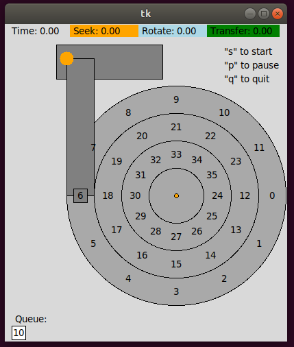
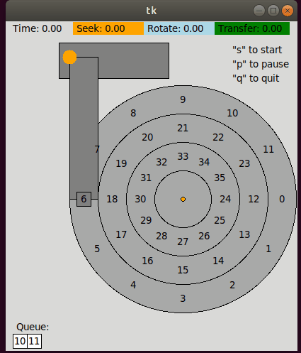
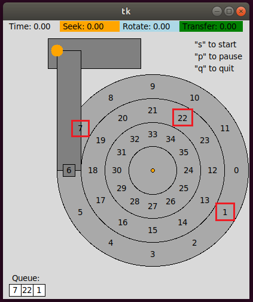
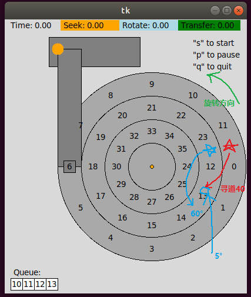
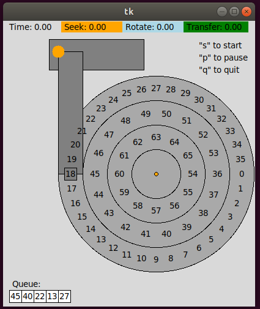
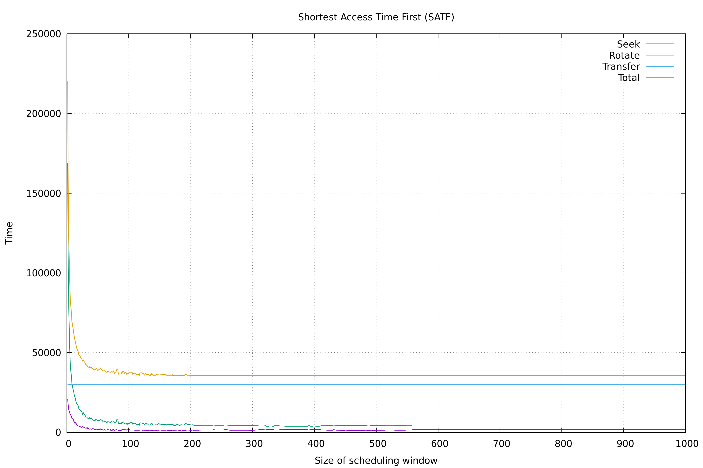

## 37 Hard Disk Drives

提供了两个文件，这里选择使用 `disk.py` ，另外，Ubuntu 上提示没有模块，需要执行 `sudo apt-get install python3-tk` 以安装 `tkinter` 。
- `disk-precise.py` 使用了 Decimal 模块，精度更高，不过没有充分测试过
- [ImportError: No module named 'Tkinter'](https://stackoverflow.com/questions/25905540/importerror-no-module-named-tkinter)


惯例先看一眼参数，

```python
parser = OptionParser()
# 随机种子，默认为 0
parser.add_option('-s', '--seed',            default='0',         help='Random seed',                                             action='store', type='int',    dest='seed')
# 请求列表，以逗号分隔，-1 表示使用随机请求
parser.add_option('-a', '--addr',            default='-1',        help='Request list (comma-separated) [-1 -> use addrDesc]',     action='store', type='string', dest='addr')
# 请求数，最大请求数（-1 表示所有），最小请求数
parser.add_option('-A', '--addrDesc',        default='5,-1,0',    help='Num requests, max request (-1->all), min request',        action='store', type='string', dest='addrDesc')
# 寻道速度
parser.add_option('-S', '--seekSpeed',       default='1',         help='Speed of seek',                                           action='store', type='string', dest='seekSpeed')
# 旋转速度
parser.add_option('-R', '--rotSpeed',        default='1',         help='Speed of rotation',                                       action='store', type='string', dest='rotateSpeed')
# 调度策略，默认先进先出
parser.add_option('-p', '--policy',          default='FIFO',      help='Scheduling policy (FIFO, SSTF, SATF, BSATF)',             action='store', type='string', dest='policy')
# 调度窗口大小
parser.add_option('-w', '--schedWindow',     default=-1,          help='Size of scheduling window (-1 -> all)',                   action='store', type='int',    dest='window')
# 磁道偏斜，，以扇区为单位，默认不偏斜
parser.add_option('-o', '--skewOffset',      default=0,           help='Amount of skew (in blocks)',                              action='store', type='int',    dest='skew')
# 外、中、内扇区之间的角度，默认都为 30°
parser.add_option('-z', '--zoning',          default='30,30,30',  help='Angles between blocks on outer,middle,inner tracks',      action='store', type='string', dest='zoning')
# 显示图形界面
parser.add_option('-G', '--graphics',        default=False,       help='Turn on graphics',                                        action='store_true',           dest='graphics')
# 请求列表，以逗号分隔，-1 表示随机
parser.add_option('-l', '--lateAddr',        default='-1',        help='Late: request list (comma-separated) [-1 -> random]',     action='store', type='string', dest='lateAddr')
# 请求数，最大请求数（-1 表示所有），最小请求数
parser.add_option('-L', '--lateAddrDesc',    default='0,-1,0',    help='Num requests, max request (-1->all), min request',        action='store', type='string', dest='lateAddrDesc')
# 计算结果
parser.add_option('-c', '--compute',         default=False,       help='Compute the answers',                                     action='store_true',           dest='compute')
```

磁盘说明：
- **逆时针旋转**
- 旋转速度为每单位时间 1°
  - 旋转一周需要 360 单位时间
- 传输在扇区之间的中点开始和结束
  - 读取扇区 10 将从 9 和 10 之间开始，到 10 和 11 之间结束
  - 传输时间为旋转一个扇区的时间，默认为 30 单位时间
- 默认每条磁道有 12 个扇区
- 默认外、中、内扇区之间的角度都为 30° ，且没有磁道偏斜
- 每个磁道之间默认 40 单位距离
- 寻道速度为每单位时间 1 单位距离
  - 从外部磁道到中间磁道的寻道需要 40 单位时间



起始位置在 6 号扇区的中央（数字位于扇区的中间位置），寻找 10 号扇区，因为恰好在同一磁道上，因此只需计算旋转时间和传输时间
- 旋转时间 = 3.5 * 30 = 105
  - 旋转 3.5 个扇区的距离

```bash
./disk.py -a 10 -c -G

# 输出
OPTIONS seed 0
OPTIONS addr 10
OPTIONS addrDesc 5,-1,0
OPTIONS seekSpeed 1
OPTIONS rotateSpeed 1
OPTIONS skew 0
OPTIONS window -1
OPTIONS policy FIFO
OPTIONS compute True
OPTIONS graphics False
OPTIONS zoning 30,30,30
OPTIONS lateAddr -1
OPTIONS lateAddrDesc 0,-1,0

z 0 30      <---- 磁道 0
z 1 30
z 2 30
0 30 0      <---- 磁道 0 扇区 0
0 30 1
0 30 2
0 30 3
0 30 4
0 30 5
0 30 6
0 30 7
0 30 8
0 30 9
0 30 10
0 30 11
1 0 30 12
1 0 30 13
1 0 30 14
1 0 30 15
1 0 30 16
1 0 30 17
1 0 30 18
1 0 30 19
1 0 30 20
1 0 30 21
1 0 30 22
1 0 30 23
2 0 30 24
2 0 30 25
2 0 30 26
2 0 30 27
2 0 30 28
2 0 30 29
2 0 30 30
2 0 30 31
2 0 30 32
2 0 30 33
2 0 30 34
2 0 30 35
REQUESTS ['10']    <---- 请求扇区 10

Block:  10  Seek:  0  Rotate:105  Transfer: 30  Total: 135    <---- 寻道时间 0，旋转时间 105，传输时间 30

TOTALS      Seek:  0  Rotate:105  Transfer: 30  Total: 135
```

寻找扇区 10 和 11 ，不用进行寻道，旋转时间为 105 ，传输时间为 60
- 扇区 10 的旋转时间为 3.5 * 30 = 105，加上传输时间 30
- 扇区 11 紧邻扇区 10 ，因此直接传输不需要旋转，传输时间 30

```bash
./disk.py -a 10,11 -c -G

# 输出
...
Block:  10  Seek:  0  Rotate:105  Transfer: 30  Total: 135
Block:  11  Seek:  0  Rotate:  0  Transfer: 30  Total:  30

TOTALS      Seek:  0  Rotate:105  Transfer: 60  Total: 165
```



寻找扇区 10 和 18 ，寻道时间为 40 ，旋转时间为 275 ，传输时间为 60
- 扇区 10 不用寻道，旋转时间为 3.5 * 30 = 105 ，传输时间为 30
- 扇区 18 在中间磁道，寻道时间为 40 ，旋转时间为 7 *30 - 40 = 170（寻道的同时在旋转），传输时间为 30

```bash
./disk.py -a 10,18 -c -G

# 输出
...
Block:  10  Seek:  0  Rotate:105  Transfer: 30  Total: 135
Block:  18  Seek: 40  Rotate:170  Transfer: 30  Total: 240

TOTALS      Seek: 40  Rotate:275  Transfer: 60  Total: 375
```

### 1

计算以下几组请求的寻道、旋转、传输时间，根据这张起始的图片进行计算即可。


1. 请求扇区 0

- 寻道时间 0
- 旋转时间 5.5 * 30 = 165
- 传输时间 30

```bash
./disk.py -a 0 -c

# 输出
...
Block:   0  Seek:  0  Rotate:165  Transfer: 30  Total: 195

TOTALS      Seek:  0  Rotate:165  Transfer: 30  Total: 195
```

2. 请求扇区 6

- 寻道时间 0
- 旋转时间 11.5 * 30 = 345
- 传输时间 30

```bash
./disk.py -a 6 -c

# 输出
...
Block:   6  Seek:  0  Rotate:345  Transfer: 30  Total: 375

TOTALS      Seek:  0  Rotate:345  Transfer: 30  Total: 375
```

3. 请求扇区 30

- 寻道时间 40 * 2 = 80
- 旋转时间 11.5 * 30 - 80 = 265
- 传输时间 30

```bash
./disk.py -a 30 -c

# 输出
...
Block:  30  Seek: 80  Rotate:265  Transfer: 30  Total: 375

TOTALS      Seek: 80  Rotate:265  Transfer: 30  Total: 375
```

4. 请求扇区 7, 30, 8

扇区 7
- 寻道时间 0
- 旋转时间 0.5 * 30 = 15
- 传输时间 30

扇区 30
- 寻道时间 40 * 2 = 80
- 旋转时间 10 * 30 - 80 = 220
- 传输时间 30

扇区 8
- 寻道时间 40 * 2 = 80
- 旋转时间 1 * 30 - 80 + 12 * 30 = 310
- 传输时间 30

```bash
./disk.py -a 7,30,8 -c

# 输出
...
Block:   7  Seek:  0  Rotate: 15  Transfer: 30  Total:  45
Block:  30  Seek: 80  Rotate:220  Transfer: 30  Total: 330
Block:   8  Seek: 80  Rotate:310  Transfer: 30  Total: 420

TOTALS      Seek:160  Rotate:545  Transfer: 90  Total: 795
```

5. 请求扇区 10, 11, 12, 13

扇区 10
- 寻道时间 0
- 旋转时间 3.5 * 30 = 105
- 传输时间 30

扇区 11
- 寻道时间 0
- 旋转时间 0
- 传输时间 30

扇区 12
- 寻道时间 40 
- 旋转时间 0 - 40 + 12 * 30 = 320
- 传输时间 30

扇区 13
- 寻道时间 0
- 旋转时间 0
- 传输时间 30

```bash
./disk.py -a 10,11,12,13 -c

# 输出
...
Block:  10  Seek:  0  Rotate:105  Transfer: 30  Total: 135
Block:  11  Seek:  0  Rotate:  0  Transfer: 30  Total:  30
Block:  12  Seek: 40  Rotate:320  Transfer: 30  Total: 390
Block:  13  Seek:  0  Rotate:  0  Transfer: 30  Total:  30

TOTALS      Seek: 40  Rotate:425  Transfer:120  Total: 585
```

### 2

改变寻道速率 `-S` ，重复 1 中的请求。

#### `-S 2`

寻道速度是原来的 2 倍，即跨越一个磁道只需要 20 单位时间。

1. 请求扇区 0

不涉及寻道，因此时间不变。

- 寻道时间 0
- 旋转时间 5.5 * 30 = 165
- 传输时间 30

```bash
./disk.py -a 0 -S 2 -c

# 输出
...
Block:   0  Seek:  0  Rotate:165  Transfer: 30  Total: 195

TOTALS      Seek:  0  Rotate:165  Transfer: 30  Total: 195
```

2. 请求扇区 6

不涉及寻道，因此时间不变。

- 寻道时间 0
- 旋转时间 11.5 * 30 = 345
- 传输时间 30

```bash
./disk.py -a 6 -S 2 -c

# 输出
...
Block:   6  Seek:  0  Rotate:345  Transfer: 30  Total: 375

TOTALS      Seek:  0  Rotate:345  Transfer: 30  Total: 375
```

3. 请求扇区 30

- 寻道时间 20 * 2 = 40
- 旋转时间 11.5 * 30 - 40 = 305
- 传输时间 30

```bash
./disk.py -a 30 -S 2 -c

# 输出
...
Block:  30  Seek: 40  Rotate:305  Transfer: 30  Total: 375

TOTALS      Seek: 40  Rotate:305  Transfer: 30  Total: 375
```

4. 请求扇区 7, 30, 8

扇区 7
- 寻道时间 0
- 旋转时间 0.5 * 30 = 15
- 传输时间 30

扇区 30
- 寻道时间 20 * 2 = 40
- 旋转时间 10 * 30 - 40 = 260
- 传输时间 30

扇区 8
- 寻道时间 20 * 2 = 40
- 旋转时间 1 * 30 - 40 + 12 * 30 = 350
- 传输时间 30

```bash
./disk.py -a 7,30,8 -S 2 -c

# 输出
...
Block:   7  Seek:  0  Rotate: 15  Transfer: 30  Total:  45
Block:  30  Seek: 40  Rotate:260  Transfer: 30  Total: 330
Block:   8  Seek: 40  Rotate:350  Transfer: 30  Total: 420

TOTALS      Seek: 80  Rotate:625  Transfer: 90  Total: 795
```

5. 请求扇区 10, 11, 12, 13

扇区 10
- 寻道时间 0
- 旋转时间 3.5 * 30 = 105
- 传输时间 30

扇区 11
- 寻道时间 0
- 旋转时间 0
- 传输时间 30

扇区 12
- 寻道时间 20 
- 旋转时间 0 - 20 + 12 * 30 = 340
- 传输时间 30

扇区 13
- 寻道时间 0
- 旋转时间 0
- 传输时间 30

```bash
./disk.py -a 10,11,12,13 -S 2 -c

# 输出
...
Block:  10  Seek:  0  Rotate:105  Transfer: 30  Total: 135
Block:  11  Seek:  0  Rotate:  0  Transfer: 30  Total:  30
Block:  12  Seek: 20  Rotate:340  Transfer: 30  Total: 390
Block:  13  Seek:  0  Rotate:  0  Transfer: 30  Total:  30

TOTALS      Seek: 20  Rotate:445  Transfer:120  Total: 585
```

#### `-S 4`

寻道速度是原来的 4 倍，即跨越一个磁道只需要 10 单位时间。

1. 请求扇区 0

不涉及寻道，因此时间不变。

- 寻道时间 0
- 旋转时间 5.5 * 30 = 165
- 传输时间 30

```bash
./disk.py -a 0 -S 4 -c

# 输出
...
Block:   0  Seek:  0  Rotate:165  Transfer: 30  Total: 195

TOTALS      Seek:  0  Rotate:165  Transfer: 30  Total: 195
```

2. 请求扇区 6

不涉及寻道，因此时间不变。

- 寻道时间 0
- 旋转时间 11.5 * 30 = 345
- 传输时间 30

```bash
./disk.py -a 6 -S 4 -c

# 输出
...
Block:   6  Seek:  0  Rotate:345  Transfer: 30  Total: 375

TOTALS      Seek:  0  Rotate:345  Transfer: 30  Total: 375
```

3. 请求扇区 30

- 寻道时间 10 * 2 = 20
- 旋转时间 11.5 * 30 - 20 = 325
- 传输时间 30

```bash
./disk.py -a 30 -S 4 -c

# 输出
...
Block:  30  Seek: 20  Rotate:325  Transfer: 30  Total: 375

TOTALS      Seek: 20  Rotate:325  Transfer: 30  Total: 375
```

4. 请求扇区 7, 30, 8

扇区 7
- 寻道时间 0
- 旋转时间 0.5 * 30 = 15
- 传输时间 30

扇区 30
- 寻道时间 10 * 2 = 20
- 旋转时间 10 * 30 - 20 = 280
- 传输时间 30

扇区 8
- 寻道时间 10 * 2 = 20
- 旋转时间 1 * 30 - 20 = 10
- 传输时间 30

```bash
./disk.py -a 7,30,8 -S 4 -c

# 输出
...
Block:   7  Seek:  0  Rotate: 15  Transfer: 30  Total:  45
Block:  30  Seek: 20  Rotate:280  Transfer: 30  Total: 330
Block:   8  Seek: 20  Rotate: 10  Transfer: 30  Total:  60

TOTALS      Seek: 40  Rotate:305  Transfer: 90  Total: 435
```

5. 请求扇区 10, 11, 12, 13

扇区 10
- 寻道时间 0
- 旋转时间 3.5 * 30 = 105
- 传输时间 30

扇区 11
- 寻道时间 0
- 旋转时间 0
- 传输时间 30

扇区 12
- 寻道时间 10 
- 旋转时间 0 - 10 + 12 * 30 = 350
- 传输时间 30

扇区 13
- 寻道时间 0
- 旋转时间 0
- 传输时间 30

```bash
./disk.py -a 10,11,12,13 -S 4 -c

# 输出
...
Block:  10  Seek:  0  Rotate:105  Transfer: 30  Total: 135
Block:  11  Seek:  0  Rotate:  0  Transfer: 30  Total:  30
Block:  12  Seek: 10  Rotate:350  Transfer: 30  Total: 390
Block:  13  Seek:  0  Rotate:  0  Transfer: 30  Total:  30

TOTALS      Seek: 10  Rotate:455  Transfer:120  Total: 585
```

#### `-S 8`

寻道速度是原来的 8 倍，即跨越一个磁道只需要 5 单位时间。

1. 请求扇区 0

不涉及寻道，因此时间不变。

- 寻道时间 0
- 旋转时间 5.5 * 30 = 165
- 传输时间 30

```bash
./disk.py -a 0 -S 8 -c

# 输出
...
Block:   0  Seek:  0  Rotate:165  Transfer: 30  Total: 195

TOTALS      Seek:  0  Rotate:165  Transfer: 30  Total: 195
```

2. 请求扇区 6

不涉及寻道，因此时间不变。

- 寻道时间 0
- 旋转时间 11.5 * 30 = 345
- 传输时间 30

```bash
./disk.py -a 6 -S 8 -c

# 输出
...
Block:   6  Seek:  0  Rotate:345  Transfer: 30  Total: 375

TOTALS      Seek:  0  Rotate:345  Transfer: 30  Total: 375
```

3. 请求扇区 30

- 寻道时间 5 * 2 = 10
- 旋转时间 11.5 * 30 - 10 = 335
- 传输时间 30

```bash
./disk.py -a 30 -S 8 -c

# 输出
...
Block:  30  Seek: 10  Rotate:335  Transfer: 30  Total: 375

TOTALS      Seek: 10  Rotate:335  Transfer: 30  Total: 375
```

4. 请求扇区 7, 30, 8

扇区 7
- 寻道时间 0
- 旋转时间 0.5 * 30 = 15
- 传输时间 30

扇区 30
- 寻道时间 5 * 2 = 10
- 旋转时间 10 * 30 - 10 = 290
- 传输时间 30

扇区 8
- 寻道时间 5 * 2 = 10
- 旋转时间 1 * 30 - 10 = 20
- 传输时间 30

```bash
./disk.py -a 7,30,8 -S 8 -c

# 输出
...
Block:   7  Seek:  0  Rotate: 15  Transfer: 30  Total:  45
Block:  30  Seek: 10  Rotate:290  Transfer: 30  Total: 330
Block:   8  Seek: 10  Rotate: 20  Transfer: 30  Total:  60

TOTALS      Seek: 20  Rotate:325  Transfer: 90  Total: 435
```

5. 请求扇区 10, 11, 12, 13

扇区 10
- 寻道时间 0
- 旋转时间 3.5 * 30 = 105
- 传输时间 30

扇区 11
- 寻道时间 0
- 旋转时间 0
- 传输时间 30

扇区 12
- 寻道时间 5
- 旋转时间 0 - 5 + 12 * 30 = 355
- 传输时间 30

扇区 13
- 寻道时间 0
- 旋转时间 0
- 传输时间 30

```bash
./disk.py -a 10,11,12,13 -S 8 -c

# 输出
...
Block:  10  Seek:  0  Rotate:105  Transfer: 30  Total: 135
Block:  11  Seek:  0  Rotate:  0  Transfer: 30  Total:  30
Block:  12  Seek:  5  Rotate:355  Transfer: 30  Total: 390
Block:  13  Seek:  0  Rotate:  0  Transfer: 30  Total:  30

TOTALS      Seek:  5  Rotate:460  Transfer:120  Total: 585
```

#### `-S 10`

寻道速度是原来的 10 倍，即跨越一个磁道只需要 4 单位时间。

1. 请求扇区 0

不涉及寻道，因此时间不变。

- 寻道时间 0
- 旋转时间 5.5 * 30 = 165
- 传输时间 30

```bash
./disk.py -a 0 -S 10 -c

# 输出
...
Block:   0  Seek:  0  Rotate:165  Transfer: 30  Total: 195

TOTALS      Seek:  0  Rotate:165  Transfer: 30  Total: 195
```

2. 请求扇区 6

不涉及寻道，因此时间不变。

- 寻道时间 0
- 旋转时间 11.5 * 30 = 345
- 传输时间 30

```bash
./disk.py -a 6 -S 10 -c

# 输出
...
Block:   6  Seek:  0  Rotate:345  Transfer: 30  Total: 375

TOTALS      Seek:  0  Rotate:345  Transfer: 30  Total: 375
```

3. 请求扇区 30

- 寻道时间 4 * 2 = 8
- 旋转时间 11.5 * 30 - 8 = 337
- 传输时间 30

```bash
./disk.py -a 30 -S 10 -c

# 输出
...
Block:  30  Seek:  8  Rotate:337  Transfer: 30  Total: 375

TOTALS      Seek:  8  Rotate:337  Transfer: 30  Total: 375
```

4. 请求扇区 7, 30, 8

扇区 7
- 寻道时间 0
- 旋转时间 0.5 * 30 = 15
- 传输时间 30

扇区 30
- 寻道时间 4 * 2 = 8
- 旋转时间 10 * 30 - 8 = 292
- 传输时间 30

扇区 8
- 寻道时间 4 * 2 = 8
- 旋转时间 1 * 30 - 8 = 22
- 传输时间 30

```bash
./disk.py -a 7,30,8 -S 10 -c

# 输出
...
Block:   7  Seek:  0  Rotate: 15  Transfer: 30  Total:  45
Block:  30  Seek:  8  Rotate:292  Transfer: 30  Total: 330
Block:   8  Seek:  8  Rotate: 22  Transfer: 30  Total:  60

TOTALS      Seek: 16  Rotate:329  Transfer: 90  Total: 435
```

5. 请求扇区 10, 11, 12, 13

扇区 10
- 寻道时间 0
- 旋转时间 3.5 * 30 = 105
- 传输时间 30

扇区 11
- 寻道时间 0
- 旋转时间 0
- 传输时间 30

扇区 12
- 寻道时间 4 
- 旋转时间 0 - 4 + 12 * 30 = 356
- 传输时间 30

扇区 13
- 寻道时间 0
- 旋转时间 0
- 传输时间 30

```bash
./disk.py -a 10,11,12,13 -S 10 -c

# 输出
...
Block:  10  Seek:  0  Rotate:105  Transfer: 30  Total: 135
Block:  11  Seek:  0  Rotate:  0  Transfer: 30  Total:  30
Block:  12  Seek:  4  Rotate:356  Transfer: 30  Total: 390
Block:  13  Seek:  0  Rotate:  0  Transfer: 30  Total:  30

TOTALS      Seek:  4  Rotate:461  Transfer:120  Total: 585
```

#### `-S 40`

寻道速度是原来的 40 倍，即跨越一个磁道只需要 1 单位时间。

1. 请求扇区 0

不涉及寻道，因此时间不变。

- 寻道时间 0
- 旋转时间 5.5 * 30 = 165
- 传输时间 30

```bash
./disk.py -a 0 -S 40 -c

# 输出
...
Block:   0  Seek:  0  Rotate:165  Transfer: 30  Total: 195

TOTALS      Seek:  0  Rotate:165  Transfer: 30  Total: 195
```

2. 请求扇区 6

不涉及寻道，因此时间不变。

- 寻道时间 0
- 旋转时间 11.5 * 30 = 345
- 传输时间 30

```bash
./disk.py -a 6 -S 40 -c

# 输出
...
Block:   6  Seek:  0  Rotate:345  Transfer: 30  Total: 375

TOTALS      Seek:  0  Rotate:345  Transfer: 30  Total: 375
```

3. 请求扇区 30

- 寻道时间 1 * 2 = 2
- 旋转时间 11.5 * 30 - 2 = 343
- 传输时间 30

```bash
./disk.py -a 30 -S 40 -c

# 输出
...
Block:  30  Seek:  2  Rotate:343  Transfer: 30  Total: 375

TOTALS      Seek:  2  Rotate:343  Transfer: 30  Total: 375
```

4. 请求扇区 7, 30, 8

扇区 7
- 寻道时间 0
- 旋转时间 0.5 * 30 = 15
- 传输时间 30

扇区 30
- 寻道时间 1 * 2 = 2
- 旋转时间 10 * 30 - 2 = 298
- 传输时间 30

扇区 8
- 寻道时间 1 * 2 = 2
- 旋转时间 1 * 30 - 2 = 28
- 传输时间 30

```bash
./disk.py -a 7,30,8 -S 40 -c

# 输出
...
Block:   7  Seek:  0  Rotate: 15  Transfer: 30  Total:  45
Block:  30  Seek:  2  Rotate:298  Transfer: 30  Total: 330
Block:   8  Seek:  2  Rotate: 28  Transfer: 30  Total:  60

TOTALS      Seek:  4  Rotate:341  Transfer: 90  Total: 435
```

5. 请求扇区 10, 11, 12, 13

扇区 10
- 寻道时间 0
- 旋转时间 3.5 * 30 = 105
- 传输时间 30

扇区 11
- 寻道时间 0
- 旋转时间 0
- 传输时间 30

扇区 12
- 寻道时间 1
- 旋转时间 0 - 1 + 12 * 30 = 359
- 传输时间 30

扇区 13
- 寻道时间 0
- 旋转时间 0
- 传输时间 30

```bash
./disk.py -a 10,11,12,13 -S 40 -c

# 输出
...
Block:  10  Seek:  0  Rotate:105  Transfer: 30  Total: 135
Block:  11  Seek:  0  Rotate:  0  Transfer: 30  Total:  30
Block:  12  Seek:  1  Rotate:359  Transfer: 30  Total: 390
Block:  13  Seek:  0  Rotate:  0  Transfer: 30  Total:  30

TOTALS      Seek:  1  Rotate:464  Transfer:120  Total: 585
```

#### `-S 0.1`

寻道速度是原来的 0.1 倍，即跨越一个磁道需要 400 单位时间。

1. 请求扇区 0

不涉及寻道，因此时间不变。

- 寻道时间 0
- 旋转时间 5.5 * 30 = 165
- 传输时间 30

```bash
./disk.py -a 0 -S 0.1 -c

# 输出
...
Block:   0  Seek:  0  Rotate:165  Transfer: 30  Total: 195

TOTALS      Seek:  0  Rotate:165  Transfer: 30  Total: 195
```

2. 请求扇区 6

不涉及寻道，因此时间不变。

- 寻道时间 0
- 旋转时间 11.5 * 30 = 345
- 传输时间 30

```bash
./disk.py -a 6 -S 0.1 -c

# 输出
...
Block:   6  Seek:  0  Rotate:345  Transfer: 30  Total: 375

TOTALS      Seek:  0  Rotate:345  Transfer: 30  Total: 375
```

3. 请求扇区 30

- 寻道时间 400 * 2 = 800
- 旋转时间 11.5 * 30 - 800 + 12 * 30 * 2 = 265
- 传输时间 30

```bash
./disk.py -a 30 -S 0.1 -c

# 输出
...
Block:  30  Seek:801  Rotate:264  Transfer: 30  Total:1095

TOTALS      Seek:801  Rotate:264  Transfer: 30  Total:1095
```

4. 请求扇区 7, 30, 8

扇区 7
- 寻道时间 0
- 旋转时间 0.5 * 30 = 15
- 传输时间 30

扇区 30
- 寻道时间 400 * 2 = 800
- 旋转时间 10 * 30 - 800 + 12 * 30 * 2 = 220
- 传输时间 30

扇区 8
- 寻道时间 400 * 2 = 800
- 旋转时间 1 * 30 - 800 + 12 * 30 * 3 = 310
- 传输时间 30

```bash
./disk.py -a 7,30,8 -S 0.1 -c

# 输出
...
Block:   7  Seek:  0  Rotate: 15  Transfer: 30  Total:  45
Block:  30  Seek:801  Rotate:219  Transfer: 30  Total:1050
Block:   8  Seek:801  Rotate:309  Transfer: 30  Total:1140

TOTALS      Seek:1602  Rotate:543  Transfer: 90  Total:2235
```

5. 请求扇区 10, 11, 12, 13

扇区 10
- 寻道时间 0
- 旋转时间 3.5 * 30 = 105
- 传输时间 30

扇区 11
- 寻道时间 0
- 旋转时间 0
- 传输时间 30

扇区 12
- 寻道时间 400
- 旋转时间 0 - 400 + 12 * 30 * 2 = 320
- 传输时间 30

扇区 13
- 寻道时间 0
- 旋转时间 0
- 传输时间 30

```bash
./disk.py -a 10,11,12,13 -S 0.1 -c

# 输出
...
Block:  10  Seek:  0  Rotate:105  Transfer: 30  Total: 135
Block:  11  Seek:  0  Rotate:  0  Transfer: 30  Total:  30
Block:  12  Seek:401  Rotate:319  Transfer: 30  Total: 750
Block:  13  Seek:  0  Rotate:  0  Transfer: 30  Total:  30

TOTALS      Seek:401  Rotate:424  Transfer:120  Total: 945
```

### 3

改变旋转速率 `-R` ，重复 1 中的请求。

#### `-R 0.1`

旋转速度是原来的 0.1 倍，即旋转一周需要 3600 单位时间，旋转一个扇区（传输时间） 需要 300 单位时间。

1. 请求扇区 0

- 寻道时间 0
- 旋转时间 5.5 * 300 = 1650
- 传输时间 300

```bash
./disk.py -a 0 -R 0.1 -c

# 输出
...
Block:   0  Seek:  0  Rotate:1650  Transfer:300  Total:1950

TOTALS      Seek:  0  Rotate:1650  Transfer:300  Total:1950
```

2. 请求扇区 6

- 寻道时间 0
- 旋转时间 11.5 * 300 = 3450
- 传输时间 300

```bash
./disk.py -a 6 -R 0.1 -c

# 输出
...
Block:   6  Seek:  0  Rotate:3449  Transfer:301  Total:3750

TOTALS      Seek:  0  Rotate:3449  Transfer:301  Total:3750
```

3. 请求扇区 30

- 寻道时间 40 * 2 = 80
- 旋转时间 11.5 * 300 - 80 = 3370
- 传输时间 300

```bash
./disk.py -a 30 -R 0.1 -c

# 输出
...
Block:  30  Seek: 80  Rotate:3369  Transfer:301  Total:3750

TOTALS      Seek: 80  Rotate:3369  Transfer:301  Total:3750
```

4. 请求扇区 7, 30, 8

扇区 7
- 寻道时间 0
- 旋转时间 0.5 * 300 = 150
- 传输时间 300

扇区 30
- 寻道时间 40 * 2 = 80
- 旋转时间 10 * 300 - 80 = 2920
- 传输时间 300

扇区 8
- 寻道时间 40 * 2 = 80
- 旋转时间 1 * 300 - 80 = 220
- 传输时间 300

```bash
./disk.py -a 7,30,8 -R 0.1 -c

# 输出
...
Block:   7  Seek:  0  Rotate:150  Transfer:299  Total: 449
Block:  30  Seek: 80  Rotate:2920  Transfer:301  Total:3301
Block:   8  Seek: 80  Rotate:219  Transfer:300  Total: 599

TOTALS      Seek:160  Rotate:3289  Transfer:900  Total:4349
```

5. 请求扇区 10, 11, 12, 13

扇区 10
- 寻道时间 0
- 旋转时间 3.5 * 300 = 1050
- 传输时间 300

扇区 11
- 寻道时间 0
- 旋转时间 0
- 传输时间 300

扇区 12
- 寻道时间 40 
- 旋转时间 0 - 40 + 12 * 300 = 3560
- 传输时间 300

扇区 13
- 寻道时间 0
- 旋转时间 0
- 传输时间 300

```bash
./disk.py -a 10,11,12,13 -R 0.1 -c

# 输出
...
Block:  10  Seek:  0  Rotate:1050  Transfer:300  Total:1350
Block:  11  Seek:  0  Rotate:  0  Transfer:300  Total: 300
Block:  12  Seek: 40  Rotate:3560  Transfer:300  Total:3900
Block:  13  Seek:  0  Rotate:  0  Transfer:300  Total: 300

TOTALS      Seek: 40  Rotate:4610  Transfer:1200  Total:5850
```

#### `-R 0.5`

旋转速度是原来的 0.5 倍，即旋转一周需要 1800 单位时间，旋转一个扇区（传输时间） 需要 60 单位时间。

1. 请求扇区 0

- 寻道时间 0
- 旋转时间 5.5 * 60 = 330
- 传输时间 60

```bash
./disk.py -a 0 -R 0.5 -c

# 输出
...
Block:   0  Seek:  0  Rotate:330  Transfer: 60  Total: 390

TOTALS      Seek:  0  Rotate:330  Transfer: 60  Total: 390
```

2. 请求扇区 6

- 寻道时间 0
- 旋转时间 11.5 * 60 = 690
- 传输时间 60

```bash
./disk.py -a 6 -R 0.5 -c

# 输出
...
Block:   6  Seek:  0  Rotate:690  Transfer: 60  Total: 750

TOTALS      Seek:  0  Rotate:690  Transfer: 60  Total: 750
```

3. 请求扇区 30

- 寻道时间 40 * 2 = 80
- 旋转时间 11.5 * 60 - 80 = 610
- 传输时间 60

```bash
./disk.py -a 30 -R 0.5 -c

# 输出
...
Block:  30  Seek: 80  Rotate:610  Transfer: 60  Total: 750

TOTALS      Seek: 80  Rotate:610  Transfer: 60  Total: 750
```

4. 请求扇区 7, 30, 8

扇区 7
- 寻道时间 0
- 旋转时间 0.5 * 60 = 30
- 传输时间 60

扇区 30
- 寻道时间 40 * 2 = 80
- 旋转时间 10 * 60 - 80 = 520
- 传输时间 60

扇区 8
- 寻道时间 40 * 2 = 80
- 旋转时间 1 * 60 - 80 + 12 * 60 = 700
- 传输时间 60

```bash
./disk.py -a 7,30,8 -R 0.5 -c

# 输出
...
Block:   7  Seek:  0  Rotate: 30  Transfer: 60  Total:  90
Block:  30  Seek: 80  Rotate:520  Transfer: 60  Total: 660
Block:   8  Seek: 80  Rotate:700  Transfer: 60  Total: 840

TOTALS      Seek:160  Rotate:1250  Transfer:180  Total:1590
```

5. 请求扇区 10, 11, 12, 13

扇区 10
- 寻道时间 0
- 旋转时间 3.5 * 60 = 210
- 传输时间 60

扇区 11
- 寻道时间 0
- 旋转时间 0
- 传输时间 60

扇区 12
- 寻道时间 40 
- 旋转时间 0 - 40 + 12 * 60 = 680
- 传输时间 60

扇区 13
- 寻道时间 0
- 旋转时间 0
- 传输时间 60

```bash
./disk.py -a 10,11,12,13 -R 0.5 -c

# 输出
...
Block:  10  Seek:  0  Rotate:210  Transfer: 60  Total: 270
Block:  11  Seek:  0  Rotate:  0  Transfer: 60  Total:  60
Block:  12  Seek: 40  Rotate:680  Transfer: 60  Total: 780
Block:  13  Seek:  0  Rotate:  0  Transfer: 60  Total:  60

TOTALS      Seek: 40  Rotate:890  Transfer:240  Total:1170
```

#### `-R 0.01`

旋转速度是原来的 0.01 倍，即旋转一周需要 36000 单位时间，旋转一个扇区（传输时间） 需要 3000 单位时间。

1. 请求扇区 0

- 寻道时间 0
- 旋转时间 5.5 * 3000 = 16500
- 传输时间 3000

```bash
./disk.py -a 0 -R 0.01 -c

# 输出
...
Block:   0  Seek:  0  Rotate:16500  Transfer:3000  Total:19500

TOTALS      Seek:  0  Rotate:16500  Transfer:3000  Total:19500
```

2. 请求扇区 6

- 寻道时间 0
- 旋转时间 11.5 * 3000 = 34500
- 传输时间 3000

```bash
./disk.py -a 6 -R 0.01 -c

# 输出
...
Block:   6  Seek:  0  Rotate:34500  Transfer:3001  Total:37501

TOTALS      Seek:  0  Rotate:34500  Transfer:3001  Total:37501
```

3. 请求扇区 30

- 寻道时间 40 * 2 = 80
- 旋转时间 11.5 * 3000 - 80 = 34420
- 传输时间 3000

```bash
./disk.py -a 30 -R 0.01 -c

# 输出
...
Block:  30  Seek: 80  Rotate:34420  Transfer:3001  Total:37501

TOTALS      Seek: 80  Rotate:34420  Transfer:3001  Total:37501
```

4. 请求扇区 7, 30, 8

扇区 7
- 寻道时间 0
- 旋转时间 0.5 * 3000 = 1500
- 传输时间 3000

扇区 30
- 寻道时间 40 * 2 = 80
- 旋转时间 10 * 3000 - 80 = 29920
- 传输时间 3000

扇区 8
- 寻道时间 40 * 2 = 80
- 旋转时间 1 * 3000 - 80 = 2920
- 传输时间 3000

```bash
./disk.py -a 7,30,8 -R 0.01 -c

# 输出
...
Block:   7  Seek:  0  Rotate:1500  Transfer:3000  Total:4500
Block:  30  Seek: 80  Rotate:29920  Transfer:3001  Total:33001
Block:   8  Seek: 80  Rotate:2920  Transfer:2999  Total:5999

TOTALS      Seek:160  Rotate:34340  Transfer:9000  Total:43500
```

5. 请求扇区 10, 11, 12, 13

扇区 10
- 寻道时间 0
- 旋转时间 3.5 * 3000 = 10500
- 传输时间 3000

扇区 11
- 寻道时间 0
- 旋转时间 0
- 传输时间 3000

扇区 12
- 寻道时间 40 
- 旋转时间 0 - 40 + 12 * 3000 = 35960
- 传输时间 3000

扇区 13
- 寻道时间 0
- 旋转时间 0
- 传输时间 3000

```bash
./disk.py -a 10,11,12,13 -R 0.01 -c

# 输出
...
Block:  10  Seek:  0  Rotate:10499  Transfer:3000  Total:13499
Block:  11  Seek:  0  Rotate:  0  Transfer:3001  Total:3001
Block:  12  Seek: 40  Rotate:35961  Transfer:3000  Total:39001
Block:  13  Seek:  0  Rotate:  0  Transfer:3000  Total:3000

TOTALS      Seek: 40  Rotate:46460  Transfer:12001  Total:58501
```

### 4

使用不同的调度策略请求扇区 7, 30, 8

1. FIFO（先进先出，顺序）

默认策略，按顺序进行访问：7, 30, 8

扇区 7
- 寻道时间 0
- 旋转时间 0.5 * 30 = 15
- 传输时间 30

扇区 30
- 寻道时间 40 * 2 = 80
- 旋转时间 10 * 30 - 80 = 220
- 传输时间 30

扇区 8
- 寻道时间 40 * 2 = 80
- 旋转时间 1 * 30 - 80 + 12 * 30 = 310
- 传输时间 30

```bash
./disk.py -a 7,30,8 -c

# 输出
...
Block:   7  Seek:  0  Rotate: 15  Transfer: 30  Total:  45
Block:  30  Seek: 80  Rotate:220  Transfer: 30  Total: 330
Block:   8  Seek: 80  Rotate:310  Transfer: 30  Total: 420

TOTALS      Seek:160  Rotate:545  Transfer: 90  Total: 795
```

2. SSTF（最短寻道时间优先）

优先访问在同一条磁道上的扇区：7, 8, 30

扇区 7
- 寻道时间 0
- 旋转时间 0.5 * 30 = 15
- 传输时间 30

扇区 8
- 寻道时间 0
- 旋转时间 0
- 传输时间 30

扇区 30
- 寻道时间 40 * 2 = 80
- 旋转时间 9 * 30 - 80 = 190
- 传输时间 30

```bash
./disk.py -a 7,30,8 -p SSTF -c

# 输出
...
Block:   7  Seek:  0  Rotate: 15  Transfer: 30  Total:  45
Block:   8  Seek:  0  Rotate:  0  Transfer: 30  Total:  30
Block:  30  Seek: 80  Rotate:190  Transfer: 30  Total: 300

TOTALS      Seek: 80  Rotate:205  Transfer: 90  Total: 375
```

3. SATF（即SPTF，最短定位时间优先）

优先访问最近的扇区（寻道、旋转时间最少）：7, 8, 30

扇区 7
- 寻道时间 0
- 旋转时间 0.5 * 30 = 15
- 传输时间 30

扇区 8
- 寻道时间 0
- 旋转时间 0
- 传输时间 30

扇区 30
- 寻道时间 40 * 2 = 80
- 旋转时间 9 * 30 - 80 = 190
- 传输时间 30

```bash
./disk.py -a 7,30,8 -p SATF -c

# 输出
...
Block:   7  Seek:  0  Rotate: 15  Transfer: 30  Total:  45
Block:   8  Seek:  0  Rotate:  0  Transfer: 30  Total:  30
Block:  30  Seek: 80  Rotate:190  Transfer: 30  Total: 300

TOTALS      Seek: 80  Rotate:205  Transfer: 90  Total: 375
```

### 5

找到 SATF 明显优于 SSTF 的一组请求，出现显著差异的条件是什么
- 访问的扇区位于不同的磁道
- 寻道比旋转更快到达下一个待访问的扇区

访问扇区 7, 22, 1



SSTF 优先访问同一个磁道上的扇区：7, 1, 22

```bash
./disk.py -a 7,22,1 -p SSTF -c

# 输出
...
Block:   7  Seek:  0  Rotate: 15  Transfer: 30  Total:  45
Block:   1  Seek:  0  Rotate:150  Transfer: 30  Total: 180
Block:  22  Seek: 40  Rotate:200  Transfer: 30  Total: 270

TOTALS      Seek: 40  Rotate:365  Transfer: 90  Total: 495
```

SATF 优先访问最近的扇区（寻道、旋转时间最少）：7, 22, 1

```bash
./disk.py -a 7,22,1 -p SATF -c

# 输出
...
Block:   7  Seek:  0  Rotate: 15  Transfer: 30  Total:  45
Block:  22  Seek: 40  Rotate: 20  Transfer: 30  Total:  90
Block:   1  Seek: 40  Rotate: 20  Transfer: 30  Total:  90

TOTALS      Seek: 80  Rotate: 55  Transfer: 90  Total: 225
```

### 6

引入磁道偏斜（`-o`）来解决访问扇区 10, 11, 12, 13 性能不好的问题、
- 磁道偏斜满足经过寻道时间的旋转角度恰好距离下一个连续的扇区最近即可



访问扇区 11 后，寻道 40 单位时间，距离扇区 13 中间位置还有 5° ，距离扇区 12 起始位置 60°，因此旋转 2 个扇区距离即可。

```bash
./disk.py -a 10,11,12,13 -o 2 -c

# 输出
...
Block:  10  Seek:  0  Rotate:105  Transfer: 30  Total: 135
Block:  11  Seek:  0  Rotate:  0  Transfer: 30  Total:  30
Block:  12  Seek: 40  Rotate: 20  Transfer: 30  Total:  90
Block:  13  Seek:  0  Rotate:  0  Transfer: 30  Total:  30

TOTALS      Seek: 40  Rotate:125  Transfer:120  Total: 285
```

对于不同的寻道速率（`-S`），计算偏斜

1. 寻道速度为原来的 2 倍，20 -> 偏斜 1 个扇区

```bash
./disk.py -a 10,11,12,13 -S 2 -o 1 -c

# 输出
...
Block:  10  Seek:  0  Rotate:105  Transfer: 30  Total: 135
Block:  11  Seek:  0  Rotate:  0  Transfer: 30  Total:  30
Block:  12  Seek: 20  Rotate: 10  Transfer: 30  Total:  60
Block:  13  Seek:  0  Rotate:  0  Transfer: 30  Total:  30

TOTALS      Seek: 20  Rotate:115  Transfer:120  Total: 255
```

2. 寻道速度为原来的 4 倍，10 -> 偏斜 1 个扇区

```bash
./disk.py -a 10,11,12,13 -S 4 -o 1 -c

# 输出
...
Block:  10  Seek:  0  Rotate:105  Transfer: 30  Total: 135
Block:  11  Seek:  0  Rotate:  0  Transfer: 30  Total:  30
Block:  12  Seek: 10  Rotate: 20  Transfer: 30  Total:  60
Block:  13  Seek:  0  Rotate:  0  Transfer: 30  Total:  30

TOTALS      Seek: 10  Rotate:125  Transfer:120  Total: 255
```

### 7

多区域磁盘，外磁道比内磁道拥有更多的扇区，`-z 10,20,30` 指定外圈磁道每隔 10° 一个扇区，中间磁道每隔 20 °一个扇区，内磁道每隔 30° 一个扇区，以下为示意图。
- 传输时间为旋转一个扇区的时间
  - 外圈：10
  - 中间：20
  - 内圈：30



外圈、中间、内圈磁道的带宽（每单位时间的扇区数）是多少

1. 随机种子（`-s`）默认为 0

扇区 45
- 寻道时间 40
- 旋转时间 17.5 * 20 - 40 = 310
- 传输时间 20

扇区 40
- 寻道时间 0
- 旋转时间 12 * 20 = 240
- 传输时间 20

扇区 22
- 寻道时间 40
- 旋转时间 12.5 * 10 - 40 = 85
- 传输时间 10

扇区 13
- 寻道时间 0
- 旋转时间 26 * 10 = 260
- 传输时间 10

扇区 27
- 寻道时间 0
- 旋转时间 13 * 10 = 130
- 传输时间 10

```bash
./disk.py -a -1 -A 5,-1,0 -z 10,20,30 -c

# 输出
...
Block:  45  Seek: 40  Rotate:310  Transfer: 20  Total: 370
Block:  40  Seek:  0  Rotate:240  Transfer: 20  Total: 260
Block:  22  Seek: 40  Rotate: 85  Transfer: 10  Total: 135
Block:  13  Seek:  0  Rotate:260  Transfer: 10  Total: 270
Block:  27  Seek:  0  Rotate:130  Transfer: 10  Total: 140

TOTALS      Seek: 80  Rotate:1025  Transfer: 70  Total:1175
```

2. 随机种子为 1

扇区 7
- 寻道时间 0
- 旋转时间 24.5 * 10 = 245
- 传输时间 10

扇区 45
- 寻道时间 40
- 旋转时间 4.75 * 20 - 40 = 55
- 传输时间 20

扇区 41
- 寻道时间 0
- 旋转时间 13 * 20 = 260
- 传输时间 20

扇区 13
- 寻道时间 40
- 旋转时间 1.5 * 10 - 40 + 36 * 10 = 335
- 传输时间 10

扇区 26
- 寻道时间 0
- 旋转时间 12 * 10 = 120
- 传输时间 10

```bash
./disk.py -s 1 -a -1 -A 5,-1,0 -z 10,20,30 -c

# 输出
...
Block:   7  Seek:  0  Rotate:245  Transfer: 10  Total: 255
Block:  45  Seek: 40  Rotate: 55  Transfer: 20  Total: 115
Block:  41  Seek:  0  Rotate:260  Transfer: 20  Total: 280
Block:  13  Seek: 40  Rotate:335  Transfer: 10  Total: 385
Block:  26  Seek:  0  Rotate:120  Transfer: 10  Total: 130

TOTALS      Seek: 80  Rotate:1015  Transfer: 70  Total:1165
```

3. 随机种子为 2

扇区 51
- 寻道时间 40
- 旋转时间 5.5 * 20 - 40 = 70
- 传输时间 20

扇区 51
- 寻道时间 0
- 旋转时间 17 * 20 = 340
- 传输时间 20

扇区 3
- 寻道时间 40
- 旋转时间 7.5 * 10 - 40 = 35
- 传输时间 10

扇区 4
- 寻道时间 0
- 旋转时间 0
- 传输时间 10

扇区 45
- 寻道时间 40
- 旋转时间 6.25 * 20 - 40 = 85
- 传输时间 20

```bash
./disk.py -s 2 -a -1 -A 5,-1,0 -z 10,20,30 -c

# 输出
...
Block:  51  Seek: 40  Rotate: 70  Transfer: 20  Total: 130
Block:  51  Seek:  0  Rotate:340  Transfer: 20  Total: 360
Block:   3  Seek: 40  Rotate: 35  Transfer: 10  Total:  85
Block:   4  Seek:  0  Rotate:  0  Transfer: 10  Total:  10
Block:  45  Seek: 40  Rotate: 85  Transfer: 20  Total: 145

TOTALS      Seek:120  Rotate:530  Transfer: 80  Total: 730
```

### 8

调度窗口确定一次磁盘可以接受多少个扇区请求，以确定下一个要服务的扇区。查看调度窗口（`-w`）从 1 变为请求数量时，SATF 调度需要多长时间？需要多大的调度窗口才能达到最佳性能？制作一张图看看。

查看调度窗口为 1 时的调度时间，使用 `grep` 查看汇总行。

```bash
./disk.py -a -1 -A 1000,-1,0 -w 1 -p SATF -c

# 输出
...
TOTALS      Seek:20960  Rotate:169165  Transfer:30000  Total:220125
```

使用 Bash 脚本循环调用 Python 脚本，使用 SATF 策略，调整调度窗口大小（1~1000）并将结果写入文件。

- [draw.sh](file-disks/draw.sh)

```bash
#!/bin/bash

for i in {1..1000};
do
    tmp=($(./disk.py -a -1 -A 1000,-1,0 -w ${i} -p SATF -c | grep TOTALS | grep -Eo '[0-9]+'))
    $(printf "%s " ${i} >> data)
    $(printf "%s " "${tmp[@]}" >> data)
    $(echo >> data)
done
```

文件共有 5 列，分别是：行号、Seek、Rotate、Transfer、Total 。

```bash
head data

# 输出
1 20960 169165 30000 220125 
2 16800 102765 30000 149565 
3 13840 75485 30000 119325 
4 12880 58085 30000 100965 
5 11280 44955 30000 86235 
6 10800 38955 30000 79755 
7 9920 35515 30000 75435 
8 8720 30595 30000 69315 
9 8640 28515 30000 67155 
10 8080 26555 30000 64635 
```

使用 `gnuplot` 绘图，四条线分别代表四列。当调度窗口为 200 左右基本已经达到了最佳性能，此外，传输时间是不变的（图中蓝线）。

- [draw.p](file-disks/draw.p)

```
set title "Shortest Access Time First (SATF)"
set xlabel "Size of scheduling window"
set ylabel "Time"

set grid

set term pngcairo truecolor nocrop enhanced size 3000,2000 font "arial bold,30" linewidth 3
set output "result.png"

plot "data" using 1:2 title "Seek" with lines,\
    "data" using 1:3 title "Rotate" with lines,\
    "data" using 1:4 title "Transfer" with lines,\
    "data" using 1:5 title "Total" with lines
```

