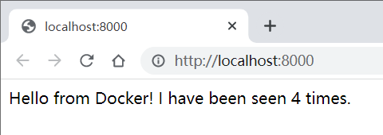

# Docker Compose

> Docker Compose is a tool for running multi-container applications on Docker defined using the [Compose file format](https://compose-spec.io/).

Compose 最初使用 Python 进行开发，调用 Docker 服务提供的 API 对容器进行管理。Compose V2 用 Go 语言重写，并将功能集成到 Docker CLI 中，因此可以使用 `docker compose` 代替 `docker-compose`。
- [docker/compose](https://github.com/docker/compose)

Docker Compose 适用于所有环境：生产、暂存、部署、测试以及 CI 工作流程。

使用 Docker Compose 一般分为以下三步：
1. 使用 Dockerfile 定义应用程序的环境
2. 在 docker-compose.yml 中定义构成应用程序的服务，在隔离环境中一起运行
3. 运行 `docker compose up` 启动并运行整个应用程序

Docker Compose 中有两个重要的概念：
- 服务（service）：一个应用容器，实际上可以包含多个相同镜像的容器实例
- 项目（project）：由一组关联的应用容器组成的一个完整业务单元，在 docker-compose.yml 文件中定义

Docker Compose 允许用户通过单独的 docker-compose.yml 模板文件将一组关联的应用容器定义为一个项目。Compose 的默认管理对象是项目，通过子命令对项目中的一组容器进行生命周期管理。
- 启动、停止、重建服务
- 查看运行服务的状态
- 流式传输运行服务的日志输出
- 在服务上运行一次性命令

## 安装

Docker Compose 依赖 Docker Engine 工作，同时 Compose V2 已经集成到 Docker-CLI 中，似乎不再需要额外的安装步骤。

- [Install Docker Compose](https://docs.docker.com/compose/install/)

## 使用

使用 Docker Compose 构建 Python Web 应用程序，该应用程序使用 Flask 框架并在 Redis 中维护一个命中计数器。

### 设置

定义应用程序依赖

1. 创建目录

```bash
$ mkdir composetest
$ cd composetest
```

2. 创建 `app.py`

```py
import time

import redis
from flask import Flask

app = Flask(__name__)
cache = redis.Redis(host='redis', port=6379)    # redis 容器主机名，默认端口

def get_hit_count():
    retries = 5
    while True:
        try:
            return cache.incr('hits')
        except redis.exceptions.ConnectionError as exc:
            if retries == 0:
                raise exc
            retries -= 1
            time.sleep(0.5)

@app.route('/')
def hello():
    count = get_hit_count()
    return 'Hello World! I have been seen {} times.\n'.format(count)
```

3. 创建 `requirements.txt`

```
flask
redis
```

### 创建 Dockerfile

- 从 Python 3.7 镜像开始构建
- 将工作目录设置为 `/code`
- 设置 flask 命令使用的环境变量
- 安装 gcc 和其他依赖项
- 复制 requirements.txt 并安装 Python 依赖
- 给镜像添加元数据，容器将监听 5000 端口
- 将当前目录复制到镜像中的工作目录
- 将容器的默认命令设置为 `flask run`

```dockerfile
# syntax=docker/dockerfile:1
FROM python:3.7-alpine
WORKDIR /code
ENV FLASK_APP=app.py
ENV FLASK_RUN_HOST=0.0.0.0
RUN apk add --no-cache gcc musl-dev linux-headers
COPY requirements.txt requirements.txt
RUN pip install -r requirements.txt
EXPOSE 5000
COPY . .
CMD ["flask", "run"]
```

### 定义服务

创建 docker-compose.yml，定义两个服务
- web 服务：从当前目录下的 Dockerfile 构建镜像，将容器的 5000 端口绑定到主机的 8000 端口
- redis 服务：从 Docker Hub 拉取 Redis 镜像

```yml
version: "3.9"
services:
  web:
    build: .
    ports:
      - "8000:5000"
  redis:
    image: "redis:alpine"
```

### 构建和运行应用程序

1. 在项目目录中，运行 `docker compose up` 启动应用程序

Compose 拉取 Redis 镜像，为 web 服务构建镜像，并启动定义的服务。在这种情况下，代码在构建时被静态地复制到镜像中。

```bash
$ docker compose up
[+] Running 7/7
 ⠿ redis Pulled                                                                                                    7.6s
   ⠿ df9b9388f04a Already exists                                                                                   0.0s
   ⠿ 192e03523482 Pull complete                                                                                    1.3s
   ⠿ 7151bccd2756 Pull complete                                                                                    1.4s
   ⠿ 683d62ead94f Pull complete                                                                                    4.3s
   ⠿ b4ca937b9a43 Pull complete                                                                                    4.3s
   ⠿ b4bb2d8d1296 Pull complete                                                                                    4.4s
[+] Building 432.1s (15/15) FINISHED
 => [internal] load build definition from Dockerfile                                                               0.1s
 => => transferring dockerfile: 320B                                                                               0.0s
 => [internal] load .dockerignore                                                                                  0.1s
 => => transferring context: 2B                                                                                    0.0s
 => resolve image config for docker.io/docker/dockerfile:1                                                         3.3s
 => docker-image://docker.io/docker/dockerfile:1@sha256:91f386bc3ae6cd5585fbd02f811e295b4a7020c23c7691d686830bf62  4.7s
 => => resolve docker.io/docker/dockerfile:1@sha256:91f386bc3ae6cd5585fbd02f811e295b4a7020c23c7691d686830bf6233e9  0.0s
 => => sha256:7c651b7122e7366e15d4ea5327b27111f6862d9b9896383a4a695d3190f3909d 528B / 528B                         0.0s
 => => sha256:edddd0dce574bd03c542d84013e16caf779de32ce2a1c5b402a0bc7405f85b20 2.37kB / 2.37kB                     0.0s
 => => sha256:0f821387874bc19cdfd45922f5ff075fd256356bf3f2baba7fb109d2b3a64bbd 9.93MB / 9.93MB                     4.3s
 => => sha256:91f386bc3ae6cd5585fbd02f811e295b4a7020c23c7691d686830bf6233e91ad 2.00kB / 2.00kB                     0.0s
 => => extracting sha256:0f821387874bc19cdfd45922f5ff075fd256356bf3f2baba7fb109d2b3a64bbd                          0.2s
 => [internal] load build definition from Dockerfile                                                               0.0s
 => [internal] load .dockerignore                                                                                  0.0s
 => [internal] load metadata for docker.io/library/python:3.7-alpine                                               2.4s
 => [internal] load build context                                                                                  0.0s
 => => transferring context: 1.13kB                                                                                0.0s
 => [1/6] FROM docker.io/library/python:3.7-alpine@sha256:ad5383edd0d9109639a44d725314d1f37af256e81c86a04a0e8e077  7.7s
 => => resolve docker.io/library/python:3.7-alpine@sha256:ad5383edd0d9109639a44d725314d1f37af256e81c86a04a0e8e077  0.0s
 => => sha256:634f06af32afe9926177560feebd9f2ae14aa9a70e1d3cc0a124495a5d7168ae 1.37kB / 1.37kB                     0.0s
 => => sha256:56dc68fee36a4664ca9d7a40f4328bd353e4c651cf64328a0761f2d9ecaadeb1 7.71kB / 7.71kB                     0.0s
 => => sha256:592c86358a0be3e5bea7de17e359984f3180e3e57aa18b5afb51cbffb6df7c71 11.19MB / 11.19MB                   6.7s
 => => sha256:cb59fb21dd583d1d59b6815c76fb183a76fad49e34f19cb39a7f4b2d5310f8e9 231B / 231B                         0.2s
 => => sha256:4304e370afec6248784d847b401b6fc02599663ee50dc37f68731241d10ceb46 2.87MB / 2.87MB                     1.8s
 => => sha256:ad5383edd0d9109639a44d725314d1f37af256e81c86a04a0e8e077f899f63ca 1.65kB / 1.65kB                     0.0s
 => => extracting sha256:592c86358a0be3e5bea7de17e359984f3180e3e57aa18b5afb51cbffb6df7c71                          0.4s
 => => extracting sha256:cb59fb21dd583d1d59b6815c76fb183a76fad49e34f19cb39a7f4b2d5310f8e9                          0.0s
 => => extracting sha256:4304e370afec6248784d847b401b6fc02599663ee50dc37f68731241d10ceb46                          0.2s
 => [2/6] WORKDIR /code                                                                                            0.1s
 => [3/6] RUN apk add --no-cache gcc musl-dev linux-headers                                                      393.6s
 => [4/6] COPY requirements.txt requirements.txt                                                                   0.1s
 => [5/6] RUN pip install -r requirements.txt                                                                     19.1s
 => [6/6] COPY . .                                                                                                 0.1s
 => exporting to image                                                                                             0.8s
 => => exporting layers                                                                                            0.7s
 => => writing image sha256:4d1b47d8815c88423e0280add63c18d52ae1d19181955ccb0484765ddca61a26                       0.0s
 => => naming to docker.io/library/composetest_web                                                                 0.0s

Use 'docker scan' to run Snyk tests against images to find vulnerabilities and learn how to fix them
[+] Running 3/3
 ⠿ Network composetest_default    Created                                                                          0.0s
 ⠿ Container composetest-redis-1  Created                                                                          0.1s
 ⠿ Container composetest-web-1    Created                                                                          0.1s
Attaching to composetest-redis-1, composetest-web-1
composetest-redis-1  | 1:C 05 May 2022 13:25:01.488 # oO0OoO0OoO0Oo Redis is starting oO0OoO0OoO0Oo
composetest-redis-1  | 1:C 05 May 2022 13:25:01.488 # Redis version=7.0.0, bits=64, commit=00000000, modified=0, pid=1, just started
composetest-redis-1  | 1:C 05 May 2022 13:25:01.488 # Warning: no config file specified, using the default config. In order to specify a config file use redis-server /path/to/redis.conf
composetest-redis-1  | 1:M 05 May 2022 13:25:01.488 * monotonic clock: POSIX clock_gettime
composetest-redis-1  | 1:M 05 May 2022 13:25:01.489 * Running mode=standalone, port=6379.
composetest-redis-1  | 1:M 05 May 2022 13:25:01.489 # Server initialized
composetest-redis-1  | 1:M 05 May 2022 13:25:01.490 # WARNING overcommit_memory is set to 0! Background save may fail under low memory condition. To fix this issue add 'vm.overcommit_memory = 1' to /etc/sysctl.conf and then reboot or run the command 'sysctl vm.overcommit_memory=1' for this to take effect.
composetest-redis-1  | 1:M 05 May 2022 13:25:01.490 * The AOF directory appendonlydir doesn't exist
composetest-redis-1  | 1:M 05 May 2022 13:25:01.490 * Ready to accept connections
composetest-web-1    |  * Serving Flask app 'app.py' (lazy loading)
composetest-web-1    |  * Environment: production
composetest-web-1    |    WARNING: This is a development server. Do not use it in a production deployment.
composetest-web-1    |    Use a production WSGI server instead.
composetest-web-1    |  * Debug mode: off
composetest-web-1    |  * Running on all addresses (0.0.0.0)
composetest-web-1    |    WARNING: This is a development server. Do not use it in a production deployment.
composetest-web-1    |  * Running on http://127.0.0.1:5000
composetest-web-1    |  * Running on http://172.18.0.3:5000 (Press CTRL+C to quit)
```

2. 访问 http://localhost:8000/

  

3. 刷新页面

计数器递增

  

4. 启动另一个终端查看镜像 `docker image ls`

```bash
$ docker image ls
REPOSITORY        TAG       IMAGE ID       CREATED              SIZE
composetest_web   latest    4d1b47d8815c   About a minute ago   190MB
ubuntu            18.04     c6ad7e71ba7d   5 days ago           63.2MB
redis             alpine    8a0942cae737   7 days ago           36.5MB
neo4j             latest    8c32d2595194   9 days ago           584MB
```

5. 停止应用程序

在原始终端中按 `CTRL + C` 终止，或在另一个终端运行 `docker compose down`

### 绑定挂载

编辑 docker-compose.yml，`volumes` 属性将主机上的项目目录（当前目录）挂载到容器的 `/code` 目录，允许即时修改代码而无需重构镜像。`environment` 属性设置 `FLASK_ENV` 环境变量，告诉 `flask run` 以开发模式运行，并在变化时重新加载代码。

```yml
version: "3.9"
services:
  web:
    build: .
    ports:
      - "8000:5000"
    volumes:
      - .:/code
    environment:
      FLASK_ENV: development
  redis:
    image: "redis:alpine"
```

### 重构和运行应用程序

在项目目录中运行 `docker-compose up`

```bash
$ docker-compose up
[+] Running 2/2
 ⠿ Container composetest-redis-1  Recreated                                                                        0.1s
 ⠿ Container composetest-web-1    Recreated                                                                        0.1s
Attaching to composetest-redis-1, composetest-web-1
composetest-redis-1  | 1:C 05 May 2022 13:29:00.836 # oO0OoO0OoO0Oo Redis is starting oO0OoO0OoO0Oo
composetest-redis-1  | 1:C 05 May 2022 13:29:00.836 # Redis version=7.0.0, bits=64, commit=00000000, modified=0, pid=1, just started
composetest-redis-1  | 1:C 05 May 2022 13:29:00.836 # Warning: no config file specified, using the default config. In order to specify a config file use redis-server /path/to/redis.conf
composetest-redis-1  | 1:M 05 May 2022 13:29:00.836 * monotonic clock: POSIX clock_gettime
composetest-redis-1  | 1:M 05 May 2022 13:29:00.837 * Running mode=standalone, port=6379.
composetest-redis-1  | 1:M 05 May 2022 13:29:00.837 # Server initialized
composetest-redis-1  | 1:M 05 May 2022 13:29:00.837 # WARNING overcommit_memory is set to 0! Background save may fail under low memory condition. To fix this issue add 'vm.overcommit_memory = 1' to /etc/sysctl.conf and then reboot or run the command 'sysctl vm.overcommit_memory=1' for this to take effect.
composetest-redis-1  | 1:M 05 May 2022 13:29:00.838 * The AOF directory appendonlydir doesn't exist
composetest-redis-1  | 1:M 05 May 2022 13:29:00.838 * Loading RDB produced by version 7.0.0
composetest-redis-1  | 1:M 05 May 2022 13:29:00.838 * RDB age 129 seconds
composetest-redis-1  | 1:M 05 May 2022 13:29:00.838 * RDB memory usage when created 0.85 Mb
composetest-redis-1  | 1:M 05 May 2022 13:29:00.838 * Done loading RDB, keys loaded: 1, keys expired: 0.
composetest-redis-1  | 1:M 05 May 2022 13:29:00.838 * DB loaded from disk: 0.000 seconds
composetest-redis-1  | 1:M 05 May 2022 13:29:00.838 * Ready to accept connections
composetest-web-1    |  * Serving Flask app 'app.py' (lazy loading)
composetest-web-1    |  * Environment: development
composetest-web-1    |  * Debug mode: on
composetest-web-1    |  * Running on all addresses (0.0.0.0)
composetest-web-1    |    WARNING: This is a development server. Do not use it in a production deployment.
composetest-web-1    |  * Running on http://127.0.0.1:5000
composetest-web-1    |  * Running on http://172.18.0.3:5000 (Press CTRL+C to quit)
composetest-web-1    |  * Restarting with stat
composetest-web-1    |  * Debugger is active!
composetest-web-1    |  * Debugger PIN: 767-860-799
```

再次访问 http://localhost:8000/


### 更新应用程序

更改 app.py 中的问候语

```py
return 'Hello from Docker! I have been seen {} times.\n'.format(count)
```

刷新页面即时显示，同时计数器继续递增



### 其他命令

```bash
# 后台运行服务
docker compose up -d

# 查看运行的服务
docker compose ps

# 运行一次性命令，指定 web 服务
docker compose run web env

# 停止服务
docker compose stop

# 停止服务、移除同期、删除数据卷
docker compose down --volumes
```

## 命令说明

选项
- `-f`：指定 Compose 模板文件，默认使用当前目录中的 docker-compose.yml
- `-p`：指定项目名称，默认使用当前目录名称

```bash
$ docker compose --help

Usage:  docker compose [OPTIONS] COMMAND

Docker Compose

Options:
      --ansi string                Control when to print ANSI control characters ("never"|"always"|"auto")
                                   (default "auto")
      --compatibility              Run compose in backward compatibility mode
      --env-file string            Specify an alternate environment file.
  -f, --file stringArray           Compose configuration files
      --profile stringArray        Specify a profile to enable
      --project-directory string   Specify an alternate working directory
                                   (default: the path of the Compose file)
  -p, --project-name string        Project name

Commands:
  build       Build or rebuild services                                                 # 构建或重构服务
  convert     Converts the compose file to platform's canonical format                  # 转换格式
  cp          Copy files/folders between a service container and the local filesystem   # 在服务容器和本地文件系统之间复制文件/文件夹
  create      Creates containers for a service.                                         # 创建指定服务的容器
  down        Stop and remove containers, networks                                      # 停止并移除容器、网络
  events      Receive real time events from containers.                                 # 接收容器中的事件
  exec        Execute a command in a running container.                                 # 进入运行容器
  images      List images used by the created containers                                # 列出容器使用的镜像
  kill        Force stop service containers.                                            # 强制终止服务容器
  logs        View output from containers                                               # 查看服务容器的输出
  ls          List running compose projects                                             # 列出运行的
  pause       Pause services                                                            # 暂停服务
  port        Print the public port for a port binding.                                 # 打印端口映射的公共端口
  ps          List containers                                                           # 列出容器
  pull        Pull service images                                                       # 拉取服务依赖的镜像
  push        Push service images                                                       # 推送服务依赖的镜像
  restart     Restart containers                                                        # 重启重启
  rm          Removes stopped service containers                                        # 删除已终止的服务容器
  run         Run a one-off command on a service.                                       # 执行一条命令
  start       Start services                                                            # 启动服务
  stop        Stop services                                                             # 终止服务
  top         Display the running processes                                             # 显示服务容器内运行的进程
  unpause     Unpause services                                                          # 恢复暂停的容器
  up          Create and start containers                                               # 构建镜像并启动容器
  version     Show the Docker Compose version information                               # 查看 Docker Compose 版本

Run 'docker compose COMMAND --help' for more information on a command.
```

## Compose 文件

Compose 文件是一个 YAML 文件，定义了 service（必需）、networks、volumes、configs、secrets。默认路径是工作目录中的 compose.yaml（首选）或 compose.yml。Compose 实现还应该支持 docker-compose.yaml 和 docker-compose.yml 以实现向后兼容性。如果两个文件都存在，则 Compose 实现首选规范的 compose.yaml。

多个 Compose 文件可以组合使用，通过设置顺序实现，顺序靠前的 Compose 文件将覆盖后续 Compose 文件中的简单属性和映射，相对路径根据第一个 Compose 文件所在文件夹解析。

### 环境变量

可以在 shell 中使用环境变量来填充 Compose 文件中的值。

运行 `docker-compose up` 时，Compose 会在 shell 中查找 `POSTGRES_VERSION` 环境变量并进行替换。如果没找到则替换为空字符串。

```yml
db:
  image: "postgres:${POSTGRES_VERSION}"
```

如果有多个环境变量，可以添加到名为 `.env` 的默认环境变量文件中，或使用 `--env-file` 标志设置环境变量文件的路径。

Compose 会在项目目录（Compose 文件所在文件夹）中查找环境变量文件，shell 中设置的值将覆盖文件中设置的值。

项目目录优先级
1. `--project-directory` 标志
2. 第一个 `--file` 标志
3. 当前目录

可以使用 `environment` 属性将环境变量从 shell 直接传递到服务的容器，容器中 `DEBUG` 变量的值取自运行 Compose 的 shell 中相同变量的值。

```yml
web:
  environment:
    - DEBUG
```

`env_file` 属性用于将多个外部文件的环境变量传递给服务容器

```yml
web:
  env_file:
    - web-variables.env
```

启动服务容器时，可以使用 `-e` 标志设置环境变量。下面的例子使用 web 服务运行一次性命令，同时传递 `DEBUG-1` 的环境变量。

```bash
$ docker-compose run -e DEBUG=1 web python console.py
```

不显式给出值时，传递 shell 中的值。

```bash
$ docker-compose run -e DEBUG web python console.py
```

环境变量优先级
1. Compose 文件
2. Shell 环境变量
3. 环境变量文件
4. Dockerfile
5. 未定义

仅当 Docker Compose 没有设置 `environment` 或 `env_file` 时，才会考虑 Dockerfile 中的 `ARG` 或 `ENV` 设置。

### 配置文件

服务通过 `profiles` 属性与配置文件关联，该属性使用一组配置文件名称。

```yml
version: "3.9"
services:
  frontend:
    image: frontend
    profiles: ["frontend"]

  phpmyadmin:
    image: phpmyadmin
    depends_on:
      - db
    profiles:
      - debug

  backend:
    image: backend

  db:
    image: mysql
```

frontend 服务分配给 frontend，phpmyadmin 服务分配给 debug，服务仅在启用各自的配置文件时才会启动。没有 `profiles` 属性的服务将始终启用。

启用配置文件有两种方式：

```bash
$ docker-compose --profile debug up         # --profile 标志
$ COMPOSE_PROFILES=debug docker-compose up  # COMPOSE_PROFILES 环境变量
```

也可以同时启用多个配置文件

```bash
$ docker-compose --profile frontend --profile debug up
$ COMPOSE_PROFILES=frontend,debug docker-compose up
```

当配置了 `profiles` 属性的服务被显式启动时，其配置文件将被自动启用。

```yml
version: "3.9"
services:
  backend:
    image: backend

  db:
    image: mysql

  db-migrations:
    image: backend
    command: myapp migrate
    depends_on:
      - db
    profiles:
      - tools
```

显式启动服务 db-migrations 将隐式启用配置 tools

```bash
# will only start backend and db
$ docker-compose up -d

# this will run db-migrations (and - if necessary - start db)
# by implicitly enabling profile `tools`
$ docker-compose run db-migrations
```

`docker compose` 只会启动指定服务并启用其配置文件，相同配置文件的其他服务并不会被启动。

```yml
version: "3.9"
services:
  web:
    image: web

  mock-backend:
    image: backend
    profiles: ["dev"]
    depends_on:
      - db

  db:
    image: mysql
    profiles: ["dev"]

  phpmyadmin:
    image: phpmyadmin
    profiles: ["debug"]
    depends_on:
      - db
```

虽然启动 phpmyadmin 会启用配置文件 debug，但是不会启用 db 服务的配置文件 dev，因此启动将失败。

```bash
# will only start "web"
$ docker-compose up -d

# this will start mock-backend (and - if necessary - db)
# by implicitly enabling profile `dev`
$ docker-compose up -d mock-backend

# this will fail because profile "dev" is disabled
$ docker-compose up phpmyadmin
```

修改 db 服务的 `profiles` 属性

```yml
db:
  image: mysql
  profiles: ["debug", "dev"]
```

或在命令行中显式启用 dev 配置文件

```bash
# profile "debug" is enabled automatically by targeting phpmyadmin
$ docker-compose --profile dev up phpmyadmin
$ COMPOSE_PROFILES=dev docker-compose up phpmyadmin
```

### 共享 Compose 文件

Compose 支持两种共享通用配置的方法：
- 使用多个 Compose 文件扩展整个 Compose 文件
- 使用 `extends` 字段扩展单个服务（Compose 3.x 不支持）

使用多个 Compose 文件可以针对不同的环境或工作流程自定义 Compose 应用程序。多个 Compose 文件有两个常见用例：针对不同环境更改 Compose 应用程序，以及针对 Compose 应用程序运行管理任务。

#### 不同环境

多个文件的常见用例是将开发 Compose 应用程序更改为类似生产的环境（可能是生产、暂存、CI）。为了支持这些差异，可以将 Compose 配置拆分为几个不同的文件。

默认情况下，Compose 读取 docker-compose.yml 和可选的 docker-compose.override.yml 文件。docker-compose.yml 包含基本配置，docker-compose.override.yml 可以包含现有服务或全新服务的配置覆盖。

docker-compose.yml 定义服务的规范配置

```yml
web:
  image: example/my_web_app:latest
  depends_on:
    - db
    - cache

db:
  image: postgres:latest

cache:
  image: redis:latest
```

docker-compose.override.yml 暴露端口，绑定挂载，构建 web 镜像

```yml
web:
  build: .
  volumes:
    - '.:/code'
  ports:
    - 8883:80
  environment:
    DEBUG: 'true'

db:
  command: '-d'
  ports:
    - 5432:5432

cache:
  ports:
    - 6379:6379
```

运行 `docker compose up` 时将自动读取 docker-compose.override.yml 进行覆盖。

docker-compose.prod.yml 生产环境配置

```yml
web:
  ports:
    - 80:80
  environment:
    PRODUCTION: 'true'

cache:
  environment:
    TTL: '500'
```

应用生产环境配置，不会读取 docker-compose.override.yml

```bash
$ docker-compose -f docker-compose.yml -f docker-compose.prod.yml up -d
```

#### 管理任务

另一个常见用例是针对 Compose 应用程序中的一个或多个服务运行临时或管理任务。

docker-compose.yml 基本配置

```yml
web:
  image: example/my_web_app:latest
  depends_on:
    - db

db:
  image: postgres:latest
```

docker-compose.admin.yml 添加新服务 dbadmin

```yml
    dbadmin:
      build: database_admin/
      depends_on:
        - db
```

`docker compose up -d` 启动正常环境，下面的命令运行数据库备份

```bash
$ docker-compose -f docker-compose.yml -f docker-compose.admin.yml \
  run dbadmin db-backup
```

### 网络

默认情况下，Compose 会为应用程序设置一个网络，服务的每个容器都加入该默认网络。网络中的容器可以相互访问，并且可以通过与容器名称相同的主机名发现。

应用程序的网络基于项目名称，例如，在 my_app 项目有这样的 docker-compose.yml 文件

```yml
version: "3.9"
services:
  web:
    build: .
    ports:
      - "8000:8000"
  db:
    image: postgres
    ports:
      - "8001:5432"
```

运行 `docker compose up`，会执行以下操作：
1. 创建了一个名为 myapp_default 的网络
2. 创建 web 服务容器，以 web 的主机名加入网络
3. 创建 db 服务容器，以 db 的主机名加入网络

web 容器可以使用 `postgres://db:5432` 连接到 Postgres 数据库，注意这里用的是容器端口，而不是映射到主机的端口。

`links` 属性用于定义别名，例如，web 容器使用 db 或 database 都可以访问 db 容器

```yml
version: "3.9"
services:

  web:
    build: .
    links:
      - "db:database"
  db:
    image: postgres
```

每个服务都可以通过服务级的 `networks` 属性连接到指定网络，顶级的 `networks` 属性用于创建自定义网络。例如，自定义两个网络，proxy 服务与 db 服务没有共同的网络，因此是隔离的。

```yml
version: "3.9"

services:
  proxy:
    build: ./proxy
    networks:             # service-level
      - frontend
  app:
    build: ./app
    networks:
      - frontend
      - backend
  db:
    image: postgres
    networks:
      - backend

networks:                 # top-level
  frontend:
    # Use a custom driver
    driver: custom-driver-1
  backend:
    # Use a custom driver which takes special options
    driver: custom-driver-2
    driver_opts:
      foo: "1"
      bar: "2"
```

网络也可以设置自定义名称，支持 Compose 3.5 及以上版本

```yml
version: "3.9"
services:
  # ...
networks:
  frontend:
    name: custom_frontend
    driver: custom-driver-1
```

更改默认网络配置（`default`）

```yml
version: "3.9"
services:
  web:
    build: .
    ports:
      - "8000:8000"
  db:
    image: postgres

networks:
  default:
    # Use a custom driver
    driver: custom-driver-1
```

使用 `external` 属性加入预先存在的网络，Compose 不会尝试创建网络

```yml
services:
  # ...
networks:
  default:
    external:
      name: my-pre-existing-network
```

### 顺序

使用 `depends_on` 属性控制服务的启动和关闭顺序，Compose 将按依赖顺序启动和停止容器。注意，Compose 不会等待容器完全准备好，只是运行之后就开始启动下一个容器，因此有依赖的服务需要实现重试。

使用脚本轮询服务容器，直到其接受 TCP 连接
- [wait-for-it](https://github.com/vishnubob/wait-for-it)
- [dockerize](https://github.com/powerman/dockerize)
- [wait-for](https://github.com/Eficode/wait-for)
- [RelayAndContainers](https://github.com/jasonsychau/RelayAndContainers)

```yml
version: "2"
services:
  web:
    build: .
    ports:
      - "80:8000"
    depends_on:
      - "db"
    command: ["./wait-for-it.sh", "db:5432", "--", "python", "app.py"]
  db:
    image: postgres
```

使用 bash 脚本，针对应用编写健康检查，例如，检查 Postgres 数据库是否准备好

```bash
#!/bin/sh
# wait-for-postgres.sh

set -e
  
host="$1"
shift
  
until PGPASSWORD=$POSTGRES_PASSWORD psql -h "$host" -U "postgres" -c '\q'; do
  >&2 echo "Postgres is unavailable - sleeping"
  sleep 1
done
  
>&2 echo "Postgres is up - executing command"
exec "$@"
```

在 docker-compose.yml 文件中设置 `command` 属性调用

```yml
command: ["./wait-for-postgres.sh", "db", "python", "app.py"]
```

## 示例

可以参考官方仓库：[docker/awesome-compose](https://github.com/docker/awesome-compose)

### Django + PostgreSQL

首先创建一个项目文件夹，然后在其中编写文件和运行命令。

Dockerfile 定义应用程序镜像

```dockerfile
# syntax=docker/dockerfile:1
FROM python:3
ENV PYTHONDONTWRITEBYTECODE=1
ENV PYTHONUNBUFFERED=1
WORKDIR /code
COPY requirements.txt /code/
RUN pip install -r requirements.txt
COPY . /code/
```

requirements.txt 依赖库

```
Django>=3.0,<4.0
psycopg2>=2.8
```

docker-compose.yml 定义两个服务 db 和 web

```yml
version: "3.9"
   
services:
  db:
    image: postgres
    volumes:
      - ./data/db:/var/lib/postgresql/data
    environment:
      - POSTGRES_DB=postgres
      - POSTGRES_USER=postgres
      - POSTGRES_PASSWORD=postgres
  web:
    build: .
    command: python manage.py runserver 0.0.0.0:8000
    volumes:
      - .:/code
    ports:
      - "8000:8000"
    environment:
      - POSTGRES_NAME=postgres
      - POSTGRES_USER=postgres
      - POSTGRES_PASSWORD=postgres
    depends_on:
      - db
```

运行 web 服务，执行 `django-admin startproject composeexample .` 一次性命令

```bash
$ sudo docker-compose run web django-admin startproject composeexample .
```

Linux 系统需要修改生成文件的所有权

```bash
$ sudo chown -R $USER:$USER composeexample manage.py
```

修改 `./composeexample/settings.py`，读取环境变量

```py
# settings.py
   
import os
   
[...]
   
DATABASES = {
    'default': {
        'ENGINE': 'django.db.backends.postgresql',
        'NAME': os.environ.get('POSTGRES_NAME'),
        'USER': os.environ.get('POSTGRES_USER'),
        'PASSWORD': os.environ.get('POSTGRES_PASSWORD'),
        'HOST': 'db',
        'PORT': 5432,
    }
}
```

运行所有服务

```bash
$ docker-compose up
```

### Rails + PostgreSQL

Dockerfile

```dockerfile
# syntax=docker/dockerfile:1
FROM ruby:2.5
RUN apt-get update -qq && apt-get install -y nodejs postgresql-client
WORKDIR /myapp
COPY Gemfile /myapp/Gemfile
COPY Gemfile.lock /myapp/Gemfile.lock
RUN bundle install

# Add a script to be executed every time the container starts.
COPY entrypoint.sh /usr/bin/
RUN chmod +x /usr/bin/entrypoint.sh
ENTRYPOINT ["entrypoint.sh"]
EXPOSE 3000

# Configure the main process to run when running the image
CMD ["rails", "server", "-b", "0.0.0.0"]
```

Gemfile 引导程序

```
source 'https://rubygems.org'
gem 'rails', '~>5'
```

Gemfile.lock 空文件

```
```

entrypoint.sh 入口脚本，容器启动时执行

```sh
#!/bin/bash
set -e

# Remove a potentially pre-existing server.pid for Rails.
rm -f /myapp/tmp/pids/server.pid

# Then exec the container's main process (what's set as CMD in the Dockerfile).
exec "$@"
```

docker-compose.yml 定义两个服务 db 和 web

```yml
version: "3.9"
services:
  db:
    image: postgres
    volumes:
      - ./tmp/db:/var/lib/postgresql/data
    environment:
      POSTGRES_PASSWORD: password
  web:
    build: .
    command: bash -c "rm -f tmp/pids/server.pid && bundle exec rails s -p 3000 -b '0.0.0.0'"
    volumes:
      - .:/myapp
    ports:
      - "3000:3000"
    depends_on:
      - db
```

运行 web 服务，执行 `rails new . --force --database=postgresql` 一次性命令

```bash
$ docker-compose run --no-deps web rails new . --force --database=postgresql
```

Linux 系统需要修改生成文件的所有权

```bash
$ sudo chown -R $USER:$USER composeexample manage.py
```

使用新的 Genfile 创建镜像

```bash
$ docker-compose build
```

修改 `./config/database.yml`

```yml
default: &default
  adapter: postgresql
  encoding: unicode
  host: db
  username: postgres
  password: password
  pool: 5

development:
  <<: *default
  database: myapp_development


test:
  <<: *default
  database: myapp_test
```

运行服务

```bash
$ docker-compose up -d
```

使用 web 服务执行一次性命令 `rake db:create`

```bash
$ docker-compose run web rake db:create
```

### WordPress + MySQL

docker-compose.yml 定义两个服务 db 和 wordpress

```yml
version: "3.9"
    
services:
  db:
    image: mysql:5.7
    volumes:
      - db_data:/var/lib/mysql
    restart: always
    environment:
      MYSQL_ROOT_PASSWORD: somewordpress
      MYSQL_DATABASE: wordpress
      MYSQL_USER: wordpress
      MYSQL_PASSWORD: wordpress
    
  wordpress:
    depends_on:
      - db
    image: wordpress:latest
    volumes:
      - wordpress_data:/var/www/html
    ports:
      - "8000:80"
    restart: always
    environment:
      WORDPRESS_DB_HOST: db
      WORDPRESS_DB_USER: wordpress
      WORDPRESS_DB_PASSWORD: wordpress
      WORDPRESS_DB_NAME: wordpress
volumes:
  db_data: {}
  wordpress_data: {}
```

运行服务

```bash
$ docker-compose up -d
```

# 参阅

- [Docker — 从入门到实践](https://yeasy.gitbook.io/docker_practice/)
- [Overview of Docker Compose](https://docs.docker.com/compose/)
- [Overview of docker-compose CLI](https://docs.docker.com/compose/reference/)
- [Compose specification](https://docs.docker.com/compose/compose-file/)
- [Quickstart: Compose and Django](https://docs.docker.com/samples/django/)
- [Quickstart: Compose and Rails](https://docs.docker.com/samples/rails/)
- [Quickstart: Compose and WordPress](https://docs.docker.com/samples/wordpress/)
