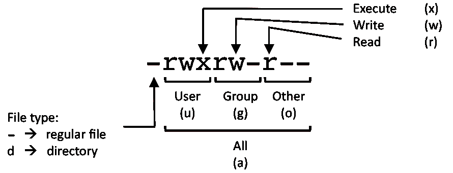

## 用户与用户组

  

数字|权限
-|-
4|read(r)
2|write(w)
1|execute(x)

### chmod

对文件 f 添加用户组的写权限
```bash
chmod g+w f
```

删除其他用户的所有权限
```bash
chmod o= f
```

禁止所有用户写
```bash
chmod a-w f
```

将文件设置为 775 权限
```bash
chmod 775 f
```

递归将文件夹设置为 600 权限
```bash
chmod -R 600 d
```

### chown

设置文件所有者和所有组
```bash
chown user:group f
```

递归将目录及子目录中的文件所有者改为 user
```bash
chown -R user /d1/d2
```

### chgrp

设置文件所属组
```bash
chgrp group f
```

递归将目录及子目录中的文件所属组改为 group
```bash
chgrp -R group /d1/d2
```

### id

打印用户及群组信息
```bash
id
# or
id -a
```

打印特定用户的相关信息
```bash
id user
```

### finger

显示登录用户的信息
```bash
finger
```

显示特定用户的登录信息
```bash
finger user
```

### who/w/whoami

显示登录用户的信息
```bash
who
```

打印标题行
```bash
who -H
```

显示已登录用户及其活动
```bash
w
```

显示特定用户及其活动
```bash
w user
```

显示用户名
```bash
whoami
# or
id -un
```

### users

显示登录用户
```bash
users
```

### last

查看最近的登录信息
```bash
last
```

查看指定用户最近的登录信息
```bash
last user
```

查看最近几次重启操作
```bash
last reboot
```

### group*

显示用户所属组
```bash
groups
# or
id -Gn
```

添加组
```bash
groupadd group
```

删除组
```bash
groupdel group
```

修改组名称
```bash
groupmod -n newgroup group
```

### user*

添加用户
```bash
useradd user
```

添加系统用户
```bash
useradd -r user
#or
useradd --system user
```

添加用户并设置主目录
```bash
useradd -d /home/user user
# or
useradd --home-dir /home/user user
```

添加用户并设置用户组
```bash
useradd -g group1 group2 user
# or
useradd --group group1 group2 user
```

删除用户
```bash
userdel user
```

删除用户及其相关文件
```bash
userdel -r user
```

将用户添加到组中
```bash
usermod -G group user
# or
usermod -aG group user
```

修改用户名
```bash
usermod -l newuser user
```

### su/sudo

切换用户身份
```bash
su user
```

切换用户身份执行命令，完成后返回当前用户
```bash
su -c ls user
```

临时提升权限
```bash
sudo
```

使用 root 用户重新登录
```bash
sudo su -
# or
sudo -s
```

### passwd

用户信息：用户名、口令、ID、GID、描述、主目录，缺省 Shell
```
/etc/passwd
/etc/shadow
```

组信息：组名、口令、已创建时间、口令最短位数、用户口令、倒计时提醒、禁用天数、过期天数
```
/etc/group
/etc/gshadow
```

更改自己的密码
```bash
passwd
```

更改或创建其他用户的密码
```bash
passwd user
```

### ssh*

连接远程服务器
```bash
ssh user@host
```

指定端口
```bash
ssh -p port user@host
```

生成公私钥对
```bash
ssh-keygen
# or
ssh-keygen -t rsa
# or
ssh-keygen -m PEM -t rsa -b 4096
```

从私钥生成公钥
```bash
ssh-keygen -y -f id_rsa > id_rsa.pub
```

复制公钥到 `~/.ssh/authorized_keys`
```bash
ssh-copy-id user@host:port
#or
ssh-copy-id -i ~/.ssh/id_rsa.pub user@host
```
