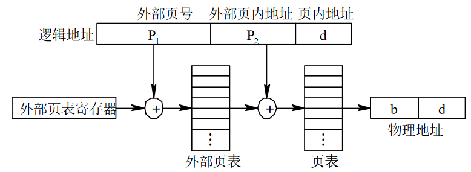
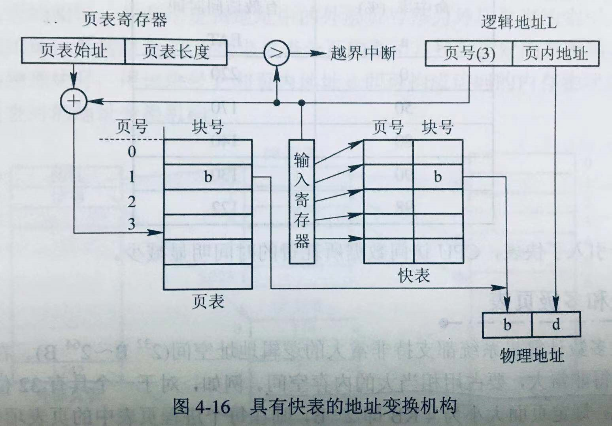

## 20 Advanced Page Tables

首先了解一下程序的参数和默认值

```python
parser = OptionParser()
# 随机种子
parser.add_option('-s', '--seed', default=0, help='the random seed', action='store', type='int', dest='seed')
# 已分配的虚拟页面数量，默认为 64
parser.add_option('-a', '--allocated', default=64, help='number of virtual pages allocated', action='store', type='int', dest='allocated')
# 随机生成的虚拟地址数量，默认为 10
parser.add_option('-n', '--addresses', default=10, help='number of virtual addresses to generate', action='store', type='int', dest='num')
# 计算答案
parser.add_option('-c', '--solve', help='compute answers for me', action='store_true', default=False, dest='solve')

(options, args) = parser.parse_args()
```

假设
- 页面大小为 32 字节
  - 2^5
- 进程的虚拟地址空间（假设只有一个）为 1024 页或 32 KB
  - 2^10
- 物理内存可以包含 128 页
  - 2^7

多级页表
- 一个寄存器存储页目录项的页表
- 虚拟地址前 5 位表示页目录项的偏移
- 如果页目录项（page directory entry, PDE）有效，指向页表
  - 每个页表有 32 个页表格条目（page table entry, PTE）
    - 虚拟地址中间 5 位表示页表格条目的偏移
  - 如果页表格条目有效，指向物理帧号（physical frame number, PFN）
    - 虚拟地址最后 5 位表示物理帧号的偏移

虚拟地址 15 位 = 10 VPN + 5 offset
物理地址 12 位 = 7 PFN + 5 offset 

```
5 PDE(offset) | 5 PTE(offset) | 5 PFN(offset)
```

页目录项（page directory entry, PDE）结构
- 第一位为有效位

```
  VALID | PT6 ... PT0
```

页表格条目（page table entry, PTE）结构
- 第一位为有效位

```
  VALID | PFN6 ... PFN0
```

页目录基址寄存器（page directory base register, PDBR）
- 存放页目录项（PDE）的目录

请用 python2 执行代码【迫真

### 1

线性页表使用一个寄存器定位页表；
二级页表使用一个寄存器，作为页目录基址寄存器，定位页目录；
三级页表同理，也只需要一个寄存器。

多级页表地址转换如下图所示：



### 2

随机种子为 0
- 页目录基址寄存器：page 122

```bash
python2 paging-multilevel-translate.py -s 0 -c

# 输出
ARG seed 0          <---- 随机种子
ARG allocated 64    <---- 已分配的页表数量
ARG num 10          <---- 随机生成虚拟地址

page   0:1b1d05051d0b19001e00121c1909190c0f0b0a1218151700100a061c06050514
page   1:0000000000000000000000000000000000000000000000000000000000000000
page   2:121b0c06001e04130f0b10021e0f000c17091717071e001a0f0408120819060b
page   3:7f7f7f7fcd7f7f7f7f7f7f7f7f7f7f7f7f7f7f7f7f7f887f7f7f7f7f7f7f7fb9
page   4:0b041004051c13071b131d0e1b150107080507071b0e1b0411001c000c181e00
page   5:17131d0a1202111906081507081d1e041b1101121301171902140e070e040a14
page   6:0000000000000000000000000000000000000000000000000000000000000000
page   7:0000000000000000000000000000000000000000000000000000000000000000
page   8:11101a120f10180a11151e151d0c12170a081e0a1e1a06191e08141702190915
page   9:0000000000000000000000000000000000000000000000000000000000000000
page  10:0000000000000000000000000000000000000000000000000000000000000000
page  11:0910141d04011a18170e150c050c18181d1b151016051c16120d13131b11060d
page  12:060b16191c05141d01141a0a07120d050e0c110f090b19071100160a0108071d
page  13:19100b0e000614140f1d0e091a08121519180b0101161d0a0d16140814090b10
page  14:1218140b000d1c0a07040f10020c141d0d0d0e060c140c12191e1b0b00120e07
page  15:0000000000000000000000000000000000000000000000000000000000000000
page  16:7f7f7f7f7f7f7f7f7f7f7f7f7f7f7f7f7f7f7f7f7f7f7f7f7f7f7f7fea7f7f7f
page  17:0000000000000000000000000000000000000000000000000000000000000000
page  18:7f7f7f7f7f7fab7f7f7f8e7f7f7fdd7f7f7f7f7f7f7f8b7f7f7f7f7f7f7f7f7f
page  19:00130001061402011e0d1b060d0b050a1e170b0c081016150e011c0c0c00041a
page  20:1a190402020c1d110807030419041a190411001a11170f151c111b0a03000719
page  21:0b081b0e1c151e121e050d111e111a130f0c0b09061d101a1b1d070a13090417
page  22:1212150f081b0a0e130f1d1d1c1c120f150608010500140418151e0c1c0e0a03
page  23:1d0f030b0c0f1e1e1113140f0f091502091b071d1e110102060a03180b07010b
page  24:0000000000000000000000000000000000000000000000000000000000000000
page  25:03031c031b0e0e0a0c0b110a1907070e1c0016000c170d0d070e070814121c1e
page  26:090e1d18081115180d0c170d070e1d040e130e06001513000917131004150e15
page  27:0000000000000000000000000000000000000000000000000000000000000000
page  28:0f1d0f0a0211070b0b17071d170e1b0b0b04180c0f0e140b1c0d0b0c171e1a0e
page  29:17081e031b010710120c030708171c120118090a10071c050c08101113100c13
page  30:7f7f7f7f7f847f7f7f7f977fbd7f7ff47f7f7f7f7f7f7f7f7f7f7f7f7f7f9c7f
page  31:7f7f7f7f7f7fd07f7f7f7f7f7f7f7f7f7f7f7f7f7f7f7f7f7f7f7f7f7f7f7f7f
page  32:0000000000000000000000000000000000000000000000000000000000000000
page  33:7f7f7f7f7f7f7f7fb57f9d7f7f7f7f7f7f7f7f7f7f7f7f7f7f7ff6b17f7f7f7f
page  34:0413050d0c02161518101105060710190b1b16160a031d1a0c1a1b0a0f0a151c
page  35:0000000000000000000000000000000000000000000000000000000000000000
page  36:1d1313160c0c1400050a07130b1b110c0c150c14010d0804100f11171b0f090e
page  37:1e0f0a0d0c100c021e1e05070d15001913081a1409101e01151a150412180c12
page  38:0000000000000000000000000000000000000000000000000000000000000000
page  39:1b111e171108150e160c0f001601151218081506100a1e1e06110a1e1c121615
page  40:0d030b1007190b0709191c1d0017100307080c0e1d01151a0b07060904110700
page  41:7f7f7f7f7f7f7f7fe57f7f7f7f7f7f7f7f7f7f7f7f7f7f7f7f7f8d7f7f7f7f7f
page  42:03041501111c1015001312110c0b1e01001d050306181d000d030806140a050f
page  43:190802041311011e0e0916000d141d171b030d00080b0a0b180519100a11050f
page  44:7f7f7f7f7f7fcc7f7f7f7f7f7f7f7f7f7f7f7f7f7f7f7f7f7fa27f7f7f7f7f7f
page  45:7fb27fef7f7f7f7fa4f57f7f7f7f7f7f7f7f7f7f7f7f7f7f7f7f7f7f7f7f7f7f
page  46:0000000000000000000000000000000000000000000000000000000000000000
page  47:070a0f1002090b0c0e0d020613190f0402040b111410110a14160c19171c0e0a
page  48:0000000000000000000000000000000000000000000000000000000000000000
page  49:1e0a0f0702030d13101003010b1d05080e1c1d00140714171b151a1804011610
page  50:161b040706011a0f020d0d181704130f0004140b1d0f15040e1619060c0e0d0e
page  51:14000f1a070a1a0511071d180d02090f1c0311151019101d12120d120b110905
page  52:0000000000000000000000000000000000000000000000000000000000000000
page  53:0f0c18090e121c0f081713071c1e191b09161b150e030d121c1d0e1a08181100
page  54:1901050f031b1c090d11081006090d121008070318031607081614160f1a0314
page  55:0000000000000000000000000000000000000000000000000000000000000000
page  56:0000000000000000000000000000000000000000000000000000000000000000
page  57:1c1d1602020b000a001e19021b0606141d03000b00121a05030a1d041d0b0e09
page  58:0000000000000000000000000000000000000000000000000000000000000000
page  59:0000000000000000000000000000000000000000000000000000000000000000
page  60:0000000000000000000000000000000000000000000000000000000000000000
page  61:010510020c0a0c031c0e1a1e0a0e150d09161b1c130b1e1302021701000c100d
page  62:7f7f7fa87f7f7f7f7f7f7f7f7f7f7f7f7f7f7f7f7f7f7f7f7f7f7f7f7f7f7f7f
page  63:0612060a1d1b19010407181a12161902021a010601001a0a0404141e0f1b0f11
page  64:18121708080d1e161d10111e0518181a1704141c110b1d110c13180700101d15
page  65:7f7f7f7f7f7f7f7f7f7f997f7f7f7f7f7f7f7f7f7f7f7f7f7f7f7f7f7f7f7f7f
page  66:7f7f7f7f7f7f7f7f7f7f7f7f7f7f7f7f7f7f7f7f7f7f7f7f7f7f7f7f7fd77f7f
page  67:0000000000000000000000000000000000000000000000000000000000000000
page  68:121216020f060c0f0a0c16011d120511020f150d09141c1b0b1a03011e171311
page  69:190a19020d0a0d190f1e1a03090016001b050c01090c0117160b1902010b1b17
page  70:0000000000000000000000000000000000000000000000000000000000000000
page  71:7f7f7f7f7f7f7f7f7f7f7f857f7f7f7f7f7f7f7f7f7f7f7f7f7f7f7f7f7f7f7f
page  72:180c0018050c0b030a051314000e111b0f02011a181a081402190a1d0e011c13
page  73:0000000000000000000000000000000000000000000000000000000000000000
page  74:0d0b1e08180d0b011a151b0d14030c06011d0604060b10041e1e040c151b0f1c
page  75:1a1c011b00141c0f0c0a1c1c13160a041e14081e120a1b021804030816120d04
page  76:0c11150c1b1d1e01191b041d03061d191108070c0013011702000817190f1d03
page  77:1c061606001b1a0205071c0b190d0b171308121519141312021d16081513140b
page  78:0e02171b1c1a1b1c100c1508191a1b121d110d141e1c1802120f131a07160306
page  79:1e1b1516071708030e0a050d1b0d0d1510041c0d180c190c06061d12010c0702
page  80:1b081d1c020d170d0f19151d051c1c131d071b171202000007170b18130c1b01
page  81:7f7f7f7f7f7f7f7f7f7f7f7f7f7f7f7f7fe27f7f7f7f7f7f7f7f7f7f7f7f7ffa
page  82:0000000000000000000000000000000000000000000000000000000000000000
page  83:0000000000000000000000000000000000000000000000000000000000000000
page  84:7f7f7f7f7f7f7f7f7f7f7f7f7f7f7f7f7f7f7f7f7f7f7f7f7f947f7f7f7f7fce
page  85:7f7f7f7f7f7f7f7f9a7fbf7f7f7f7f7f7f7f7f7faf7f7f7f7f7f7f7f7f7f7f7f
page  86:7f7f7f7f7f7f7fc57f7f7f7f7f7f7f7f7f7f7f7fca7f7fee7f7f7f7f7f7f7f7f
page  87:1805180d170e1802011c0f1b1d14110602191b18150d09030d111c1d0c031716
page  88:7f7f7f7f7f7f7f7f7f7f7f7f7f7f7f7f7f7f7fc47f7f7f7f7f7f7f7f7f7f7f7f
page  89:0000000000000000000000000000000000000000000000000000000000000000
page  90:7f7f7f7f7f7f7f7f7f7f7f7f7f7f7f7fc07f7f7f7f7f7f7f7fde7f7f7f7f7f7f
page  91:7f7f7f7f7f7f7f7f7f7f7f7fa57f7f7f7f7f7f7f7f7f7f7f7f7f7f7f7f7f7f7f
page  92:0000000000000000000000000000000000000000000000000000000000000000
page  93:0a1a1907001905181505021c12130e0412071816001c01020904070b160c080f
page  94:1406190710140713080519110a1200040c1e0f021718181115061619170a1213
page  95:0a1d0f1d1e1915040012151d10151406131e0315130b18001b190e030e12070f
page  96:7f7f7f7f7f7f7f7f7f7f7f7f7f7fb67f7f7f7f7f7f7f7f7f7f7f7f7f7f7f7f7f
page  97:7f7f7f7f7f7f7f7f7f7f7f7f7f7f7f7fc87f7f7f7f7fe77f7f7f7f7f7f7f7f7f
page  98:15191803171a170e1503170818130f100201001804030b1e1b0919020c111e01
page  99:090b1304150b1204140a0e0c0e1509140109170113000e1b0010021a15171400
page 100:7f7f7f7f7f7f7f7f7f7f7f7f7f7f7f7f7f7fa77f7f7f7f7f7f7f7f7f7fe37f7f
page 101:0e0a00010b061005061416091a070a16011c020e1601191e0e030203170c1c0d
page 102:1d031b0116000d1a0c1c1612050a0c121e080f1c0a13171317061d0512091309
page 103:1e171c061012190e180c121a181400050f07021a1d090c19011303081901010c
page 104:7f7f7f7f7f7f7f7f7f7f7f7f80aa7f7f7f7f7f7f7f7f7f7f7f7f7f7ff07f7f7f
page 105:b37f7f7f7f7f7f7f7f7f7f7f7f937f7f7f7f7f7f7f7f7f7f7f7f7f7f7f7f7f7f
page 106:160a000e1001110a00050310011c1a1d091c1e170814120c090103040e131701
page 107:7f7f7f7f7f7f7f7f7f7f7f7f7f7ff17f7f7f7f7f7f7f7f7ff37f7f7f7f7f7f7f
page 108:83fee0da7fd47febbe9ed5ade4ac90d692d8c1f89fe1ede9a1e8c7c2a9d1dbff
page 109:7f7f7f7f7f7f7f7f7f7f7f7f7f7f7f7f7f827f7f7f7f7f7f7f7f7f7f7f7f7f7f
page 110:1614041e0c120b010e0401131303110a0b180f1b120e130a03151318031c181c
page 111:08000115111d1d1c01171514161b130b10061200040a18160a1301051e080c11
page 112:19051e1302161e0c150906160019100303141b081e031a0c02080e181a041014
page 113:1d07111b1205071e091a181716181a01050f06100f03020019021d1e170d080c
page 114:0000000000000000000000000000000000000000000000000000000000000000
page 115:110601040d1406151a170d141e1b0a1505110b0d0d141a0e0417171d0c0e101b
page 116:0a130b11150f14171a05060f0f19101b180f190e0a0d0e1401161e0e02060307
page 117:1b0a170019111d0b130a18121e000401031c1d0e1d19181705110d1d05051404
page 118:1119021a1c05191a1b101206150c00040c1b111c1c02120a0f0e0e03190f130e
page 119:0000000000000000000000000000000000000000000000000000000000000000
page 120:7f7f7f7f7f7f7f7f7f7f7f7f7f7f7f7f7f7fcb7f7f7f7f7f7f7f7f7f7f7f7f7f
page 121:0000000000000000000000000000000000000000000000000000000000000000
page 122:051e0312041b1d18090717090d01040002020d1116040d13020d0b1d010c0c16
page 123:0000000000000000000000000000000000000000000000000000000000000000
page 124:0000000000000000000000000000000000000000000000000000000000000000
page 125:0000000000000000000000000000000000000000000000000000000000000000
page 126:7f7f7f7f7f7f7f7f8ce6cf7f7f7f7f7f7f7f7f7f7f7f7f7f7f7f967f7f7f7f7f
page 127:7f7f7f7f7f7f7f7f7f7f7f7f7f7f7f7fdf7f7f7f7f7f7f7f7f7f7f7f7f957f7f

PDBR: 108  (decimal) [This means the page directory is held in this page]               <---- 83 fe e0 da 7f d4 7f eb be 9e d5 ad e4 ac 90 d6 92 d8 c1 f8 9f e1 ed e9 a1 e8 c7 c2 a9 d1 db ff (从 0 开始编号)

Virtual Address 611c:                                                                   <---- 110 0001 0001 1100
  --> pde index:0x18 [decimal 24] pde contents:0xa1 (valid 1, pfn 0x21 [decimal 33])    <---- 110 00 = 24 (PDE offset) -> 0xa1 = 1010 0001 (valid|PTE) -> 010 0001 = 33 (PTE) -> Page 33
    --> pte index:0x8 [decimal 8] pte contents:0xb5 (valid 1, pfn 0x35 [decimal 53])    <---- 01 000 =  8 (PTE offset) -> 0xb5 = 1011 0101 (valid|PFN)-> 011 0101 = 53 (PFN)
      --> Translates to Physical Address 0x6bc --> Value: 08                            <---- 011 0101 1 1100 = 0110 1011 1100 = 0x6bc -> 1724/32=53, 1724mod32=28 （第 53 页，第 28 项）
Virtual Address 3da8:                                                                   <---- 011 1101 1010 1000
  --> pde index:0xf [decimal 15] pde contents:0xd6 (valid 1, pfn 0x56 [decimal 86])     <---- 011 11 = 15 (PDE offset) -> 0xd6 = 1101 0110 (valid|PTE) -> 101 0110 = 86 (PTE) -> Page 86
    --> pte index:0xd [decimal 13] pte contents:0x7f (valid 0, pfn 0x7f [decimal 127])  <---- 01 101 = 13 (PTE offset) -> 0x7f = 0111 1111 (valid|PFN) -> invalid
      --> Fault (page table entry not valid)
Virtual Address 17f5:                                                                   <---- 001 0111 1111 0101
  --> pde index:0x5 [decimal 5] pde contents:0xd4 (valid 1, pfn 0x54 [decimal 84])      <---- 001 01 =  5 (PDE offset) -> 0xd4 = 1101 0100 (valid|PTE) -> 101 0100 =  84 (PTE) -> Page 84
    --> pte index:0x1f [decimal 31] pte contents:0xce (valid 1, pfn 0x4e [decimal 78])  <---- 11 111 = 31 (PTE offset) -> 0xce = 1100 1110 (valid|PFN) -> 100 1110 =  78 (PTE) -> Page 78
      --> Translates to Physical Address 0x9d5 --> Value: 1c                            <---- 100 1110 1 0101 = 1001 1101 0101 = 0x9d5
Virtual Address 7f6c:                                                                   <---- 111 1111 0110 1100
  --> pde index:0x1f [decimal 31] pde contents:0xff (valid 1, pfn 0x7f [decimal 127])   <---- 111 11 = 31 (PDE offset) -> 0xff = 1111 1111 (valid|PTE) -> 111 1111 = 127 (PTE) -> Page 127
    --> pte index:0x1b [decimal 27] pte contents:0x7f (valid 0, pfn 0x7f [decimal 127]) <---- 11 011 = 27 (PTE offset) -> 0x7f = 0111 1111 (valid|PFN) -> invalid
      --> Fault (page table entry not valid)
Virtual Address 0bad:                                                                   <---- 000 1011 1010 1101
  --> pde index:0x2 [decimal 2] pde contents:0xe0 (valid 1, pfn 0x60 [decimal 96])      <---- 000 10 =  2 (PDE offset) -> 0xe0 = 1110 0000 (valid|PTE) -> 110 0000 =  96 (PTE) -> Page 96
    --> pte index:0x1d [decimal 29] pte contents:0x7f (valid 0, pfn 0x7f [decimal 127]) <---- 11 101 = 29 (PTE offset) -> 0x7f = 0111 1111 (valid|PFN) -> invalid
      --> Fault (page table entry not valid)
Virtual Address 6d60:                                                                   <---- 110 1101 0110 0000
  --> pde index:0x1b [decimal 27] pde contents:0xc2 (valid 1, pfn 0x42 [decimal 66])    <---- 110 11 = 27 (PDE offset) -> 0xc2 = 1100 0010 (valid|PTE) -> 100 0010 =  66 (PTE) -> Page 66
    --> pte index:0xb [decimal 11] pte contents:0x7f (valid 0, pfn 0x7f [decimal 127])  <---- 01 011 = 11 (PTE offset) -> 0x7f = 0111 1111 (valid|PFN) -> invalid
      --> Fault (page table entry not valid)
Virtual Address 2a5b:                                                                   <---- 010 1010 0101 1011
  --> pde index:0xa [decimal 10] pde contents:0xd5 (valid 1, pfn 0x55 [decimal 85])     <---- 010 10 = 10 (PDE offset) -> 0xd5 = 1101 0101 (valid|PTE) -> 101 0101 =  85 (PTE) -> Page 85
    --> pte index:0x12 [decimal 18] pte contents:0x7f (valid 0, pfn 0x7f [decimal 127]) <---- 10 010 = 18 (PTE offset) -> 0x7f = 0111 1111 (valid|PFN) -> invalid
      --> Fault (page table entry not valid)
Virtual Address 4c5e:                                                                   <---- 100 1100 0101 1110
  --> pde index:0x13 [decimal 19] pde contents:0xf8 (valid 1, pfn 0x78 [decimal 120])   <---- 100 11 = 19 (PDE offset) -> 0xf8 = 1111 1000 (valid|PTE) -> 111 1000 = 120 (PTE) -> Page 120
    --> pte index:0x2 [decimal 2] pte contents:0x7f (valid 0, pfn 0x7f [decimal 127])   <---- 00 010 =  2 (PTE offset) -> 0x7f = 0111 1111 (valid|PFN) -> invalid
      --> Fault (page table entry not valid)
Virtual Address 2592:                                                                   <---- 010 0101 1001 0010
  --> pde index:0x9 [decimal 9] pde contents:0x9e (valid 1, pfn 0x1e [decimal 30])      <---- 010 01 =  9 (PDE offset) -> 0x9e = 1001 1110 (valid|PTE) -> 001 1110 =  30 (PTE) -> Page 30
    --> pte index:0xc [decimal 12] pte contents:0xbd (valid 1, pfn 0x3d [decimal 61])   <---- 01 100 = 12 (PTE offset) -> 0xbd = 1011 1101 (valid|PFN) -> 011 1101
      --> Translates to Physical Address 0x7b2 --> Value: 1b                            <---- 0111 1011 0010
Virtual Address 3e99:                                                                   <---- 011 1110 1001 1001
  --> pde index:0xf [decimal 15] pde contents:0xd6 (valid 1, pfn 0x56 [decimal 86])     <---- 011 11 = 15 (PDE offset) -> 0xd6 = 1101 0110 (valid|PTE) -> 101 0110 =  56 (PTE) -> Page 56
    --> pte index:0x14 [decimal 20] pte contents:0xca (valid 1, pfn 0x4a [decimal 74])  <---- 10 100 = 20 (PTE offset) -> 0xca = 1100 1010 (valid|PFN) -> 100 1010
      --> Translates to Physical Address 0x959 --> Value: 1e                            <---- 1001 0101 1001
```

随机种子为 1
- 页目录基址寄存器：page 17

```bash
python2 paging-multilevel-translate.py -s 1 -c

# 输出
ARG seed 1
ARG allocated 64
ARG num 10

page   0:7f7f7f7f7f7fb27f7f7f7f7f7f7f7f7f7f7f7f7f7f7f7f7f7f7f7f7f7f7f7f7f
page   1:01191d11051a1e150f0b0a06140d060314090f0a1b1b00060a1e180a0614191c
page   2:ba7f7f7f7f7f7f7f7f7f7f7f7f7f7f7f9f7f7f7f7f7f7f7f7f7f7fa47f7f7f7f
page   3:0000000000000000000000000000000000000000000000000000000000000000
page   4:7f7f7f7f7f7f7f7f7f7f7f7f7f7f7f7f7f7f7f7f7f7f7f7f7f7f7f7f7f7f7f9c
page   5:1e120c050f1e17101a070f1d110e08101d0018191b161910110d011a11060f0f
page   6:0000000000000000000000000000000000000000000000000000000000000000
page   7:0000000000000000000000000000000000000000000000000000000000000000
page   8:7f7f7f7f7f7f7f7f7f7f7f7f7f7f7fbd7f7f7f7f7f7f7f7f7f7f7f7f7f7f7f7f
page   9:06170406050b010b12151a0213060a1119141e00090e01010b1104020916111e
page  10:0000000000000000000000000000000000000000000000000000000000000000
page  11:0f1c07091211110c011208130d081e091e0e100805150e12050f1417140c1512
page  12:0000000000000000000000000000000000000000000000000000000000000000
page  13:09080100040c1c130715080f091d0a18131a121a0c15131011100c1b1311010f
page  14:0000000000000000000000000000000000000000000000000000000000000000
page  15:7f7f7ff17f7f7fb47f7fcac27f7f7f7f7f7f7f7f7f7f7f7f7f7f7f7f7f7f7f7f
page  16:0000000000000000000000000000000000000000000000000000000000000000
page  17:daf7f2a896c59d94c8b97fc498e57f7fd3a1828fa6fbbff07f84d2a08880c992
page  18:7f7fdd7f7f7f7f7f7f7f7f957f7f7f7f7f7f7f7f7f7f7f7f7f7f7f7f7f7f7f7f
page  19:1c000414010b040e1a1c01011a01080302001317151a140c131e1307011c120a
page  20:7f7f7f7f7f7f7f7f7f7f7f7f7f7f7f7f7f7f7f7f7fad7f7f7f7f7f7f7f7f7f7f
page  21:15111c050c16010310080308131002021a13051a000b1a16081b121a1b0d1410
page  22:7f7f7f7f7fd97f7f7f7f7f7f7f7f7f7f7f7f7f7f7f7f7f7f7f7f7f7f7f7f7f7f
page  23:15091c0d0e00000313141d0d150a020d15181d1911110f0e15111a0d0e191410
page  24:7f7f7f7f7f7f7f7f7f7f7fb57f7ffa7f7f7f7f7f7f7f7f7f7f937f7f7f7f7f7f
page  25:0d1b11110c0613021801170b1512041002070b08141e0b1906150a100219060e
page  26:0000000000000000000000000000000000000000000000000000000000000000
page  27:170115160a0f0516011e1913081c1d04181a14150d1c1e0b180d050a031c1d03
page  28:07060a0e1b14131a0b0d07191b1c120302181b101c1c170b0e0a0c0e00030511
page  29:7f7f7f7f7f7f7f7f7f7f7f7f7f7f7f7f7f7f7f7f7f7f7f7fa57f7f7f7f7f7f7f
page  30:0000000000000000000000000000000000000000000000000000000000000000
page  31:07021102021309180f1a040f18021d05181e1909030f1c091b041c00091b181c
page  32:7f7f7fe17f7f7f7f7f7f7f7f7f7f7f7f7f7f7f7f7f7f7f7f7f7f7f7fdb7f7f7f
page  33:7f7f7f7f7f7f997f7f7f7f7f7f7f7f7f7f7f7f7f7f7fd57f7f7f7f7f7f7f7f7f
page  34:111c0e081819001402031b01071e0d03050717031c0b1e1c09070e031401001e
page  35:0c121e1509100d0f0c050c0c06190b04111a1813160a04070a080e0404070618
page  36:1e070f16150d180f160f1e1602041d0700070e1d0c161902121e11100a1d1e03
page  37:061b07110e0a0c0005131706051c03181b04190401080a120d1814030617031d
page  38:7f7f7f7f7fa77f7f7f7f7f7f7ff57f7f7f7f7f7f7f7f7f7f7f7f7f7f7f977f7f
page  39:0f12111e05131e16110b0c1d1b141b1c1a0b0e180b170e0a0e030a0c0005081a
page  40:7f7f7fe87f7faa7f7f7f7f7f7f7f7f7f7f8b7f7f7f7f7f7f7f7f7ff97f7f7f7f
page  41:0000000000000000000000000000000000000000000000000000000000000000
page  42:1e14180e0e0f1716060d10111c1a040b0300020517141808041e191d000c1316
page  43:0000000000000000000000000000000000000000000000000000000000000000
page  44:13120e000705121a181819071a14020000170703130a0204100508160e090e00
page  45:181c091b0a141e17010d0b09190d15131001141b05130f0a161e001b0b190516
page  46:0000000000000000000000000000000000000000000000000000000000000000
page  47:0a170c0b1106020700140e1311011919000d180c1a15141c1812010e1510120a
page  48:0000000000000000000000000000000000000000000000000000000000000000
page  49:0d0c1a12161b170f171314130c13131d181a1719120a08151b1004190f0e010f
page  50:181e1c140a07181c1d05120f0d181d1615151410071803130b11130e1e07001d
page  51:0000000000000000000000000000000000000000000000000000000000000000
page  52:09071700050d001312190608100812071518191e100f1a17110b080319031710
page  53:031b0f0612190000041604151510061e181006140c11091301091e1b091a091d
page  54:0b14000f1d150c151206061b080219100b0f16051416190812071105181a0a06
page  55:0708100e0c030b1410101a1615000915041c041b061a1a0a1b041a0b0d031208
page  56:0000000000000000000000000000000000000000000000000000000000000000
page  57:7f7f7f7f7f7f7f7f7fcb7f7f7f7fcc7f7f7f7f7f7f7f7f7f7f7f7f7f7f7f7fa3
page  58:1b070d151c15130b0d130b1800171709000a12181a0602031e1403151d12071d
page  59:0e0f05100d1b160e04041e120619060e1b030301040b0908000f0d1609120917
page  60:0000000000000000000000000000000000000000000000000000000000000000
page  61:141a00050a091907090f1d0913010d1c060b14111112140a0a0c10111b0c0d19
page  62:00071b01140f1e1e03081e0a051c1309110d0e1105131d12180804001e030b14
page  63:7f7fe77f7f7f7f7f7f7f7f7f7fe27f7f7f7f7f7f7f7f7f7f7f7f7f7f7f7f7f7f
page  64:0d1516070f0e060c111c1c081401020f1b04171b09151a0b1516121a1b1d1105
page  65:0000000000000000000000000000000000000000000000000000000000000000
page  66:010a0c061b0d1416171617071e041c1a1a0102190e0b1e01100d030c151b0010
page  67:0000000000000000000000000000000000000000000000000000000000000000
page  68:d77f7f7f7f7f7f7f7f7f7f7f7fac7f7f7f7f7f7f7f7f7f7f7f7f7f7f7f7f7f7f
page  69:7f7f7f7f7f7f7f7f7f7f7f7f7f7f7f7f7fbee9b77f7f7f7f7f7f7f7f7f7f7f7f
page  70:111302051d080208160806080e16091b1e1902091c1a040d0b170009171b0112
page  71:051e1a030a16161d0d191409121b1a0f120107180c051115140b0d0f18100c0f
page  72:9b7f7f7f7f7f7f7f7f7f7f7f7f7f7f7f7f7f7f7f7f7f7f7f7f7f7f7f7f7f7f7f
page  73:7f7f7f7f7f7f7fdc7f7f7f7f7f7f7f7f7f7f7f7f7f7f7f7f7f7fec7ffc7f7f7f
page  74:0910080009020f0f1a17171e080b07030f0f041c1e020001161a0200100a0000
page  75:131707011909191d13031a1307060f031c15190b1c041607000306170b0e1308
page  76:09011c1e1e0306131e1015140810090702081e0d14131d0c090a091a1b090a10
page  77:001d1c130b111b0e18120d1c0c12010e0115000103040f0b081e1c1418190719
page  78:0000000000000000000000000000000000000000000000000000000000000000
page  79:0d190d190116030c0d050d1a01061e0d0c1c18051205181118021c071a0d1b03
page  80:0000000000000000000000000000000000000000000000000000000000000000
page  81:0d040004080e0002181e0d0e120310141d13100c1c100e160d02121a0b02031c
page  82:7f7f7f7f7f7f7fc67f7f7f7f7f7f7f7f7f7f7f7f7f7f7f7f7fc77f7fdfd17f7f
page  83:7f7f7f7f7f7f7f7f7f7f7f7f7f7f7f7f7f7f7f7f7f7f7faf7f7f7f7f7fc07f7f
page  84:0000000000000000000000000000000000000000000000000000000000000000
page  85:080e181a1814020c14090f1c031a030b1c06100c1b1e080f1b1006170a0f001e
page  86:0000000000000000000000000000000000000000000000000000000000000000
page  87:0f1e071602051c0617121a0b0a091a121d1b04110301021a18190a13180b1106
page  88:0000000000000000000000000000000000000000000000000000000000000000
page  89:070f0f1c021011040b041b0a020e101b16061c0015011905181917030c03161e
page  90:7f7f7fb17f7f7f7f7f7f7f7f7f7f7f7f7f7f7f7f7f7f7f7f7f7f7f7f7f7f857f
page  91:040e130402120713051a090d111b1c1a150205101e16050b1d0f1a1a1813140a
page  92:191e070617170f0f0c1b1812011a0e0509150003091b171e1011111010191d0c
page  93:0716010f11151c18110f0011111705120116190d15140902170b050d191d111e
page  94:0000000000000000000000000000000000000000000000000000000000000000
page  95:15050d04161407011d1911101a0e0c0a0700140c11010b040308190c0c120700
page  96:0000000000000000000000000000000000000000000000000000000000000000
page  97:0f0d14180200190d17000d16071d1b0000101d0b060d00060d0f0707060e0800
page  98:0f110b090d100e1a02061d121313070c06041e171b0015090f14000b111b0f09
page  99:0000000000000000000000000000000000000000000000000000000000000000
page 100:0000000000000000000000000000000000000000000000000000000000000000
page 101:7f7f7f7f7f7f7f7f7fff7f7f7f7f7f7f7f7f7f7f7f7f7f7f7f7f7f897f7f7f7f
page 102:02010b16090418191a090d07110a0a181d1203140d1e161915101b1909040b10
page 103:0a03040702101511150706111b0d000009130206151e0a1210000a0407171501
page 104:090a0a170f10041c0a0a021e0e1c1c1e191c1c180410111e1815170b1d130c0e
page 105:1d11131609120e0f0c100607061207181c170a1d0a0b12140c181a08060c1514
page 106:0000000000000000000000000000000000000000000000000000000000000000
page 107:0000000000000000000000000000000000000000000000000000000000000000
page 108:001b13090d17180513051e0d1c161208100404160b1707161609030c0f030501
page 109:0000000000000000000000000000000000000000000000000000000000000000
page 110:0000000000000000000000000000000000000000000000000000000000000000
page 111:0d1e06030412030806011d0a1d16061c001e01071100170219011006080f0b0c
page 112:7f7f7f7f7f7f7f7f7f7f7f7f7f7f7f7fcf7f7f7f7f7f7f7f7f81b67f7f7f7f7f
page 113:060115191d130a190315020c0f0b0507190e1106160a121c1e01181a090b111c
page 114:7f7ff37f7f7f7f7f7f7f7f7f7f7f7f8d7f7f7fa27f7f7f7f7f7f7f7fe67f7f7f
page 115:0e1905041c08010f1e190c1e181a140c1c0e1c111c0e0d120904121a081a1818
page 116:0000000000000000000000000000000000000000000000000000000000000000
page 117:0f1a1e170d08031904110e010619101c1c0215010d0d1d12050f10060b1b1e18
page 118:08100d171a0708150c040611121d1012040c081508060b0e0a12051b1510010a
page 119:7f7f7f7f7f7f7f7f7f7f7f7f7f7f7f7f7f7f7f7f7f7f7fbb7f7f7f7f7f7f7f7f
page 120:0000000000000000000000000000000000000000000000000000000000000000
page 121:0108131d06071a0a0c0b011d150003040b1b0407090f1b101c100d1b120e0f0b
page 122:12181a0602120b16090d19020c0410161e17040d1013151e1d06041e041e0312
page 123:7ff67f7f7f7f7fef7f7fcd7f7f7f7f7f7f7f7f7f7f7f7f7f7f7f7f7f7f7f7f7f
page 124:090f0b10000d0d090c18150f140b060008121b190f1e0e190c171e090513100b
page 125:0000000000000000000000000000000000000000000000000000000000000000
page 126:0000000000000000000000000000000000000000000000000000000000000000
page 127:110311001b0a0b1113120f131a0d0f1900040a061b0403090f191e1a12010113

PDBR: 17  (decimal) [This means the page directory is held in this page]                <---- da f7 f2 a8 96 c5 9d 94 c8 b9 7f c4 98 e5 7f 7f d3 a1 82 8f a6 fb bf f0 7f 84 d2 a0 88 80 c9 92

Virtual Address 6c74:                                                                   <---- 110 1100 0111 0100
  --> pde index:0x1b [decimal 27] pde contents:0xa0 (valid 1, pfn 0x20 [decimal 32])    <---- 110 11 = 27 (PDE) -> 0xa0 = 1010 0000 (valid|PTE) -> 010 0000 = 32 (PTE) -> Page 32
    --> pte index:0x3 [decimal 3] pte contents:0xe1 (valid 1, pfn 0x61 [decimal 97])    <---- 00 011 =  3 (PTE) -> 0xe1 = 1110 0001 (valid|PFN) -> 110 0001
      --> Translates to Physical Address 0xc34 --> Value: 06                            <---- 1100 0011 0100
Virtual Address 6b22:                                                                   <---- 110 1011 0010 0010
  --> pde index:0x1a [decimal 26] pde contents:0xd2 (valid 1, pfn 0x52 [decimal 82])    <---- 110 10 = 26 (PDE) -> 0xd2 = 1101 0010 (valid|PTE) -> 101 0010 = 82 (PTE) -> Page 82
    --> pte index:0x19 [decimal 25] pte contents:0xc7 (valid 1, pfn 0x47 [decimal 71])  <---- 11 001 = 25 (PDE) -> 0xc7 = 1100 0111 (valid|PFN) -> 100 0111
      --> Translates to Physical Address 0x8e2 --> Value: 1a                            <---- 1000 1110 0010
Virtual Address 03df:                                                                   <---- 000 0011 1101 1111
  --> pde index:0x0 [decimal 0] pde contents:0xda (valid 1, pfn 0x5a [decimal 90])      <---- 000 00 =  0 (PDE) -> 0xda = 1101 1010 (valid|PTE) -> 101 1010 = 90 (PTE) -> Page 90
    --> pte index:0x1e [decimal 30] pte contents:0x85 (valid 1, pfn 0x05 [decimal 5])   <---- 11 110 = 30 (PTE) -> 0x85 = 1000 0101 (valid|PFN) -> 000 0101
      --> Translates to Physical Address 0x0bf --> Value: 0f                            <---- 0000 1011 1111
Virtual Address 69dc:                                                                   <---- 110 1001 1101 1100
  --> pde index:0x1a [decimal 26] pde contents:0xd2 (valid 1, pfn 0x52 [decimal 82])    <---- 110 10 = 26 (PDE) -> 0xd2 = 1101 0010 (valid|PTE) -> 101 0010 = 82 (PTE) -> Page 82
    --> pte index:0xe [decimal 14] pte contents:0x7f (valid 0, pfn 0x7f [decimal 127])  <---- 01 110 = 14 (PTE) -> 0x7f = 0111 1111 (valid|PFN) -> invalid
      --> Fault (page table entry not valid)
Virtual Address 317a:                                                                   <---- 011 0001 0111 1010
  --> pde index:0xc [decimal 12] pde contents:0x98 (valid 1, pfn 0x18 [decimal 24])     <---- 011 00 = 12 (PDE) -> 0x98 = 1001 1000 (valid|PTE) -> 001 1000 = 24 (PTE) -> Page 24
    --> pte index:0xb [decimal 11] pte contents:0xb5 (valid 1, pfn 0x35 [decimal 53])   <---- 01 011 = 11 (PTE) -> 0xb5 = 1011 0101 (valid|PFN) -> 011 0101
      --> Translates to Physical Address 0x6ba --> Value: 1e                            <---- 0110 1011 1010
Virtual Address 4546:                                                                   <---- 100 0101 0100 0110
  --> pde index:0x11 [decimal 17] pde contents:0xa1 (valid 1, pfn 0x21 [decimal 33])    <---- 110 01 = 17 (PDE) -> 0xa1 = 1010 0001 (valid|PTE) -> 010 0001 = 33 (PTE) -> Page 33
    --> pte index:0xa [decimal 10] pte contents:0x7f (valid 0, pfn 0x7f [decimal 127])  <---- 01 010 = 10 (PTE) -> 0x7f = 0111 1111 (valid|PFN) -> invalid
      --> Fault (page table entry not valid)
Virtual Address 2c03:                                                                   <---- 010 1100 0000 0011
  --> pde index:0xb [decimal 11] pde contents:0xc4 (valid 1, pfn 0x44 [decimal 68])     <---- 010 11 = 11 (PDE) -> 0xc4 = 1100 0100 (valid|PTE) -> 100 0100 = 68 (PTE) -> Page 68
    --> pte index:0x0 [decimal 0] pte contents:0xd7 (valid 1, pfn 0x57 [decimal 87])    <---- 00 000 =  0 (PTE) -> 0xd7 = 1101 0111 (valid|PFN) -> 101 0111
      --> Translates to Physical Address 0xae3 --> Value: 16                            <---- 1010 1110 0011
Virtual Address 7fd7:                                                                   <---- 111 1111 1101 0111
  --> pde index:0x1f [decimal 31] pde contents:0x92 (valid 1, pfn 0x12 [decimal 18])    <---- 111 11 = 31 (PDE) -> 0x92 = 1001 0010 (valid|PTE) -> 001 0010 = 18 (PTE) -> Page 18
    --> pte index:0x1e [decimal 30] pte contents:0x7f (valid 0, pfn 0x7f [decimal 127]) <---- 11 110 = 30 (PTE) -> 0x7f = 0111 1111 (valid|PFN) -> invalid
      --> Fault (page table entry not valid)
Virtual Address 390e:                                                                   <---- 011 1001 0000 1110
  --> pde index:0xe [decimal 14] pde contents:0x7f (valid 0, pfn 0x7f [decimal 127])    <---- 011 10 = 14 (PDE) -> 0x7f = 0111 1111 (valid|PTE) -> invalid
      --> Fault (page directory entry not valid)
Virtual Address 748b:                                                                   <---- 111 0100 1000 1011
  --> pde index:0x1d [decimal 29] pde contents:0x80 (valid 1, pfn 0x00 [decimal 0])     <---- 111 01 = 29 (PDE) -> 0x80 = 1000 0000 (valid|PTE) -> 000 0000 =  0 (PTE) -> Page 0
    --> pte index:0x4 [decimal 4] pte contents:0x7f (valid 0, pfn 0x7f [decimal 127])   <---- 00 100 =  4 (PTE) -> 0x7f = 0111 1111 (valid|PFN) -> invalid
      --> Fault (page table entry not valid)
```

随机种子为 2
- 页目录基址寄存器：page 108

```bash
python2 paging-multilevel-translate.py -s 2 -c

# 输出
ARG seed 2
ARG allocated 64
ARG num 10

page   0:1d1d060805000e101b0e050d04010c19021e1a1e1209170410191017051a040a
page   1:161b1419001d16121c1b031917061712051804120d07110e061d02000f191417
page   2:7f7f7f7f7f7f7f7f7f7f7f7f7f7f7f7f7f7f7f7fbf7f7f7fb5dd7f7fac7f7f7f
page   3:0000000000000000000000000000000000000000000000000000000000000000
page   4:031310051d1e1b0e09061915081b110c0c160e140315081c060a100c101c0617
page   5:150b0d170608101c0219160514131610090f070e0c03070a0c111708110a0704
page   6:0000000000000000000000000000000000000000000000000000000000000000
page   7:19161409121212040d0c161e1d100d0801000e090b1b101107000a040f1e1405
page   8:0000000000000000000000000000000000000000000000000000000000000000
page   9:7f7f7f7f7f7f7f7fbc7f7f7f7f7f7f7f7f7f7fc47f7f7f7f7f7f7fa97f7f7f7f
page  10:7f7f7f7f7f7f7f7f7f7f877fc37f7f7f7fe67f7f7f7ff77f7f7f7f7f7f7f7f7f
page  11:0000000000000000000000000000000000000000000000000000000000000000
page  12:0000000000000000000000000000000000000000000000000000000000000000
page  13:13060b090d0d0c1819110e08171e071515140011060611131317150e01171919
page  14:0000000000000000000000000000000000000000000000000000000000000000
page  15:09081e1d140d0c020e0410190c15191c0d071b0f08151a1e0b080709061c1301
page  16:120e06010a180407131318131a041c000303180f1c1e1d130a1d160611000013
page  17:061500021806050c19001b09110e031d05181b0e1d01040e0219101808001b06
page  18:7f7f7f7f7f9b7f7f7f7f7f7f7f7f7f7f7f7fc17f7f7f7f7f7f7f7f7f7f7f7f7f
page  19:0000000000000000000000000000000000000000000000000000000000000000
page  20:0000000000000000000000000000000000000000000000000000000000000000
page  21:05140e0a0201080215060b0d1519130604110b1606150b0805170f101900100a
page  22:0000000000000000000000000000000000000000000000000000000000000000
page  23:06100e0913061c1d160d0f12010c100502180b101c12081e0b001503091a1400
page  24:0b180719130c190a1b1c0f151d17171a1d171e0913140b0c051d0a0e1b051d03
page  25:7f7f7fcb847f7f7f7f7f7f7f7f7f7f7f7f7f7f7f7f917f7f7f7f7f7f7fef7f7f
page  26:1b1e0411041b1a1c170c13010311160900010a0b1c151b171517061712130f0d
page  27:061019021d1401150c0f030f101812151606000e0404091013141d031102140d
page  28:1205091911160e080f11071a1e050719160612071a120f050c0e0b0506151c1a
page  29:e77fdb7f7f7f977f8f7f7f7f7f7f7f7f7f7f7f7f7f7f7f7f7f7f7f7f7f7f7f7f
page  30:0000000000000000000000000000000000000000000000000000000000000000
page  31:0c0d0409000f131e1d0a1d0304101512010c0f0b1717020e1518141e160c1912
page  32:0000000000000000000000000000000000000000000000000000000000000000
page  33:0000000000000000000000000000000000000000000000000000000000000000
page  34:0000000000000000000000000000000000000000000000000000000000000000
page  35:150c0d161404130106191c0717050f0a020d111a0308000608191d060e100f1d
page  36:0219111409181d1e0109020e14120a1d131e0d130310140713040e120e04050b
page  37:0000000000000000000000000000000000000000000000000000000000000000
page  38:0000000000000000000000000000000000000000000000000000000000000000
page  39:140e1d0b0a1c1203180b1d13181b0f1d000a1900141e161a0210120d0d180501
page  40:0d0913091c19090200190d030118061c0b130a1404080301111e001b0804000a
page  41:001c1b0e02190f0e13040619161e0d1e1b0f1b050219040f1615061801111b10
page  42:7f7f7f7f7f7f7f7f7f7f7f7f7f7f7f7fd67f7f7f7f7f7fa47f7f7f7f7f7f7f7f
page  43:7f7f7f7f7f7f7fec7f7f7f7f7f7f7fa77f7f7f7f7f7fd57f7f7f7f7f7f7f7f7f
page  44:0b1c1b170d1007190c081304091c020406070d070a0707120a0b1701041a0d18
page  45:7f7f7f7f7f7f7f7f7f7f7f7f7f7f7f7f7f7f7f7f7f7f7f7fba7f7f7f7f7ff27f
page  46:0000000000000000000000000000000000000000000000000000000000000000
page  47:7f7f7f7f7f7f7fb17f7f7f7f7f7f7f7f7f7f7f987f7f7f7f7f9f7f7f7f7f7f7f
page  48:0000000000000000000000000000000000000000000000000000000000000000
page  49:150415091405180c191d12000b1e14170e1d1c1212030006161a171b00000700
page  50:0000000000000000000000000000000000000000000000000000000000000000
page  51:7f7f7f7f7fc97f7f7f7f7f7f7f7f7f7f7f7f7f857f7f7f7f7f7f7f7f7f7f7f7f
page  52:061202080b1c021705110c0e170c0303021a131d15001418160f0b0e1808100e
page  53:0c1b030f190c1d070f0908021814190e05141c1108101a1913160004000d0f00
page  54:0000000000000000000000000000000000000000000000000000000000000000
page  55:060a0904120e0a001c010309181d17061a0103031112131d1717051c1c190216
page  56:7f7f7fa87f7f7f7f7f7f7f7f7f7f7f7f7f7f7f7f7f7f7f7f7f7f7f7f7f7f7f7f
page  57:0000000000000000000000000000000000000000000000000000000000000000
page  58:051b121707161518051d0e021c091b06020f1114130b170f04120a1004070814
page  59:7f7f7f7f7f7f7f7f7f7f817f7f7f9c7f7f7f7f7f7f7f7f7f7f7f7fb77f7f7f7f
page  60:15060c1608130115070d1e1805180c0f08051e0c0618030c03011e0f14040b01
page  61:0000000000000000000000000000000000000000000000000000000000000000
page  62:7f7f7f7f7f7f7f7f7f7fc77f7f7fb47f7f7f7f7f7f7f7f7fd47f7f7f957f7f7f
page  63:10131b061900190800191e14180c071419080b08081a000005181117151b1200
page  64:141209060f1c130219161c0517011408071b03101a07061b0d16000b0514021d
page  65:1d08120d00110401010402130f1e1c1e070d0712131815070d1000010c031607
page  66:7f7fa37f7fe47f7f7f7ff07f7f7f7f7f7f7f7fc07f7f7f7f7f7f7f7f7f7f7f7f
page  67:141019030e19050513041003050a181212130c1e12130207121d150119061205
page  68:0817191709160215000003141e0e13121a1e190a021b08171a05060d1a1a1e08
page  69:01181b0d0d0806100d141406170d0c05121518190a10130c00161b0e1c01120c
page  70:13101718091804101c061b0f16040107121b11100b0f161a0a140a07010c120f
page  71:1d0a0d1709180a04101109081e0f160d1108051915090c1102131e150e031012
page  72:0000000000000000000000000000000000000000000000000000000000000000
page  73:14181b14140c010e031d0b121605190a02120c1c0d0200000f16010a0e1b1e1b
page  74:7f7f7f7f7f7f7f7f7f7f7f907fea7f7f7f7f7f7f7f7f7f7f7f7f7f7f7f7f7ff9
page  75:17150e180d161c10041c0606010d0c19050b17000c0417090403061503010701
page  76:0000000000000000000000000000000000000000000000000000000000000000
page  77:7f7f7f7f7f7f7f7f7f7f7f7f7f7f7f7f7f7f7f7f7f7f7f7f7f7f7f7f7f7fe27f
page  78:0000000000000000000000000000000000000000000000000000000000000000
page  79:0000000000000000000000000000000000000000000000000000000000000000
page  80:0000000000000000000000000000000000000000000000000000000000000000
page  81:0000000000000000000000000000000000000000000000000000000000000000
page  82:0c1a02130c101a181309070e07081d03190b0b09020e050d091b1c0d131c0a03
page  83:7f7f7f7f7f7f7f7f7f7f7f7f7f7f7f7f7f7f7f7f7fff7fd27f7f7f7f7f7f7f7f
page  84:11100e1d170d0f1b17141d0312130e1d1d0c1317150b180a0414140c0f1e190c
page  85:021e14011b070e11040f01061c1910151b040f0403030601060b131a1c160f1c
page  86:080f0002170517180c14181a04050b0e0900111d0b100b0d1a09140e101c0219
page  87:7f7f7f7f7f7f7f7f7f7f7f7f7f7f7f7f7f7f7f7f7f7f7f7f7f7f7f7fd87f7f7f
page  88:101a1d120d10181418091207110010161c0f1b0600110a0c12171a0a12131512
page  89:1c010a0b0c1e1e1914181a06131e050d0b1a0e040b1410001908011314120200
page  90:0000000000000000000000000000000000000000000000000000000000000000
page  91:071b0e150c1e1811040d00121b050f0e0c161d150e1d0a1714171a06130c141e
page  92:0f11031017151d120b1a1e1e03140408181b12090f0908061d1c051a17160710
page  93:07190405150b011e04010a1317030a000d17161b171a150e061409030d1b0312
page  94:7f7f7f7f7f7f7f7f7f7f7f7f7f7f7f7f7f7f7fe57f7f7f7f7f7f7f7f7f7f7f7f
page  95:7f7fd97f7f7f7fc67f7f7f7f7f7f7f7f7f7f7f7f7f7f7f7f7f7f7f7f7f7f80c5
page  96:ee7f7f7f7f9a7f7f7f7f7f7fe17f7f7f7f7f7f7f7f7f7f7f7f7f7f7f7f7f7f7f
page  97:100a011607111e07150d100c15100119070a0e1217030b130e07181d1410040e
page  98:15120c09100708190a16150e180a001a17161c0c0d121b08171d07000514061d
page  99:0000000000000000000000000000000000000000000000000000000000000000
page 100:0d0e0a0e07050e050e110905121a0613141b1509061909001a06090907160a0d
page 101:1c17180a1e1d0417160e100f1c0f190a1b1b0e111c160f060a15051c081c091d
page 102:1c1909070f080d151c1219020b1e040c02021b1e1403090714150d1003101d17
page 103:06061d020f100a171a07090f0e13180a1d0e000d10051b121008040813151500
page 104:7f7f7f7f7f7f8d7f7f7f7f7f7f7f7f7f7f7f7f7f7f7f7f7f7f7f7f7f7f7f7f7f
page 105:7f7f7f7f7f7f7f7f7f7f7f7f7f7f7f7f7f7f7f7f7f7f7f7ff67f7f7f7f7f7ffb
page 106:0404120b02121c130f181c04091d1c06151b1215100706011404130c0d1e0c0e
page 107:0000000000000000000000000000000000000000000000000000000000000000
page 108:17120c1e0c0e1309191212101e1e1a0e0c1001031e031d151c02091800030a05
page 109:0000000000000000000000000000000000000000000000000000000000000000
page 110:04161e140e0901131d03191b0a1a0409111b10021c1118070a02050d0c14190a
page 111:0b12061a0d0f1409190e0d1614151b190c131a0114100c0308171b1e171b1905
page 112:08031e101b121b1216131d171e0c06060e11150e1d0c0010140717061c0d1d13
page 113:0000000000000000000000000000000000000000000000000000000000000000
page 114:1c0a0314091d19070f111708111012110d0c0c1e10030c1715020c0e1a081c19
page 115:0000000000000000000000000000000000000000000000000000000000000000
page 116:0000000000000000000000000000000000000000000000000000000000000000
page 117:0000000000000000000000000000000000000000000000000000000000000000
page 118:1b031414140c071b1c161001080707061415051b001d121408151b0604180703
page 119:19050403090d000d15190500180b0904080807071019090c0e1a171e05180911
page 120:7f7f7f7f7f7f7f7f7f7f7f7f7f7f7f7fdc7f7f7f7f7f7f7f7f7f7f7f7f7f7f7f
page 121:18140512030a00151e1311070d0e0d0806171d191300091a1e10111507160b1a
page 122:82cdad9dabe87faf7fd37ff892cabeaa897fe999bb7fc2e0d7b8df7fdeb38a7f
page 123:14091c0107181b0c1c0312020705000c0f08140110100c1c030d0e0b1e11100d
page 124:0000000000000000000000000000000000000000000000000000000000000000
page 125:0000000000000000000000000000000000000000000000000000000000000000
page 126:0000000000000000000000000000000000000000000000000000000000000000
page 127:16181b1c11190f07080800130c1c0118060a091d140e05010b1e0d141b01090c

PDBR: 122  (decimal) [This means the page directory is held in this page]               <---- 82 cd ad 9d ab e8 7f af 7f d3 7f f8 92 ca be aa 89 7f e9 99 bb 7f c2 e0 d7 b8 df 7f de b3 8a 7f

Virtual Address 7570:                                                                   <---- 111 0101 0111 0000
  --> pde index:0x1d [decimal 29] pde contents:0xb3 (valid 1, pfn 0x33 [decimal 51])    <---- 111 01 = 29 (PDE) -> 0xb3 = 1011 0011 (valid|PTE) -> 011 0011 = 51 (PTE) -> Page 51
    --> pte index:0xb [decimal 11] pte contents:0x7f (valid 0, pfn 0x7f [decimal 127])  <---- 01 011 = 11 (PTE) -> 0x7f = 0111 1111 (valid|PFN) -> invalid
      --> Fault (page table entry not valid)
Virtual Address 7268:                                                                   <---- 111 0010 0110 1000
  --> pde index:0x1c [decimal 28] pde contents:0xde (valid 1, pfn 0x5e [decimal 94])    <---- 111 00 = 28 (PDE) -> 0xde = 1101 1110 (valid|PTE) -> 101 1110 = 94 (PTE) -> Page 94
    --> pte index:0x13 [decimal 19] pte contents:0xe5 (valid 1, pfn 0x65 [decimal 101]) <---- 10 011 = 19 (PTE) -> 0xe5 = 1110 0101 (valid|PFN) -> 110 0101
      --> Translates to Physical Address 0xca8 --> Value: 16                            <---- 1100 1010 1000
Virtual Address 1f9f:                                                                   <---- 001 1111 1001 1111
  --> pde index:0x7 [decimal 7] pde contents:0xaf (valid 1, pfn 0x2f [decimal 47])      <---- 001 11 =  7 (PDE) -> 0xaf = 1010 1111 (valid|PTE) -> 010 1111 = 47 (PTE) -> Page 47
    --> pte index:0x1c [decimal 28] pte contents:0x7f (valid 0, pfn 0x7f [decimal 127]) <---- 11 100 = 28 (PTE) -> 0x7f = 0111 1111 (valid|PFN) -> invalid
      --> Fault (page table entry not valid)
Virtual Address 0325:                                                                   <---- 000 0011 0010 0101
  --> pde index:0x0 [decimal 0] pde contents:0x82 (valid 1, pfn 0x02 [decimal 2])       <---- 000 00 =  0 (PDE) -> 0x82 = 1000 0010 (valid|PTE) -> 000 0010 =  2 (PTE) -> Page 2
    --> pte index:0x19 [decimal 25] pte contents:0xdd (valid 1, pfn 0x5d [decimal 93])  <---- 11 001 = 25 (PTE) -> 0xdd = 1101 1101 (valid|PFN) -> 101 1101
      --> Translates to Physical Address 0xba5 --> Value: 0b                            <---- 1011 1010 0101
Virtual Address 64c4:                                                                   <---- 110 0100 1100 0100
  --> pde index:0x19 [decimal 25] pde contents:0xb8 (valid 1, pfn 0x38 [decimal 56])    <---- 110 01 = 25 (PDE) -> 0x38 = 0011 1000 (valid|PTE) -> 011 1000 = 56 (PTE) -> Page 56
    --> pte index:0x6 [decimal 6] pte contents:0x7f (valid 0, pfn 0x7f [decimal 127])   <---- 00 110 =  6 (PTE) -> 0x7f = 0111 1111 (valid|PFN) -> invalid
      --> Fault (page table entry not valid)
Virtual Address 0cdf:                                                                   <---- 000 1100 1101 1111
  --> pde index:0x3 [decimal 3] pde contents:0x9d (valid 1, pfn 0x1d [decimal 29])      <---- 000 11 =  3 (PDE) -> 0x9d = 1001 1101 (valid|PTE) -> 001 1101 = 29 (PTE) -> Page 29
    --> pte index:0x6 [decimal 6] pte contents:0x97 (valid 1, pfn 0x17 [decimal 23])    <---- 00 110 =  6 (PTE) -> 0x97 = 1001 0111 (valid|PFN) -> 001 0111
      --> Translates to Physical Address 0x2ff --> Value: 00                            <---- 0010 1111 1111
Virtual Address 2906:                                                                   <---- 010 1001 0000 0110
  --> pde index:0xa [decimal 10] pde contents:0x7f (valid 0, pfn 0x7f [decimal 127])    <---- 010 10 = 10 (PDE) -> 0x7f = 0111 1111 (valid|PTE) -> invalid
      --> Fault (page directory entry not valid)
Virtual Address 7a36:                                                                   <---- 111 1010 0011 0110
  --> pde index:0x1e [decimal 30] pde contents:0x8a (valid 1, pfn 0x0a [decimal 10])    <---- 111 10 = 30 (PDE) -> 0x8a = 1000 1010 (valid|PTE) -> 000 1010 = 10 (PTE) -> Page 10
    --> pte index:0x11 [decimal 17] pte contents:0xe6 (valid 1, pfn 0x66 [decimal 102]) <---- 10 001 = 17 (PTE) -> 0xe6 = 1110 0110 (valid|PFN) -> 110 0110
      --> Translates to Physical Address 0xcd6 --> Value: 09                            <---- 1100 1101 0110
Virtual Address 21e1:                                                                   <---- 010 0001 1110 0001
  --> pde index:0x8 [decimal 8] pde contents:0x7f (valid 0, pfn 0x7f [decimal 127])     <---- 010 00 =  8 (PDE) -> 0x7f = 0111 1111 (valid|PTE) -> invalid
      --> Fault (page directory entry not valid)
Virtual Address 5149:                                                                   <---- 101 0001 0100 1001
  --> pde index:0x14 [decimal 20] pde contents:0xbb (valid 1, pfn 0x3b [decimal 59])    <---- 101 00 = 20 (PDE) -> 0xbb = 1011 1011 (valid|PTE) -> 011 1011 = 59 (PTE) -> Page 59
    --> pte index:0xa [decimal 10] pte contents:0x81 (valid 1, pfn 0x01 [decimal 1])    <---- 01 010 = 10 (PTE) -> 0x81 = 1000 0001 (valid|PFN) -> 000 0001
      --> Translates to Physical Address 0x029 --> Value: 1b                            <---- 0000 0010 1001
```

### 3

对页表的内存引用如何在缓存中工作？

为了提高地址转换的速度，增设一个具有并行查询能力的特殊高速缓冲寄存器，称为联想寄存器/快表
- 用于存放当前访问的页表项
- 减少 CPU 访问数据所耗费的时间

优点
- 高速联想存储器
- 具有并行查找能力
- 存放当前访问的页表项
- 首先访问快表

