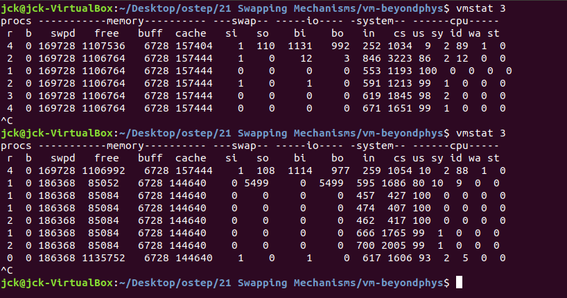

## 21 Swapping Mechanisms

这次是个 C 程序，在 Linux 系统上生成可执行文件并运行即可，使用 `Ctrl+C` 终止程序。

程序的功能是
- 为数组分配空间
- 循环对数组中的每个元素进行递增
- 打印循环消耗的时间以及带宽

### 1. 分配 1 MB 空间

- 程序首先打印分配的空间大小 1.00 MB，然后根据空间大小计算数组元素个数 262144 ；
- 然后不断循环对数组进行递增，由于速度很快，所以并没有打印每次循环的时间和带宽；
- 第一次执行较慢，但是之后的执行速度都非常快。
  - 缓存冷启动

```bash
./mem 1

# 输出
allocating 1048576 bytes (1.00 MB)
  number of integers in array: 262144
loop 0 in 0.41 ms (bandwidth: 2444.23 MB/s)
loop 1457 in 0.13 ms (bandwidth: 7810.62 MB/s)
loop 2925 in 0.14 ms (bandwidth: 7345.54 MB/s)
loop 4279 in 2.34 ms (bandwidth: 427.90 MB/s)
loop 5566 in 0.13 ms (bandwidth: 7825.19 MB/s)
loop 6929 in 0.13 ms (bandwidth: 7752.87 MB/s)
loop 8307 in 0.14 ms (bandwidth: 6898.53 MB/s)
loop 9748 in 0.15 ms (bandwidth: 6754.11 MB/s)
^C
```

### 2. 分配 1 GB 空间

- 程序首先打印分配的空间大小 1024.00 MB，然后根据空间大小计算数组元素个数 268435456 ；
- 然后不断循环对数组进行递增，由于空间大，数组元素多，因此每隔 2 次循环就打印一次循环信息；
- 同样地，第一次执行较慢，之后的执行速度都非常快。
  - 缓存冷启动

```bash
./mem 1024

# 输出
allocating 1073741824 bytes (1024.00 MB)
  number of integers in array: 268435456
loop 0 in 956.71 ms (bandwidth: 1070.34 MB/s)
loop 1 in 228.78 ms (bandwidth: 4475.96 MB/s)
loop 3 in 151.56 ms (bandwidth: 6756.27 MB/s)
loop 5 in 160.48 ms (bandwidth: 6380.93 MB/s)
loop 7 in 172.33 ms (bandwidth: 5942.16 MB/s)
loop 9 in 147.02 ms (bandwidth: 6964.81 MB/s)
loop 11 in 145.07 ms (bandwidth: 7058.61 MB/s)
loop 13 in 147.99 ms (bandwidth: 6919.53 MB/s)
loop 15 in 143.32 ms (bandwidth: 7144.85 MB/s)
loop 17 in 148.80 ms (bandwidth: 6881.63 MB/s)
^C
```

### vmstat

[vmstat命令](https://man.linuxde.net/vmstat) 显示虚拟内存状态（Virtual Memory Statistics），也可以报告关于进程、内存、I/O等系统整体运行状态。

每隔 3s 进行一次采样，第一次是运行 `./mem 1` 时的采样结果，第二次是运行 `./mem 1024` 时的采样结果
- 从 memory 的 free 字段可以看出程序请求分配空间，并获得了空间
- 从 swap 的 si 和 so 字段可以看出，程序在执行循环的过程中并没有进行数据交换（swap）

