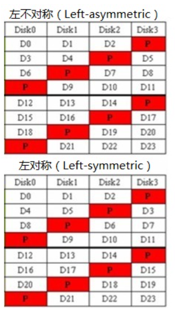

## 38 Redundant Disk Arrays (RAID)


简单的模拟 RAID 的程序，支持 RAID-0（块条带化）、RAID-1（镜像，RAID-10）、RAID-4（块条带化加上一个奇偶校验磁盘）和RAID-5（带有旋转奇偶校验的块条带化）。显示不同 RAID 级别如何将逻辑块映射到底层磁盘和偏移量，考察地址映射以及读写性能。

```python
# 随机种子，默认为 0
parser.add_option('-s', '--seed',        default=0,      help='the random seed',                                action='store',       type='int',    dest='seed')
# 磁盘数量，默认为 4
parser.add_option('-D', '--numDisks',    default=4,      help='number of disks in RAID',                        action='store',       type='int',    dest='numDisks') 
# 大块大小，默认为 4 kb
parser.add_option('-C', '--chunkSize',   default='4k',   help='chunk size of the RAID',                         action='store',       type='string', dest='chunkSize') 
# 请求数量，默认为 10 
parser.add_option('-n', '--numRequests', default=10,     help='number of requests to simulate',                 action='store',       type='int',    dest='numRequests')
# 请求大小，默认为 4 kb
parser.add_option('-S', '--reqSize',     default='4k',   help='size of requests',                               action='store',       type='string', dest='size')
# 工作负载，默认为随机，seq 表示顺序
parser.add_option('-W', '--workload',    default='rand', help='either "rand" or "seq" workloads',               action='store',       type='string', dest='workload')
# 写入百分比，默认为 0 表示不进行写入
parser.add_option('-w', '--writeFrac',   default=0,      help='write fraction (100->all writes, 0->all reads)', action='store',       type='int',    dest='writeFrac')
# 随机工作负载的请求范围，默认为 10000
parser.add_option('-R', '--randRange',   default=10000,  help='range of requests (when using "rand" workload)', action='store',       type='int',    dest='range')
# RAID 级别，默认为 0
parser.add_option('-L', '--level',       default=0,      help='RAID level (0, 1, 4, 5)',                        action='store',       type='int',    dest='level')
# RAID 5 旋转奇偶校验，默认为 LS 左对称布局，LA 表示左不对称布局
parser.add_option('-5', '--raid5',       default='LS',   help='RAID-5 left-symmetric "LS" or left-asym "LA"',   action='store',       type='string', dest='raid5type')
# 显示物理操作
parser.add_option('-r', '--reverse',     default=False,  help='instead of showing logical ops, show physical',  action='store_true',                 dest='reverse')
# 使用计时模式（随机请求 10 ms，顺序请求 0.1 ms），默认使用映射模式
parser.add_option('-t', '--timing',      default=False,  help='use timing mode, instead of mapping mode',       action='store_true',                 dest='timing')
# 计算结果
parser.add_option('-c', '--compute',     default=False,  help='compute answers for me',                         action='store_true',                 dest='solve')
```

具有四个磁盘的简单条带 RAID (RAID-0) 如何进行映射
- `-n 5` ：5 个请求
- `-L 0` ：RAID-0
- `-R 20` ：将随机请求的范围限制在前 20 个块

在 RAID-0 中，请求的底层磁盘和偏移量是通过模运算计算的：

```
disk   = address % number_of_disks
offset = address / number_of_disks
```

随机请求以下 5 个地址：16, 8, 10, 15, 9

```bash
./raid.py -n 5 -R 20 -L 0 -c

# 输出
ARG blockSize 4096  <---- 块大小（字节）
ARG seed 0          <---- 随机数种子
ARG numDisks 4      <---- 磁盘数量
ARG chunkSize 4k    <---- 大块大小
ARG numRequests 5   <---- 请求数量
ARG reqSize 4k      <---- 请求大小
ARG workload rand   <---- 随机工作负载
ARG writeFrac 0     <---- 写入百分比
ARG randRange 20    <---- 随机工作负载的请求范围
ARG level 0         <---- RAID 0 级
ARG raid5 LS        <---- RAID 5 级使用左对称布局
ARG reverse False   <---- 不显示物理操作
ARG timing False    <---- 不使用计时模式，使用映射模式

16 1
LOGICAL READ from addr:16 size:4096   <---- 16 % 4 = 0
  read  [disk 0, offset 4]            <---- 16 / 4 = 4

8 1
LOGICAL READ from addr:8 size:4096    <---- 8 % 4 = 0
  read  [disk 0, offset 2]            <---- 8 / 4 = 2

10 1
LOGICAL READ from addr:10 size:4096   <---- 10 % 4 = 2
  read  [disk 2, offset 2]            <---- 10 / 4 = 2

15 1
LOGICAL READ from addr:15 size:4096   <---- 15 % 4 = 3
  read  [disk 3, offset 3]            <---- 15 / 4 = 3

9 1
LOGICAL READ from addr:9 size:4096    <---- 9 % 4 = 1
  read  [disk 1, offset 2]            <---- 9 / 4 = 2
```

RAID-1
- 对于偶数编号的逻辑块，选择对应的偶数编号的磁盘；奇数磁盘用于奇数编号的逻辑块。
  - RAID-1 一半的磁盘用于条带化，另一半的磁盘作为镜像，因此可用磁盘为 2
  - 0 映射到 1； 2 映射到 3
  - 求模 0 访问 0、1；求模 1 访问 2、3
  - 根据商的奇偶访问

```bash
./raid.py -R 20 -n 5 -L 1 -c

# 输出
...
16 1
LOGICAL READ from addr:16 size:4096   <---- 16 / 2 = 8
  read  [disk 0, offset 8]            <---- 16 % 2 = 0

8 1
LOGICAL READ from addr:8 size:4096    <---- 8 / 2 = 4
  read  [disk 0, offset 4]            <---- 8 % 2 = 0

10 1
LOGICAL READ from addr:10 size:4096   <---- 10 / 2 = 5
  read  [disk 1, offset 5]            <---- 10 % 2 = 0 -> 1

15 1
LOGICAL READ from addr:15 size:4096   <---- 15 / 2 = 7
  read  [disk 3, offset 7]            <---- 15 % 2 = 1 -> 3

9 1
LOGICAL READ from addr:9 size:4096    <---- 9 / 2 = 4
  read  [disk 2, offset 4]            <---- 9 % 2 = 1 -> 2
```

每个请求都写入，RAID-1 必须写入两个磁盘。

```bash
./raid.py -R 20 -n 5 -L 1 -w 100 -c

# 输出
...
16 1
LOGICAL WRITE to  addr:16 size:4096
  write [disk 0, offset 8]    write [disk 1, offset 8]  

8 1
LOGICAL WRITE to  addr:8 size:4096
  write [disk 0, offset 4]    write [disk 1, offset 4]  

10 1
LOGICAL WRITE to  addr:10 size:4096
  write [disk 0, offset 5]    write [disk 1, offset 5]  

15 1
LOGICAL WRITE to  addr:15 size:4096
  write [disk 2, offset 7]    write [disk 3, offset 7]  

9 1
LOGICAL WRITE to  addr:9 size:4096
  write [disk 2, offset 4]    write [disk 3, offset 4]  
```

### 1 不同级别 RAID 随机读取

随机种子默认为 0

1. RAID-0

对地址求模取商即可找到映射。

```bash
./raid.py -L 0 -c

# 输出
...
8444 1
LOGICAL READ from addr:8444 size:4096   <---- 8444 / 4 = 2111
  read  [disk 0, offset 2111]           <---- 8444 % 4 = 0

4205 1
LOGICAL READ from addr:4205 size:4096   <---- 4205 / 4 = 1051
  read  [disk 1, offset 1051]           <---- 4205 % 4 = 1

5112 1
LOGICAL READ from addr:5112 size:4096   <---- 5112 / 4 = 1278
  read  [disk 0, offset 1278]           <---- 5112 % 4 = 0

7837 1
LOGICAL READ from addr:7837 size:4096   <---- 7837 / 4 = 1959
  read  [disk 1, offset 1959]           <---- 7837 % 4 = 1

4765 1
LOGICAL READ from addr:4765 size:4096   <---- 4765 / 4 = 1191
  read  [disk 1, offset 1191]           <---- 4765 % 4 = 1

9081 1
LOGICAL READ from addr:9081 size:4096   <---- 9081 / 4 = 2270
  read  [disk 1, offset 2270]           <---- 9081 % 4 = 1

2818 1
LOGICAL READ from addr:2818 size:4096   <---- 2818 / 4 = 704
  read  [disk 2, offset 704]            <---- 2818 % 4 = 2

6183 1
LOGICAL READ from addr:6183 size:4096   <---- 6183 / 4 = 1545
  read  [disk 3, offset 1545]           <---- 6183 % 4 = 3

9097 1
LOGICAL READ from addr:9097 size:4096   <---- 9097 / 4 = 2274
  read  [disk 1, offset 2274]           <---- 9097 % 4 = 1

8102 1
LOGICAL READ from addr:8102 size:4096   <---- 8102 / 4 = 2025
  read  [disk 2, offset 2025]           <---- 8102 % 4 = 2
```

2. RAID-1

- 0 映射到 1； 2 映射到 3
- 求模 0 访问 0、1；求模 1 访问 2、3
- 根据商的奇偶访问

```bash
./raid.py -L 1 -c

# 输出
...
8444 1
LOGICAL READ from addr:8444 size:4096   <---- 8444 / 2 = 4222
  read  [disk 0, offset 4222]           <---- 8444 % 2 = 0

4205 1
LOGICAL READ from addr:4205 size:4096   <---- 4205 / 2 = 2102
  read  [disk 2, offset 2102]           <---- 4205 % 2 = 1 -> 2

5112 1
LOGICAL READ from addr:5112 size:4096   <---- 5112 / 2 = 2556
  read  [disk 0, offset 2556]           <---- 5112 % 2 = 0

7837 1
LOGICAL READ from addr:7837 size:4096   <---- 7837 / 2 = 3918
  read  [disk 2, offset 3918]           <---- 7837 % 2 = 1 -> 2

4765 1
LOGICAL READ from addr:4765 size:4096   <---- 4765 / 2 = 2382
  read  [disk 2, offset 2382]           <---- 4765 % 2 = 1 -> 2

9081 1
LOGICAL READ from addr:9081 size:4096   <---- 9081 / 2 = 4540
  read  [disk 2, offset 4540]           <---- 9081 % 2 = 1 -> 2

2818 1
LOGICAL READ from addr:2818 size:4096   <---- 2818 / 2 = 1409
  read  [disk 1, offset 1409]           <---- 2818 % 2 = 0 -> 1

6183 1
LOGICAL READ from addr:6183 size:4096   <---- 6183 / 2 = 3091
  read  [disk 3, offset 3091]           <---- 6183 % 2 = 1 -> 3

9097 1
LOGICAL READ from addr:9097 size:4096   <---- 9097 / 2 = 4548
  read  [disk 2, offset 4548]           <---- 9097 % 2 = 1 -> 2

8102 1
LOGICAL READ from addr:8102 size:4096   <---- 8102 / 2 = 4051
  read  [disk 1, offset 4051]           <---- 8102 % 2 = 0 -> 1
```

3. RAID-4

最后一个磁盘作为奇偶校验盘，因此只有 3 个磁盘可用，对地址求模取商即可找到映射。

```bash
./raid.py -L 4 -c

# 输出
...
8444 1
LOGICAL READ from addr:8444 size:4096   <---- 8444 / 3 = 2814
  read  [disk 2, offset 2814]           <---- 8444 % 3 = 2
4205 1
LOGICAL READ from addr:4205 size:4096   <---- 4205 / 3 = 1401
  read  [disk 2, offset 1401]           <---- 4205 % 3 = 2
5112 1
LOGICAL READ from addr:5112 size:4096   <---- 5112 / 3 = 1704
  read  [disk 0, offset 1704]           <---- 5112 % 3 = 0
7837 1
LOGICAL READ from addr:7837 size:4096   <---- 7837 / 3 = 2612
  read  [disk 1, offset 2612]           <---- 7837 % 3 = 1
4765 1
LOGICAL READ from addr:4765 size:4096   <---- 4765 / 3 = 1588
  read  [disk 1, offset 1588]           <---- 4765 % 3 = 1
9081 1
LOGICAL READ from addr:9081 size:4096   <---- 9081 / 3 = 3027
  read  [disk 0, offset 3027]           <---- 9081 % 3 = 0
2818 1
LOGICAL READ from addr:2818 size:4096   <---- 2818 / 3 = 939
  read  [disk 1, offset 939]            <---- 2818 % 3 = 1
6183 1
LOGICAL READ from addr:6183 size:4096   <---- 6183 / 3 = 2061
  read  [disk 0, offset 2061]           <---- 6183 % 3 = 0
9097 1
LOGICAL READ from addr:9097 size:4096   <---- 9097 / 3 = 3032
  read  [disk 1, offset 3032]           <---- 9097 % 3 = 1
8102 1
LOGICAL READ from addr:8102 size:4096   <---- 8102 / 3 = 2700
  read  [disk 2, offset 2700]           <---- 8102 % 3 = 2
```

4. RAID-5 (LS)

磁盘容量与 RAID-4 相同，旋转奇偶校验，每个磁盘都有奇偶校验块。



默认左对称布局（left-symmetric），想象一下，把奇偶校验块全部放到磁盘最后一位，那么每个磁盘上磁块的编号实际上和 RAID-0 相同。因此磁盘编号只需要对磁盘数量求模，而每个磁盘都有奇偶校验位，偏移则是对（磁盘数量 - 1）求商。

```bash
./raid.py -L 5 -c

# 输出
...
8444 1
LOGICAL READ from addr:8444 size:4096   <---- 8444 / 3 = 2814
  read  [disk 0, offset 2814]           <---- 8444 % 4 = 0
4205 1
LOGICAL READ from addr:4205 size:4096   <---- 4205 / 3 = 1401
  read  [disk 1, offset 1401]           <---- 4205 % 4 = 1 
5112 1
LOGICAL READ from addr:5112 size:4096   <---- 5112 / 3 = 1704
  read  [disk 0, offset 1704]           <---- 5112 % 4 = 0
7837 1
LOGICAL READ from addr:7837 size:4096   <---- 7837 / 3 = 2612
  read  [disk 1, offset 2612]           <---- 7837 % 4 = 1
4765 1
LOGICAL READ from addr:4765 size:4096   <---- 4765 / 3 = 1588
  read  [disk 1, offset 1588]           <---- 4765 % 4 = 1
9081 1
LOGICAL READ from addr:9081 size:4096   <---- 9081 / 3 = 3027
  read  [disk 1, offset 3027]           <---- 9081 % 4 = 1
2818 1
LOGICAL READ from addr:2818 size:4096   <---- 2818 / 3 = 939
  read  [disk 2, offset 939]            <---- 2818 % 4 = 2
6183 1
LOGICAL READ from addr:6183 size:4096   <---- 6383 / 3 = 2061
  read  [disk 3, offset 2061]           <---- 6383 % 4 = 3
9097 1
LOGICAL READ from addr:9097 size:4096   <---- 9097 / 3 = 3032
  read  [disk 1, offset 3032]           <---- 9097 % 4 = 1
8102 1
LOGICAL READ from addr:8102 size:4096   <---- 8102 / 3 = 2700
  read  [disk 2, offset 2700]           <---- 8102 % 4 = 2
```

5. RAID-5 (LA)

左不对称布局（left-asymmetric），每个磁盘都有奇偶校验位，偏移是对（磁盘数量 - 1）求商。

磁盘按这种形式循环，对其进行编号，`x` 表示奇偶校验块，实际的列号即为磁盘编号，但下三角的列需要加一
- 行 = addr / 3 % 4
- 列 = addr % 3

-|0|1|2|3
-|-|-|-|-
0|0|1|2|x
1|0|1|x|2
2|0|x|1|2
3|x|0|1|2

```bash
./raid.py -L 5 -5 LA -c

# 输出
...
8444 1
LOGICAL READ from addr:8444 size:4096   <---- 8444 / 3 = 2814
  read  [disk 3, offset 2814]           <---- 2814 % 4 = 2, 8444 % 3 = 2 -> 3
4205 1
LOGICAL READ from addr:4205 size:4096   <---- 4205 / 3 = 1401
  read  [disk 3, offset 1401]           <---- 1401 % 4 = 1, 4205 % 3 = 2 -> 3
5112 1
LOGICAL READ from addr:5112 size:4096   <---- 5112 / 3 = 1704
  read  [disk 0, offset 1704]           <---- 1704 % 4 = 0, 5112 % 3 = 0 -> 0
7837 1
LOGICAL READ from addr:7837 size:4096   <---- 7837 / 3 = 2612
  read  [disk 1, offset 2612]           <---- 2612 % 4 = 0, 7837 % 3 = 1 -> 1
4765 1
LOGICAL READ from addr:4765 size:4096   <---- 4765 / 3 = 1588
  read  [disk 1, offset 1588]           <---- 1588 % 4 = 0, 4765 % 3 = 1 -> 1
9081 1
LOGICAL READ from addr:9081 size:4096   <---- 9081 / 3 = 3027
  read  [disk 1, offset 3027]           <---- 3027 % 4 = 3, 9081 % 3 = 0 -> 1
2818 1
LOGICAL READ from addr:2818 size:4096   <---- 2818 / 3 = 939
  read  [disk 2, offset 939]            <---- 939 % 4 = 3, 2818 % 3 = 1 -> 2
6183 1
LOGICAL READ from addr:6183 size:4096   <---- 6183 / 3 = 2061
  read  [disk 0, offset 2061]           <---- 2061 % 4 = 1, 6183 % 3 = 0 -> 0
9097 1
LOGICAL READ from addr:9097 size:4096   <---- 9097 / 3 = 3032
  read  [disk 1, offset 3032]           <---- 3032 % 4 = 0, 9097 % 3 = 1 -> 1
8102 1
LOGICAL READ from addr:8102 size:4096   <---- 8102 / 3 = 2700
  read  [disk 2, offset 2700]           <---- 2700 % 4 = 0, 8102 % 3 = 2 -> 2
```

### 2/3 不同级别 RAID 随机读取（改变大块大小）

改变大块大小 `-C` ，重复实验 1 。

- ~~磁盘编号 = address / n % number_of_disks~~
- ~~磁盘编号 = addr % (number_of_disks * n) / n~~

1. RAID-0

大块大小是原来的 2 倍时

0|1|2|3
-|-|-|-
0|2|4|6
1|3|5|7
8|10|12|14
9|11|13|15

```bash
./raid.py -C 8k -L 0 -c

# 输出
...
8444 1
LOGICAL READ from addr:8444 size:4096   <---- = 2
  read  [disk 2, offset 2110]           <---- = 2110

4205 1
LOGICAL READ from addr:4205 size:4096   <---- = 2
  read  [disk 2, offset 1051]           <---- = 1051

5112 1
LOGICAL READ from addr:5112 size:4096   <---- = 0
  read  [disk 0, offset 1278]           <---- = 1278

7837 1
LOGICAL READ from addr:7837 size:4096   <---- = 2
  read  [disk 2, offset 1959]           <---- = 1959

4765 1
LOGICAL READ from addr:4765 size:4096   <---- = 2
  read  [disk 2, offset 1191]           <---- = 1191

9081 1
LOGICAL READ from addr:9081 size:4096   <---- = 0
  read  [disk 0, offset 2271]           <---- = 2270

2818 1
LOGICAL READ from addr:2818 size:4096   <---- = 1
  read  [disk 1, offset 704]            <---- = 704

6183 1
LOGICAL READ from addr:6183 size:4096   <---- = 3
  read  [disk 3, offset 1545]           <---- = 1545

9097 1
LOGICAL READ from addr:9097 size:4096   <---- = 0
  read  [disk 0, offset 2275]           <---- = 2275

8102 1
LOGICAL READ from addr:8102 size:4096   <---- = 3
  read  [disk 3, offset 2024]           <---- = 2024
```

2. RAID-1

和 RAID-0 类似
- 0 映射到 1； 2 映射到 3
- 根据商的奇偶访问

```bash
./raid.py -C 8k -L 1 -c

# 输出
...
8444 1
LOGICAL READ from addr:8444 size:4096
  read  [disk 0, offset 4222]  

4205 1
LOGICAL READ from addr:4205 size:4096
  read  [disk 1, offset 2103]  

5112 1
LOGICAL READ from addr:5112 size:4096
  read  [disk 0, offset 2556]  

7837 1
LOGICAL READ from addr:7837 size:4096
  read  [disk 1, offset 3919]  

4765 1
LOGICAL READ from addr:4765 size:4096
  read  [disk 1, offset 2383]  

9081 1
LOGICAL READ from addr:9081 size:4096
  read  [disk 1, offset 4541]  

2818 1
LOGICAL READ from addr:2818 size:4096
  read  [disk 2, offset 1408]  

6183 1
LOGICAL READ from addr:6183 size:4096
  read  [disk 3, offset 3091]  

9097 1
LOGICAL READ from addr:9097 size:4096
  read  [disk 1, offset 4549]  

8102 1
LOGICAL READ from addr:8102 size:4096
  read  [disk 2, offset 4050]  
```

3. RAID-4

最后一个磁盘作为奇偶校验盘，因此只有 3 个磁盘可用。

```bash
./raid.py -C 8k -L 4 -c

# 输出
...
8444 1
LOGICAL READ from addr:8444 size:4096
  read  [disk 1, offset 2814]  
4205 1
LOGICAL READ from addr:4205 size:4096
  read  [disk 2, offset 1401]  
5112 1
LOGICAL READ from addr:5112 size:4096
  read  [disk 0, offset 1704]  
7837 1
LOGICAL READ from addr:7837 size:4096
  read  [disk 0, offset 2613]  
4765 1
LOGICAL READ from addr:4765 size:4096
  read  [disk 0, offset 1589]  
9081 1
LOGICAL READ from addr:9081 size:4096
  read  [disk 1, offset 3027]  
2818 1
LOGICAL READ from addr:2818 size:4096
  read  [disk 2, offset 938]  
6183 1
LOGICAL READ from addr:6183 size:4096
  read  [disk 1, offset 2061]  
9097 1
LOGICAL READ from addr:9097 size:4096
  read  [disk 0, offset 3033]  
8102 1
LOGICAL READ from addr:8102 size:4096
  read  [disk 1, offset 2700]  
```

4. RAID-5 (LS)

磁盘编号仍然可以视为与 RAID-0 相同

```bash
./raid.py -C 8k -L 5 -c

# 输出
...
8444 1
LOGICAL READ from addr:8444 size:4096
  read  [disk 2, offset 2814]  
4205 1
LOGICAL READ from addr:4205 size:4096
  read  [disk 2, offset 1401]  
5112 1
LOGICAL READ from addr:5112 size:4096
  read  [disk 0, offset 1704]  
7837 1
LOGICAL READ from addr:7837 size:4096
  read  [disk 2, offset 2613]  
4765 1
LOGICAL READ from addr:4765 size:4096
  read  [disk 2, offset 1589]  
9081 1
LOGICAL READ from addr:9081 size:4096
  read  [disk 0, offset 3027]  
2818 1
LOGICAL READ from addr:2818 size:4096
  read  [disk 1, offset 938]  
6183 1
LOGICAL READ from addr:6183 size:4096
  read  [disk 3, offset 2061]  
9097 1
LOGICAL READ from addr:9097 size:4096
  read  [disk 0, offset 3033]  
8102 1
LOGICAL READ from addr:8102 size:4096
  read  [disk 3, offset 2700]  
```

5. RAID-5 (LA)

```bash
./raid.py -C 8k -L 5 -5 LA -c

# 输出
...
8444 1
LOGICAL READ from addr:8444 size:4096
  read  [disk 2, offset 2814]  
4205 1
LOGICAL READ from addr:4205 size:4096
  read  [disk 2, offset 1401]  
5112 1
LOGICAL READ from addr:5112 size:4096
  read  [disk 0, offset 1704]  
7837 1
LOGICAL READ from addr:7837 size:4096
  read  [disk 0, offset 2613]  
4765 1
LOGICAL READ from addr:4765 size:4096
  read  [disk 0, offset 1589]  
9081 1
LOGICAL READ from addr:9081 size:4096
  read  [disk 1, offset 3027]  
2818 1
LOGICAL READ from addr:2818 size:4096
  read  [disk 3, offset 938]  
6183 1
LOGICAL READ from addr:6183 size:4096
  read  [disk 2, offset 2061]  
9097 1
LOGICAL READ from addr:9097 size:4096
  read  [disk 0, offset 3033]  
8102 1
LOGICAL READ from addr:8102 size:4096
  read  [disk 2, offset 2700]  
```

### 4 不同级别 RAID 随机读取（改变请求大小）

增加请求的大小（`-S`），并指定顺序工作负载（`-W seq`）。

当请求的大小增加时，底层 I/O 模式会发生什么？

对于什么请求大小，RAID-4 和 RAID-5 的 I/O 效率更高？

#### RAID-0

1. `-S 8k`

请求大小为区块大小的 2 倍，因此连续访问两个区块。

```bash
./raid.py -W seq -S 8k -L 0 -c

# 输出
...
0 2
LOGICAL READ from addr:0 size:8192
  read  [disk 0, offset 0]  
  read  [disk 1, offset 0]  

2 2
LOGICAL READ from addr:2 size:8192
  read  [disk 2, offset 0]  
  read  [disk 3, offset 0]  

4 2
LOGICAL READ from addr:4 size:8192
  read  [disk 0, offset 1]  
  read  [disk 1, offset 1]  

6 2
LOGICAL READ from addr:6 size:8192
  read  [disk 2, offset 1]  
  read  [disk 3, offset 1]  

8 2
LOGICAL READ from addr:8 size:8192
  read  [disk 0, offset 2]  
  read  [disk 1, offset 2]  

10 2
LOGICAL READ from addr:10 size:8192
  read  [disk 2, offset 2]  
  read  [disk 3, offset 2]  

12 2
LOGICAL READ from addr:12 size:8192
  read  [disk 0, offset 3]  
  read  [disk 1, offset 3]  

14 2
LOGICAL READ from addr:14 size:8192
  read  [disk 2, offset 3]  
  read  [disk 3, offset 3]  

16 2
LOGICAL READ from addr:16 size:8192
  read  [disk 0, offset 4]  
  read  [disk 1, offset 4]  

18 2
LOGICAL READ from addr:18 size:8192
  read  [disk 2, offset 4]  
  read  [disk 3, offset 4]  
```

2. `-S 12k`

请求大小为区块大小的 3 倍，因此连续访问三个区块。

```bash
./raid.py -W seq -S 12k -L 0 -c

# 输出
...
0 3
LOGICAL READ from addr:0 size:12288
  read  [disk 0, offset 0]  
  read  [disk 1, offset 0]  
  read  [disk 2, offset 0]  

3 3
LOGICAL READ from addr:3 size:12288
  read  [disk 3, offset 0]  
  read  [disk 0, offset 1]  
  read  [disk 1, offset 1]  

6 3
LOGICAL READ from addr:6 size:12288
  read  [disk 2, offset 1]  
  read  [disk 3, offset 1]  
  read  [disk 0, offset 2]  

9 3
LOGICAL READ from addr:9 size:12288
  read  [disk 1, offset 2]  
  read  [disk 2, offset 2]  
  read  [disk 3, offset 2]  

12 3
LOGICAL READ from addr:12 size:12288
  read  [disk 0, offset 3]  
  read  [disk 1, offset 3]  
  read  [disk 2, offset 3]  

15 3
LOGICAL READ from addr:15 size:12288
  read  [disk 3, offset 3]  
  read  [disk 0, offset 4]  
  read  [disk 1, offset 4]  

18 3
LOGICAL READ from addr:18 size:12288
  read  [disk 2, offset 4]  
  read  [disk 3, offset 4]  
  read  [disk 0, offset 5]  

21 3
LOGICAL READ from addr:21 size:12288
  read  [disk 1, offset 5]  
  read  [disk 2, offset 5]  
  read  [disk 3, offset 5]  

24 3
LOGICAL READ from addr:24 size:12288
  read  [disk 0, offset 6]  
  read  [disk 1, offset 6]  
  read  [disk 2, offset 6]  

27 3
LOGICAL READ from addr:27 size:12288
  read  [disk 3, offset 6]  
  read  [disk 0, offset 7]  
  read  [disk 1, offset 7]  
```

3. `-S 16k`

请求大小为区块大小的 4 倍，因此连续访问四个区块。

```bash
./raid.py -W seq -S 16k -L 0 -c

# 输出
...
0 4
LOGICAL READ from addr:0 size:16384
  read  [disk 0, offset 0]  
  read  [disk 1, offset 0]  
  read  [disk 2, offset 0]  
  read  [disk 3, offset 0]  

4 4
LOGICAL READ from addr:4 size:16384
  read  [disk 0, offset 1]  
  read  [disk 1, offset 1]  
  read  [disk 2, offset 1]  
  read  [disk 3, offset 1]  

8 4
LOGICAL READ from addr:8 size:16384
  read  [disk 0, offset 2]  
  read  [disk 1, offset 2]  
  read  [disk 2, offset 2]  
  read  [disk 3, offset 2]  

12 4
LOGICAL READ from addr:12 size:16384
  read  [disk 0, offset 3]  
  read  [disk 1, offset 3]  
  read  [disk 2, offset 3]  
  read  [disk 3, offset 3]  

16 4
LOGICAL READ from addr:16 size:16384
  read  [disk 0, offset 4]  
  read  [disk 1, offset 4]  
  read  [disk 2, offset 4]  
  read  [disk 3, offset 4]  

20 4
LOGICAL READ from addr:20 size:16384
  read  [disk 0, offset 5]  
  read  [disk 1, offset 5]  
  read  [disk 2, offset 5]  
  read  [disk 3, offset 5]  

24 4
LOGICAL READ from addr:24 size:16384
  read  [disk 0, offset 6]  
  read  [disk 1, offset 6]  
  read  [disk 2, offset 6]  
  read  [disk 3, offset 6]  

28 4
LOGICAL READ from addr:28 size:16384
  read  [disk 0, offset 7]  
  read  [disk 1, offset 7]  
  read  [disk 2, offset 7]  
  read  [disk 3, offset 7]  

32 4
LOGICAL READ from addr:32 size:16384
  read  [disk 0, offset 8]  
  read  [disk 1, offset 8]  
  read  [disk 2, offset 8]  
  read  [disk 3, offset 8]  

36 4
LOGICAL READ from addr:36 size:16384
  read  [disk 0, offset 9]  
  read  [disk 1, offset 9]  
  read  [disk 2, offset 9]  
  read  [disk 3, offset 9]  
```

#### RAID-1

1. `-S 8k`

请求大小为区块大小的 2 倍，因此连续访问两个区块。

```bash
./raid.py -W seq -S 8k -L 1 -c

# 输出
...
0 2
LOGICAL READ from addr:0 size:8192
  read  [disk 0, offset 0]  
  read  [disk 2, offset 0]  

2 2
LOGICAL READ from addr:2 size:8192
  read  [disk 1, offset 1]  
  read  [disk 3, offset 1]  

4 2
LOGICAL READ from addr:4 size:8192
  read  [disk 0, offset 2]  
  read  [disk 2, offset 2]  

6 2
LOGICAL READ from addr:6 size:8192
  read  [disk 1, offset 3]  
  read  [disk 3, offset 3]  

8 2
LOGICAL READ from addr:8 size:8192
  read  [disk 0, offset 4]  
  read  [disk 2, offset 4]  

10 2
LOGICAL READ from addr:10 size:8192
  read  [disk 1, offset 5]  
  read  [disk 3, offset 5]  

12 2
LOGICAL READ from addr:12 size:8192
  read  [disk 0, offset 6]  
  read  [disk 2, offset 6]  

14 2
LOGICAL READ from addr:14 size:8192
  read  [disk 1, offset 7]  
  read  [disk 3, offset 7]  

16 2
LOGICAL READ from addr:16 size:8192
  read  [disk 0, offset 8]  
  read  [disk 2, offset 8]  

18 2
LOGICAL READ from addr:18 size:8192
  read  [disk 1, offset 9]  
  read  [disk 3, offset 9]  
```

2. `-S 12k`

请求大小为区块大小的 3 倍，因此连续访问三个区块。

```bash
./raid.py -W seq -S 12k -L 1 -c

# 输出
...
0 3
LOGICAL READ from addr:0 size:12288
  read  [disk 0, offset 0]  
  read  [disk 2, offset 0]  
  read  [disk 1, offset 1]  

3 3
LOGICAL READ from addr:3 size:12288
  read  [disk 3, offset 1]  
  read  [disk 0, offset 2]  
  read  [disk 2, offset 2]  

6 3
LOGICAL READ from addr:6 size:12288
  read  [disk 1, offset 3]  
  read  [disk 3, offset 3]  
  read  [disk 0, offset 4]  

9 3
LOGICAL READ from addr:9 size:12288
  read  [disk 2, offset 4]  
  read  [disk 1, offset 5]  
  read  [disk 3, offset 5]  

12 3
LOGICAL READ from addr:12 size:12288
  read  [disk 0, offset 6]  
  read  [disk 2, offset 6]  
  read  [disk 1, offset 7]  

15 3
LOGICAL READ from addr:15 size:12288
  read  [disk 3, offset 7]  
  read  [disk 0, offset 8]  
  read  [disk 2, offset 8]  

18 3
LOGICAL READ from addr:18 size:12288
  read  [disk 1, offset 9]  
  read  [disk 3, offset 9]  
  read  [disk 0, offset 10]  

21 3
LOGICAL READ from addr:21 size:12288
  read  [disk 2, offset 10]  
  read  [disk 1, offset 11]  
  read  [disk 3, offset 11]  

24 3
LOGICAL READ from addr:24 size:12288
  read  [disk 0, offset 12]  
  read  [disk 2, offset 12]  
  read  [disk 1, offset 13]  

27 3
LOGICAL READ from addr:27 size:12288
  read  [disk 3, offset 13]  
  read  [disk 0, offset 14]  
  read  [disk 2, offset 14]  
```

3. `-S 16k`

请求大小为区块大小的 4 倍，因此连续访问四个区块。

```bash
./raid.py -W seq -S 16k -L 1 -c

# 输出
...
0 4
LOGICAL READ from addr:0 size:16384
  read  [disk 0, offset 0]  
  read  [disk 2, offset 0]  
  read  [disk 1, offset 1]  
  read  [disk 3, offset 1]  

4 4
LOGICAL READ from addr:4 size:16384
  read  [disk 0, offset 2]  
  read  [disk 2, offset 2]  
  read  [disk 1, offset 3]  
  read  [disk 3, offset 3]  

8 4
LOGICAL READ from addr:8 size:16384
  read  [disk 0, offset 4]  
  read  [disk 2, offset 4]  
  read  [disk 1, offset 5]  
  read  [disk 3, offset 5]  

12 4
LOGICAL READ from addr:12 size:16384
  read  [disk 0, offset 6]  
  read  [disk 2, offset 6]  
  read  [disk 1, offset 7]  
  read  [disk 3, offset 7]  

16 4
LOGICAL READ from addr:16 size:16384
  read  [disk 0, offset 8]  
  read  [disk 2, offset 8]  
  read  [disk 1, offset 9]  
  read  [disk 3, offset 9]  

20 4
LOGICAL READ from addr:20 size:16384
  read  [disk 0, offset 10]  
  read  [disk 2, offset 10]  
  read  [disk 1, offset 11]  
  read  [disk 3, offset 11]  

24 4
LOGICAL READ from addr:24 size:16384
  read  [disk 0, offset 12]  
  read  [disk 2, offset 12]  
  read  [disk 1, offset 13]  
  read  [disk 3, offset 13]  

28 4
LOGICAL READ from addr:28 size:16384
  read  [disk 0, offset 14]  
  read  [disk 2, offset 14]  
  read  [disk 1, offset 15]  
  read  [disk 3, offset 15]  

32 4
LOGICAL READ from addr:32 size:16384
  read  [disk 0, offset 16]  
  read  [disk 2, offset 16]  
  read  [disk 1, offset 17]  
  read  [disk 3, offset 17]  

36 4
LOGICAL READ from addr:36 size:16384
  read  [disk 0, offset 18]  
  read  [disk 2, offset 18]  
  read  [disk 1, offset 19]  
  read  [disk 3, offset 19]  
```


#### RAID-4

1. `-S 8k`

请求大小为区块大小的 2 倍，因此连续访问两个区块。

```bash
./raid.py -W seq -S 8k -L 4 -c

# 输出
...
0 2
LOGICAL READ from addr:0 size:8192
  read  [disk 0, offset 0]    read  [disk 1, offset 0]  
2 2
LOGICAL READ from addr:2 size:8192
  read  [disk 2, offset 0]    read  [disk 0, offset 1]  
4 2
LOGICAL READ from addr:4 size:8192
  read  [disk 1, offset 1]    read  [disk 2, offset 1]  
6 2
LOGICAL READ from addr:6 size:8192
  read  [disk 0, offset 2]    read  [disk 1, offset 2]  
8 2
LOGICAL READ from addr:8 size:8192
  read  [disk 2, offset 2]    read  [disk 0, offset 3]  
10 2
LOGICAL READ from addr:10 size:8192
  read  [disk 1, offset 3]    read  [disk 2, offset 3]  
12 2
LOGICAL READ from addr:12 size:8192
  read  [disk 0, offset 4]    read  [disk 1, offset 4]  
14 2
LOGICAL READ from addr:14 size:8192
  read  [disk 2, offset 4]    read  [disk 0, offset 5]  
16 2
LOGICAL READ from addr:16 size:8192
  read  [disk 1, offset 5]    read  [disk 2, offset 5]  
18 2
LOGICAL READ from addr:18 size:8192
  read  [disk 0, offset 6]    read  [disk 1, offset 6]  
```


2. `-S 12k`

请求大小为区块大小的 3 倍，因此连续访问三个区块。

```bash
./raid.py -W seq -S 12k -L 4 -c

# 输出
...
0 3
LOGICAL READ from addr:0 size:12288
  read  [disk 0, offset 0]    read  [disk 1, offset 0]    read  [disk 2, offset 0]  
3 3
LOGICAL READ from addr:3 size:12288
  read  [disk 0, offset 1]    read  [disk 1, offset 1]    read  [disk 2, offset 1]  
6 3
LOGICAL READ from addr:6 size:12288
  read  [disk 0, offset 2]    read  [disk 1, offset 2]    read  [disk 2, offset 2]  
9 3
LOGICAL READ from addr:9 size:12288
  read  [disk 0, offset 3]    read  [disk 1, offset 3]    read  [disk 2, offset 3]  
12 3
LOGICAL READ from addr:12 size:12288
  read  [disk 0, offset 4]    read  [disk 1, offset 4]    read  [disk 2, offset 4]  
15 3
LOGICAL READ from addr:15 size:12288
  read  [disk 0, offset 5]    read  [disk 1, offset 5]    read  [disk 2, offset 5]  
18 3
LOGICAL READ from addr:18 size:12288
  read  [disk 0, offset 6]    read  [disk 1, offset 6]    read  [disk 2, offset 6]  
21 3
LOGICAL READ from addr:21 size:12288
  read  [disk 0, offset 7]    read  [disk 1, offset 7]    read  [disk 2, offset 7]  
24 3
LOGICAL READ from addr:24 size:12288
  read  [disk 0, offset 8]    read  [disk 1, offset 8]    read  [disk 2, offset 8]  
27 3
LOGICAL READ from addr:27 size:12288
  read  [disk 0, offset 9]    read  [disk 1, offset 9]    read  [disk 2, offset 9]  
```

3. `-S 16k`

请求大小为区块大小的 4 倍，因此连续访问四个区块。

```bash
./raid.py -W seq -S 16k -L 4 -c

# 输出
...
0 4
LOGICAL READ from addr:0 size:16384
  read  [disk 0, offset 0]    read  [disk 1, offset 0]    read  [disk 2, offset 0]    read  [disk 0, offset 1]  
4 4
LOGICAL READ from addr:4 size:16384
  read  [disk 1, offset 1]    read  [disk 2, offset 1]    read  [disk 0, offset 2]    read  [disk 1, offset 2]  
8 4
LOGICAL READ from addr:8 size:16384
  read  [disk 2, offset 2]    read  [disk 0, offset 3]    read  [disk 1, offset 3]    read  [disk 2, offset 3]  
12 4
LOGICAL READ from addr:12 size:16384
  read  [disk 0, offset 4]    read  [disk 1, offset 4]    read  [disk 2, offset 4]    read  [disk 0, offset 5]  
16 4
LOGICAL READ from addr:16 size:16384
  read  [disk 1, offset 5]    read  [disk 2, offset 5]    read  [disk 0, offset 6]    read  [disk 1, offset 6]  
20 4
LOGICAL READ from addr:20 size:16384
  read  [disk 2, offset 6]    read  [disk 0, offset 7]    read  [disk 1, offset 7]    read  [disk 2, offset 7]  
24 4
LOGICAL READ from addr:24 size:16384
  read  [disk 0, offset 8]    read  [disk 1, offset 8]    read  [disk 2, offset 8]    read  [disk 0, offset 9]  
28 4
LOGICAL READ from addr:28 size:16384
  read  [disk 1, offset 9]    read  [disk 2, offset 9]    read  [disk 0, offset 10]    read  [disk 1, offset 10]  
32 4
LOGICAL READ from addr:32 size:16384
  read  [disk 2, offset 10]    read  [disk 0, offset 11]    read  [disk 1, offset 11]    read  [disk 2, offset 11]  
36 4
LOGICAL READ from addr:36 size:16384
  read  [disk 0, offset 12]    read  [disk 1, offset 12]    read  [disk 2, offset 12]    read  [disk 0, offset 13]  
```

#### RAID-5 (LS)

1. `-S 8k`

请求大小为区块大小的 2 倍，因此连续访问两个区块。

```bash
./raid.py -W seq -S 8k -L 5 -c

# 输出
...
0 2
LOGICAL READ from addr:0 size:8192
  read  [disk 0, offset 0]    read  [disk 1, offset 0]  
2 2
LOGICAL READ from addr:2 size:8192
  read  [disk 2, offset 0]    read  [disk 3, offset 1]  
4 2
LOGICAL READ from addr:4 size:8192
  read  [disk 0, offset 1]    read  [disk 1, offset 1]  
6 2
LOGICAL READ from addr:6 size:8192
  read  [disk 2, offset 2]    read  [disk 3, offset 2]  
8 2
LOGICAL READ from addr:8 size:8192
  read  [disk 0, offset 2]    read  [disk 1, offset 3]  
10 2
LOGICAL READ from addr:10 size:8192
  read  [disk 2, offset 3]    read  [disk 3, offset 3]  
12 2
LOGICAL READ from addr:12 size:8192
  read  [disk 0, offset 4]    read  [disk 1, offset 4]  
14 2
LOGICAL READ from addr:14 size:8192
  read  [disk 2, offset 4]    read  [disk 3, offset 5]  
16 2
LOGICAL READ from addr:16 size:8192
  read  [disk 0, offset 5]    read  [disk 1, offset 5]  
18 2
LOGICAL READ from addr:18 size:8192
  read  [disk 2, offset 6]    read  [disk 3, offset 6]  
```

2. `-S 12k`

请求大小为区块大小的 3 倍，因此连续访问三个区块。

```bash
./raid.py -W seq -S 12k -L 5 -c

# 输出
...
0 3
LOGICAL READ from addr:0 size:12288
  read  [disk 0, offset 0]    read  [disk 1, offset 0]    read  [disk 2, offset 0]  
3 3
LOGICAL READ from addr:3 size:12288
  read  [disk 3, offset 1]    read  [disk 0, offset 1]    read  [disk 1, offset 1]  
6 3
LOGICAL READ from addr:6 size:12288
  read  [disk 2, offset 2]    read  [disk 3, offset 2]    read  [disk 0, offset 2]  
9 3
LOGICAL READ from addr:9 size:12288
  read  [disk 1, offset 3]    read  [disk 2, offset 3]    read  [disk 3, offset 3]  
12 3
LOGICAL READ from addr:12 size:12288
  read  [disk 0, offset 4]    read  [disk 1, offset 4]    read  [disk 2, offset 4]  
15 3
LOGICAL READ from addr:15 size:12288
  read  [disk 3, offset 5]    read  [disk 0, offset 5]    read  [disk 1, offset 5]  
18 3
LOGICAL READ from addr:18 size:12288
  read  [disk 2, offset 6]    read  [disk 3, offset 6]    read  [disk 0, offset 6]  
21 3
LOGICAL READ from addr:21 size:12288
  read  [disk 1, offset 7]    read  [disk 2, offset 7]    read  [disk 3, offset 7]  
24 3
LOGICAL READ from addr:24 size:12288
  read  [disk 0, offset 8]    read  [disk 1, offset 8]    read  [disk 2, offset 8]  
27 3
LOGICAL READ from addr:27 size:12288
  read  [disk 3, offset 9]    read  [disk 0, offset 9]    read  [disk 1, offset 9]  
```

3. `-S 16k`

请求大小为区块大小的 4 倍，因此连续访问四个区块。

```bash
./raid.py -W seq -S 16k -L 5 -c

# 输出
...
0 4
LOGICAL READ from addr:0 size:16384
  read  [disk 0, offset 0]    read  [disk 1, offset 0]    read  [disk 2, offset 0]    read  [disk 3, offset 1]  
4 4
LOGICAL READ from addr:4 size:16384
  read  [disk 0, offset 1]    read  [disk 1, offset 1]    read  [disk 2, offset 2]    read  [disk 3, offset 2]  
8 4
LOGICAL READ from addr:8 size:16384
  read  [disk 0, offset 2]    read  [disk 1, offset 3]    read  [disk 2, offset 3]    read  [disk 3, offset 3]  
12 4
LOGICAL READ from addr:12 size:16384
  read  [disk 0, offset 4]    read  [disk 1, offset 4]    read  [disk 2, offset 4]    read  [disk 3, offset 5]  
16 4
LOGICAL READ from addr:16 size:16384
  read  [disk 0, offset 5]    read  [disk 1, offset 5]    read  [disk 2, offset 6]    read  [disk 3, offset 6]  
20 4
LOGICAL READ from addr:20 size:16384
  read  [disk 0, offset 6]    read  [disk 1, offset 7]    read  [disk 2, offset 7]    read  [disk 3, offset 7]  
24 4
LOGICAL READ from addr:24 size:16384
  read  [disk 0, offset 8]    read  [disk 1, offset 8]    read  [disk 2, offset 8]    read  [disk 3, offset 9]  
28 4
LOGICAL READ from addr:28 size:16384
  read  [disk 0, offset 9]    read  [disk 1, offset 9]    read  [disk 2, offset 10]    read  [disk 3, offset 10]  
32 4
LOGICAL READ from addr:32 size:16384
  read  [disk 0, offset 10]    read  [disk 1, offset 11]    read  [disk 2, offset 11]    read  [disk 3, offset 11]  
36 4
LOGICAL READ from addr:36 size:16384
  read  [disk 0, offset 12]    read  [disk 1, offset 12]    read  [disk 2, offset 12]    read  [disk 3, offset 13]  
```

#### RAID-5 (LA)

1. `-S 8k`

请求大小为区块大小的 2 倍，因此连续访问两个区块。

```bash
./raid.py -W seq -S 8k -L 5 -5 LA -c

# 输出
...
0 2
LOGICAL READ from addr:0 size:8192
  read  [disk 0, offset 0]    read  [disk 1, offset 0]  
2 2
LOGICAL READ from addr:2 size:8192
  read  [disk 2, offset 0]    read  [disk 0, offset 1]  
4 2
LOGICAL READ from addr:4 size:8192
  read  [disk 1, offset 1]    read  [disk 3, offset 1]  
6 2
LOGICAL READ from addr:6 size:8192
  read  [disk 0, offset 2]    read  [disk 2, offset 2]  
8 2
LOGICAL READ from addr:8 size:8192
  read  [disk 3, offset 2]    read  [disk 1, offset 3]  
10 2
LOGICAL READ from addr:10 size:8192
  read  [disk 2, offset 3]    read  [disk 3, offset 3]  
12 2
LOGICAL READ from addr:12 size:8192
  read  [disk 0, offset 4]    read  [disk 1, offset 4]  
14 2
LOGICAL READ from addr:14 size:8192
  read  [disk 2, offset 4]    read  [disk 0, offset 5]  
16 2
LOGICAL READ from addr:16 size:8192
  read  [disk 1, offset 5]    read  [disk 3, offset 5]  
18 2
LOGICAL READ from addr:18 size:8192
  read  [disk 0, offset 6]    read  [disk 2, offset 6]  
```

2. `-S 12k`

请求大小为区块大小的 3 倍，因此连续访问三个区块。

```bash
./raid.py -W seq -S 12k -L 5 -5 LA -c

# 输出
...
0 3
LOGICAL READ from addr:0 size:12288
  read  [disk 0, offset 0]    read  [disk 1, offset 0]    read  [disk 2, offset 0]  
3 3
LOGICAL READ from addr:3 size:12288
  read  [disk 0, offset 1]    read  [disk 1, offset 1]    read  [disk 3, offset 1]  
6 3
LOGICAL READ from addr:6 size:12288
  read  [disk 0, offset 2]    read  [disk 2, offset 2]    read  [disk 3, offset 2]  
9 3
LOGICAL READ from addr:9 size:12288
  read  [disk 1, offset 3]    read  [disk 2, offset 3]    read  [disk 3, offset 3]  
12 3
LOGICAL READ from addr:12 size:12288
  read  [disk 0, offset 4]    read  [disk 1, offset 4]    read  [disk 2, offset 4]  
15 3
LOGICAL READ from addr:15 size:12288
  read  [disk 0, offset 5]    read  [disk 1, offset 5]    read  [disk 3, offset 5]  
18 3
LOGICAL READ from addr:18 size:12288
  read  [disk 0, offset 6]    read  [disk 2, offset 6]    read  [disk 3, offset 6]  
21 3
LOGICAL READ from addr:21 size:12288
  read  [disk 1, offset 7]    read  [disk 2, offset 7]    read  [disk 3, offset 7]  
24 3
LOGICAL READ from addr:24 size:12288
  read  [disk 0, offset 8]    read  [disk 1, offset 8]    read  [disk 2, offset 8]  
27 3
LOGICAL READ from addr:27 size:12288
  read  [disk 0, offset 9]    read  [disk 1, offset 9]    read  [disk 3, offset 9]  
```

3. `-S 16k`

请求大小为区块大小的 4 倍，因此连续访问四个区块。

```bash
./raid.py -W seq -S 16k -L 5 -5 LA -c

# 输出
...
0 4
LOGICAL READ from addr:0 size:16384
  read  [disk 0, offset 0]    read  [disk 1, offset 0]    read  [disk 2, offset 0]    read  [disk 0, offset 1]  
4 4
LOGICAL READ from addr:4 size:16384
  read  [disk 1, offset 1]    read  [disk 3, offset 1]    read  [disk 0, offset 2]    read  [disk 2, offset 2]  
8 4
LOGICAL READ from addr:8 size:16384
  read  [disk 3, offset 2]    read  [disk 1, offset 3]    read  [disk 2, offset 3]    read  [disk 3, offset 3]  
12 4
LOGICAL READ from addr:12 size:16384
  read  [disk 0, offset 4]    read  [disk 1, offset 4]    read  [disk 2, offset 4]    read  [disk 0, offset 5]  
16 4
LOGICAL READ from addr:16 size:16384
  read  [disk 1, offset 5]    read  [disk 3, offset 5]    read  [disk 0, offset 6]    read  [disk 2, offset 6]  
20 4
LOGICAL READ from addr:20 size:16384
  read  [disk 3, offset 6]    read  [disk 1, offset 7]    read  [disk 2, offset 7]    read  [disk 3, offset 7]  
24 4
LOGICAL READ from addr:24 size:16384
  read  [disk 0, offset 8]    read  [disk 1, offset 8]    read  [disk 2, offset 8]    read  [disk 0, offset 9]  
28 4
LOGICAL READ from addr:28 size:16384
  read  [disk 1, offset 9]    read  [disk 3, offset 9]    read  [disk 0, offset 10]    read  [disk 2, offset 10]  
32 4
LOGICAL READ from addr:32 size:16384
  read  [disk 3, offset 10]    read  [disk 1, offset 11]    read  [disk 2, offset 11]    read  [disk 3, offset 11]  
36 4
LOGICAL READ from addr:36 size:16384
  read  [disk 0, offset 12]    read  [disk 1, offset 12]    read  [disk 2, offset 12]    read  [disk 0, offset 13]  
```

### 5 不同级别 RAID 随机读取性能

使用计时模式（`-t`）估计 100 次随机读取 RAID 的性能。

#### RAID-0

随机读性能 = 磁盘数量 * 单个磁盘的随机带宽

```bash
./raid.py -n 100 -t -L 0 -c

# 输出
...
disk:0  busy: 100.00  I/Os:    28 (sequential:0 nearly:1 random:27)
disk:1  busy:  93.91  I/Os:    29 (sequential:0 nearly:6 random:23)
disk:2  busy:  87.92  I/Os:    24 (sequential:0 nearly:0 random:24)
disk:3  busy:  65.94  I/Os:    19 (sequential:0 nearly:1 random:18)

STAT totalTime 275.69999999999993
```

#### RAID-1

和 RAID-0 相同，随机读性能 = 磁盘数量 * 单个磁盘的随机带宽

```bash
./raid.py -n 100 -t -L 1 -c

# 输出
...
disk:0  busy: 100.00  I/Os:    28 (sequential:0 nearly:1 random:27)
disk:1  busy:  86.98  I/Os:    24 (sequential:0 nearly:0 random:24)
disk:2  busy:  97.52  I/Os:    29 (sequential:0 nearly:3 random:26)
disk:3  busy:  65.23  I/Os:    19 (sequential:0 nearly:1 random:18)

STAT totalTime 278.7
```

#### RAID-4

实际磁盘数量少一个，随机读性能 = (磁盘数量 - 1) * 单个磁盘的随机带宽

```bash
./raid.py -n 100 -t -L 4 -c

# 输出
...

disk:0  busy:  78.48  I/Os:    30 (sequential:0 nearly:0 random:30)
disk:1  busy: 100.00  I/Os:    40 (sequential:0 nearly:3 random:37)
disk:2  busy:  76.46  I/Os:    30 (sequential:0 nearly:2 random:28)
disk:3  busy:   0.00  I/Os:     0 (sequential:0 nearly:0 random:0)

STAT totalTime 386.1000000000002
```

#### RAID-5 (LS)

和 RAID-0 相同，随机读性能 = 磁盘数量 * 单个磁盘的随机带宽

```bash
./raid.py -n 100 -t -L 5 -c

# 输出
...
disk:0  busy: 100.00  I/Os:    28 (sequential:0 nearly:1 random:27)
disk:1  busy:  95.84  I/Os:    29 (sequential:0 nearly:5 random:24)
disk:2  busy:  87.60  I/Os:    24 (sequential:0 nearly:0 random:24)
disk:3  busy:  65.70  I/Os:    19 (sequential:0 nearly:1 random:18)

STAT totalTime 276.7
```

#### RAID-5 (LA)

和 RAID-5 (LS) 相同，随机读性能 = 磁盘数量 * 单个磁盘的随机带宽

```bash
./raid.py -n 100 -t -L 5 -5 LA -c

# 输出
...
disk:0  busy:  83.76  I/Os:    24 (sequential:0 nearly:0 random:24)
disk:1  busy: 100.00  I/Os:    30 (sequential:0 nearly:2 random:28)
disk:2  busy:  77.75  I/Os:    23 (sequential:0 nearly:2 random:21)
disk:3  busy:  77.57  I/Os:    23 (sequential:0 nearly:2 random:21)

STAT totalTime 289.4
```

### 6 不同级别 RAID 随机读取性能（增加磁盘数量）

增加磁盘数量（`-D 8`），重复实验 5 。

随着磁盘数量的增加，不同级别的 RAID 性能如何变化。
- 随机读性能增加

#### RAID-0

随机读性能 = 磁盘数量 * 单个磁盘的随机带宽

```bash
./raid.py -n 100 -t -D 8 -L 0 -c

# 输出
...
disk:0  busy:  67.86  I/Os:    12 (sequential:0 nearly:3 random:9)
disk:1  busy:  63.58  I/Os:    12 (sequential:0 nearly:3 random:9)
disk:2  busy:  75.46  I/Os:    13 (sequential:0 nearly:3 random:10)
disk:3  busy:  33.35  I/Os:     6 (sequential:0 nearly:1 random:5)
disk:4  busy:  95.65  I/Os:    16 (sequential:0 nearly:2 random:14)
disk:5  busy: 100.00  I/Os:    17 (sequential:0 nearly:3 random:14)
disk:6  busy:  70.03  I/Os:    11 (sequential:0 nearly:1 random:10)
disk:7  busy:  77.44  I/Os:    13 (sequential:0 nearly:1 random:12)

STAT totalTime 156.49999999999994
```

#### RAID-1

和 RAID-0 相同，随机读性能 = 磁盘数量 * 单个磁盘的随机带宽

```bash
./raid.py -n 100 -t -D 8 -L 1 -c

# 输出
...
disk:0  busy:  67.76  I/Os:    12 (sequential:0 nearly:1 random:11)
disk:1  busy:  92.07  I/Os:    16 (sequential:0 nearly:1 random:15)
disk:2  busy:  64.36  I/Os:    12 (sequential:0 nearly:2 random:10)
disk:3  busy: 100.00  I/Os:    17 (sequential:0 nearly:1 random:16)
disk:4  busy:  77.47  I/Os:    13 (sequential:0 nearly:1 random:12)
disk:5  busy:  66.21  I/Os:    11 (sequential:0 nearly:0 random:11)
disk:6  busy:  32.12  I/Os:     6 (sequential:0 nearly:1 random:5)
disk:7  busy:  72.23  I/Os:    13 (sequential:0 nearly:1 random:12)

STAT totalTime 167.79999999999995
```

#### RAID-4

实际磁盘数量少一个，随机读性能 = (磁盘数量 - 1) * 单个磁盘的随机带宽

```bash
./raid.py -n 100 -t -D 8 -L 4 -c

# 输出
...
disk:0  busy:  94.00  I/Os:    17 (sequential:0 nearly:2 random:15)
disk:1  busy:  66.61  I/Os:    12 (sequential:0 nearly:2 random:10)
disk:2  busy: 100.00  I/Os:    18 (sequential:0 nearly:3 random:15)
disk:3  busy:  72.36  I/Os:    13 (sequential:0 nearly:2 random:11)
disk:4  busy:  76.73  I/Os:    13 (sequential:0 nearly:1 random:12)
disk:5  busy:  78.30  I/Os:    13 (sequential:0 nearly:1 random:12)
disk:6  busy:  83.70  I/Os:    14 (sequential:0 nearly:1 random:13)
disk:7  busy:   0.00  I/Os:     0 (sequential:0 nearly:0 random:0)

STAT totalTime 164.99999999999994
```

#### RAID-5 (LS)

和 RAID-0 相同，随机读性能 = 磁盘数量 * 单个磁盘的随机带宽

```bash
./raid.py -n 100 -t -D 8 -L 5 -c

# 输出
...
disk:0  busy:  68.35  I/Os:    12 (sequential:0 nearly:3 random:9)
disk:1  busy:  63.49  I/Os:    12 (sequential:0 nearly:3 random:9)
disk:2  busy:  76.04  I/Os:    13 (sequential:0 nearly:3 random:10)
disk:3  busy:  33.04  I/Os:     6 (sequential:0 nearly:1 random:5)
disk:4  busy:  95.15  I/Os:    16 (sequential:0 nearly:2 random:14)
disk:5  busy: 100.00  I/Os:    17 (sequential:0 nearly:3 random:14)
disk:6  busy:  69.86  I/Os:    11 (sequential:0 nearly:1 random:10)
disk:7  busy:  76.42  I/Os:    13 (sequential:0 nearly:1 random:12)

STAT totalTime 158.59999999999997
```

#### RAID-5 (LA)

和 RAID-5 (LS) 相同，随机读性能 = 磁盘数量 * 单个磁盘的随机带宽

```bash
./raid.py -n 100 -t -D 8 -L 5 -5 LA -c

# 输出
...
disk:0  busy:  90.87  I/Os:    14 (sequential:0 nearly:1 random:13)
disk:1  busy:  89.34  I/Os:    13 (sequential:0 nearly:1 random:12)
disk:2  busy: 100.00  I/Os:    15 (sequential:0 nearly:1 random:14)
disk:3  busy:  63.39  I/Os:    10 (sequential:0 nearly:1 random:9)
disk:4  busy:  97.85  I/Os:    14 (sequential:0 nearly:0 random:14)
disk:5  busy:  80.00  I/Os:    12 (sequential:0 nearly:1 random:11)
disk:6  busy:  90.87  I/Os:    13 (sequential:0 nearly:0 random:13)
disk:7  busy:  60.28  I/Os:     9 (sequential:0 nearly:1 random:8)

STAT totalTime 144.49999999999997
```

### 7 不同级别 RAID 随机写入性能

全部执行写入（`-w 100`），不同级别的 RAID 性能如何变化。

#### RAID-0

随机写性能 = 磁盘数量 * 单个磁盘的随机带宽

```bash
./raid.py -n 100 -t -w 100 -L 0 -c

# 输出
...
disk:0  busy: 100.00  I/Os:    28 (sequential:0 nearly:1 random:27)
disk:1  busy:  93.91  I/Os:    29 (sequential:0 nearly:6 random:23)
disk:2  busy:  87.92  I/Os:    24 (sequential:0 nearly:0 random:24)
disk:3  busy:  65.94  I/Os:    19 (sequential:0 nearly:1 random:18)

STAT totalTime 275.69999999999993
```

#### RAID-1

由于 RAID-1 需要写入两次，随机写性能 = 磁盘数量 / 2 * 单个磁盘的随机带宽

```bash
./raid.py -n 100 -t -w 100 -L 1 -c

# 输出
...
disk:0  busy: 100.00  I/Os:    52 (sequential:0 nearly:3 random:49)
disk:1  busy: 100.00  I/Os:    52 (sequential:0 nearly:3 random:49)
disk:2  busy:  92.90  I/Os:    48 (sequential:0 nearly:2 random:46)
disk:3  busy:  92.90  I/Os:    48 (sequential:0 nearly:2 random:46)

STAT totalTime 509.80000000000047
```

#### RAID-4

每次写入都需要执行两次读取和两次写入，因此随机写性能 = 1 / 2 * 单个磁盘的随机带宽
- 读取其余两个磁盘的数据
- 写入数据、写入奇偶校验

```bash
./raid.py -n 100 -t -w 100 -L 4 -c

# 输出
...
disk:0  busy:  30.84  I/Os:    60 (sequential:0 nearly:30 random:30)
disk:1  busy:  39.30  I/Os:    80 (sequential:0 nearly:43 random:37)
disk:2  busy:  30.05  I/Os:    60 (sequential:0 nearly:32 random:28)
disk:3  busy: 100.00  I/Os:   200 (sequential:0 nearly:107 random:93)

STAT totalTime 982.5000000000013
```

#### RAID-5 (LS)

相比 RAID-4， RAID-5 允许跨请求并行处理，因此随机写性能 = 磁盘数量 / 4 * 单个磁盘的随机带宽
- 仍然产生 4 个 I/O 操作

```bash
./raid.py -n 100 -t -w 100 -L 5 -c

# 输出
...
disk:0  busy:  99.32  I/Os:   100 (sequential:0 nearly:53 random:47)
disk:1  busy:  96.02  I/Os:   100 (sequential:0 nearly:55 random:45)
disk:2  busy:  99.62  I/Os:   100 (sequential:0 nearly:52 random:48)
disk:3  busy: 100.00  I/Os:   100 (sequential:0 nearly:53 random:47)

STAT totalTime 497.40000000000043
```

#### RAID-5 (LA)

和 RAID-5 (LS) 相同，随机写性能 = 磁盘数量 / 4 * 单个磁盘的随机带宽

```bash
./raid.py -n 100 -t -w 100 -L 5 -5 LA -c

# 输出
...
disk:0  busy:  86.91  I/Os:    92 (sequential:0 nearly:46 random:46)
disk:1  busy:  90.40  I/Os:   102 (sequential:0 nearly:56 random:46)
disk:2  busy:  90.05  I/Os:    98 (sequential:0 nearly:52 random:46)
disk:3  busy: 100.00  I/Os:   108 (sequential:0 nearly:57 random:51)

STAT totalTime 534.6000000000005
```

### 8 不同级别 RAID 顺序写入/读取性能

使用顺序工作负载（`-W seq`），不同级别的 RAID 性能如何变化。

读取和写入时有何不同。

#### RAID-0

顺序写性能 = 磁盘数量 * 单个磁盘的顺序带宽

```bash
./raid.py -n 100 -t -W seq -L 0 -c

# 输出
...
disk:0  busy: 100.00  I/Os:    25 (sequential:24 nearly:0 random:1)
disk:1  busy: 100.00  I/Os:    25 (sequential:24 nearly:0 random:1)
disk:2  busy: 100.00  I/Os:    25 (sequential:24 nearly:0 random:1)
disk:3  busy: 100.00  I/Os:    25 (sequential:24 nearly:0 random:1)

STAT totalTime 12.499999999999991
```

#### RAID-1

由于 RAID-1 需要写入两次，顺序写性能 = 磁盘数量 / 2 * 单个磁盘的顺序带宽

```bash
./raid.py -n 100 -t -W seq -L 1 -c

# 输出
...
disk:0  busy: 100.00  I/Os:    25 (sequential:0 nearly:24 random:1)
disk:1  busy: 100.00  I/Os:    25 (sequential:0 nearly:24 random:1)
disk:2  busy: 100.00  I/Os:    25 (sequential:0 nearly:24 random:1)
disk:3  busy: 100.00  I/Os:    25 (sequential:0 nearly:24 random:1)

STAT totalTime 14.899999999999983
```

#### RAID-4

顺序写性能 = (磁盘数量 - 1) * 单个磁盘的顺序带宽

```bash
./raid.py -n 100 -t -W seq -L 4 -c

# 输出
...
disk:0  busy: 100.00  I/Os:    34 (sequential:33 nearly:0 random:1)
disk:1  busy:  99.25  I/Os:    33 (sequential:32 nearly:0 random:1)
disk:2  busy:  99.25  I/Os:    33 (sequential:32 nearly:0 random:1)
disk:3  busy:   0.00  I/Os:     0 (sequential:0 nearly:0 random:0)

STAT totalTime 13.399999999999988
```

#### RAID-5 (LS)

顺序写性能 = (磁盘数量 - 1) * 单个磁盘的顺序带宽

```bash
./raid.py -n 100 -t -W seq -L 5 -c

# 输出
...
disk:0  busy: 100.00  I/Os:    25 (sequential:16 nearly:8 random:1)
disk:1  busy: 100.00  I/Os:    25 (sequential:16 nearly:8 random:1)
disk:2  busy: 100.00  I/Os:    25 (sequential:16 nearly:8 random:1)
disk:3  busy: 100.00  I/Os:    25 (sequential:16 nearly:8 random:1)

STAT totalTime 13.299999999999988
```

#### RAID-5 (LA)

顺序写性能 = (磁盘数量 - 1) * 单个磁盘的顺序带宽

```bash
./raid.py -n 100 -t -W seq -L 5 -5 LA -c

# 输出
...
disk:0  busy: 100.00  I/Os:    26 (sequential:17 nearly:8 random:1)
disk:1  busy:  99.25  I/Os:    25 (sequential:16 nearly:8 random:1)
disk:2  busy:  99.25  I/Os:    25 (sequential:16 nearly:8 random:1)
disk:3  busy:  97.76  I/Os:    24 (sequential:16 nearly:7 random:1)

STAT totalTime 13.399999999999988
```
