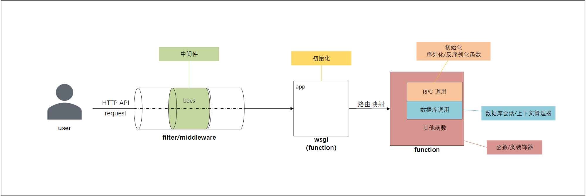
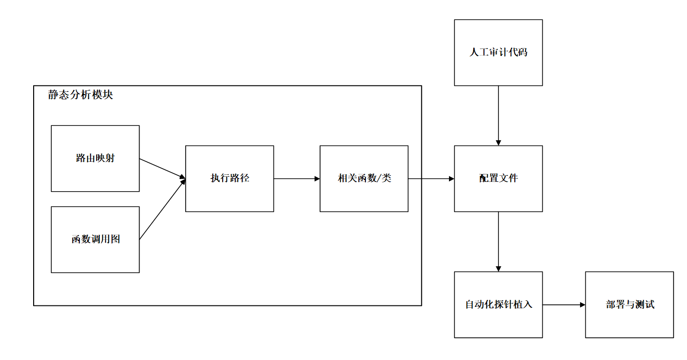

# 针对 OpenStack 云平台的链路追踪系统

时间：2021.01 ~ 2021.09

项目地址：https://github.com/KKSKProject/bees

## 项目介绍

开发一套针对 OpenStack 云平台的分布式链路追踪系统，为漏洞建模/挖掘打基础。该系统基于开源工具 Jaeger 开发，插桩点包括数据库会话、函数调用、RPC 调用、WSGI 中间件等，已验证支持对 Victoria 版本 OpenStack 核心组件的链路追踪。

## 负责内容

OpenStack 云平台测试环境搭建，链路追踪工具的开发与打包，对 OpenStack 组件进行源码插桩，自动化探针植入研究，Kolla-Ansible 打包镜像。

1. OpenStack 云平台搭建
   
   包括单机部署与多机部署，使用 Packstack、Kolla-Ansible 以及源码进行手动和自动部署。

2. 链路追踪工具 bees 开发
   
   调研 [openstack/osprofiler](https://github.com/openstack/osprofiler) 工作流程、使用效果、代码架构，在 Keystone、Glance、Nova、Cinder 上进行实验，总结其功能与不足。
   1. 插桩点：数据库、HTTP、RPC、驱动
   2. 追踪数据：ID、时间戳、服务名称、信息
   3. 没有获取执行结果
   4. 自定义追踪困难

   学习 OpenTelemetry 规范，调研 [jaegertracing/jaeger-client-python](https://github.com/jaegertracing/jaeger-client-python)
   1. OpenTracing 和 OpenCensus 已经合并为 [OpenTelemetry specification](https://github.com/open-telemetry/opentelemetry-specification)，规定了所有实现需要遵循的要求。
   2. 基于 Jaeger 二次开发
    - WSGI 中间件
    - 函数/类装饰器
    - 数据库会话包装
    - 猴子补丁
    - 路由映射
    - 适配 eventlet 模块
   3. 验证支持对 Victoria 版本 OpenStack 云平台的追踪
   
     

3. OpenStack 组件源码插桩
   
   1. 定位创建进程的代码，插桩初始化 tracer 实例
   2. 在配置文件中添加 WSGI 中间件，并在源码配置中间件的地方添加
   3. 对数据库会话进行包装
   4. 函数/类装饰器

4. Python 项目打包与发布
   
   将开发的工具进行打包，发布到本地的 PyPI 服务器上。
   - 根据官方教程 [Packaging Python Projects](https://packaging.python.org/en/latest/tutorials/packaging-projects/) 整理项目结构，添加必要的许可证、说明等信息
   - 使用 pypiserver 搭建本地 PyPI 服务器
   - 验证能够使用 `pip install --extra-index-url http://localhost:8080 my_project` 安装

5. 自动化探针植入
   
   处理 HTTP 请求时，根据 url 路径的映射关系调用相应的函数，因此可以从路由映射着手，对这条路径上的相关函数和类进行探针植入，也可以人工审计代码进行辅助，最后将植入探针的源码进行部署与测试。

   - [Python 静态分析相关论文](https://jckling.github.io/2021/07/28/Notes/Python%20%E9%9D%99%E6%80%81%E5%88%86%E6%9E%90%E7%9B%B8%E5%85%B3%E8%AE%BA%E6%96%87/)
   - [Pyre 污点分析工具 Pysa 使用教程](https://jckling.github.io/2021/07/07/Security/Pysa%20Tutorial/)
   - [Python 程序分析工具调研](https://jckling.github.io/2021/12/30/Security/Python%20%E7%A8%8B%E5%BA%8F%E5%88%86%E6%9E%90%E5%B7%A5%E5%85%B7%E8%B0%83%E7%A0%94/)
   
   

6. [CVE-2020-12691 漏洞利用相关信息追踪](https://jckling.github.io/2021/11/05/Jaeger/CVE-2020-12691%20%E6%BC%8F%E6%B4%9E%E5%88%A9%E7%94%A8%E7%9B%B8%E5%85%B3%E4%BF%A1%E6%81%AF%E8%BF%BD%E8%B8%AA/)
   
   验证漏洞利用流程中的关键信息都能够追踪到。

7. 容器化
   
   将插桩后的核心组件源码打包为 docker 镜像，支持 Kolla-Ansible 自动化部署 OpenStack 云平台和链路追踪系统。

## 应用

1. OpenStack 云平台信息收集
   
   主要是为漏洞挖掘打基础，尽可能多地收集信息。

2. 全真蜜罐
   
   与仿真不同，直接以 OpenStack 云平台作为蜜罐，使用链路追踪捕获操作信息。

## 问题解决

1. 追踪链路断开
   
   只追踪到执行链路中的部分调用，与处理请求的操作有关。例如，WSGI 中间件过滤掉无关的字段，RPC 调用使用的第三方库只提取固定的字段，因此追踪数据丢失。解决办法是加入自己的 WSGI 中间件和猴子补丁，在发送请求时注入追踪上下文信息，在接收请求时提取上下文信息。

   此外，多线程服务需要尝试获取父进程的追踪上下文，然后创建新的 span 继续追踪，同一服务的多进程配置相同的名称，这样所有进程及其线程的追踪数据就能够以组件为单位聚合，以 traceID、spanID 区分。

2. 追踪信息混杂
   
   多进程多线程服务的追踪信息产生了错误的聚合，原本应该是单独的追踪链路混在了一起，查看日志存在警告信息。向共同开发的学长提问，同时在 Github 上提 [two sperate traces are aggregated into one, warning duplicate span IDs #305](https://github.com/jaegertracing/jaeger-client-python/issues/305)，最后表明是没有针对每个进程创建一个追踪实例。
   
   将初始化追踪实例的代码移到创建子进程的地方，为每个进程创建单独的追踪实例，处理本进程内的所有线程追踪。 

3. 其他
   
   - 装饰器引起递归调用
   - 元数据服务追踪
   - tornado 与 eventlet 同时对 os 模块进行 hook
   - kolla-ansible 构建镜像无法安装依赖

## 技术细节

### 插桩点

会话装饰器
- 原理：ORM 中有各种事件侦听器钩子（API 级别）
- 在执行 SQL 语句之前拦截，获取语句、参数等信息
- 在执行 SQL 语句之后拦截，获取执行结果
- 在执行过程中出现异常时拦截，获取异常类型、异常信息

函数/类装饰器
- 原理：使用装饰器修改函数功能
- 执行函数前，获取函数名称、参数
- 执行函数后，获取执行结果
- 出现异常时，获取异常类型、异常信息

WSGI 中间件
- 原理：使用装饰器修改请求逻辑
- 收到请求后，获取请求头、请求体等信息
- 执行请求后，获取执行结果

猴子补丁
- 原理：同函数/类装饰器

### OpenStack

整体介绍、部署流程、OSProfiler 源码分析、组件源码分析

- [分类 - OpenStack](https://jckling.github.io/categories/OpenStack/)

### Jaeger

包括可观察性、OpenTracing 等相关概念

- [分类 - Jaeger](https://jckling.github.io/categories/Jaeger/)

### Python

- [Python 单元测试框架](https://jckling.github.io/2021/03/18/Other/Python%20%E5%8D%95%E5%85%83%E6%B5%8B%E8%AF%95%E6%A1%86%E6%9E%B6/)
- [Python ast 模块使用](https://jckling.github.io/2021/07/14/Other/Python%20ast%20%E6%A8%A1%E5%9D%97%E4%BD%BF%E7%94%A8/)
- [Python 项目打包并发布到私有 PyPI 服务器](https://jckling.github.io/2021/08/23/Other/Python%20%E9%A1%B9%E7%9B%AE%E6%89%93%E5%8C%85%E5%B9%B6%E5%8F%91%E5%B8%83%E5%88%B0%E7%A7%81%E6%9C%89%20PyPI%20%E6%9C%8D%E5%8A%A1%E5%99%A8/)
