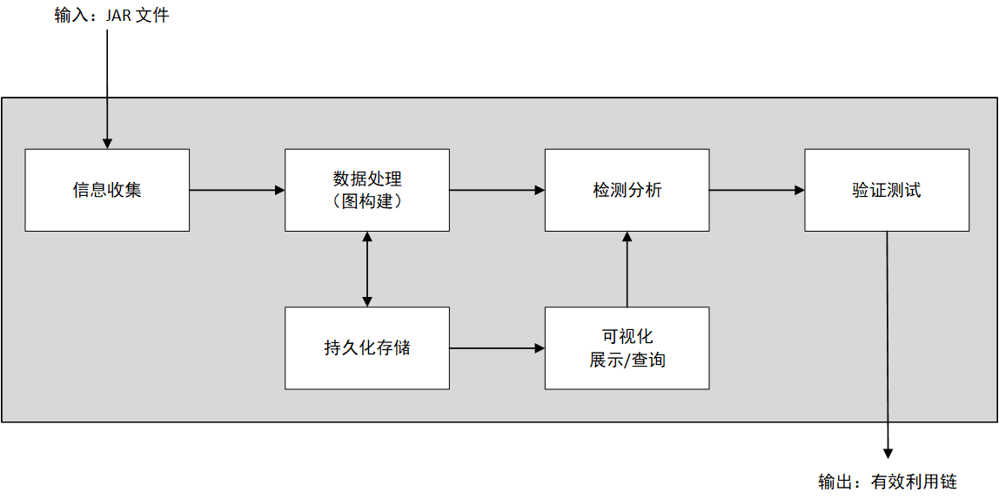
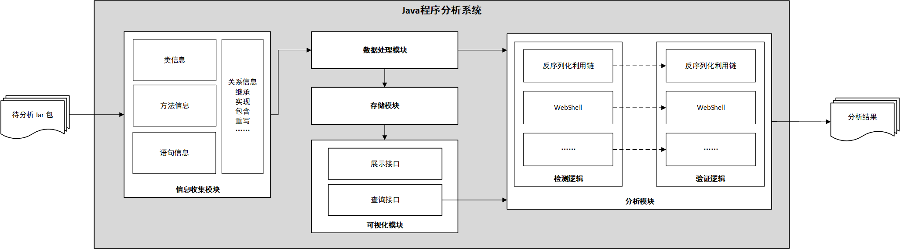

# Java 程序分析系统

时间：2021.09 ~ 2022.06

项目地址：https://github.com/KKSKProject/viz

## 项目介绍

针对 Java 的静态代码分析工具，支持对多种漏洞的检测与验证。

## 负责内容

开发反序列化漏洞检测 demo，验证思路可行；负责系统的整体设计与部分开发工作。

1. 执行逻辑
   
   - 输入待分析的 JAR 文件（默认使用 JDK1.8），对应用程序和 JDK 中的所有类执行信息收集，得到类信息、方法信息、关系信息等
   - 利用收集到的信息构建代码属性图，并持久化存储，可以使用可视化 UI 展示或查询
   - 在图上进行检测分析：（1）使用 JAVA 代码编写检测逻辑；（2）在可视化 UI 上查询检测
     - 本质：图上的路径搜索
   - 对检测结果进行验证，最终得到有效的攻击链
     - 自动化测试，可能涉及到插桩技术

   

2. 模块构成
   
   系统的详细架构，共分为五大模块：**信息收集模块、数据处理模块、存储模块、可视化模块、分析模块**。其中分析模块包含检测与验证两个子模块，能够支持不同漏洞的检测逻辑。
   
   

3. 代码属性图构建
   
   尽可能多地收集信息，将所有信息放在一张图上构成代码属性图。支持分析强制类型转换、链式调用、函数分派、反射等语言特性。

4. 动态验证技术探索
   
   目前任然是人工比对调用链是否有效，之后将基于 Java 单元测试自动生成工具 Randoop 或 EvoSuite 实现自动验证（也可能会探索其他方式）。

## 应用

1. 反序列化漏洞 gadgetchain 验证
   
   对 CommonsCollections3.1 进行分析，验证能够检测到其中存在的 gadgetchain。

2. 其他漏洞的检测
   
   自行设计检测逻辑（图搜索），扩展即可。

## 问题解决

1. Soot 读取到的类太少
   
   遍历 JDK 目录，全部添加到 `classpath` 中，能够得到 10 万左右的类。

2. 有些函数没有方法体，尝试读取导致异常退出
   
   当读取函数的方法体时，没有则会进行创建，因此可能需要读取两遍。此外，还需要对 SootClass 类调用 `setApplicationClass` 才能读到相应的方法体。弊端是没有区分 JDK 与应用类。

3. 路径爆炸
   
   在代码属性图上进行搜索时，非常慢，或是搜出来结果异常多。需要过滤一些无关的类和方法，例如 Object 类。

4. 特殊情况分析
   
   强制类型转换、函数分派、链式调用、反射等。

## 技术细节

### Java 反序列化漏洞

- [Java 反序列化漏洞入门](https://jckling.github.io/2021/09/16/Security/Java%20%E5%8F%8D%E5%BA%8F%E5%88%97%E5%8C%96%E6%BC%8F%E6%B4%9E%E5%85%A5%E9%97%A8/)
- [Gadget Inspector 源码解析](https://jckling.github.io/2021/10/12/Security/Gadget%20Inspector%20%E6%BA%90%E7%A0%81%E8%A7%A3%E6%9E%90/)

### Soot 框架

[Soot 使用记录](https://jckling.github.io/2022/02/23/Other/Soot%20%E4%BD%BF%E7%94%A8%E8%AE%B0%E5%BD%95/)

用于分析和转换 Java 和 Android 应用程序的框架。Soot 将程序转换为 Jimple（最常用）中间表示，然后可以对其进行分析。

### Doop 指针分析工具

- [LogiQL 入门](https://jckling.github.io/2021/10/26/Other/LogiQL%20%E5%85%A5%E9%97%A8/)
- [Datalog 引擎 Soufflé 指南](https://jckling.github.io/2021/11/22/Other/Datalog%20%E5%BC%95%E6%93%8E%20Souffl%C3%A9%20%E6%8C%87%E5%8D%97/)
- [指针分析工具 Doop 使用指南](https://jckling.github.io/2021/12/17/Security/%E6%8C%87%E9%92%88%E5%88%86%E6%9E%90%E5%B7%A5%E5%85%B7%20Doop%20%E4%BD%BF%E7%94%A8%E6%8C%87%E5%8D%97/)

Doop 分析字节码（或 Android 的 Dex 代码），将其转换为 Jimple 中间表示，然后再转换为 .facts 文件，由 Datalog 引擎 Soufflé 加载作为输入。Datalog 从输入开始推导事实，执行终止时输出 .csv 文件作为分析结果。

Doop 执行流程大致可以分为三步：
1. 使用 Soot 生成 Jimple 文件
2. 将 Jimple 文件转换为 Datalog 引擎的输入事实（.facts）
3. 使用 Soufflé 引擎执行选定的分析，将关系输出为 .csv，即分析结果

### Neo4j

使用 neo4j-jdbc-driver 实现图数据库的交互。

节点
- 类
- 方法
- 语句

边
- 继承（extend）：针对类
- 实现（implement）：针对类
- 包含（has）：类与类、类与方法、方法与方法、方法与语句
- 重写（override）：针对方法
- 调用（call）：针对方法
