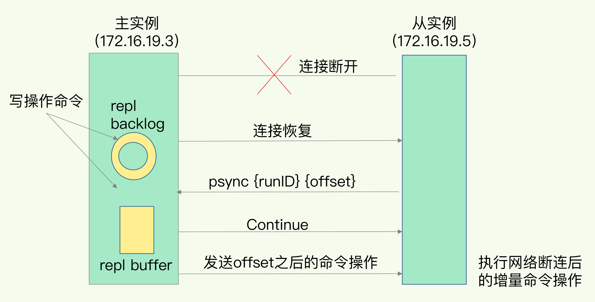

# Redis

Redis 是一个开源（BSD 许可）的内存数据结构存储，用作数据库、缓存、消息代理和流引擎。Redis 提供多种数据结构，例如字符串（strings）、哈希表（hashes）、列表（lists）、集合（sets）、支持范围查询的有序集合（sorted sets）、位图（bitmaps）、基数统计（hyperloglogs）、地理空间索引（geospatial indexes）和流（streams）。

Redis 内置了复制（replication）、Lua 脚本（Lua scripting）、LRU 淘汰（LRU eviction）、事务（transactions）和不同级别的磁盘持久性（on-disk persistence），并通过 Redis 哨兵（Sentinel）和 Redis 集群（Cluster）自动分区提供高可用性。

优点
- 读写性能优异
- 支持数据持久化
- 支持事务
- 数据类型丰富
- 支持主从复制，读写分离

缺点
- 容量受到物理内存的限制
- 自动容错：哨兵模式
- 横向扩展：集群模式

使用理由
- 读操作远多于写操作
- 高性能：加快读取速度
- 高并发：降低数据库压力

早期版本为什么选择单线程？
- 使用单线程模型能带来更好的可维护性，方便开发和调试
- 使用单线程模型也能并发地处理客户端的请求（I/O 多路复用）
- Redis 服务中运行的绝大多数操作的性能瓶颈都不是 CPU
  - 瓶颈最有可能是内存大小或网络带宽

Redis 为什么这么快？
1. 内存操作
2. 单线程，无锁竞争
3. I/O 多路复用，非阻塞 I.O
4. 高效数据类型，底层优化

## NoSQL

非关系型数据库

数据库比较

| Name       | Type                                  | Data storage options                                         | Query types                                                  | Additional features                                          |
| ---------- | ------------------------------------- | ------------------------------------------------------------ | ------------------------------------------------------------ | ------------------------------------------------------------ |
| Redis      | In-memory non-relational database     | Strings, lists, sets, hashes, sorted sets                    | Commands for each data type for common access patterns, with bulk operations, and partial transaction support | Publish/Subscribe, master/slave replication, disk persistence, scripting (stored procedures) |
| memcached  | In-memory key-value cache             | Mapping of keys to values                                    | Commands for create, read, update, delete, and a few others  | Multithreaded server for additional performance              |
| MySQL      | Relational database                   | Databases of tables of rows, views over tables, spatial and third-party extensions | SELECT, INSERT, UPDATE, DELETE, functions, stored procedures | ACID compliant (with InnoDB), master/slave and master/master replication |
| PostgreSQL | Relational database                   | Databases of tables of rows, views over tables, spatial and third-party extensions, customizable types | SELECT, INSERT, UPDATE, DELETE, built-in functions, custom stored procedures | ACID compliant, master/slave replication, multi-master replication (third party) |
| MongoDB    | On-disk non-relational document store | Databases of tables of schema-less BSON documents            | Commands for create, read, update, delete, conditional queries, and more | Supports map-reduce operations, master/slave replication, sharding, spatial indexes |

## 数据结构

### 简单动态字符串（simple dynamic string，SDS）

C 语言的字符串不足之处以及可以改进的地方：
- 获取字符串长度的时间复杂度为  O(N)；
- 字符串的结尾以 `\0` 字符标识，而且字符必须符合某种编码（比如 ASCII），只能保存文本数据；
- 字符串操作函数不高效且不安全，比如可能会发生缓冲区溢出，从而造成程序运行终止；

```c++
struct sdshdr {
    // 字符串长度
    int len;

    // 空闲字符长度
    int free;

    // 字符数组
    char[] buf;
};
```

优点
- 获取字符串长度 O(1) 时间复杂度
- 不会发生缓冲区溢出，先检查空间大小再决定是否自动扩容
- 节省内存空间，减少修改时的内存重分配次数
  - 空间预分配：小于 1M 成倍分配，大于则分配 1M
  - 惰性空间释放：不会立即回收多出来的字节，而是用 free 来记录未使用空间
- 可以保存任意二进制数据，并且是二进制安全的 
- 最大长度 512 M

### 双向链表

优点
- 双向：节点获取前驱或后继只需要 O(1) 时间复杂度
- 头指针、尾指针：获取头节点和尾节点只需要 O(1) 时间复杂度
- 无环：头指针的前驱和尾指针的后继指向 NULL
- 长度记录：获取链表长度只需要 O(1) 时间复杂度
- 多态：可保存不同类型的值

缺点
- 获取中间节点需要逐个遍历

### 压缩列表（ziplist）

优点
- 由连续内存块组成的顺序型数据结构实现
- 节约内存，针对不同 encoding 细化存储大小
- 获取第一个元素和最后一个元素只需要 O(1) 时间复杂度

- 缺点
  - 获取中间元素只能逐个查找 O(N)
  - 连锁更新：第一个节点的扩容导致后续所有节点的扩容（内存空间重新多次分配）

### 快速列表（quicklist）

双向链表 + 压缩列表，快表是一个链表，但每个元素是一个压缩列表

优点
- 规避潜在的连锁更新

缺点
- 没有解决连锁更新问题

### 紧凑列表（listpack）

优点
- 解决了连锁更新问题，不再记录上一节点的长度

### 哈希表/字典（dict）

哈希表
- 查询数据 O(1) 时间复杂度

缺点
  - 哈希冲突：链式哈希

### 整数集合（intset）

使用数组实现
- 有序、无重复
- 节约内存

缺点
- 只支持升级（upgrade）操作

### 跳跃表（skiplist）

基本思想：将有序链表中的一些节点分层，每一层都是一个有序链表。

优点
- 支持平均 O(logN)/最坏 O(N) 复杂度的节点查找，可以二分
- 支持随机操作
- 可以通过顺序操作来批量处理节点

相比红黑树/平衡树：
1. 性能考虑：插入速度非常快，不需要进行旋转等操作来维护平衡性；查找/插入/删除平均复杂度均为 O(logN)
2. 实现考虑：在复杂度与红黑树相同的情况下，跳跃表实现起来更简单，看起来也更加直观；
3. 支持无锁操作

## 数据类型

### RedisObject 对象

Redis 内部会使用一个 RedisObject 对象来表示所有的 key 和 value；为了平衡空间和时间效率，针对 value 的具体类型在底层会采用不同的数据结构来实现。

```c++
typedef struct redisObject {
    unsigned type:4;        // 类型
    unsigned encoding:4;    // 编码
    unsigned lru:LRU_BITS; /* lru time (relative to server.lruclock) */
    int refcount;           // 引用计数
    void *ptr;              // 指向底层数据结构
} robj;
```


### 基本数据类型

| Structure type    | What it contains                                             | Structure read/write ability                                 |
| ----------------- | ------------------------------------------------------------ | ------------------------------------------------------------ |
| STRING            | Strings, integers, or floating-point values                  | Operate on the whole string, parts, increment/ decrement the integers and floats |
| LIST              | Linked list of strings                                       | Push or pop items from both ends, trim based on offsets, read individual or multiple items, find or remove items by value |
| SET               | Unordered collection of unique strings                       | Add, fetch, or remove individual items, check membership, intersect, union, difference, fetch random items |
| HASH              | Unordered hash table of keys to values                       | Add, fetch, or remove individual items, fetch the whole hash |
| ZSET (sorted set) | Ordered mapping of string members to floating-point scores, ordered by score | Add, fetch, or remove individual values, fetch items based on score ranges or member value |


#### String（字符串）


常用场景
- 缓存
- 计数器：粉丝数、关注数
- session 共享

数据结构
- SDS

#### List（列表）


常用场景
- 时间轴
- 粉丝列表、关注列表
- 消息队列

数据结构
- 双向链表 -> 快速列表
- 压缩列表：当列表只包含少量的列表项，且每个列表项都是小整数值或长度较短的字符串

#### Hash（哈希表）


常用场景
- 缓存：比 string 更节省空间，用户信息、视频信息（经常变动的对象信息存储）

数据结构
- 哈希表（2 个）
- 压缩列表：当哈希表只包含少量的键值对，且每个键值对的键和值都是小整数值或长度较短的字符串

渐进式 rehash：避免集中消耗资源导致无法响应
- 缩容或扩容
- `负载因子=已保存节点数量/哈希表大小`
- 用户操作时（增删改查），顺便迁移数据

#### Set（无序集合）


常用场景
- 标签
- 收藏
- 顶踩

数据结构
- 整数集合：只包含整数且数量不多
- 哈希表

#### ZSet（有序集合）


常用场景
- 排行榜

数据结构
- 压缩列表
- 哈希表 + 跳跃表

### 扩展数据类型

#### BitMap（位图）

基于 String 基本类型实现，用于统计二值状态，将字节数组的每一位表示一个元素的二元状态。

常用场景
- 登录/未登录、打卡/未打卡、活跃/非活跃

#### HyperLogLog（基数统计）

基于 String 基本类型实现，用于统计计数，当集合元素数量非常多时，它计算基数所需的空间总是固定的。

常用场景
- 注册 IP 数、访问 IP 数、页面 UV、在线用户数、共同好友数

优点
- 节约内存

#### Geo（地理空间）

基于 Zset 有序集合基本类型实现，地理空间索引，使用 GeoHash 编码将经纬度转换为排序集合中的权重，支持查找给定地理半径内的位置。

#### Stream（流）

类似于仅附加日志，用于按事件发生的顺序记录事件。

常用场景
- 支持多播的可持久化消息队列
- 实时通信、大数据分析、异地数据备份

## 持久化

### RDB

> Redis DataBase

内存快照，RDB 持久化是把当前进程数据生成快照保存到磁盘上，由于是某一时刻的快照，因此快照中的值要早于或者等于内存中的值。

核心思路：写时复制（copy-on-write），只有写入时才进行复制操作。


#### 触发方式

手动触发
- `save` 命令：阻塞当前 Redis 服务器，直到 RDB 过程完成为止，对于内存占用比较大的实例会造成长时间阻塞，线上环境不建议使用
- `bgsave` 命令：Redis 进程执行 fork 操作创建子进程，RDB 持久化过程由子进程负责，完成后自动结束。阻塞只发生在 fork 阶段，一般时间很短


自动触发
- redis.conf 中配置 `save m n`，即 m 秒内有 n 次修改时
- 主从复制，从节点从主节点进行全量复制
- `debug reload` 命令：重新加载 Redis
- `shutdown` 命令：没有开启 AOF 持久化时

#### 配置

```sh
# 周期性执行条件的设置格式为
save <seconds> <changes>

# 默认的设置为：
save 900 1
save 300 10
save 60 10000

# 以下设置方式为关闭 RDB 快照功能
save ""

# 文件名称
dbfilename dump.rdb

# 文件保存路径
dir /home/work/app/redis/data/

# 如果持久化出错，主进程是否停止写入
stop-writes-on-bgsave-error yes

# 是否压缩
rdbcompression yes

# 导入时是否检查
rdbchecksum yes
```

#### 优缺点

优点
- 某个时间点的快照，默认使用 LZF 算法压缩，适用于备份，全量复制
- Redis 加载 RDB 文件恢复要远远快于 AOF

缺点
- 实时性，无法做到秒级的持久化
- 每次调用 `bgsave` 都要 fork 子进程，阻塞主进程或开销大
- RDB 文件是二进制的，不可读
- 版本兼容问题

### AOF

核心思路：写后日志，即先写内存再写日志


#### 实现

AOF 日志记录 Redis 的每个写命令，步骤分为：命令追加（append）、文件写入（write）和文件同步（sync）。

三种写回策略


#### 配置

```sh
# appendonly 参数开启 AOF 持久化
appendonly yes

# AOF 持久化的文件名，默认是 appendonly.aof
appendfilename "appendonly.aof"

# AOF 文件的保存位置和 RDB 文件的位置相同，都是通过 dir 参数设置的
dir ./

# 同步策略
# appendfsync always
appendfsync everysec
# appendfsync no

# aof 重写期间是否同步
no-appendfsync-on-rewrite no

# 重写触发配置
auto-aof-rewrite-percentage 100  # 文件大小差值
auto-aof-rewrite-min-size 64mb   # 重写时的文件大小

# 加载 aof 出错如何处理
aof-load-truncated yes

# 文件重写策略
aof-rewrite-incremental-fsync yes
```

#### AOF 重写

AOF 文件记录写命令，因此会随着时间增长。

通过创建新的 AOF 文件替换
- fork 子进程 `bgrewriteaof`，阻塞主进程
- 将内存拷贝给子进程
- 重写完毕后修改文件名替换


重写时有新的输入写入
- 记录在旧文件和重写缓冲区
- 子进程完成重写后，再写入重写缓冲区的内容

重写期间发生宕机
- 重写文件未被替换，仍然使用旧文件

#### 优缺点

优点
- 避免额外的检查开销：记录日志时不用再检查命令
- 不阻塞当前的写操作

缺点
- 如果命令执行完成，写日志之前宕机了，会丢失数据
- 主线程写磁盘压力大，导致写盘慢，阻塞后续操作

### RDB + AOF 混合方式

内存快照以一定的频率执行，在两次快照之间，使用 AOF 日志记录这期间的所有命令操作。
- 快照不用很频繁地执行，这就避免了频繁 fork 对主线程的影响
- AOF 日志也只用记录两次快照间的操作，不需要记录所有操作了，因此就不会出现文件过大的情况了，也可以避免重写开销


### 恢复

AOF 实时性更强，因此优先加载 AOF 文件


## 消息传递（发布/订阅）

消息队列有以下三种实现方式
1. List
2. Stream
3. Pub/Sub

> Redis 发布订阅（pub/sub）是一种消息通信模式：发送者（pub）发送消息，订阅者（sub）接收消息。

Redis 的 SUBSCRIBE 命令可以让客户端订阅任意数量的频道， 每当有新信息发送到被订阅的频道时， 信息就会被发送给所有订阅指定频道的客户端。

### 基于频道（Channel）

发布者可以向指定频道发送消息，订阅者可以订阅一个或者多个频道，所有订阅频道的订阅者都会收到消息。


```sh
# 发布消息
publish channel message

# 订阅频道
subscribe channel1 [channel2 ...]

# 取消订阅
unsubscribe channel1 [channel2 ...]
```

底层使用哈希表实现，键是频道信息，值是订阅者链表。


### 基于模式（Pattern）

当有信息发送到 tweet.shop.kindle 频道时，除了发送给 clientX 和 clientY 之外，还会发送给订阅 tweet.shop.* 模式的 client123 和 client256。


```sh
# 发布消息
publish channel message

# 订阅模式
psubscribe c? b* d?*

# 退订
punsubscribe [pattern [pattern ...]]
```

注意：
- 如果客户端执行了 `subscribe c1` 和 `psubscribe c?*`，向 `c1` 发送消息时，客户端会收到两条，但类型不同：message、pmessage
- `punsubscribe *` 无法退订 `c*` 模式，必须使用 `punsubscribe c*` 退订
- `punsubscribe` 退订所有模式

底层使用 `pubsubPattern` 节点的链表实现，保存和模式有关的信息。


## 事务

Redis 的事务就是一次性、顺序性、排他性地执行一个队列中的一系列命令。单条命令具有原子性，但是多条命令保证执行顺序、不保证执行的原子性。

### 命令

- `MULTI`：开启事务，将后续命令放入队列
- `EXEC`：执行事务中的所有操作命令
- `DISCARD`：取消事务
- `WATCH`：监视一个或多个 key，如果在事务执行前被修改，则事务被中断，不执行事务中的任何命令
- `UNWATCH`：取消监视

```sh
127.0.0.1:6379> set k1 v1
OK
127.0.0.1:6379> set k2 v2
OK
127.0.0.1:6379> MULTI
OK
127.0.0.1:6379> set k1 11
QUEUED
127.0.0.1:6379> set k2 22
QUEUED
127.0.0.1:6379> EXEC
1) OK
2) OK
127.0.0.1:6379> get k1
"11"
127.0.0.1:6379> get k2
"22"
127.0.0.1:6379>
```

取消事务

```sh
127.0.0.1:6379> MULTI
OK
127.0.0.1:6379> set k1 33
QUEUED
127.0.0.1:6379> set k2 34
QUEUED
127.0.0.1:6379> DISCARD
OK
```

事务执行步骤
1. 开启：以 `MULTI` 开始一个事务
2. 入队：将多个命令入队到事务队列中
3. 执行：由 `EXEC` 命令触发事务

### 错误处理

#### 语法错误（编译器错误）

在开启事务后，修改 k1 值为 11，k2 值为 22，但 k2 语法错误，导致事务提交失败，k1、k2 保留原值。

```sh
127.0.0.1:6379> set k1 v1
OK
127.0.0.1:6379> set k2 v2
OK
127.0.0.1:6379> MULTI
OK
127.0.0.1:6379> set k1 11
QUEUED
127.0.0.1:6379> sets k2 22
(error) ERR unknown command `sets`, with args beginning with: `k2`, `22`, 
127.0.0.1:6379> exec
(error) EXECABORT Transaction discarded because of previous errors.
127.0.0.1:6379> get k1
"v1"
127.0.0.1:6379> get k2
"v2"
127.0.0.1:6379>
```

#### Redis 类型错误（运行时错误）

在开启事务后，修改 k1 值为 11，k2 值为 22，但将 k2 的类型误认为 List，在运行时检测类型错误，最终导致事务提交失败，此时事务并没有回滚，而是跳过错误命令继续执行，k1 值改变、k2 保留原值。

```sh
127.0.0.1:6379> set k1 v1
OK
127.0.0.1:6379> set k1 v2
OK
127.0.0.1:6379> MULTI
OK
127.0.0.1:6379> set k1 11
QUEUED
127.0.0.1:6379> lpush k2 22
QUEUED
127.0.0.1:6379> EXEC
1) OK
2) (error) WRONGTYPE Operation against a key holding the wrong kind of value
127.0.0.1:6379> get k1
"11"
127.0.0.1:6379> get k2
"v2"
127.0.0.1:6379>
```

### 乐观锁

`WATCH` 命令可以为 Redis 事务提供 check-and-set(CAS) 行为。

如果在 `WATCH` 执行后， `EXEC` 执行前，有其他客户端修改了 mykey 的值，那么当前客户端的事务就会失败。程序需要做的就是不断重试这个操作，直到没有发生冲突为止。

```sh
WATCH mykey
val = GET mykey
val = val + 1
MULTI
SET mykey $val
EXEC
```

### 其他

Redis 不支持回滚
- Redis 命令只会因为语法错误而失败，这些错误应该在开发的过程中被发现，而不该出现在生产环境中。
- 因为不需要对回滚进行支持，所以 Redis 内部可以保持简单且快速。

#### ACID

原子性（Atomicity）：Redis 的事务是原子性的，所有命令，要么全部执行，要么全部不执行，而不是完全成功。
- 单条命令是原子执行（或者使用 Lua 脚本）
- 事务中命令入队时就报错，会放弃整个事务执行，保证原子性；
- 事务中命令入队时没报错，实际执行时报错，则部分命令执行成功部分失败，不保证原子性。

一致性（Consistency）：能够处理语法错误，终止事务
- 在命令执行错误或 Redis 发生故障的情况下，Redis 事务机制对一致性属性是有保证的。

隔离性（Isolation）：保证命令执行过程中不会被其他客户端命令打断
- 并发操作在 `EXEC` 命令前执行，隔离性保证要使用 `WATCH` 机制来实现，否则隔离性无法保证；
- 并发操作在 `EXEC` 命令后执行，隔离性可以保证。

持久性（Durability）：不保证持久性，RDB 和 AOF 持久化策略都是异步执行的

#### 其他实现方式

1. 基于 Lua 脚本，Redis 可以保证脚本内的命令一次性、按顺序地执行，但不提供事务运行错误的回滚，执行过程中如果部分命令运行错误，剩下的命令还是会继续运行完。

2. 基于中间标记变量，通过标记变量来标识事务是否执行完成，读取数据时先读取标记变量判断事务是否执行完成。需要额外写代码实现，比较繁琐。

## 事件

Redis 中的事件驱动库只关注网络 IO 和定时器。
- 文件事件（file event）：用于处理 Redis 服务器和客户端之间的网络 IO。
- 时间事件（time event）：处理定时操作，Redis 服务器中的一些操作（比如 `serverCron` 函数）需要在给定的时间点执行。

`aeEventLoop` 是事件驱动的核心，管理文件事件表和时间事件列表，循环处理就绪的文件事件和到期的时间事件。


### IO 多路复用

IO 模型：`select`、`poll`、`epoll`、`kqueue`

IO 多路复用模型是建立在内核提供的多路分离函数 `select` 基础之上的，使用 `select` 函数可以避免同步非阻塞 IO 模型中轮询等待的问题。

#### 优缺点

`select`
- 良好的跨平台性
- 监视的文件描述符数量最多 1024（Linux），放到文件描述符集合中
- 两次遍历两次拷贝
  - 将描述符集合拷贝到内核中，让内核遍历获取就绪的描述符
  - 将描述符集合拷贝到用户态，让用户态遍历处理就绪的描述符

`poll`
- 使用动态数组 + 链表的形式组织文件描述符，没有数量限制
- 仍然需要在用户态和内核态之间拷贝文件描述符集合
- 仍然需要遍历描述符集合找到就绪的描述符

`epoll`
- 使用红黑树来跟踪进程所有待检测的文件描述符，减少了内核和用户空间大量的数据拷贝和内存分配
- 使用事件驱动机制，在内核里维护了一个链表来记录就绪事件

#### 传统模型

同步、阻塞

#### Reactor/Dispatcher 模式

同步、非阻塞

- Reactor：将 I/O 事件发派给对应的 Handler
- Acceptor：处理客户端连接请求
- Handler：执行非阻塞读/写

单线程
- 一个线程同时监控多个请求（Channel），所有读/写请求以及对新连接请求的处理都在同一个线程中处理。无法充分利用多 CPU 的优势，同时读/写操作也会阻塞对新连接请求的处理。


多线程
- 专门的线程（event loop thread），Acceptor 用于监听服务端，接收客户端的 TCP 连接请求。单独的线程可能存在性能不足的问题。 
- 网络 I/O 操作（读、写等）由一个线程池负责。


主从多线程（Netty）
- 一个主 Reactor 负责 accept 新连接，多个子 Reactor 负责监控并处理读/写请求，减轻了主 Reactor 的压力，降低了主 Reactor 压力太大而造成的延迟。
- 每个子 Reactor 分别属于一个独立的线程，每个成功连接后的 Channel 的所有操作由同一个线程处理。保证了同一请求的所有状态和上下文在同一个线程中，避免了不必要的上下文切换，同时便于监控请求响应状态。


#### Proactor 模式

异步、非阻塞


缺点
- 编程复杂
- 内存使用问题
- 操作系统支持

### 文件事件

Redis 基于 Reactor 模式开发了自己的网络事件处理器，也就是文件事件处理器。文件事件处理器使用 IO 多路复用技术，同时监听多个套接字，并为套接字关联不同的事件处理函数。当套接字的可读或可写事件触发时，就调用相应的事件处理函数。

1. 为什么单线程的 Redis 能那么快？
Redis 的瓶颈主要在 IO 而不是 CPU，所以为了省开发量，在 6.0 版本前是单线程模型；其次，单线程主要是指 Redis 的网络 IO 和键值对读写是由一个线程来完成的，这也是 Redis 对外提供键值存储服务的主要流程。但 Redis 的其他功能，比如持久化、异步删除、集群数据同步等，是由额外的线程执行的。Redis 采用了多路复用机制使其在网络 IO 操作中能并发处理大量的客户端请求，实现高吞吐率。

2. Redis 事件响应框架 `ae_event` 及文件事件处理器
Redis 使用的 IO 多路复用技术主要有：`select`、`epoll`、`evport`、`kqueue` 等。每个 IO 多路复用函数库在源码中都对应一个单独的文件，比如 `ae_select.c`、`ae_epoll.c`、`ae_kqueue.c` 等。Redis 会根据不同的操作系统，按照不同的优先级选择多路复用技术。事件响应框架一般都采用该架构，比如 Netty 和 libevent。


文件事件处理器有四个组成部分：套接字、I/O 多路复用程序、文件事件分派器、事件处理器。


文件事件是对套接字操作的抽象，每当一个套接字准备好执行 `accept`、`read`、`write` 和 `close` 等操作时，就会产生一个文件事件。I/O 多路复用程序负责监听多个套接字，并向文件事件分派器传递那些产生了事件的套接字。文件事件处理器会以有序、同步、单个套接字的方式处理队列中的套接字，也就是处理就绪的文件事件。

3. Redis IO 多路复用模型

在 Redis 单线程运行的情况下，内核中同时存在多个监听套接字和已连接套接字。内核会一直监听套接字上的连接请求或数据请求，一旦有请求到达就交给 Redis 线程处理，这就实现了一个 Redis 线程处理多个 IO 流的效果。

Redis 网络框架使用 epoll 机制，让内核监听这些套接字。此时，Redis 线程不会阻塞在某一个特定的监听或已连接套接字上，即不会阻塞在某一个特定的客户端请求处理上。正因为此，Redis 可以同时和多个客户端连接并处理请求，从而提升并发性。


select/epoll 提供了基于事件的回调机制，当监测到 FD 上有请求到达时，就会触发相应的事件。这些事件会被放进一个事件队列，Redis 单线程对该事件队列不断进行处理。这样一来，Redis 无需一直轮询是否有请求实际发生，避免了 CPU 资源浪费。同时，Redis 在处理事件队列中的事件时，会调用相应的处理函数，这就实现了基于事件的回调。因为 Redis 一直在对事件队列进行处理，所以能及时响应客户端请求，提升 Redis 的响应性能。

### 时间事件

- 定时事件：让一段程序在指定的时间之后执行一次。
- 周期事件：让一段程序每隔指定时间就执行一次。

一个时间事件是定时事件还是周期性事件取决于时间处理器的返回值：
- 如果返回值是 `AE_NOMORE`，那么是定时事件。该事件在达到后删除，之后不会再重复。
- 如果返回值是非 `AE_NOMORE` 的值，那么是周期事件。当一个时间事件到达后，服务器会根据时间处理器的返回值，对时间事件的 `when` 属性进行更新，让这个事件在一段时间后再次到达。


## 集群

### 主从复制

将一台 Redis 服务器的数据，复制到其他 Redis 服务器。前者称为主节点（master），后者称为从节点（slave）；数据的复制是单向的，只能由主节点到从节点。

主要作用
- 数据冗余：数据热备份
- 故障恢复：主节点宕机，可以由从节点提供服务
- 负载均衡：由主节点提供写服务，由从节点提供读服务，提高服务器并发
- 高可用：哨兵和集群的实现基础

读写分离
- 读：主节点、从节点都可读
- 写：写入主节点，主节点同步到从节点

#### 全量复制

当启动多个 Redis 实例时，它们相互之间就可以通过 `replicaof`（Redis 5.0 之前使用 `slaveof`）命令形成主库和从库的关系，之后会按照三个阶段完成数据的第一次同步。

1. 确立主从关系：将本机作为 `172.16.19.3` 的从库

```sh
replicaof 172.16.19.3 6379
```

2. 三阶段
- 主从库间建立连接、协商同步
- 主库将所有数据同步给从库（RDB 文件）
- 主库把第二阶段执行过程中收到的写命令，再发送给从库


#### 增量复制

全量复制时，若产生网络中断则需要重新执行三阶段。

增量复制使用环形缓冲区记录主从差异



#### 优缺点

优点
- 读写分离，从节点只读，写由主节点完成
- 从节点也可以接受其他从节点的连接和同步请求，分摊主节点的同步压力
- 同步期间（非阻塞），客户端仍然可以进行查询或修改

缺点
- 写入压力都在主节点
- 宕机需要人工介入恢复，手动将一台从服务器切换为主服务器
- 扩容困难

#### 其他

全量复制为什么使用 RDB 而不是 AOF？
- RDB 文件是经过压缩的二进制数据，体积小，因此传输和读写都相对更快
- AOF 同步策略选择不当会严重影响 Redis 性能

从库的从库
- 将主库生成 RDB 和传输 RDB 的压力，以级联的方式分散到从库上


读写分离问题
- 延迟与不一致问题：主从复制的命令传播是异步的
- 故障切换问题：当主节点或从节点出现问题而发生更改时，需要及时修改应用程序读写 Redis 数据的连接

### 哨兵（Sentinel）机制

核心功能：使用发布/订阅模式实现主节点的自动故障转移。

实现功能
- 监控（Monitoring）：哨兵会不断地检查主节点和从节点是否运作正常。
- 自动故障转移（Automatic failover）：当主节点不能正常工作时，哨兵会开始自动故障转移操作，它会将失效主节点的某个从节点升级为新的主节点，并让其他从节点改为复制新的主节点。 
- 配置提供者（Configuration provider）：客户端在初始化时，通过连接哨兵来获得当前 Redis 服务的主节点地址。 
- 通知（Notification）：哨兵可以将故障转移的结果发送给客户端。

监控和自动故障转移功能，使得哨兵可以及时发现主节点故障并完成转移；而配置提供者和通知功能，则需要在与客户端的交互中才能体现。

#### 哨兵集群的组建

使用发布/订阅实现。在主从集群中，主库上有一个名为 `__sentinel__:hello` 的频道，不同哨兵就是通过它来相互发现，实现通信的。

哨兵 1 把自己的 IP（172.16.19.3）和端口（26579）发布到频道上，哨兵 2 和 3 订阅了该频道。


#### 哨兵监控 Redis 库

哨兵 2 给主库发送 `INFO` 命令，主库收到这个命令后，就会把从库列表返回给哨兵。接着，哨兵就可以根据从库列表中的连接信息，和每个从库建立连接，并对从库进行持续监控。


#### 主库下线的判定

- 主观下线：任何一个哨兵都可以监控，并作出 Redis 节点下线的判断
- 客观下线：有哨兵集群共同决定 Redis 节点是否下线

当某个哨兵（如下图中的哨兵 2）判断主库“主观下线”后，就会给其他哨兵发送 `is-master-down-by-addr` 命令。接着，其他哨兵会根据自己和主库的连接情况，做出 Y 或 N 的响应。如果赞成票数大于等于哨兵配置文件中的 `quorum` 配置项，则可以判定主库客观下线了。


#### 哨兵集群的选举

Raft 分布式共识算法
- 半数以上的赞成票
- 票数大于等于哨兵配置文件中的 `quorum` 配置项

#### 新主库的选出

- 过滤掉不健康的（下线或断线），没有响应哨兵 `ping` 的从节点
- 选择 `salve-priority` 从节点优先级最高的（redis.conf）
- 选择复制偏移量最大，复制最完整的从节点


#### 故障的转移

转移流程
- 将从节点升级为主节点
- 让其他从节点指向新的主节点
- 通知客户端主节点已更换
- 将原来的主节点变成从节点，指向新的主节点

#### 优缺点

优点
- 基于主从复制：读写分离、从节点的从节点
- 自动故障转移，可用性更高

缺点
- 扩容困难

### 集群（Cluster）分片

核心思路：每个节点存储不同的内容。

主从复制和哨兵机制保障了高可用，读写分离使得从节点扩展了主从的读并发能力，但是写能力和存储能力是没有扩展，上限即主节点的承载上限。面对海量数据必需要构建主节点集群，并保持高可用，即每个主节点还需要从节点，这就是分布式系统中典型的纵向扩展（集群分片技术）的体现。

#### 设计目标

- 高达 1000 个节点的高性能和线性可扩展性。没有代理，使用异步复制，并且不对值执行合并操作。
- 可接受的写入安全：系统尝试（best-effort）保留与大多数主节点连接的客户端的所有写入。通常会有小的时间窗口，其中已确认的写入可能会丢失。当客户端位于少数分区时，丢失已确认写入的时间窗口更大。
- 可用性：Redis 集群在大多数主节点可访问的分区中是可用的，并且每个不可访问的主节点至少有一个可访问副本。此外，使用副本迁移，不被任何副本复制的主节点将从有多个副本的主节点接收一个。

#### 主要模块

##### 哈希槽（hash slot）

Redis-Cluster 中有 16384（2^14）个哈希槽，每个 key 通过 CRC16 校验后对 16383 取模来决定放置到哪个槽。Cluster 中的每个节点负责一部分哈希槽。

Redis 节点发送心跳包时需要把所有的槽放到心跳包中，以便让节点知道当前集群信息，在发送心跳包时使用 char 进行 bitmap 压缩后是 2k，也就是说用 2k 的空间创建了 16k 的槽数。虽然使用 CRC16 算法最多可以分配 65535（2^16-1, 65k）个槽位，压缩后就是 8k，也就是说需要需要 8k 的心跳包，作者认为这样做不太值得；而且一般情况下一个 Redis 集群不会有超过 1000 个 master 节点，所以 16k 的槽位是个比较合适的选择。

哈希槽是集群内数据管理和迁移的基本单位，数据迁移时不会停止服务，因此对某个节点的哈希槽进行增删改时不会造成集群不可用。

优点
- 解耦数据与节点之间的关系，简化扩容缩容
- 节点维护哈希槽的映射关系，不需要客户端或代理维护
- 支持节点、哈希槽、键之间的映射查询，用于数据路由、在线伸缩等产经

##### 集群拓扑

Redis Cluster 是一张全网拓扑，节点与其他每个节点之间都保持着 TCP 连接。在一个拥有 N 个节点的集群中，每个节点由 N-1 个 TCP 传出连接和 N-1 个 TCP 传入连接。当一个节点在集群总线上发送了 ping 请求并期待对方回复 pong，在等待足够时间后将对方标记为不可达之前，它将先尝试重新连接对方以刷新连接。在全网拓扑中的 Redis Cluster 节点使用 gossip 协议和配置更新机制来避免在正常情况下节点之间交换过多的消息，因此集群内交换的消息数目（相对节点数目）不是指数级的。

##### 请求重定向

Moved 重定向
- 命中：返回结果；
- 未命中：即当前键命令所请求的键不在当前请求的节点中，则返回 Moved 重定向，客户端根据 Moved 重定向所包含的内容找到目标节点，再一次发送命令。


Ask 重定向
- 发生于集群伸缩时，集群伸缩会导致槽迁移，去源节点访问时数据可能已经迁移到了目标节点。


#### 状态检测及维护

##### Gossip 协议

Gossip协议的最大的好处是，即使集群节点的数量增加，每个节点的负载也不会增加很多，几乎是恒定的。这就允许集群规模能横向扩展到数千个节点。

Redis 集群是去中心化的，彼此之间状态同步靠 gossip 协议通信，集群的消息有以下几种类型：
- `Meet` 通过 `cluster meet ip port` 命令，集群的节点会向新节点发送邀请，加入集群。 
- `Ping` 节点每秒会向集群中其他节点发送 ping 消息，消息中带有自己已知的两个节点的地址、槽、状态信息、最后一次通信时间等。
- `Pong` 节点收到 ping 消息后会回复 pong 消息，消息中同样带有自己已知的两个节点信息。
- `Fail` 节点 ping 不通某节点时，会向集群所有节点广播该节点宕机的消息，其他节点收到消息后标记该节点已下线。

##### 心跳机制

#### 扩容与缩容

扩容
1. 新节点加入集群（`cluster meet ip port` 或 `redis-trib add node`），默认为主节点
2. 迁移数据，确定移动的槽、将槽中的 key 全部迁移到节点、向集群主节点广播

缩容
1. 判断是否为主节点、是否有槽
2. 迁移数据，广播准备下线

#### 其他

特点
- 所有的 Redis 节点彼此互联（PING-PONG机制），内部使用二进制协议优化传输速度和带宽。
- 节点的 fail 是通过集群中超过半数的节点检测失效时才生效。
- 客户端与 Redis 节点直连，不需要中间代理层。客户端不需要连接集群所有节点，连接集群中任何一个可用节点即可。

优点
- 高可用、可扩展性、分布式、容错

缺点
- 只支持对相同槽的 key 执行批量操作
- 只支持多 key 在同一节点上的事务操作
- 不能将大的键值对象（Hash、List）映射到不同节点
- 不支持多数据库空间
  - 单机下的 Redis 可支持 16 个数据库（`db0 ~ db15`），集群模式下只能使用一个数据库空间，即 `db0`
  - 一个 Redis 一般给一个项目用，项目内的不同业务各自使用一个库，这样就不会有数据交叉。
- 复制结构只支持一层，从节点只能复制主节点

## 缓存问题

### 缓存穿透

查询缓存和数据库中都没有的数据，绕过缓存请求数据库。

产生原因：请求数据未命中缓存，转而请求数据库。

解决方法
1. 接口层增加校验：参数校验、权限校验
2. 设置有效期较短的 `key-null` 缓存
3. 布隆过滤器（bloomfilter）：快速判断一个 key 是否存在于某容器，不存在直接返回

### 缓存击穿

查询缓存中没有但数据库中有的数据，即某个热点数据失效时，大量请求到达数据库。

解决方法
1. 设置热点数据永不过期
2. 接口限流、熔断（降级）
3. 互斥锁

### 缓存雪崩

同一时间大量缓存数据失效，导致原本访问 Redis 的请求全部到达数据库，造成数据库短期内 CPU 和内存压力骤增，严重时甚至可以导致宕机。

产生原因：缓存数据的过期时间相同。

解决方法
1. 设置随机过期时间，防止同一时间大量过期
2. 如果是分布式部署，则将热点数据均匀分散
3. 设置热点数据永不过期

### 缓存污染

缓存中只被访问一次或者几次的的数据，访问完毕后依然驻留在缓存中，消耗缓存空间。

解决方法：缓存淘汰策略
1. `noeviction`：不淘汰，默认策略
2. `volatile-random`：针对已过期数据，随机淘汰
3. `volatile-ttl`：优先淘汰过期时间早的
4. `volatile-lru`：最近最少使用，优先淘汰最近被访问时间戳早的
5. `volatile-lfu`：最近最不常用，优先淘汰访问次数少的，再淘汰最近被访问时间戳早的
6. `allkeys-random`：针对所有数据
7. `allkeys-lru`：
8. `allkeys-lfu`：

### 缓存与数据库一致性

从缓存中找到数据称为命中缓存，反之称为未命中缓存。应用最为广泛的是 Cache-Aside + Write-Around：
- 读：先读缓存，再读数据库，写入缓存
- 写：先写数据库，再让缓存失效

脏数据问题：读操作未命中缓存，从数据库读取并写入缓存，同时写操作修改了数据库中的数据，那么缓存中保存的就是脏数据。
- 发生概率低
- 使用两阶段提交（2PC）
- 使用共识算法（Paxos、Raft）

设计模式
1. Cache-Aside
2. Read-Through
3. Write-Through
4. Write-Around
5. Write-Back

#### Cache-Aside

应用直接去缓存中找数据，命中缓存则直接返回，如果未命中缓存，则需要先去数据库中查询数据，并将查询到的数据存储到缓存中。


配合 Write-Around

#### Read-Through

应用和数据库之间不直接连接，通过缓存来更新数据。


配合 Write-Through

#### Write-Through

先将数据写入到缓存中，然后由缓存将数据存入到数据库中。


Read-Through + Write-Through


#### Write-Around

不用缓存，直接写入数据库。


Cache-Aside + Write-Around


不用 Write-Through 的原因：Write-Through 会先更新缓存，如果此时刚好有另一个线程将数据库中的旧数据读取出来，覆盖缓存中的新数据，那么就造成了数据错误，使用 Write-Around 则不会出现这个问题。

Read-Through + Write-Around

常用于某些只需要写一次并且读多次的情况，比如聊天信息的写入和获取。

#### Write-Back

多次写入缓存后，再写入数据库，即批量写回。


缺点是缓存出错则丢失这一批的数据。

#### 异步更新缓存


## 应用

### 缓存

将热点数据放到内存中，设置内存的最大使用量以及过期淘汰策略来保证缓存的命中率。

### 计数器

Redis 内存数据库能支持计数器频繁的读写操作。

Redis 提供了 `INCR` 命令来实现计数功能，通过内存操作性能高，能够很好适用于这些场景。

- 社交业务产品中统计技术功能
  - 用户点赞数、关注数、粉丝数
  - 帖子点赞数、评论数、热度
  - 消息已读、未读，红点消息数
  - 话题消息数、帖子数、收藏数
- 统计网站、接口的调用次数等

### 应用限流

限流是一种限制某些操作、接口执行访问速率的操作。例如网关限制接口访问频次，针对于用户维度、全局维度来控制接口的访问频率。

- MQ 防止重复消费同样可以利用 `INCR` 计数，保证时间段内只会被消费一次
- 接口限流，限制接口时间段内请求次数上限
- 限流方式：
  - 本地令牌桶
  - Lua 脚本使用 `INCR` 实现限流

### 消息队列

使用 List 数据类型，或 Pub/Sub 模式。

### 分布式 Session

多个应用服务的 Session 都存储到 Redis 中来保证 Session 的一致性。

### 分布式锁

分布式锁的特征
- 互斥性。互斥是锁的基本特性，同一时刻只能被一个线程操作。
- 超时释放。通过超时释放，可以避免死锁，防止不必要的线程等待和浪费资源。MySQL 的 InnoDB 中 `innodblockwait_timeout` 参数配置超时释放锁。
- 可重入性。一个线程在持有该锁的情况下可以对其再次请求加锁。防止锁在线程执行完临界操作前释放。
- 高性能和高可用。加锁和解锁的过程需要尽量减少性能消耗，但也要保证高可用，避免分布式锁意外失效。

除了可以使用 `SETNX` 实现分布式锁之外，还可以使用官方提供的 RedLock 分布式锁实现。

### 其他

- 排行榜：Zset
- 时间轴：List
- 查找表：Hash
- 查找共友：Set

# 参阅

- [Redis 的数据结构总结](https://juejin.cn/post/6978430172152201247)
- [为了拿捏 Redis 数据结构，我画了 40 张图（完整版）](https://www.cnblogs.com/xiaolincoding/p/15628854.html)
- [Skip List--跳表（全网最详细的跳表文章没有之一）](https://www.jianshu.com/p/9d8296562806)
- [♥Redis教程 - Redis知识体系详解♥](https://pdai.tech/md/db/nosql-redis/db-redis-overview.html)
- [缓存的五种设计模式](https://xie.infoq.cn/article/49947a60376964f1c16369a8b)
- [Redis的ACID属性](https://juejin.cn/post/6970531814653820942)
- [[Redis] 你了解 Redis 的三种集群模式吗？](https://segmentfault.com/a/1190000022808576)
- [深入剖析Redis系列(三) - Redis集群模式搭建与原理详解](https://juejin.cn/post/6844903670572646413)
- [图解 I/O 多路复用](https://bbs.huaweicloud.com/blogs/279731)
- [Redis中的对象](https://axlgrep.github.io/tech/redis-object.html)
